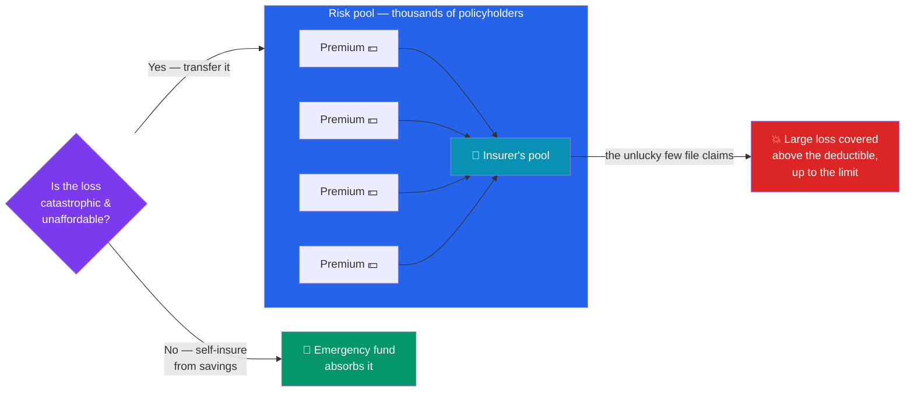

# 🛡️ Insurance and Personal Risk

> [!abstract] TL;DR
> Insurance is **risk transfer**: you pay a small, certain cost (the **premium**) so an insurer absorbs a large, uncertain loss. It works through **risk pooling** — many people pay in, the unlucky few draw out. The main types cover life (**term** vs **whole**), health, disability, and property/liability. Key levers are the **premium**, the **deductible** (what you pay before coverage kicks in), and the **coverage limit**. The golden rule: **insure catastrophic, unaffordable losses; self-insure small, affordable ones.** This is educational content, not personalized insurance or financial advice.

## Intuition — analogy FIRST

Imagine a village of 1,000 houses. Each year, on average, one burns down — a $300,000 loss. No single family can absorb that, and nobody knows *which* house it will be. So the village agrees: everyone pays $350 a year into a common pot. The pot collects $350,000; when a house burns, the pot rebuilds it. Each family has traded a tiny, survivable cost for protection against a ruinous one.

That is all insurance is: **risk pooling** plus the **law of large numbers**. The insurer can't predict *your* fire, but across millions of policies the *average* is remarkably stable — so it can charge a predictable premium and still pay every claim.

Here's the twist most people miss: on average, insurance is a **losing bet** — the insurer must collect more than it pays out to cover expenses and profit. You *want* to lose this bet, because "winning" means your house burned down. You buy insurance not to profit, but to avoid catastrophe you couldn't otherwise survive.

---

## How Risk Transfer Works

## Key Concepts / Details

### The Three Levers: Premium, Deductible, Coverage

Every policy is a dial between three numbers:

- **Premium** — the recurring price you pay (monthly/annually) to stay covered.
- **Deductible** — what *you* pay out of pocket per claim before the insurer contributes. Higher deductible → lower premium (you're self-insuring the first slice).
- **Coverage limit** — the maximum the insurer will pay. Under-insuring here is the dangerous kind of "saving money."

**Worked example — choosing a deductible on auto insurance:**

| Option | Deductible | Annual premium |
|--------|-----------|----------------|
| Low deductible | $500 | $1,600 |
| High deductible | $1,500 | $1,300 |

The high-deductible plan saves **$300/year** but exposes you to **$1,000 more** per claim. If you have a solid [[Budgeting_and_Saving|emergency fund]] and rarely claim, taking the higher deductible and pocketing the $300 is usually the smarter, self-insuring move — you break even after ~3.3 claim-free years and profit thereafter.

### The Expected-Value Logic (and Why You Still Buy)

Insurers price so that, on average, **premium > expected payout**:

$$\text{Fair premium} \approx (\text{Probability of loss} \times \text{Loss size}) + \text{expenses} + \text{profit}$$

**Worked example — homeowner's insurance:** Suppose the chance of a **$300,000** total loss in a year is **0.2%** (0.002). The expected payout is $0.002 \times \$300{,}000 = \$600$. Add smaller claims, admin, and profit, and the premium might be **$1,500/year**. On average you "lose" ~$900 a year.

You buy anyway because of **diminishing marginal utility of wealth**: losing $1,500 you'll never notice; losing $300,000 would bankrupt you. Insurance is worth paying a premium over its expected value precisely for the losses that would be *financially fatal*.

### The Main Types of Insurance

| Type | Protects against | Notes |
|------|------------------|-------|
| **Life** | Your death leaving dependents unfunded | Term vs whole (below); needed if others rely on your income |
| **Health** | Medical costs | Often the largest catastrophic risk; deductibles, copays, out-of-pocket max |
| **Disability** | Losing income to injury/illness | Often *underrated* — a young worker is more likely to be disabled than to die |
| **Auto / Property** | Damage to car or home | Liability portion is critical; covers others' losses you cause |
| **Liability (umbrella)** | Lawsuits exceeding other policies' limits | Cheap protection for higher-net-worth households |

**Life insurance — term vs whole:**
- **Term life** is pure protection: a fixed death benefit for a set term (e.g., 20-year, $500,000), no cash value. Cheap — a healthy 30-year-old might pay **~$25–35/month** for $500,000 of 20-year term.
- **Whole (permanent) life** never expires and builds a cash-value savings component — but costs **5–15× more** (often $300–500+/month for the same face amount), bundling insurance with a low-return investment.

The mainstream guidance for most families: **"buy term and invest the difference"** — get cheap term coverage for the years dependents need it, and invest the premium savings in [[Retirement_Planning_and_FIRE|tax-advantaged accounts]] for higher expected returns. How much term coverage? A common rule is **10–12× annual income**, or the **DIME** method (Debt + Income replacement + Mortgage + Education).

### When Insurance Is — and Isn't — Worth It

The decision rule follows the risk matrix:

| | Low severity | High severity |
|---|---|---|
| **High probability** | Budget for it (routine costs) | Reduce/avoid the risk; insure what remains |
| **Low probability** | **Self-insure** (skip it) | **Insure** — this is what insurance is for |

**Insure** the low-probability, high-severity corner: death with dependents, disability, major health events, home destruction, liability lawsuits. **Skip** the low-severity products that prey on fear: extended warranties, phone insurance, flight-accident insurance, rental-car damage waivers (often already covered), and credit-card "payment protection." For those, your emergency fund *is* the insurance — and it's free.

---

## Real-World Notes

A classic misallocation: a young parent buys an expensive whole-life policy (sold on commission) for $400/month but skips **disability insurance** and carries only a token term benefit. Yet during their working years, the probability of a disability that stops income is materially higher than the probability of death — the **Social Security Administration** has noted that a sizable share of today's 20-year-olds will experience a disabling condition before retirement age. The dollars were spent on the wrong risk.

The counter-example of *good* risk transfer: term life plus a high-deductible health plan paired with a **Health Savings Account (HSA)**. The family self-insures small medical bills from the HSA (which also grows tax-advantaged, like a stealth retirement account), while the plan's out-of-pocket maximum caps the catastrophic downside. Small risks absorbed cheaply; large risks transferred — exactly the structure insurance is designed for.

---

## Common Pitfalls

- **Insuring small, affordable losses.** Extended warranties and phone insurance have terrible expected value — self-insure from your emergency fund instead.
- **Under-insuring the catastrophic ones.** Skimping on liability limits or disability coverage to save a few dollars is a false economy that can be financially fatal.
- **Confusing insurance with investment.** Whole-life "cash value" bundles a mediocre investment into a costly product; for most people, term + separate investing wins.
- **Choosing a deductible you can't afford.** A high deductible only saves money if you actually have the cash to cover it when a claim hits.
- **Setting it and forgetting it.** Coverage needs change — marriage, kids, a mortgage, a paid-off house. Re-evaluate every few years.
- **Ignoring liability exposure.** The rare lawsuit is exactly the low-probability, high-severity event umbrella insurance cheaply covers.

---

## Related Concepts

- [[_MOC_Personal_Finance|↑ Section MOC]]
- [[Budgeting_and_Saving]] — The emergency fund is your self-insurance for small losses
- [[Retirement_Planning_and_FIRE]] — "Invest the difference" and protect the plan from ruin
- [[Debt_and_Credit_Management]] — Uninsured catastrophes are a top driver of ruinous debt
- [[Time_Value_of_Money]] — Expected value and discounting behind premium pricing

## Review Questions

1. Explain why insurance is, on average, a "losing bet" for the buyer, yet still rational to purchase. What property of money (or of catastrophic loss) makes paying above expected value worthwhile?
2. An auto policy offers a $500 deductible at $1,700/year or a $1,500 deductible at $1,350/year. What is the annual premium saving, and how much more would you pay per claim? Under what personal-finance conditions is the higher deductible the better choice?
3. A 32-year-old with two young children and a mortgage is deciding between a $500,000 20-year term policy (~$30/month) and a whole-life policy (~$450/month). Using the "buy term and invest the difference" idea, describe what they might do with the ~$420/month gap and why it may build more wealth.

## Sources

- Insurance Information Institute (III) — consumer guides to life, health, disability, auto, and property insurance
- U.S. Social Security Administration — statistics on disability probability during working years
- Milevsky, *The Calculus of Retirement Income* (risk pooling, mortality, and insurance economics)
- National Association of Insurance Commissioners (NAIC) — consumer guidance on premiums, deductibles, and coverage

#finance #personal-finance #insurance #risk-transfer #term-life #disability #deductible
