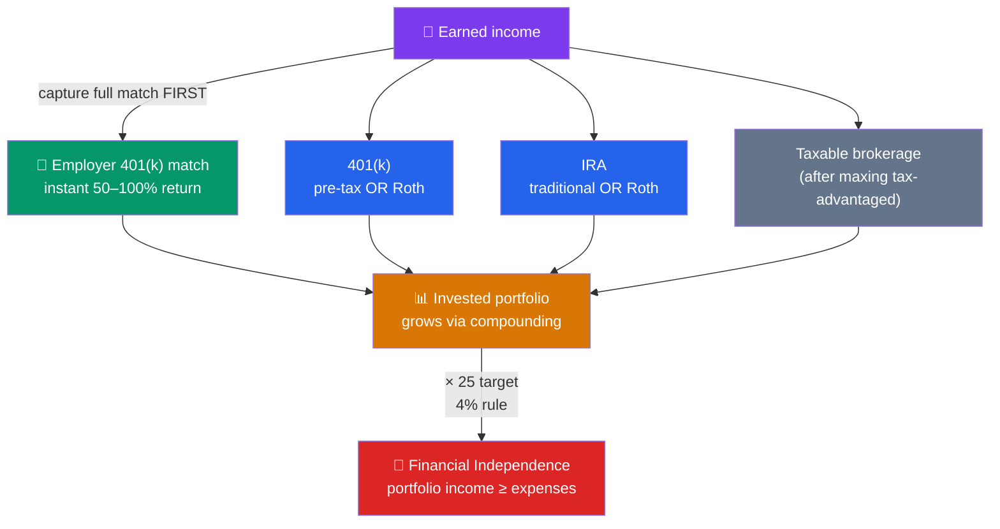

# 🏖️ Retirement Planning and FIRE

> [!abstract] TL;DR
> Retirement planning means building a portfolio large enough to replace your paycheck. **Tax-advantaged accounts** — 401(k)s and IRAs, in **traditional** (tax now, deduct later) or **Roth** (pay tax now, withdraw tax-free) flavors — supercharge growth, and an **employer match** is free money you should always capture. The **4% rule** says you can withdraw ~4% of your portfolio each year, which implies a **25× annual expenses** target. The **FIRE** movement (Financial Independence, Retire Early) pushes this to extremes — lean, fat, and coast variants. This is educational content, not personalized financial or tax advice.

## Intuition — analogy FIRST

Think of retirement as replacing your salary with a **money-making machine** you build during your working years. Every dollar you invest is a tiny worker you hire; through [[The_Power_of_Compounding|compounding]], those workers hire more workers. Retirement arrives the day your machine's output — investment income — covers your living costs without you lifting a finger.

So the real question isn't "how old will I be?" but "**how big must the machine be?**" The answer is surprisingly simple. If you can safely draw 4% of the machine per year, then you need a machine worth **25 times** your annual spending. Spend $40,000/year → you need $1,000,000. That single ratio turns a vague, scary goal into a concrete number you can aim at.

FIRE takes this to its logical conclusion: save aggressively, hit your number in your 30s or 40s, and buy back the most valuable asset of all — your time.

---

## Building the Retirement Machine

## Key Concepts / Details

### Tax-Advantaged Accounts

These accounts trade a tax break for rules on when you can withdraw. Two big families, each with a traditional and a Roth version:

| Account | 2025 contribution limit | Traditional | Roth |
|---------|-------------------------|-------------|------|
| **401(k)** (employer plan) | $23,500 (+$7,500 catch-up at 50+) | Pre-tax; deducted from taxable income now; taxed on withdrawal | After-tax now; grows and withdraws tax-free |
| **IRA** (individual) | $7,000 (+$1,000 catch-up at 50+) | Deductible now (income limits apply); taxed later | After-tax now; tax-free growth and withdrawal |

*Limits are set annually by the IRS and change over time.*

**Traditional vs Roth — the core trade-off** is *when* you pay tax:
- **Traditional**: skip tax now, pay it on withdrawal. Best if you expect a **lower** tax rate in retirement.
- **Roth**: pay tax now, never again. Best if you expect a **higher** future rate, are early-career (low bracket now), or want tax diversification.

### The Employer Match — Free Money

Many employers match a portion of your 401(k) contributions. A common formula is **"50% of the first 6% of salary."**

**Worked example — $80,000 salary:**
- You contribute 6% = **$4,800**
- Employer adds 50% of that = **$2,400**

That $2,400 is an **instant, guaranteed 50% return** on your $4,800 — before the market does anything. Not contributing enough to get the full match is leaving guaranteed money on the table. **Rule of thumb order:** (1) capture the full match, (2) pay off high-interest [[Debt_and_Credit_Management|debt]], (3) max Roth/IRA and 401(k), (4) invest the rest in a taxable brokerage.

### The 4% Rule and the 25× Target

Based on the **Trinity Study** and William Bengen's research, the **4% rule** says a portfolio (roughly 50–75% stocks) can sustain annual withdrawals of **4% of its starting value, adjusted for inflation**, for ~30 years with a very high success rate. Rearranged:

$$\text{Portfolio needed} = \frac{\text{Annual expenses}}{0.04} = \text{Annual expenses} \times 25$$

**Worked "number to retire" example** — annual spending of **$60,000**:

$$\text{Target} = \$60{,}000 \times 25 = \boxed{\$1{,}500{,}000}$$

Now suppose a pension or Social Security is expected to cover **$20,000/year**. You only need your portfolio to fund the remaining **$40,000**:

$$\$40{,}000 \times 25 = \$1{,}000{,}000$$

The other income streams cut your required nest egg by a third. The 4% rule is a *planning guideline*, not a guarantee — long retirements, poor early-year returns ("sequence of returns risk"), and high fees may call for a more conservative 3.25–3.5%.

### The FIRE Movement

**FIRE — Financial Independence, Retire Early** — applies these numbers with an extreme savings rate (often 40–70% of income). Because your savings *rate* determines both how fast the machine grows *and* how small it needs to be, a high saver can reach 25× in ~15 years instead of 40.

| Flavor | Idea | Rough target |
|--------|------|--------------|
| **Lean FIRE** | Frugal, minimalist lifestyle | < $40k/yr → ~$1M or less |
| **Fat FIRE** | Comfortable/luxurious spending | $100k+/yr → $2.5M+ |
| **Coast FIRE** | Invest enough early, then *coast* | Cover current costs only; no more retirement saving needed |
| **Barista FIRE** | Part-time work covers some costs (and health insurance) | Smaller portfolio + side income |

**Coast FIRE worked example.** At **age 30** you want **$1,000,000** by **65**, assuming a **7% real return** over 35 years. Using present value, $PV = \dfrac{FV}{(1+r)^t}$:

$$PV = \frac{1{,}000{,}000}{(1.07)^{35}} = \frac{1{,}000{,}000}{10.68} \approx \$93{,}600$$

If you have about **$93,600 invested at 30**, compounding alone carries you to $1M at 65 — you can stop retirement contributions and just "coast," needing your job only to cover *today's* expenses. That is the power of an early start (see [[The_Power_of_Compounding]]).

---

## Real-World Notes

The FIRE movement was popularized by bloggers like "Mr. Money Mustache" and by Vicki Robin's book *Your Money or Your Life*, which reframes spending as trading away hours of your finite "life energy." A recurring FIRE insight: your **savings rate**, not your income, is the master variable. Someone saving 50% of their take-home pay reaches financial independence in roughly 17 years regardless of the dollar amount, because a 50% rate means one year of work funds one year of future living *and* one year of saving.

A cautionary real-world note: early retirees face two risks the standard 4% rule underweights — **sequence-of-returns risk** (a market crash in the first few retirement years is far more damaging than a later one) and **health insurance** before Medicare eligibility. Many "retired" FIRE adherents keep flexible income (Barista FIRE) precisely to buffer these, and pair the plan with proper [[Insurance_and_Personal_Risk|insurance coverage]].

---

## Common Pitfalls

- **Leaving the employer match on the table.** It is a guaranteed 50–100% return — the highest-return move in personal finance.
- **Defaulting Roth vs traditional without thinking.** The right choice depends on your current vs expected future tax bracket. Many people benefit from holding *both* for flexibility.
- **Treating the 4% rule as a law.** It's a probability, based on historical U.S. data and a ~30-year horizon. Longer retirements or high fees warrant a lower withdrawal rate.
- **Ignoring inflation.** A $1M target that feels huge today buys far less in 30 years; plan in *real* (inflation-adjusted) terms.
- **Raiding retirement accounts early.** Early 401(k)/IRA withdrawals typically trigger a 10% penalty plus taxes, and — worse — kill decades of future compounding.
- **Forgetting sequence-of-returns risk.** A downturn right after you retire can permanently damage the portfolio; keep a cash buffer or flexible spending.

---

## Related Concepts

- [[_MOC_Personal_Finance|↑ Section MOC]]
- [[The_Power_of_Compounding]] — The engine that makes early, consistent investing so powerful
- [[Budgeting_and_Saving]] — A high savings rate is the master lever for FIRE
- [[Debt_and_Credit_Management]] — Clear high-interest debt before aggressive investing
- [[Insurance_and_Personal_Risk]] — Protect the retirement plan against catastrophic risk
- [[Time_Value_of_Money]] — Present/future value underpins every retirement projection

## Review Questions

1. Your employer matches 100% of the first 4% of a $70,000 salary. How much must you contribute to capture the full match, and what is the total (yours + employer) going into the 401(k)? What return does the match alone represent?
2. You estimate you'll spend $50,000/year in retirement, with $15,000/year expected from Social Security. Using the 4% rule, what portfolio do you need? How does the Social Security income change the required number?
3. Explain Coast FIRE in your own words. If a 25-year-old wants $1.2M at 65 assuming a 7% real return, roughly how much would they need invested today to "coast" (you may approximate using the Rule of 72 or present value)?

## Sources

- William P. Bengen (1994), "Determining Withdrawal Rates Using Historical Data," *Journal of Financial Planning*
- Cooley, Hubbard & Walz (1998), "Retirement Savings: Choosing a Withdrawal Rate That Is Sustainable" (the Trinity Study)
- Vicki Robin & Joe Dominguez, *Your Money or Your Life* (foundational FIRE text)
- U.S. Internal Revenue Service (IRS) — annual 401(k) and IRA contribution limits and rules

#finance #personal-finance #retirement #fire #401k #roth-ira #4-percent-rule
