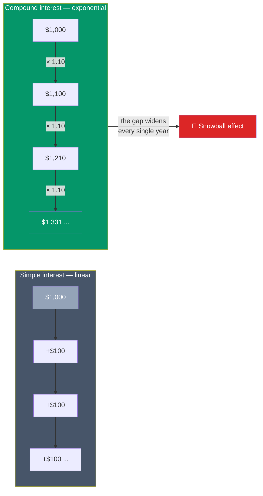

# 📈 The Power of Compounding

> [!abstract] TL;DR
> **Compound interest** is interest earned on your interest — growth that accelerates over time: $A = P\left(1 + \frac{r}{n}\right)^{nt}$. The **Rule of 72** estimates doubling time as $72 \div \text{rate}$. Because compounding is exponential, **time is a bigger lever than the amount you invest**: starting at 25 instead of 35 can more than *double* your ending wealth despite contributing only a little more. **Dollar-cost averaging** — investing a fixed sum on a schedule — turns market volatility into an advantage. This is educational content, not personalized financial advice.

## Intuition — analogy FIRST

Picture a lily pad that doubles in size every day. On day 30 it covers the whole pond. On which day was it *half* covered? Day 29 — the day before. For 29 days it looked like almost nothing was happening; then it exploded. That is exponential growth, and compounding money behaves the same way.

Simple interest is a straight line: earn 10% on $100 and you get $10 every year, forever. **Compound** interest is a curve that bends upward: year one you earn $10, but now you have $110, so year two you earn $11, then $12.10, and so on. Each year's interest joins the principal and starts earning its own interest.

The counter-intuitive punchline: **when** you start matters more than **how much** you invest or even what return you earn. A modest sum given decades to compound beats a large sum given only a few years. Time is the ingredient you can never buy back.

---

## Simple vs Compound Growth

## Key Concepts / Details

### The Compound Interest Formula

$$A = P\left(1 + \frac{r}{n}\right)^{nt}$$

Where **A** = final amount, **P** = principal, **r** = annual rate (decimal), **n** = compounding periods per year, **t** = years. This is [[Time_Value_of_Money|future value]] applied to your own savings.

**Worked example — compound vs simple:** Invest **$10,000 at 8%** for **30 years**, compounded annually ($n = 1$):

$$A = 10{,}000 \times (1.08)^{30} = 10{,}000 \times 10.063 = \$100{,}627$$

With **simple** interest you'd have only $10{,}000 + (10{,}000 \times 0.08 \times 30) = \$34{,}000$. Compounding produced an extra **$66,627** from the exact same deposit — that surplus is interest-on-interest.

**Compounding frequency matters too.** More frequent compounding means slightly more growth. $10,000 at 6% for one year:

| Compounding (n) | Formula | Final value |
|-----------------|---------|-------------|
| Annual (1) | $10{,}000(1.06)^1$ | $10,600.00 |
| Quarterly (4) | $10{,}000(1.015)^4$ | $10,613.64 |
| Monthly (12) | $10{,}000(1.005)^{12}$ | $10,616.78 |
| Daily (365) | $10{,}000(1+0.06/365)^{365}$ | $10,618.31 |

### The Rule of 72

A shortcut for how fast money doubles:

$$\text{Years to double} \approx \frac{72}{\text{interest rate (\%)}}$$

| Return | Years to double | Doublings in 40 years |
|--------|-----------------|-----------------------|
| 3% | ≈ 24 years | ~1.7 |
| 6% | ≈ 12 years | ~3.3 |
| 8% | ≈ 9 years | ~4.4 |
| 10% | ≈ 7.2 years | ~5.6 |

At 8%, $10,000 becomes $20,000 in ~9 years, $40,000 in ~18, $80,000 in ~27, and ~$160,000 in ~36 years — each doubling adds more absolute dollars than the last. The Rule of 72 works in reverse for inflation too: 3% inflation *halves* your purchasing power in ~24 years.

### The Cost of Starting Late

This is the most important lesson in personal finance. Compare two investors, each contributing **$500/month** into a portfolio returning **7% annually** until age 65.

- **Early Erin** starts at **age 25** → 40 years = 480 monthly contributions.
- **Late Liam** starts at **age 35** → 30 years = 360 monthly contributions.

Using the future value of an annuity, $FV = C \times \dfrac{(1+i)^m - 1}{i}$ with monthly rate $i = 0.07/12 = 0.005833$:

| Investor | Start age | Total contributed | Value at 65 |
|----------|-----------|-------------------|-------------|
| Early Erin | 25 | $240,000 | **≈ $1,312,000** |
| Late Liam | 35 | $180,000 | **≈ $610,000** |

Erin contributed only **$60,000 more** than Liam, yet ends up with roughly **$700,000 more** — she has *more than double* the wealth. Those extra ten years at the *front* had decades to compound, so they did the heaviest lifting. The lesson: **the best time to start was yesterday; the second best time is today.**

### Dollar-Cost Averaging (DCA)

**Dollar-cost averaging** means investing a *fixed dollar amount* on a *regular schedule* regardless of price. When prices are low your fixed sum buys more shares; when high, fewer. This automatically lowers your average cost and removes the impossible job of timing the market.

**Worked example — $500/month into a fund with a bumpy price:**

| Month | Share price | Shares bought ($500) |
|-------|-------------|----------------------|
| 1 | $50 | 10.0 |
| 2 | $40 | 12.5 |
| 3 | $25 | 20.0 |
| 4 | $40 | 12.5 |
| 5 | $50 | 10.0 |
| **Total** | | **65.0 shares for $2,500** |

Your **average cost per share** = $2{,}500 \div 65 = \$38.46$, yet the simple **average of the prices** was $(50+40+25+40+50)/5 = \$41.00$. By buying more when it was cheap, DCA beat the average price — and you never had to guess the bottom.

---

## Real-World Notes

The single most-cited example of compounding is Warren Buffett: he accumulated over **99% of his net worth after age 50**, not because his returns spiked, but because his ~20%/year compounding had *decades* of runway. Time, not a sudden windfall, did the work.

Most 401(k) and index-fund investors practice DCA without naming it — every paycheck automatically buys a fixed dollar amount of a fund. During the 2020 and 2022 market drops, disciplined DCA investors were quietly buying shares at a discount while others sat frozen. The mechanism only works if you keep buying *through* the downturns; selling in a panic converts the paper dip into a permanent loss and forfeits the very cheap shares DCA is designed to accumulate.

---

## Common Pitfalls

- **Waiting for the "right time" to start.** The lily-pad math is unforgiving: every year of delay is a year of compounding you can never recover.
- **Underestimating fees.** A 1% annual fee sounds trivial but compounds *against* you — over 40 years it can quietly erase 25–30% of your final balance.
- **Ignoring inflation.** Nominal growth flatters; use *real* (after-inflation) returns to judge true purchasing power. The Rule of 72 shows 3% inflation halving your money's value in ~24 years.
- **Confusing DCA with a guarantee.** DCA manages *timing risk*, not market risk. A portfolio can still fall; DCA simply keeps you buying rationally through the swings.
- **Breaking the compounding chain.** Withdrawing gains, or selling in a panic, resets the snowball to the bottom of the hill.

---

## Related Concepts

- [[_MOC_Personal_Finance|↑ Section MOC]]
- [[Budgeting_and_Saving]] — Frees up the monthly surplus that compounding grows
- [[Retirement_Planning_and_FIRE]] — Compounding is the engine behind every retirement number
- [[Debt_and_Credit_Management]] — Compounding working *against* you on credit-card balances
- [[Time_Value_of_Money]] — The corporate-finance foundation this note applies to households

## Review Questions

1. Using the Rule of 72, how long does it take money to double at 4%, 9%, and 12%? If a savings account pays 2% while inflation runs 4%, what is happening to your real purchasing power over 18 years?
2. Two friends each invest $300/month at 7%. One starts at 22 and stops contributing at 32 (10 years, then lets it ride to 65); the other starts at 32 and contributes all the way to 65. Qualitatively, who is likely to have more at 65, and why does that outcome surprise most people?
3. Explain why dollar-cost averaging produced an average cost of $38.46 in the worked example when the average share price was $41.00. What feature of the buying rule causes this?

## Sources

- Benjamin Graham, *The Intelligent Investor* (dollar-cost averaging and the discipline of regular investing)
- Burton Malkiel, *A Random Walk Down Wall Street*, 12th edition (compounding and low-cost index investing)
- CFA Institute, *CFA Program Curriculum* Level 1 — Quantitative Methods (time value / future value)
- U.S. Securities and Exchange Commission (SEC), *Investor.gov* compound interest calculator and guidance

#finance #personal-finance #compounding #compound-interest #rule-of-72 #dollar-cost-averaging
