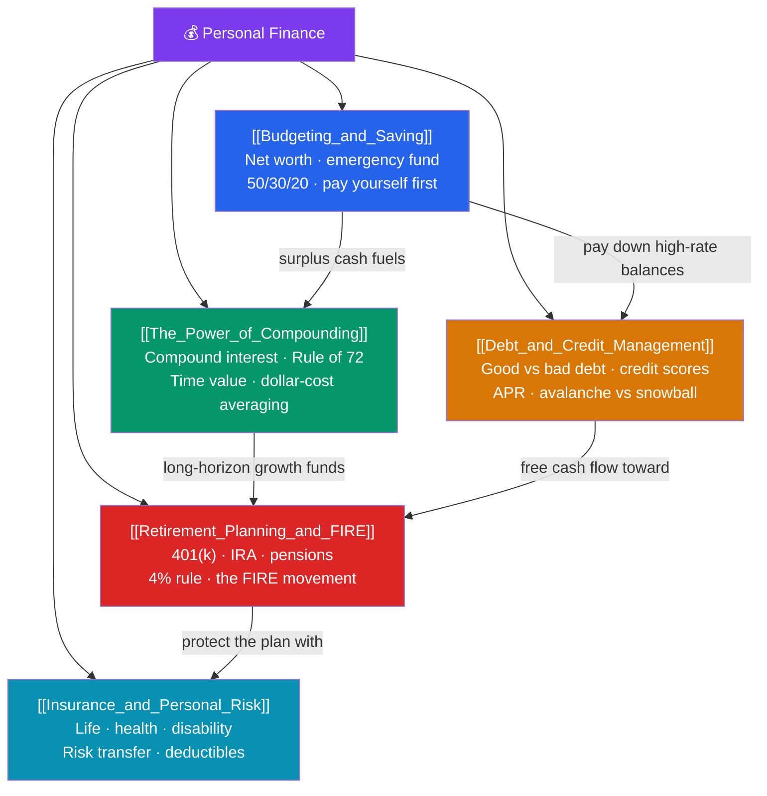

# 💰 Personal Finance — Map of Content

> [!abstract] What This Section Covers
> Personal finance applies the core ideas of corporate finance — time value of money, risk, and return — to the household balance sheet. The journey runs from **cash-flow control** (budgeting, saving, building an emergency fund of 3–6 months of expenses) to **wealth accumulation** through the astonishing math of **compound interest** (the Rule of 72: money doubles in roughly 72 ÷ rate years). Along the way you must **manage debt and credit** (good vs bad debt, credit scores of 300–850, APR, avalanche vs snowball payoff), **plan for retirement** (tax-advantaged 401(k)s and IRAs, the 4% safe-withdrawal rule, the FIRE movement), and **transfer catastrophic risk** through insurance. This is the practical, lifelong-relevant foundation on which every other finance topic rests.

## Concept Map

## Learning Path
1. [[Budgeting_and_Saving]] — Track your net worth, build a spending plan (50/30/20), fund an emergency reserve, and pay yourself first.
2. [[The_Power_of_Compounding]] — Understand why time is the biggest lever: compound interest, the Rule of 72, and dollar-cost averaging.
3. [[Debt_and_Credit_Management]] — Distinguish good from bad debt, protect your credit score, and choose an efficient payoff strategy.
4. [[Retirement_Planning_and_FIRE]] — Use tax-advantaged accounts, apply the 4% rule, and explore Financial Independence / Retire Early.
5. [[Insurance_and_Personal_Risk]] — Transfer catastrophic risk with the right life, health, disability, and property coverage.

## All Notes at a Glance

| Note | Difficulty | What You'll Learn |
|------|------------|-------------------|
| [[Budgeting_and_Saving]] | Beginner | Net worth statement, 50/30/20 rule, emergency fund sizing, pay-yourself-first automation |
| [[The_Power_of_Compounding]] | Beginner | Compound vs simple interest, the Rule of 72, time value of money, dollar-cost averaging |
| [[Debt_and_Credit_Management]] | Beginner | Good vs bad debt, FICO 300–850 scores, APR vs interest rate, avalanche vs snowball |
| [[Retirement_Planning_and_FIRE]] | Intermediate | 401(k)/IRA/pensions, traditional vs Roth, the 4% rule, the FIRE movement |
| [[Insurance_and_Personal_Risk]] | Intermediate | Term vs whole life, health/disability/property cover, risk transfer, deductibles |

## Key Questions This Section Answers
- How much should you save, and how big should your emergency fund be?
- Why does starting to invest a decade earlier matter more than the interest rate, and how does the Rule of 72 make it obvious?
- What actually moves a credit score, and should you pay debt by highest rate (avalanche) or smallest balance (snowball)?
- How much can you safely withdraw from a retirement portfolio each year, and what is FIRE?
- Which risks should you insure against, and which should you self-insure through savings?

## Related Sections
- [[_MOC_Finance_Master|↑ Finance Master MOC]]
- [[_MOC_Financial_Modeling|← Financial Modeling]] — Modeling cash flows and returns over time
- [[_MOC_Behavioral_Finance|→ Behavioral Finance]] — Why real people fail to save and invest rationally

#MOC #Finance #PersonalFinance
