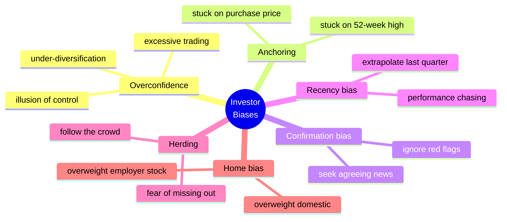

# 🎯 Cognitive Biases in Investing

> [!abstract] TL;DR
> A handful of **cognitive biases** does most of the damage to real portfolios. **Overconfidence** makes investors trade too much and diversify too little — Barber & Odean found the most active traders earned ~6.5 percentage points a year *less* than the market. **Anchoring** fixes us to arbitrary numbers (last price, purchase price). **Confirmation bias** filters out disconfirming evidence. **Recency bias** extrapolates the recent past, fueling performance-chasing. **Herding** copies the crowd, and **home bias** leaves portfolios dangerously concentrated in domestic (and employer) stock. The cures — rules, checklists, diversification, and pre-commitment — work by taking discretion away from System 1.

## Intuition — analogy FIRST

Think of your investing brain as a fast, confident intern who has never admitted being wrong. Give the intern a stock and it instantly forms a view, then spends the rest of the day gathering evidence that it was right (confirmation), assumes the last few months predict the next few (recency), fixates on the price you paid (anchoring), glances nervously at what everyone else is buying (herding), and — because the local companies feel familiar and safe — puts almost everything into the home market (home bias). Every one of these shortcuts felt reasonable in the moment; together they quietly bleed returns. Debiasing is not about firing the intern — you can't — but about writing rules the intern must follow.

---

## The Bias Map

## Key Concepts / Details

### Overconfidence — the costliest bias

**Overconfidence** shows up as overestimating one's knowledge, precision, and control. Its financial signature is **excessive trading**. In "Trading Is Hazardous to Your Wealth," **Barber & Odean (2000)** studied 66,000 households: the average account underperformed the market modestly, but the **most active 20% earned about 6.5 percentage points per year less** than the market, mostly eaten by transaction costs. Their follow-up, **"Boys Will Be Boys" (2001)**, found men trade 45% more than women and thereby earn lower net returns — overconfidence, not skill, drives turnover.

### Anchoring

**Anchoring** (Tversky & Kahneman, 1974) is the tendency to latch onto an initial number and adjust insufficiently. Investors anchor on the **price they paid**, a stock's **52-week high**, or a round number like "$100," letting an arbitrary reference distort a forward-looking valuation. Analyst price targets famously cluster near the current price — an anchor, not an independent estimate.

### Confirmation bias

**Confirmation bias** is seeking, weighting, and remembering evidence that supports what you already believe. After buying a stock, an investor reads the bullish thread and skims past the bearish one; a thesis calcifies precisely when it should be stress-tested. It is the enemy of the pre-mortem.

### Recency bias

**Recency bias** overweights recent experience and extrapolates it into the future. It drives **performance chasing** — pouring money into last year's hot fund or sector just before mean reversion. Regulators require the disclaimer "past performance is not indicative of future results" precisely because recency bias makes investors ignore it.

### Herding

**Herding** is following the crowd, whether from social proof, career risk ("no one gets fired for buying the consensus"), or fear of missing out. Herding turns individual biases into **market-wide** momentum and bubbles — the bridge from this note to [[Market_Anomalies_and_Bubbles]].

### Home bias

The **home bias** (French & Poterba, 1991) is the puzzle that investors hold far more domestic equity than diversification implies. US investors have historically held ~85–90% domestic stock despite the US being roughly half of global market cap. A dangerous special case is **employer-stock concentration**: Enron employees held much of their 401(k) in Enron shares and lost jobs and savings together when it collapsed.

| Bias | Behavioral signature | Portfolio damage | Debiasing move |
|------|---------------------|------------------|----------------|
| **Overconfidence** | Trades too often, too concentrated | Costs and taxes erode returns | Trade less; set a turnover budget; index |
| **Anchoring** | Fixates on purchase price / highs | Holds losers, mis-values assets | Value from fundamentals, ignore cost basis |
| **Confirmation** | Seeks agreeing evidence | Thesis never gets tested | Write a pre-mortem; assign a devil's advocate |
| **Recency** | Extrapolates recent returns | Buys high, sells low | Rebalance on a fixed schedule |
| **Herding** | Copies the crowd | Buys into bubbles | Written investment policy statement |
| **Home bias** | Overweights domestic/employer | Under-diversified, correlated risk | Global index funds; cap single-stock weight |

### Debiasing — the constructive response

You cannot introspect your way out of System 1. What works is **structure**: (1) rules-based investing and automatic rebalancing; (2) checklists and written **investment policy statements** that pre-commit you before emotions arrive; (3) a **pre-mortem** ("assume this failed — why?") to defeat confirmation bias; (4) broad **diversification** so no single bias-driven bet can sink you; and (5) reducing decision *frequency*, since fewer discretionary choices mean fewer chances to err. These are the personal-scale version of the [[Nudges_and_Choice_Architecture|choice architecture]] in the next note.

---

## Real-World Example

During the 2020–2021 meme-stock episode, retail traders on commission-free apps concentrated in a few names like GameStop. Every bias fired at once: **herding** (following viral social-media crowds), **overconfidence** (frequent, leveraged options trading), **recency** (extrapolating a vertical price chart), **anchoring** (targeting prior highs), and **confirmation** (echo-chamber forums that muted skeptics). Zero commissions removed the friction that normally throttles overtrading. Many who bought near the peak — the moment all biases pointed the same way — suffered severe losses when the crowd dispersed, a live demonstration of how individual biases compound into collective disaster.

---

## Common Pitfalls

- **Believing awareness alone fixes bias.** Knowing about anchoring does not stop you anchoring; only rules and structure reliably do.
- **Mistaking a bull market for skill.** In a rising market, overconfident overtrading can still show a profit — masking the cost until conditions turn.
- **Over-diversifying into complexity.** The cure for home bias is a couple of broad global index funds, not fifty overlapping ones.
- **Confusing conviction with confirmation.** A well-tested thesis and a bias-protected one look identical from inside; only actively seeking disconfirmation distinguishes them.

---

## Related Concepts

- [[_MOC_Behavioral_Finance|↑ Section MOC]]
- [[Foundations_of_Behavioral_Finance]] — biases as System 1 heuristics that System 2 fails to check
- [[Prospect_Theory_and_Loss_Aversion]] — anchoring and mental accounting overlap with reference dependence
- [[Market_Anomalies_and_Bubbles]] — herding and overconfidence aggregate into market-level anomalies
- [[Nudges_and_Choice_Architecture]] — designing defaults that debias people at scale
- [[Cognitive_Biases]] — cross-vault: the full catalog of biases from the psychology vault
- [[_MOC_Psychology_Master]] — cross-vault: the cognitive science behind each bias

## Review Questions

1. Barber & Odean found the most active traders underperformed the market by roughly 6.5 percentage points a year. Which bias best explains this, and through what two mechanisms does it destroy returns?
2. Distinguish anchoring, confirmation bias, and recency bias with a single stock example for each. Which one most directly drives performance-chasing into last year's hot fund?
3. Why is employer-stock concentration a particularly dangerous form of home bias? Propose two concrete rules that would debias an investor prone to it.

## Sources

- Barber, B. & Odean, T. (2000), "Trading Is Hazardous to Your Wealth," *Journal of Finance*
- Barber, B. & Odean, T. (2001), "Boys Will Be Boys: Gender, Overconfidence, and Common Stock Investment," *Quarterly Journal of Economics*
- French, K. & Poterba, J. (1991), "Investor Diversification and International Equity Markets," *American Economic Review*
- Montier, J. (2007), *Behavioural Investing: A Practitioner's Guide to Applying Behavioural Finance*, Wiley

#finance #behavioral-finance #cognitive-bias #overconfidence #home-bias #debiasing
