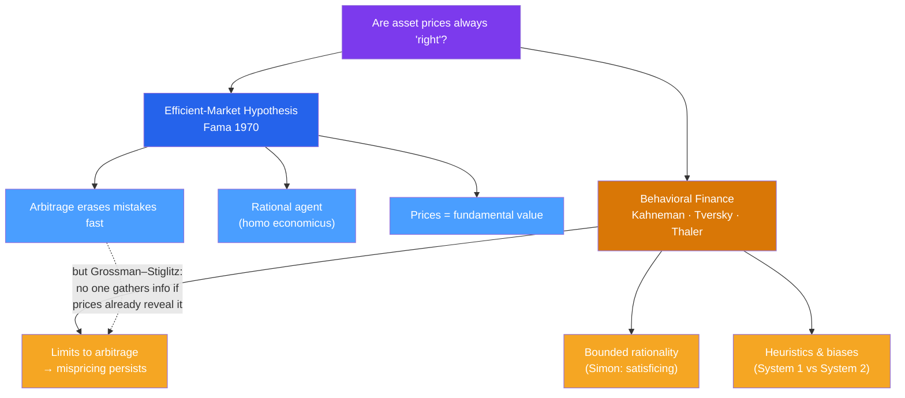

# 🧠 Foundations of Behavioral Finance

> [!abstract] TL;DR
> Classical finance rests on the **efficient-market hypothesis (EMH)** — prices instantly reflect all available information, so no one can systematically beat the market — and on a perfectly rational agent, *homo economicus*. Behavioral finance keeps the math but replaces the agent. Drawing on Herbert **Simon's bounded rationality**, Daniel **Kahneman** and Amos **Tversky's** heuristics-and-biases program, and Richard **Thaler's** economics of the imperfect human, it argues that real investors are predictably irrational, that **System 1** (fast, intuitive) often overrides **System 2** (slow, deliberate), and that markets can therefore misprice assets for long stretches.

## Intuition — analogy FIRST

Imagine two economists watching a $20 bill lying on the sidewalk. The classical one says, "It can't really be there — if it were, someone would already have picked it up." That is the efficient-market instinct: any obvious profit is already gone, so prices are always "right."

The behavioral economist walks over and picks it up. Sometimes the bill *is* there, because the crowd is scared, distracted, or collectively wrong. Real markets are made of people who anchor on yesterday's price, panic-sell in a crash, and pile into whatever is rising.

Behavioral finance does not claim markets are *always* wrong — arbitrage is real and often works. It claims they are wrong *often enough, and predictably enough,* that a theory of the human mind belongs inside the theory of prices.

---

## The Two Worldviews

## Key Concepts / Details

### The Efficient-Market Hypothesis

Formalized by **Eugene Fama** (1970), the EMH says security prices fully reflect available information, so returns are unpredictable — a **random walk** (an idea traced to Bachelier in 1900 and Samuelson in 1965). Fama distinguished three forms by the information set:

| Form | Information already in the price | Implication |
|------|----------------------------------|-------------|
| **Weak** | All past prices and volume | Technical analysis cannot beat the market |
| **Semi-strong** | All public information | Fundamental analysis of public data cannot either; prices adjust instantly to news |
| **Strong** | All information, including private | Even insiders cannot earn abnormal returns |

The EMH is elegant and partly true: most active managers do underperform low-cost index funds after fees, exactly as the theory predicts.

### The behavioral critique

The cracks show up as **excess volatility**. Robert **Shiller (1981)** showed stock prices swing far more than the present value of future dividends can justify — markets move on mood, not just fundamentals. The **Grossman–Stiglitz paradox (1980)** delivers a logical blow: if prices already reflected *all* information, no one would be paid to gather it, so no one would — and then prices *couldn't* reflect it. Perfect efficiency is self-contradicting; some inefficiency must remain to reward the analysts who correct it.

### Bounded rationality (Herbert Simon)

**Herbert Simon (1955, Nobel 1978)** argued that humans lack the time, information, and cognitive power to optimize. Instead we **satisfice** — search until we find an option that is "good enough," then stop. Bounded rationality is the philosophical bedrock of behavioral finance: if minds are limited, systematic error is not a bug but the default.

### Heuristics, biases, and the two systems

**Kahneman and Tversky's** landmark 1974 *Science* paper, "Judgment under Uncertainty: Heuristics and Biases," showed that people replace hard probability questions with easy mental shortcuts — **availability**, **representativeness**, **anchoring** — that work well on average but fail in predictable directions.

Kahneman later popularized the **dual-process** framing in *Thinking, Fast and Slow* (2011):

- **System 1** — fast, automatic, emotional, effortless. It jumps to conclusions and is the source of most biases.
- **System 2** — slow, deliberate, logical, effortful. It can override System 1 but is lazy and easily fatigued.

Most investing mistakes are System 1 answers that System 2 never checked.

### The founders and the field

| Thinker | Contribution | Recognition |
|---------|--------------|-------------|
| **Herbert Simon** | Bounded rationality, satisficing | Nobel 1978 |
| **Daniel Kahneman & Amos Tversky** | Heuristics and biases; prospect theory | Kahneman Nobel 2002 (Tversky d. 1996) |
| **Richard Thaler** | Applied psychology to economics; mental accounting; nudges | Nobel 2017 |
| **Robert Shiller** | Excess volatility, speculative bubbles | Nobel 2013 |

Notably, Fama (efficient markets) and Thaler (behavioral) both taught at the University of Chicago and even shared the 2013 Nobel stage with Shiller — a sign the debate is a genuine tension, not a settled rout. Andrew **Lo's Adaptive Markets Hypothesis** (2004) offers a synthesis: efficiency is not fixed but evolves as market participants learn.

---

## Real-World Example

In the dot-com era, **3Com** spun off a fraction of its subsidiary **Palm** (March 2000). Investors valued the small Palm stake so highly that 3Com's *remaining* business was implicitly worth *negative* several billion dollars — an arithmetic impossibility if prices equal fundamental value. Rational arbitrageurs saw the mispricing clearly, yet could not easily short enough Palm shares to close it. The episode is a textbook demonstration that markets can be visibly, absurdly wrong, and that "smart money" is not always able to fix it — the two pillars of the behavioral worldview.

---

## Common Pitfalls

- **Treating behavioral finance as "markets are always wrong."** It is not. It says markets are *sometimes* wrong in *predictable* ways; index funds still beat most active managers.
- **Confusing "irrational" with "stupid."** Heuristics are efficient adaptations that misfire in specific, well-mapped situations — not evidence of low intelligence.
- **Assuming you are the exception.** The biases apply to professionals and PhDs too; believing you are immune is itself overconfidence.
- **Reading EMH as falsified.** The joint-hypothesis problem (Fama) means any test of efficiency is also a test of the asset-pricing model used — so "beating the market" never cleanly disproves EMH.

---

## Related Concepts

- [[_MOC_Behavioral_Finance|↑ Section MOC]]
- [[Prospect_Theory_and_Loss_Aversion]] — the formal model of how boundedly rational agents actually value gambles
- [[Cognitive_Biases_in_Investing]] — the specific System 1 errors that damage portfolios
- [[Market_Anomalies_and_Bubbles]] — what happens when these biases aggregate across a whole market
- [[Nudges_and_Choice_Architecture]] — the constructive response Thaler built from these foundations
- [[Cognitive_Biases]] — cross-vault: the core psychology catalog behind the finance biases
- [[_MOC_Psychology_Master]] — cross-vault: the cognitive science that behavioral finance imports

## Review Questions

1. State the three forms of the efficient-market hypothesis and give one investing practice that each form would declare futile. Which form does the existence of profitable insider trading contradict?
2. Explain the Grossman–Stiglitz paradox. Why does it imply that a *perfectly* efficient market cannot exist in equilibrium?
3. Distinguish System 1 from System 2 using a concrete trading decision. Which system is responsible for panic-selling in a crash, and why is System 2 often unable to stop it?

## Sources

- Fama, E. (1970), "Efficient Capital Markets: A Review of Theory and Empirical Work," *Journal of Finance*
- Kahneman, D. (2011), *Thinking, Fast and Slow*, Farrar, Straus and Giroux
- Simon, H. (1955), "A Behavioral Model of Rational Choice," *Quarterly Journal of Economics*
- Shiller, R. (2000), *Irrational Exuberance*, Princeton University Press

#finance #behavioral-finance #EMH #bounded-rationality #kahneman #thaler
