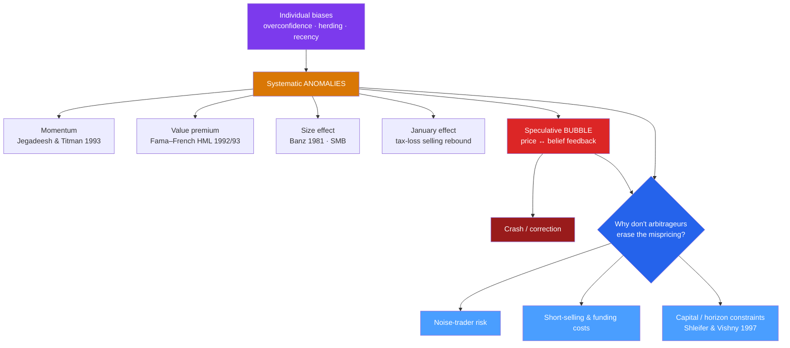

# 🫧 Market Anomalies and Bubbles

> [!abstract] TL;DR
> **Anomalies** are patterns in returns that the efficient-market hypothesis says should not exist yet stubbornly do: **momentum** (past winners keep winning for 3–12 months), the **value premium** (cheap stocks beat glamour stocks), the **size effect**, and calendar oddities like the **January effect**. Scaled up, biases produce **speculative bubbles** — self-reinforcing spirals of price and belief — from tulips to dot-com to housing. The deep question is why rational arbitrageurs don't simply erase these mispricings. The answer is the **limits to arbitrage** (Shleifer & Vishny, 1997): real arbitrage is costly, risky, and capital-constrained, so smart money cannot always win, and prices can stay wrong longer than a trader can stay solvent.

## Intuition — analogy FIRST

Efficient-market theory promises that if a $20 bill sits on the sidewalk, arbitrageurs snatch it instantly. Anomalies are bills that lie there for *months* — momentum and value have paid off across decades and dozens of countries.

Why doesn't the crowd grab them? Because in real markets the bill is guarded by a dog. Betting against an overpriced stock means borrowing shares (costly), posting margin (capital-constrained), and enduring the risk that the crowd gets *even more* irrational before sanity returns — "the market can stay irrational longer than you can stay solvent." Arbitrage is not the frictionless, riskless force the textbook assumes. That single crack — the **limits to arbitrage** — is what lets both persistent anomalies and full-blown bubbles survive.

---

## From Bias to Anomaly to Bubble

## Key Concepts / Details

### The major anomalies

An **anomaly** is a return pattern not explained by risk within the standard model — a challenge to semi-strong efficiency.

| Anomaly | Finding | Key study |
|---------|---------|-----------|
| **Momentum** | Stocks that outperformed over the past 3–12 months keep outperforming over the next 3–12 | Jegadeesh & Titman (1993) |
| **Value premium** | Low price-to-book / low P/E ("value") stocks beat high-multiple "glamour" stocks long-term | Basu (1977); Fama & French (1992) |
| **Size effect** | Small-cap stocks historically earned higher risk-adjusted returns than large-caps | Banz (1981) |
| **January effect** | Small-caps tend to jump in early January after December tax-loss selling | Rozeff & Kinney (1976) |

Momentum is especially awkward because it directly violates **weak-form** efficiency: past prices predict future prices. Behavioral explanations invoke **underreaction** then **overreaction** (herding, recency); risk-based explanations (Fama & French's factors) say value and size are compensation for bearing systematic risk. The debate is unresolved — and many anomalies have weakened after publication, consistent with arbitrage slowly eroding them.

### Factor models — the rational reply

**Fama & French's three-factor model (1993)** absorbed size and value into risk factors, **SMB** (small-minus-big) and **HML** (high-minus-low book-to-market), added to the market factor. **Carhart (1997)** appended a momentum factor, **WML/UMD**. Whether these factors are *risk premia* (rational) or *mispricing* (behavioral) is the central battleground between the Fama and Thaler camps.

### Speculative bubbles

A **bubble** is a self-reinforcing rise in price driven by expectations of further rises rather than fundamentals, followed by a crash. Charles Kindleberger's *Manias, Panics, and Crashes* and Hyman **Minsky's** financial-instability hypothesis describe the arc: displacement → boom → euphoria → distress → revulsion. Classic episodes — Dutch tulip mania (1637), the South Sea Bubble (1720), the 1929 crash, the dot-com bubble (2000), and the US housing bubble (2008) — all show herding, overconfidence, and extrapolative (recency) beliefs feeding a price-belief spiral. See [[Financial_History_and_Crises]] for the historical narratives.

### Limits to arbitrage

Classical theory assumes arbitrageurs instantly correct mispricing. **Shleifer & Vishny (1997), "The Limits of Arbitrage,"** showed why they often cannot:

- **Noise-trader risk** — irrational traders can push prices *further* from value before reverting (De Long, Shleifer, Summers & Waldmann, 1990). The arbitrageur can be right and still be wiped out first.
- **Capital and horizon constraints** — professional arbitrageurs manage other people's money; a widening loss triggers redemptions and margin calls exactly when the opportunity is best, forcing liquidation at the worst time.
- **Implementation costs** — short-selling requires borrowing shares (sometimes impossible or expensive), plus margin, fees, and short-recall risk.

**Canonical evidence of the limits:** the **Royal Dutch / Shell** twin shares, claims on the same cash flows, diverged by up to ~35% for years; **3Com/Palm (2000)** implied a negative value for 3Com's core business; and **Long-Term Capital Management (1998)** — run by Nobel laureates — collapsed when convergence trades that were "certain" to pay diverged long enough to exhaust its capital. Mispricing can be real, visible, and still unexploitable.

---

## Real-World Example

The **dot-com bubble (1995–2000)** is limits-to-arbitrage in the wild. By 1999 many internet firms with no earnings traded at absurd multiples; sophisticated investors *knew* it. Yet shorting was brutal — hard-to-borrow shares, unbounded losses as prices kept climbing through 1999 and early 2000, and clients pulling money from any manager who lagged the soaring index. Julian Robertson's Tiger Management, a value-driven fund, shut down in early 2000 after refusing to chase tech — just weeks before the NASDAQ peaked and then fell nearly 80%. Being right too early was indistinguishable from being wrong. The bubble inflated and burst precisely because arbitrage had limits.

---

## Common Pitfalls

- **Treating anomalies as free money.** Many shrink or vanish after publication (arbitrage erodes them), and live trading costs can swallow paper premiums.
- **Ignoring the joint-hypothesis problem.** An "anomaly" may simply mean the risk model is wrong, not that the market is inefficient — you can't cleanly separate the two.
- **Assuming arbitrage is riskless.** Textbook arbitrage is riskless; real arbitrage carries noise-trader, funding, and horizon risk that can bankrupt a correct trader.
- **Calling every drawdown a bubble.** Bubbles require a self-reinforcing price-belief spiral detached from fundamentals — not merely a high valuation or a sharp fall.

---

## Related Concepts

- [[_MOC_Behavioral_Finance|↑ Section MOC]]
- [[Foundations_of_Behavioral_Finance]] — anomalies are the empirical case against strong-form EMH
- [[Prospect_Theory_and_Loss_Aversion]] — loss aversion underlies the equity premium and momentum
- [[Cognitive_Biases_in_Investing]] — herding, overconfidence, and recency are the micro-causes of bubbles
- [[Nudges_and_Choice_Architecture]] — the policy response to predictable investor error
- [[Financial_History_and_Crises]] — cross-link: the historical bubbles and crashes in detail
- [[_MOC_Psychology_Master]] — cross-vault: the crowd psychology behind manias

## Review Questions

1. Explain why the momentum anomaly is a sharper challenge to the efficient-market hypothesis than the value premium. Which *form* of EMH does momentum violate?
2. State the three limits to arbitrage from Shleifer & Vishny. Using the Royal Dutch/Shell or 3Com/Palm case, show how a mispricing can be obvious yet impossible to profitably exploit.
3. Are the Fama–French size and value factors evidence of risk premia or of behavioral mispricing? Lay out the argument each camp would make and why the joint-hypothesis problem keeps the debate open.

## Sources

- Jegadeesh, N. & Titman, S. (1993), "Returns to Buying Winners and Selling Losers," *Journal of Finance*
- Fama, E. & French, K. (1993), "Common Risk Factors in the Returns on Stocks and Bonds," *Journal of Financial Economics*
- Shleifer, A. & Vishny, R. (1997), "The Limits of Arbitrage," *Journal of Finance*
- Kindleberger, C. & Aliber, R. (2011), *Manias, Panics, and Crashes: A History of Financial Crises*, 6th ed., Palgrave Macmillan

#finance #behavioral-finance #anomalies #momentum #value-premium #bubbles #limits-to-arbitrage
