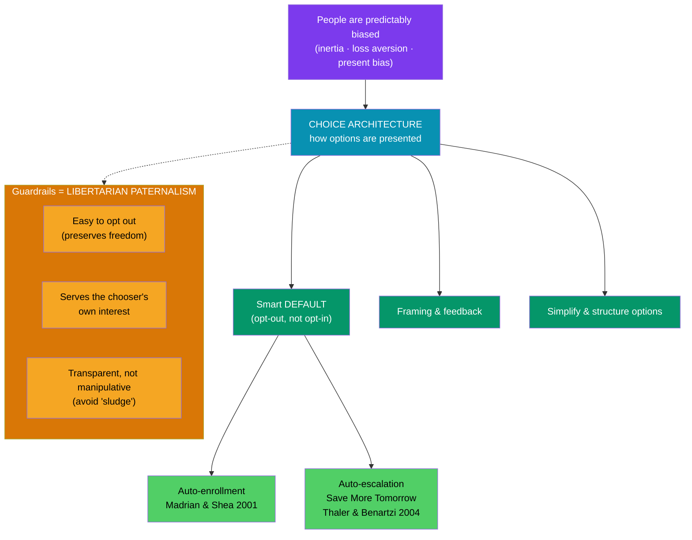

# 🪄 Nudges and Choice Architecture

> [!abstract] TL;DR
> If people are predictably biased, you can redesign their *choices* to help them without removing any option. That is the program of **Nudge** (Thaler & Sunstein, 2008). A **nudge** alters the **choice architecture** — the way options are presented — to steer behavior predictably while preserving freedom of choice; **libertarian paternalism** is the philosophy behind it. The workhorse is the **default**: because inertia and loss aversion are powerful, whatever happens "automatically" tends to stick. **Automatic enrollment** in retirement plans (Madrian & Shea, 2001) and **Save More Tomorrow** (Thaler & Benartzi, 2004) turned these insights into dramatic, real increases in savings — at essentially zero cost and zero coercion.

## Intuition — analogy FIRST

A school cafeteria has to arrange its food somehow — there is no neutral layout. Put the fruit at eye level and the fries in an awkward back corner, and more kids eat fruit; reverse it and they eat fries. Nobody has been banned from anything; every option remains available. But the *arrangement* — the choice architecture — reliably moves behavior.

Finance is full of cafeterias. A 401(k) form that asks employees to *opt in* leaves many un-enrolled through sheer inertia; the *identical* plan that enrolls them automatically (with a simple opt-out) reaches near-universal participation. Same options, same freedom — but a default set with human psychology in mind. A nudge is just choosing the arrangement deliberately, in the chooser's own interest.

---

## Anatomy of a Nudge

## Key Concepts / Details

### Choice architecture and the nudge

**Richard Thaler** and **Cass Sunstein** argued in *Nudge* (2008) that there is no such thing as a neutral presentation of options — someone is always the **choice architect**, so they should design deliberately and benevolently. A **nudge** is "any aspect of the choice architecture that alters people's behavior in a predictable way without forbidding any options or significantly changing their economic incentives." Banning junk food is not a nudge; putting the salad first is.

### Libertarian paternalism

The governing philosophy is **libertarian paternalism** — *paternalist* because it tries to make people better off *by their own lights*, *libertarian* because it never forecloses choice. Both properties must hold: a default you cannot escape is not a nudge, and a shove toward the architect's interest rather than yours is not benevolent.

### The power of defaults

The single most powerful nudge is the **default** — the outcome that occurs if the chooser does nothing. Defaults are potent because of **status-quo bias**, **inertia**, and **loss aversion** (any change feels like a loss from the reference point). **Johnson & Goldstein (2003)** showed organ-donor rates differ enormously between opt-in and opt-out countries with otherwise similar cultures — from single digits to over 90% — purely from the default.

### Auto-enrollment in retirement plans

The landmark financial application: **Madrian & Shea (2001)** studied a firm that switched its 401(k) from opt-in to **automatic enrollment**. Participation among new hires jumped from roughly **half to about 90%**, with the largest gains among younger and lower-income workers who most needed to save. A "default" cost the employer nothing and moved behavior more than years of financial-education campaigns. The finding drove the US **Pension Protection Act of 2006**, which encouraged auto-enrollment nationwide.

Auto-enrollment has a catch: naïve defaults can **anchor** people at a low contribution rate (e.g., 3%) and a conservative fund, so the default *level* matters as much as the default *decision*.

### Save More Tomorrow

**Thaler & Benartzi's (2004) "Save More Tomorrow" (SMarT)** program engineers around specific biases. Employees pre-commit to **increase** their savings rate with **future** raises, so:

- **Present bias** is disarmed — the sacrifice is in the future, which feels painless today.
- **Loss aversion** is respected — take-home pay never *falls*, since increases come only from raises, so no change registers as a loss.
- **Inertia** now works *for* saving — once enrolled, staying enrolled is the path of least resistance.

In the first implementation, participants' average saving rates roughly **tripled** (about 3.5% to 13.6%) over a few years. It is the clearest case of turning the biases from [[Prospect_Theory_and_Loss_Aversion]] into a policy that helps people.

| Nudge | Mechanism it exploits | Documented effect |
|-------|-----------------------|-------------------|
| **Auto-enrollment** | Inertia, status-quo bias | 401(k) participation ~50% → ~90% |
| **Auto-escalation (SMarT)** | Present bias, loss aversion | Saving rate ~3.5% → ~13.6% |
| **Opt-out organ donation** | Default effect | Consent rates single digits → 90%+ |
| **Simplified, framed disclosure** | Cognitive overload | Better fund and loan choices |

### The ethics of nudging

Nudging draws real criticism. Is steering people **manipulation** that bypasses rational agency? Who guards the choice architect's values, and what if defaults serve the institution rather than the person (Thaler's own dark twin, **"sludge"** — friction that exploits bias *against* the chooser, like hard-to-cancel subscriptions)? The defenders' reply: since *some* architecture is unavoidable, the honest choice is a **transparent** one set in the chooser's interest with an easy opt-out — the two guardrails of libertarian paternalism. Thaler's summed-up rule of thumb: *"Nudge for good."*

---

## Real-World Example

The United Kingdom's **automatic enrolment** into workplace pensions, phased in from 2012, is nudge theory at national scale. Every eligible worker is enrolled by default and must actively opt out to leave. Workplace-pension participation among eligible employees rose from around **55% in 2012 to over 88%** within a few years, adding millions of new savers — with opt-out rates staying under ~10%. No one lost the right to decline; the default simply changed which decision required effort. It is arguably the most successful large-scale application of behavioral finance to date, and a direct descendant of Madrian & Shea's 2001 result.

---

## Common Pitfalls

- **Confusing a nudge with a mandate.** If opting out is hard or an option is removed, it is regulation, not a nudge — the libertarian half is gone.
- **Ignoring the default level.** Auto-enrolling people at a too-low rate or into a too-conservative fund anchors them there; set smart *defaults within the default*.
- **Assuming all nudges are benign.** The same tools power **sludge** — dark-pattern friction that exploits bias against the user. Design intent is everything.
- **Overrating education, underrating architecture.** Financial-literacy campaigns move behavior far less than a single well-set default; do not substitute pamphlets for design.

---

## Related Concepts

- [[_MOC_Behavioral_Finance|↑ Section MOC]]
- [[Foundations_of_Behavioral_Finance]] — Thaler's program and the bounded-rationality basis of nudging
- [[Prospect_Theory_and_Loss_Aversion]] — loss aversion is the exact lever Save More Tomorrow pulls
- [[Cognitive_Biases_in_Investing]] — nudges are population-scale debiasing of the same errors
- [[Market_Anomalies_and_Bubbles]] — the market-level failures policy nudges try to prevent
- [[Cognitive_Biases]] — cross-vault: the psychology catalog the nudges are engineered against
- [[_MOC_Psychology_Master]] — cross-vault: the decision science underpinning choice architecture

## Review Questions

1. Define a nudge precisely and state the two conditions of libertarian paternalism. Explain why a mandatory retirement contribution and a hidden "sludge" fee each fail at least one condition.
2. Madrian & Shea (2001) found auto-enrollment raised 401(k) participation from ~50% to ~90%. Which biases make the default so powerful, and why did decades of financial education achieve so much less?
3. Walk through how Save More Tomorrow defeats present bias, loss aversion, and inertia in turn. Why does tying increases to future raises matter for the loss-aversion piece specifically?

## Sources

- Thaler, R. & Sunstein, C. (2008), *Nudge: Improving Decisions About Health, Wealth, and Happiness*, Yale University Press
- Madrian, B. & Shea, D. (2001), "The Power of Suggestion: Inertia in 401(k) Participation and Savings Behavior," *Quarterly Journal of Economics*
- Thaler, R. & Benartzi, S. (2004), "Save More Tomorrow: Using Behavioral Economics to Increase Employee Saving," *Journal of Political Economy*
- Johnson, E. & Goldstein, D. (2003), "Do Defaults Save Lives?," *Science*

#finance #behavioral-finance #nudge #choice-architecture #defaults #auto-enrollment #save-more-tomorrow
