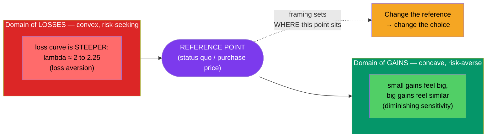

# 📉 Prospect Theory and Loss Aversion

> [!abstract] TL;DR
> **Prospect theory** (Kahneman & Tversky, 1979) is the leading descriptive model of choice under risk — how people *actually* decide, versus how expected-utility theory says they *should*. Its core is an S-shaped **value function** defined over *changes* from a **reference point**, not final wealth. Three features drive everything: outcomes are judged **relative to a reference point** (reference dependence), each extra dollar matters less than the last (**diminishing sensitivity**), and **losses hurt about twice as much as equivalent gains feel good** (**loss aversion**, λ ≈ 2). This asymmetry explains **framing** effects and the **disposition effect** — investors sell winners too early and cling to losers too long.

## Intuition — analogy FIRST

Ask yourself two questions.

First: I give you $1,000, then offer a choice — a *sure* $500 more, or a coin flip for $1,000 more or nothing. Most people take the sure $500.

Second: I give you $2,000, then offer — a *sure* loss of $500, or a coin flip to lose $1,000 or lose nothing. Now most people gamble.

Both scenarios leave you choosing between a guaranteed $1,500 and a coin flip between $1,000 and $2,000 — *identical* final-wealth options. Yet framing one as a gain and the other as a loss flips the choice. Expected-utility theory, which cares only about final wealth, cannot explain this. Prospect theory can: we are **risk-averse in gains and risk-seeking in losses**, because we code outcomes as changes from where we stand, not as end states.

---

## The Value Function

## Key Concepts / Details

### From expected utility to prospect theory

Classical **expected-utility theory** evaluates a gamble as $\sum p_i \, u(w_i)$ over *final wealth* $w_i$. **Prospect theory** (published in *Econometrica*, 1979) replaces this with two functions evaluated over *changes* $x$ from a reference point:

$$V = \sum \pi(p_i)\, v(x_i)$$

where $v(\cdot)$ is the **value function** and $\pi(\cdot)$ is a **probability weighting function**.

**The value function $v(x)$** has three defining properties:

1. **Reference dependence** — value is defined over gains and losses relative to a reference point (often the purchase price or the status quo), not over absolute wealth.
2. **Diminishing sensitivity** — the function is concave for gains and convex for losses. The difference between $100 and $200 feels larger than between $1,100 and $1,200.
3. **Loss aversion** — the curve is *steeper* for losses than for gains. Empirically the **loss-aversion coefficient λ ≈ 2 to 2.25**: losing $100 hurts roughly as much as winning $200 pleases.

A common parametric form (Tversky & Kahneman, 1992):
$$v(x) = \begin{cases} x^{\alpha} & x \ge 0 \\ -\lambda(-x)^{\beta} & x < 0 \end{cases}$$
with estimates $\alpha = \beta \approx 0.88$ and $\lambda \approx 2.25$.

### Probability weighting

People do not use raw probabilities. The weighting function $\pi(p)$ **overweights small probabilities** (why we buy lottery tickets *and* insurance) and **underweights moderate-to-high probabilities**. **Cumulative Prospect Theory** (1992) refined this so it applies cleanly to gambles with many outcomes.

### Framing

Because value depends on a reference point, *how* an option is described changes the choice. In Tversky & Kahneman's **"Asian disease problem" (1981)**, an identical policy framed as "200 of 600 people will be saved" was preferred by most, while "400 will die" was rejected by most — the same outcome, opposite decisions. Marketers, employers, and financial advisors all move behavior by moving the reference point.

| Feature | Expected-Utility Theory | Prospect Theory |
|---------|-------------------------|-----------------|
| Carrier of value | Final wealth | Change vs a reference point |
| Attitude to risk | Consistent (usually averse) | Averse in gains, seeking in losses |
| Gains vs losses | Symmetric | Losses ~2× steeper (loss aversion) |
| Probabilities | Used as given | Small p overweighted, large underweighted |
| Framing | Irrelevant | Decisive |

### The disposition effect

The most famous market consequence. Investors **sell winners too early and hold losers too long** — first named by **Shefrin & Statman (1985)** and documented at scale by **Terrance Odean (1998, "Are Investors Reluctant to Realize Their Losses?")** across 10,000 brokerage accounts. Prospect theory explains it: a stock above its purchase price puts you in the concave *gain* domain, where you are risk-averse and want to lock in the sure win; a stock below purchase price puts you in the convex *loss* domain, where you turn risk-seeking and gamble on a recovery to avoid realizing the painful loss. The reference point is the price you paid — and it is exactly the wrong anchor for a forward-looking decision. Selling winners and holding losers is also tax-inefficient, compounding the damage.

---

## Real-World Example

A retail investor buys a stock at $50. It rises to $65; delighted, she sells to "take the profit" — realizing a gain in the concave domain feels safe and good. The same investor buys another stock at $50 that falls to $35. Rather than sell, she holds and even "averages down," refusing to crystallize the loss because doing so would move her from a hoped-for recovery into a certain, painful realization. Odean's data show this pattern is systematic: the winners she sells tend to *keep outperforming* the losers she keeps. Her reference point — the purchase price — has hijacked a decision that should depend only on each stock's future prospects.

---

## Common Pitfalls

- **Confusing loss aversion with risk aversion.** Risk aversion is a dislike of variance; loss aversion is an asymmetry around a reference point that can make people *seek* risk to avoid a sure loss.
- **Anchoring on purchase price.** "I'll sell when it gets back to what I paid" is the disposition effect in words — the market has no memory of your cost basis.
- **Assuming the reference point is fixed.** It can be the purchase price, a recent high, a peer's return, or an expectation — and it can be deliberately reset by framing.
- **Over-precision on λ.** The ~2:1 ratio is a robust average, not a universal constant; it varies by person, domain, and stakes.

---

## Related Concepts

- [[_MOC_Behavioral_Finance|↑ Section MOC]]
- [[Foundations_of_Behavioral_Finance]] — the bounded-rationality tradition prospect theory formalizes
- [[Cognitive_Biases_in_Investing]] — mental accounting and anchoring are close cousins of reference dependence
- [[Market_Anomalies_and_Bubbles]] — loss aversion helps explain the equity premium puzzle and momentum
- [[Nudges_and_Choice_Architecture]] — Save More Tomorrow is engineered around loss aversion
- [[Cognitive_Biases]] — cross-vault: the psychology of framing and reference points
- [[_MOC_Psychology_Master]] — cross-vault: the decision-science parent of prospect theory

## Review Questions

1. Draw the prospect-theory value function and label its reference point, its concave gain region, its convex loss region, and the steeper loss slope. Which property produces loss aversion?
2. Using reference dependence and the shape of the value function, explain precisely why the disposition effect makes investors sell winners early and hold losers too long.
3. In the Asian disease problem, the "save 200" and "400 die" frames describe identical outcomes yet reverse the majority choice. Explain the reversal in terms of gain versus loss framing and the value function's curvature.

## Sources

- Kahneman, D. & Tversky, A. (1979), "Prospect Theory: An Analysis of Decision under Risk," *Econometrica*
- Tversky, A. & Kahneman, A. (1992), "Advances in Prospect Theory: Cumulative Representation of Uncertainty," *Journal of Risk and Uncertainty*
- Odean, T. (1998), "Are Investors Reluctant to Realize Their Losses?," *Journal of Finance*
- Shefrin, H. & Statman, M. (1985), "The Disposition to Sell Winners Too Early and Ride Losers Too Long," *Journal of Finance*

#finance #behavioral-finance #prospect-theory #loss-aversion #disposition-effect #framing
