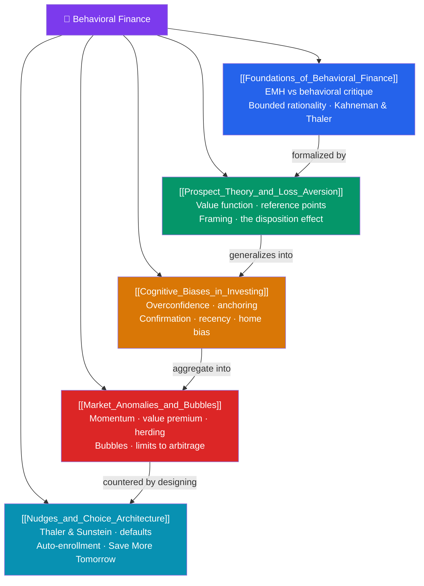

# 🧠 Behavioral Finance — Map of Content

> [!abstract] What This Section Covers
> Behavioral finance is the collision between economics and psychology. Classical theory assumes the **efficient-market hypothesis** and a rational *homo economicus*; behavioral finance documents that real investors are **boundedly rational** and systematically biased. The intellectual arc runs from the **foundations** (Kahneman & Tversky's heuristics, Richard Thaler's economics of the imperfect human) through **prospect theory** — the finding that losses hurt about twice as much as equivalent gains loom pleasant (loss aversion), and that we evaluate outcomes against reference points rather than final wealth. From there we catalog the **cognitive biases** that damage portfolios (overconfidence, anchoring, confirmation, recency, home bias), the **market anomalies** they produce (momentum, the value premium, herding, bubbles, limits to arbitrage), and finally the constructive response: **nudges and choice architecture** that redesign defaults to help people choose better without restricting freedom.

## Concept Map

## Learning Path
1. [[Foundations_of_Behavioral_Finance]] — The debate: efficient markets vs bounded rationality, and the founders Kahneman, Tversky, and Thaler.
2. [[Prospect_Theory_and_Loss_Aversion]] — The value function, reference dependence, framing effects, and the disposition effect.
3. [[Cognitive_Biases_in_Investing]] — Overconfidence, anchoring, confirmation, recency, and home bias in real portfolios.
4. [[Market_Anomalies_and_Bubbles]] — How biases scale up: momentum, the value premium, herding, bubbles, and the limits to arbitrage.
5. [[Nudges_and_Choice_Architecture]] — Designing better defaults: auto-enrollment, Save More Tomorrow, and libertarian paternalism.

## All Notes at a Glance

| Note | Difficulty | What You'll Learn |
|------|------------|-------------------|
| [[Foundations_of_Behavioral_Finance]] | Beginner | EMH forms, the behavioral critique, bounded rationality, heuristics, key thinkers |
| [[Prospect_Theory_and_Loss_Aversion]] | Intermediate | S-shaped value function, ~2:1 loss aversion, reference points, framing, disposition effect |
| [[Cognitive_Biases_in_Investing]] | Intermediate | Overconfidence, anchoring, confirmation bias, recency, mental accounting, home bias |
| [[Market_Anomalies_and_Bubbles]] | Advanced | Momentum, value premium, herding, speculative bubbles, limits to arbitrage |
| [[Nudges_and_Choice_Architecture]] | Intermediate | Thaler & Sunstein nudges, default effects, auto-enrollment, Save More Tomorrow |

## Key Questions This Section Answers
- If markets are efficient, why do systematic anomalies like momentum and the value premium persist?
- Why does losing $100 feel worse than gaining $100 feels good, and how does that drive the disposition effect?
- Which biases cause investors to trade too much, hold losers too long, and under-diversify?
- What are the limits to arbitrage, and why can't rational traders simply eliminate mispricing?
- How can a well-chosen default (like automatic 401(k) enrollment) dramatically raise savings without coercion?

## Related Sections
- [[_MOC_Finance_Master|↑ Finance Master MOC]]
- [[_MOC_Personal_Finance|← Personal Finance]] — The rational plan these biases sabotage
- [[_MOC_Financial_Accounting|→ Financial Accounting]] — The hard numbers investors so often misread
- [[_MOC_Psychology_Master]] — Cross-vault: the cognitive science behind the biases
- [[Cognitive_Biases]] — The core catalog of biases from the psychology vault

#MOC #Finance #BehavioralFinance
