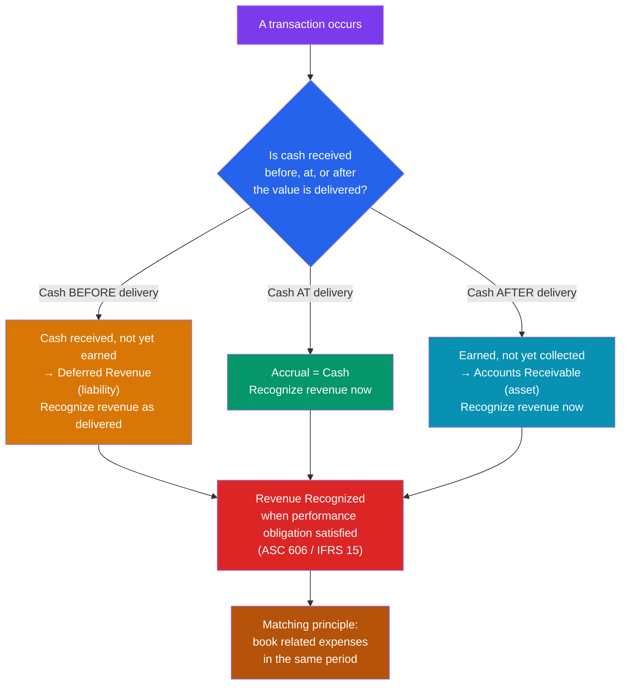

# 📐 Accrual Accounting and Standards

> [!abstract] TL;DR
> **Accrual accounting** records revenue when it is *earned* and expenses when they are *incurred* — regardless of when cash changes hands — as opposed to **cash-basis** accounting, which records only actual cash movement. Two principles govern it: **revenue recognition** (book revenue when the performance obligation is satisfied) and the **matching principle** (match expenses to the revenue they help generate). The rulebooks are **US GAAP** (rules-based, FASB) and **IFRS** (principles-based, IASB), which differ on inventory, development costs, and asset revaluation. **Auditors** provide independent assurance, but accrual's judgment calls also open the door to **earnings management**.

## Intuition — analogy FIRST

Suppose you're a wedding photographer. In December, you shoot a wedding and hand over the album. The couple pays you in January.

**When did you earn the money?** Common sense says December — that's when you did the work. That's **accrual accounting**: recognize the revenue when you *deliver the value*, even though cash arrives later. On your books in December you record revenue and an **account receivable** (a promise of cash).

**Cash-basis accounting** would disagree: it says you earned nothing in December and everything in January, because that's when the money hit your account. Simple, but misleading — it makes December look idle and January look like a windfall, when really you did all the work in December.

Now flip it: a gym collects a full year's membership fee *upfront* in January but delivers the service over twelve months. Cash basis books all the revenue in January; accrual spreads it evenly and parks the not-yet-earned portion as **deferred revenue** (a liability — you owe eleven months of gym access). Accrual accounting exists to match economic reality to the *period it belongs to*, which is why every public company is required to use it.

---

## How It Works — Earned vs Collected

## Key Concepts / Details

### Accrual vs Cash Basis

| | **Cash basis** | **Accrual basis** |
|---|---|---|
| Revenue recorded | When cash received | When earned (obligation satisfied) |
| Expense recorded | When cash paid | When incurred (matched to revenue) |
| Receivables / payables | Not tracked | Tracked on the balance sheet |
| Best for | Very small businesses, personal finance | All firms of scale; **required** for public companies |
| Weakness | Distorts timing; hides obligations | Requires judgment → open to manipulation |

### Revenue Recognition — the 5-Step Model

Under **ASC 606 (GAAP)** and its twin **IFRS 15**, revenue is recognized by:

1. **Identify the contract** with a customer.
2. **Identify the performance obligations** (distinct goods/services promised).
3. **Determine the transaction price.**
4. **Allocate the price** to each obligation.
5. **Recognize revenue** as each obligation is satisfied (at a point in time or over time).

### The Matching Principle

Expenses are booked in the *same period* as the revenue they generate, not when paid. Examples:
- **COGS** is recognized when the goods are sold, not when inventory is purchased.
- A **prepaid** 12-month insurance policy is expensed 1/12 per month, sitting as a prepaid asset until consumed.
- **Depreciation** spreads an asset's cost over its useful life to match the periods it helps produce revenue.

### Worked Example — SaaS Subscription

CloudLedger sells an annual subscription for **$12,000**, collected in full on **October 1, 2025**. Service is delivered evenly over 12 months. Fiscal year ends December 31.

| Metric | Cash basis | Accrual basis |
|--------|-----------:|--------------:|
| Cash collected in 2025 | $12,000 | $12,000 |
| **Revenue recognized in 2025** (Oct–Dec = 3 months) | **$12,000** | **$3,000** |
| Deferred revenue at Dec 31 (liability) | $0 | $9,000 |
| Revenue recognized in 2026 | $0 | $9,000 |

Accrual recognizes **$1,000/month** ($12,000 ÷ 12): only **$3,000** is earned in 2025; the remaining **$9,000** sits as **deferred revenue** on the [[The_Balance_Sheet]] and flows into the [[The_Income_Statement]] across 2026. Cash basis would overstate 2025 profit fourfold — precisely the distortion accrual accounting prevents.

### GAAP vs IFRS — Key Differences

| Topic | US GAAP | IFRS |
|-------|---------|------|
| Philosophy | Rules-based (detailed, bright lines) | Principles-based (judgment) |
| Inventory costing | **LIFO permitted** | **LIFO prohibited** |
| Inventory write-down reversal | Prohibited | **Allowed** (up to original cost) |
| Development costs | Generally expensed | **Capitalized** if criteria met |
| Asset revaluation | Historical cost only | **Revaluation to fair value allowed** |
| Impairment reversal (non-goodwill) | Prohibited | **Allowed** |
| Standard setter | FASB (US) | IASB (~140+ countries) |

These differences mean the *same economics* can produce different reported profit and asset values under the two frameworks — a critical caveat when comparing a US filer to a European one.

### Auditors and Assurance

External **auditors** provide independent, reasonable (not absolute) assurance that statements are fairly presented in accordance with the applicable framework. Opinion types:

- **Unqualified ("clean")** — fairly presented. The goal.
- **Qualified** — fairly presented *except for* a specific issue.
- **Adverse** — statements are *not* fairly presented.
- **Disclaimer** — auditor cannot form an opinion (e.g., scope limitation).

### Earnings-Management Red Flags

Accrual judgment can be abused. Watch for:
- **Channel stuffing** — shipping excess product to book revenue early.
- **Cookie-jar reserves** — over-reserving in good years to release in bad ones.
- **Big bath** — piling losses into one bad quarter to flatter the future.
- **Aggressive capitalization** — recording routine costs as assets to defer expense.
- **Diverging CFO and net income** — profit rising while [[The_Cash_Flow_Statement]] operating cash lags.
- **Receivables growing faster than revenue** — a sign revenue is booked but not collectible.

---

## Real-World Notes

- **Enron (2001)** used mark-to-market accounting and off-balance-sheet special-purpose entities to recognize speculative future profits immediately and hide debt — an accrual-abuse case that triggered the **Sarbanes-Oxley Act (2002)**, which forced CEO/CFO certification and independent audit committees.
- **WorldCom (2002)** capitalized ~$3.8B of ordinary operating costs (line-lease expenses) as assets, converting expenses into depreciable capex to inflate profit — a textbook "aggressive capitalization" fraud caught by internal audit.
- **The LIFO reserve.** Because US firms may use LIFO but IFRS firms cannot, US filers disclose a **LIFO reserve** so analysts can restate inventory to a comparable FIFO basis — essential when benchmarking across the GAAP/IFRS divide.

---

## Common Pitfalls

- **Equating profit with cash.** Accrual revenue can be recognized long before cash arrives (receivables) or after cash arrives (deferred revenue). Always cross-check against the [[The_Cash_Flow_Statement]].
- **Assuming GAAP and IFRS are interchangeable.** Inventory (LIFO), R&D capitalization, and revaluation can swing reported figures materially. Never compare a GAAP and an IFRS filer without adjustment.
- **Treating a clean audit as a fraud guarantee.** An unqualified opinion is *reasonable* assurance the statements follow the framework — not a certification that management didn't manipulate estimates within the rules.
- **Overlooking deferred revenue.** For subscription and prepaid-service businesses, deferred revenue is a leading indicator of future revenue; ignoring it misreads growth.

---

## Related Concepts

- [[_MOC_Financial_Accounting|↑ Section MOC]]
- [[The_Income_Statement]] — Accrual rules govern when revenue and expenses appear on it
- [[The_Balance_Sheet]] — Receivables, deferred revenue, and prepaids are accrual artifacts
- [[The_Cash_Flow_Statement]] — Bridges accrual profit back to hard cash
- [[Financial_Ratio_Analysis]] — Accrual choices distort ratios; quality-of-earnings checks matter
- [[Financial_Statement_Analysis]] — Detecting earnings management in practice (cross-vault)

## Review Questions

1. A landscaping firm completes a $9,000 job in December but is not paid until February. Under cash basis and under accrual basis, in which period is the revenue recognized, and what balance-sheet account arises under accrual?
2. Name three specific differences between US GAAP and IFRS and explain how each could cause the same company to report different profit or asset values under the two frameworks.
3. An analyst notices a company's net income rose 25% while operating cash flow fell 10% and accounts receivable grew 40%. What earnings-management concerns does this raise, and what would you investigate?

## Sources

- CFA Institute, *CFA Program Curriculum* Level 1 — Financial Reporting and Analysis, "Financial Reporting Standards"
- FASB ASC 606 & IASB IFRS 15 — *Revenue from Contracts with Customers*
- Howard Schilit, *Financial Shenanigans*, 4th edition
- Kieso, Weygandt & Warfield, *Intermediate Accounting*, 17th edition

#finance #financial-accounting #accrual-accounting #GAAP #IFRS #revenue-recognition
