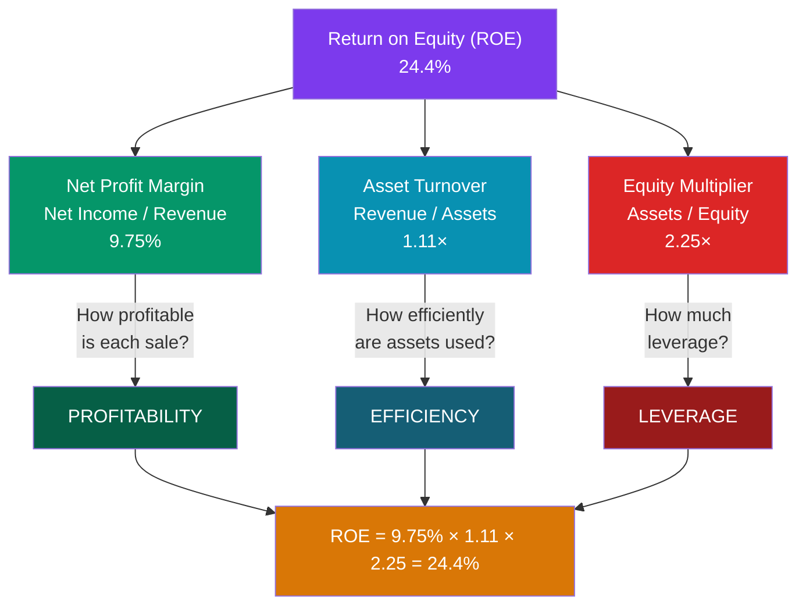

# 🔍 Financial Ratio Analysis

> [!abstract] TL;DR
> Ratio analysis turns raw statements into comparable insight by dividing one line item by another. Ratios fall into four families: **liquidity** (can the firm pay short-term bills? — current & quick ratios), **leverage** (how much debt? — debt-to-equity & interest coverage), **profitability** (how much profit per dollar? — margins, ROA, ROE), and **efficiency** (how hard do assets work? — turnover ratios). The **DuPont identity** decomposes return on equity into three drivers: $ROE = Net\ Margin \times Asset\ Turnover \times Equity\ Multiplier$, revealing *why* returns are high or low.

## Intuition — analogy FIRST

A single financial number is almost meaningless in isolation. "$97,500 of net income" — is that good? You have no idea until you ask: *relative to what?*

Ratios supply the "relative to what." Net income relative to **revenue** tells you the profit *margin*. Net income relative to **equity** tells you the *return* owners earn. Debt relative to equity tells you how *risky* the financing is. A ratio is just a fraction that puts a number in context — the same way a batting average (hits ÷ at-bats) makes a hitter comparable across players and seasons, while raw hit counts don't.

The magic is **comparability**. A ratio lets you compare a $500M company to a $5B one, this year to last year, and one firm to its whole industry — because you've stripped out size. That's why analysts rarely look at absolute figures alone; they look at ratios, trends in ratios, and how ratios stack up against peers.

---

## How It Works — The DuPont Decomposition of ROE

## Key Concepts / Details

All figures below use **Northwind Retail Co.** ($ thousands): revenue $1,000,000, COGS $600,000, EBIT $150,000, interest $20,000, net income $97,500; current assets $370,000 (inventory $150,000, receivables $120,000), current liabilities $180,000, total assets $900,000, interest-bearing debt $350,000, total equity $400,000.

### 1. Liquidity — Can it pay short-term bills?

$$Current\ Ratio = \frac{Current\ Assets}{Current\ Liabilities} = \frac{370{,}000}{180{,}000} = 2.06$$

$$Quick\ Ratio = \frac{Current\ Assets - Inventory}{Current\ Liabilities} = \frac{220{,}000}{180{,}000} = 1.22$$

The **quick (acid-test) ratio** excludes inventory because inventory is the least-liquid current asset. A current ratio > 1 means short-term assets cover short-term debts.

### 2. Leverage — How much debt, and can it service it?

$$Debt\text{-}to\text{-}Equity = \frac{Total\ Debt}{Equity} = \frac{350{,}000}{400{,}000} = 0.88$$

$$Interest\ Coverage = \frac{EBIT}{Interest\ Expense} = \frac{150{,}000}{20{,}000} = 7.5\times$$

**D/E** measures financial risk (some analysts use total *liabilities* instead of interest-bearing debt — state your convention). **Interest coverage** (times-interest-earned) shows how many times operating profit covers interest — 7.5× is comfortable; below ~2× is a warning.

### 3. Profitability — How much profit per dollar?

| Ratio | Formula | Northwind |
|-------|---------|----------:|
| Gross margin | Gross profit / Revenue | 40.0% |
| Operating margin | EBIT / Revenue | 15.0% |
| Net margin | Net income / Revenue | 9.75% |
| **Return on assets (ROA)** | Net income / Total assets | 10.8% |
| **Return on equity (ROE)** | Net income / Equity | 24.4% |

$$ROA = \frac{97{,}500}{900{,}000} = 10.8\%, \qquad ROE = \frac{97{,}500}{400{,}000} = 24.4\%$$

ROE exceeds ROA whenever the firm uses leverage productively — the gap is the leverage effect.

### 4. Efficiency — How hard do the assets work?

$$Asset\ Turnover = \frac{Revenue}{Total\ Assets} = \frac{1{,}000{,}000}{900{,}000} = 1.11\times$$

$$Inventory\ Turnover = \frac{COGS}{Inventory} = \frac{600{,}000}{150{,}000} = 4.0\times \;\Rightarrow\; \frac{365}{4.0} = 91\ \text{days on hand}$$

$$Receivables\ Turnover = \frac{Revenue}{Receivables} = \frac{1{,}000{,}000}{120{,}000} = 8.33\times \;\Rightarrow\; DSO = \frac{365}{8.33} = 44\ \text{days}$$

**Days sales outstanding (DSO)** of 44 means Northwind waits ~44 days to collect from customers — a working-capital lever straight off the [[The_Balance_Sheet]].

### The DuPont Identity

ROE can be decomposed to reveal its *drivers*:

$$ROE = \underbrace{\frac{Net\ Income}{Revenue}}_{Net\ Margin} \times \underbrace{\frac{Revenue}{Assets}}_{Asset\ Turnover} \times \underbrace{\frac{Assets}{Equity}}_{Equity\ Multiplier}$$

For Northwind:
$$ROE = 9.75\% \times 1.11 \times 2.25 = 24.4\%$$

(Equity multiplier = $900{,}000 / 400{,}000 = 2.25$.) The power of DuPont is **diagnosis**: two firms with identical 24% ROE can be completely different animals — one a high-margin, low-turnover luxury brand; the other a low-margin, high-turnover discount retailer; a third a mediocre operator juiced by heavy leverage. The **extended (5-step) DuPont** further splits net margin into tax burden, interest burden, and operating margin.

### Ratio Summary

| Family | Ratio | Northwind | Rough benchmark |
|--------|-------|----------:|-----------------|
| Liquidity | Current ratio | 2.06 | > 1.5 healthy |
| Liquidity | Quick ratio | 1.22 | > 1.0 healthy |
| Leverage | Debt-to-equity | 0.88 | < 1.0–2.0 (industry-dependent) |
| Leverage | Interest coverage | 7.5× | > 3× comfortable |
| Profitability | Net margin | 9.75% | Sector-dependent |
| Profitability | ROE | 24.4% | > 15% strong |
| Efficiency | Asset turnover | 1.11× | Sector-dependent |
| Efficiency | DSO | 44 days | Lower is better |

---

## Real-World Notes

- **Same ROE, opposite businesses.** Walmart historically earns high ROE via *turnover* (thin ~3% margins, assets churning several times a year), while a luxury house like Hermès earns high ROE via *margin* (huge markups, slow turnover). DuPont makes the strategic difference legible from the same headline number.
- **Leverage cuts both ways.** A high equity multiplier inflates ROE in good times but magnifies losses in bad ones. Pre-2008 banks reported dazzling ROE built almost entirely on 30×+ leverage — a fragility DuPont would have flagged instantly.
- **Ratios are only as clean as the accounting.** LIFO vs FIFO changes inventory turnover; capitalizing vs expensing R&D changes margins and ROA. Cross-check against [[Accrual_Accounting_and_Standards]] before comparing firms on different bases.

---

## Common Pitfalls

- **Comparing across industries.** A 1.1× asset turnover is weak for a grocer and strong for a utility. Ratios are meaningful only against sector peers and the company's own history.
- **Ignoring the denominator's timing.** Balance-sheet items are point-in-time; income items are period flows. For ratios mixing them (ROA, turnover), best practice uses the *average* of beginning and ending balances.
- **Chasing a single ratio.** A great current ratio can hide unsellable inventory; a high ROE can be pure leverage. Always read ratios as a *system* — the four families together, plus the [[The_Cash_Flow_Statement]].
- **Window dressing.** Firms can temporarily improve ratios at period-end (paying down short-term debt just before the reporting date to flatter the current ratio). Trend analysis across several periods defeats this.

---

## Related Concepts

- [[_MOC_Financial_Accounting|↑ Section MOC]]
- [[The_Income_Statement]] — Supplies revenue, EBIT, and net income for margins and coverage
- [[The_Balance_Sheet]] — Supplies assets, liabilities, and equity for liquidity and leverage
- [[The_Cash_Flow_Statement]] — Cash-based ratios complement accrual-based ones
- [[Accrual_Accounting_and_Standards]] — Accounting choices distort ratios; adjust before comparing
- [[Fundamental_Analysis]] — Ratio analysis is a pillar of bottom-up equity research (cross-vault)

## Review Questions

1. A company reports current assets $240,000 (of which inventory is $90,000), current liabilities $120,000, total assets $600,000, equity $250,000, revenue $750,000, and net income $45,000. Calculate the current ratio, quick ratio, net margin, ROA, ROE, and asset turnover.
2. Using the DuPont identity, decompose an ROE of 18% for a firm with a net margin of 6% and an equity multiplier of 2.0. What must its asset turnover be, and interpret the result.
3. Two retailers both report 20% ROE. Firm A has a 10% net margin and 1.0× asset turnover; Firm B has a 4% net margin and 2.5× asset turnover, both with an equity multiplier of 2.0. Verify each ROE and describe the different business strategies the ratios imply.

## Sources

- CFA Institute, *CFA Program Curriculum* Level 1 — Financial Reporting and Analysis, "Financial Analysis Techniques"
- Robert Higgins, *Analysis for Financial Management*, 12th edition, Ch. 2
- Krishna Palepu & Paul Healy, *Business Analysis and Valuation*, 5th edition
- Aswath Damodaran, *Investment Valuation*, 3rd edition, Ch. 2

#finance #financial-accounting #ratio-analysis #DuPont #ROE #profitability
