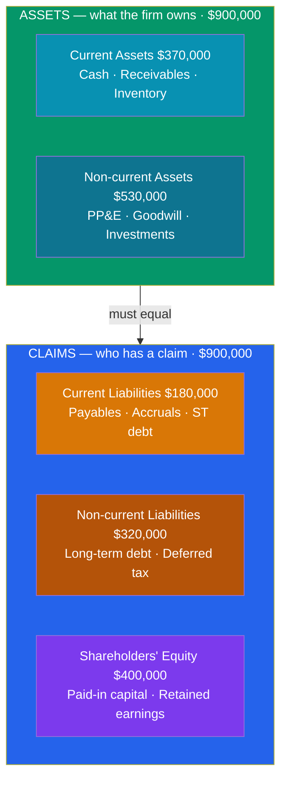

# ⚖️ The Balance Sheet

> [!abstract] TL;DR
> The balance sheet (or **statement of financial position**) is a **snapshot at a single point in time** of what a company owns and owes. It is governed by the **accounting identity** that must *always* hold: $Assets = Liabilities + Equity$. Assets and liabilities are split into **current** (turning to cash or due within one year) and **non-current**. The difference between current assets and current liabilities is **working capital** — the short-term liquidity cushion. Equity is the residual: what owners would have left if every asset were sold and every debt repaid.

## Intuition — analogy FIRST

Think of buying a $400,000 house with a $300,000 mortgage and $100,000 of your own savings.

The **house** is your **asset** — worth $400,000. The **mortgage** is your **liability** — you owe the bank $300,000. What's genuinely *yours* is the difference: **$100,000 of equity**. Rearranged, that's exactly the accounting identity:

$$\underbrace{400{,}000}_{Assets} = \underbrace{300{,}000}_{Liabilities} + \underbrace{100{,}000}_{Equity}$$

A company is the same idea scaled up. Everything it controls (cash, inventory, factories) sits on the left. Every claim against those things sits on the right — first the **creditors'** claims (liabilities), then whatever is left over belongs to the **owners** (equity). The two sides *must* be equal, because equity is *defined* as the leftover. That's why it's called a **balance** sheet: it can never not balance.

Unlike the income statement, which covers a *period* ("what happened over 2025"), the balance sheet is a *moment* ("where we stood at 11:59pm on Dec 31").

---

## How It Works — The Two Sides Must Balance

## Key Concepts / Details

### The Accounting Identity

$$\boxed{Assets = Liabilities + Equity}$$

Every transaction preserves this equality via **double-entry bookkeeping**: buying $10,000 of inventory on credit *raises* inventory (asset +10,000) and *raises* accounts payable (liability +10,000) — both sides move together. Paying $10,000 cash for that inventory instead *swaps* one asset for another (cash −10,000, inventory +10,000), leaving totals unchanged.

Rearranged, equity is the **residual claim**:

$$Equity = Assets - Liabilities$$

This is a company's **book value** — its net worth on paper, which usually differs from its **market value** (what investors will pay for the equity).

### Current vs Non-Current

The one-year cutoff (or the operating cycle, if longer) sorts both sides:

| | Current (< 1 year) | Non-current (> 1 year) |
|---|---|---|
| **Assets** | Cash, marketable securities, accounts receivable, inventory, prepaid expenses | PP&E, goodwill & intangibles, long-term investments |
| **Liabilities** | Accounts payable, accrued expenses, short-term debt, current portion of long-term debt | Long-term debt, bonds payable, deferred tax, pension obligations |

Assets are typically listed **in order of liquidity** (cash first); liabilities **in order of maturity** (soonest-due first).

### Working Capital

$$Working\ Capital = Current\ Assets - Current\ Liabilities$$

**Working capital** is the liquidity buffer for day-to-day operations. Positive working capital means short-term assets cover short-term obligations. But *too much* working capital (say, bloated inventory or slow-paying receivables) ties up cash unproductively — so more is not always better.

### Worked Example — Northwind Retail Co.

Balance sheet as of December 31, 2025 ($ thousands):

| Assets | | Liabilities & Equity | |
|--------|-------:|----------------------|-------:|
| **Current assets** | | **Current liabilities** | |
| Cash & equivalents | 80,000 | Accounts payable | 90,000 |
| Accounts receivable | 120,000 | Accrued expenses | 40,000 |
| Inventory | 150,000 | Short-term debt | 50,000 |
| Prepaid expenses | 20,000 | *Total current liabilities* | *180,000* |
| *Total current assets* | *370,000* | **Non-current liabilities** | |
| **Non-current assets** | | Long-term debt | 300,000 |
| PP&E (net) | 400,000 | Deferred tax liabilities | 20,000 |
| Goodwill & intangibles | 100,000 | *Total non-current liabilities* | *320,000* |
| Long-term investments | 30,000 | **Total liabilities** | **500,000** |
| *Total non-current assets* | *530,000* | Common stock & paid-in capital | 200,000 |
| | | Retained earnings | 200,000 |
| | | **Total equity** | **400,000** |
| **TOTAL ASSETS** | **900,000** | **TOTAL LIAB. & EQUITY** | **900,000** |

The identity checks: **$900,000 = $500,000 + $400,000.** ✓

Working capital = $370,000 − $180,000 = **$190,000**, a comfortable cushion. Note the link to the [[The_Income_Statement]]: Northwind's $200,000 of **retained earnings** is the cumulative sum of past net income *not* paid out as dividends — the bridge that ties this year's $97,500 net income into the balance sheet.

---

## Real-World Notes

- **Negative equity isn't always distress.** Companies like McDonald's and Starbucks have at times reported *negative* shareholders' equity — not because they're insolvent, but because aggressive share buybacks reduce equity while stable cash flows service the debt. Book value can go negative while market value stays large.
- **Goodwill is fragile.** When one company acquires another for more than the fair value of its net assets, the premium is recorded as **goodwill**. If the acquisition sours, an **impairment** write-down slashes goodwill (and equity) with the stroke of a pen — as when AOL–Time Warner wrote off ~$99B in 2002.
- **Off-balance-sheet exposure.** Historically, operating leases and some special-purpose entities kept obligations *off* the balance sheet — a device central to the Enron collapse. Accounting standards (ASC 842 / IFRS 16) now bring most leases on-balance-sheet as right-of-use assets and lease liabilities.

---

## Common Pitfalls

- **Reading it as a period statement.** The balance sheet is a *snapshot*, not a flow. "Cash of $80,000" is the balance on Dec 31 only — it says nothing about cash *generated* during the year (that's the [[The_Cash_Flow_Statement]]).
- **Confusing book value with market value.** Equity on the balance sheet is historical-cost book value. A firm's market capitalization can be many multiples of book value (or below it) — the balance sheet does not mark most assets to market.
- **Assuming positive working capital = healthy.** Excess inventory and slow receivables inflate current assets while quietly signaling problems. The *quality* of working capital matters, which is why analysts also compute the **quick ratio** (see [[Financial_Ratio_Analysis]]).
- **Netting assets against liabilities.** Cash and debt are reported *gross*, not netted. A firm with $80,000 cash and $350,000 debt shows both — not "$270,000 net debt" — on the face of the statement.

---

## Related Concepts

- [[_MOC_Financial_Accounting|↑ Section MOC]]
- [[The_Income_Statement]] — Net income flows into retained earnings within equity
- [[The_Cash_Flow_Statement]] — Explains the change in the cash line between two balance sheets
- [[Accrual_Accounting_and_Standards]] — Determines how and when items land on the balance sheet
- [[Financial_Ratio_Analysis]] — Liquidity and leverage ratios are built directly from it
- [[Three_Statement_Model]] — The balance sheet is the linchpin that must balance in a model (cross-vault)

## Review Questions

1. A company has cash $50,000, receivables $90,000, inventory $110,000, PP&E $500,000, accounts payable $70,000, short-term debt $60,000, and long-term debt $320,000. Calculate total assets, total liabilities, shareholders' equity, and working capital.
2. A firm buys $40,000 of equipment, paying $15,000 in cash and financing the rest with a bank loan. Describe every line item that changes and confirm the accounting identity still holds.
3. Explain why retained earnings on the balance sheet links the income statement to the balance sheet, and what happens to retained earnings when a company pays a dividend.

## Sources

- CFA Institute, *CFA Program Curriculum* Level 1 — Financial Reporting and Analysis, "Understanding Balance Sheets"
- Robert Higgins, *Analysis for Financial Management*, 12th edition, Ch. 1
- Ross, Westerfield, Jordan, *Fundamentals of Corporate Finance*, 12th edition, Ch. 2
- U.S. SEC, *Beginners' Guide to Financial Statements* (sec.gov)

#finance #financial-accounting #balance-sheet #accounting-equation #working-capital
