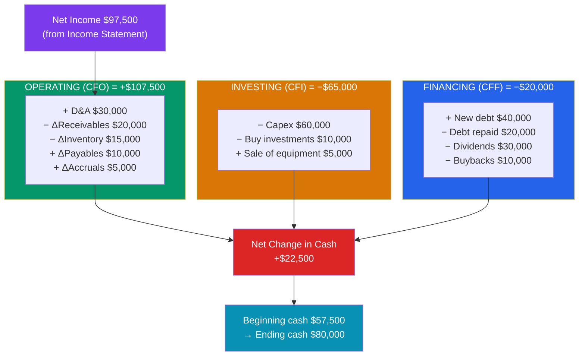

# 💵 The Cash Flow Statement

> [!abstract] TL;DR
> The cash flow statement tracks **actual cash moving in and out** over a period, split into three sections: **operating (CFO)** — cash from running the business; **investing (CFI)** — cash spent on or received from long-term assets; and **financing (CFF)** — cash from debt, equity, and dividends. Its job is to answer why **profit ≠ cash**. The **indirect method** starts with net income and adjusts for non-cash items and working-capital changes to arrive at CFO. The three sections sum to the **net change in cash**, which must exactly reconcile the cash line on last year's and this year's [[The_Balance_Sheet]].

## Intuition — analogy FIRST

A company can be *profitable and still go bankrupt*. That sentence confuses people until you separate profit from cash.

Imagine you sell $1,000,000 of furniture this year, all on 90-day credit. Your [[The_Income_Statement]] proudly reports the revenue and a healthy profit. But not a single dollar has arrived — it's all sitting in **accounts receivable**. Meanwhile you had to *pay cash* for the lumber, wages, and rent. On paper you're profitable; in your bank account you're bleeding. If a supplier demands payment before your customers pay you, you're insolvent despite the profit.

The cash flow statement is the antidote to this illusion. It ignores accounting accruals and asks one blunt question: **did cash actually come in, or go out?** Profit is an *opinion* shaped by accounting choices; cash is a *fact*. This is why seasoned investors say "revenue is vanity, profit is sanity, but cash is king."

---

## How It Works — Reconciling Profit to Cash

## Key Concepts / Details

### The Three Sections

**Cash Flow from Operations (CFO)** — cash generated by the core business: collecting from customers, paying suppliers and employees, paying taxes and interest. Sustainable companies fund themselves from CFO.

**Cash Flow from Investing (CFI)** — cash tied to long-term assets: **capital expenditures (capex)** to buy PP&E, acquisitions, and purchases/sales of securities. A growing firm usually has *negative* CFI (it's investing).

**Cash Flow from Financing (CFF)** — cash exchanged with capital providers: issuing or repaying debt, issuing or buying back stock, and paying dividends.

$$Net\ \Delta Cash = CFO + CFI + CFF$$

This total must equal the change in the cash balance between two consecutive balance sheets — the statement's built-in integrity check.

### Direct vs Indirect Method

Both produce *identical* CFO; they differ only in presentation of the operating section.

| | **Direct method** | **Indirect method** |
|---|---|---|
| Starting point | Actual cash receipts & payments | Net income |
| CFO build | Lists cash from customers, cash to suppliers, etc. | Adjusts net income for non-cash items and working-capital changes |
| Prevalence | Rare (more informative but costly) | ~99% of filers |
| Reconciliation shown | Requires a separate schedule | Built in — reconciles profit to cash directly |

### The Indirect Method, Step by Step

Starting from net income, make three kinds of adjustment to reach CFO:

1. **Add back non-cash expenses** — depreciation, amortization, stock-based compensation, impairments. These reduced net income but *no cash left the building*.
2. **Reverse non-operating gains/losses** — e.g., subtract a gain on asset sale (its cash shows up in CFI instead).
3. **Adjust for changes in working capital**:

| Working-capital change | Effect on cash |
|------------------------|----------------|
| Receivables **up** (customers owe more) | **Uses** cash (−) |
| Inventory **up** (more stock bought) | **Uses** cash (−) |
| Payables **up** (paying suppliers slower) | **Provides** cash (+) |
| Accruals **up** | **Provides** cash (+) |

The rule: an **increase in an operating asset uses cash**; an **increase in an operating liability provides cash**.

### Worked Example — Northwind Retail Co.

Cash flow statement for the year ended December 31, 2025 ($ thousands), indirect method:

| Section | Item | Amount |
|---------|------|-------:|
| **Operating** | Net income | 97,500 |
| | + Depreciation & amortization | 30,000 |
| | − Increase in accounts receivable | (20,000) |
| | − Increase in inventory | (15,000) |
| | + Increase in accounts payable | 10,000 |
| | + Increase in accrued expenses | 5,000 |
| | **Cash from operations (CFO)** | **107,500** |
| **Investing** | Capital expenditures | (60,000) |
| | Purchase of investments | (10,000) |
| | Proceeds from sale of equipment | 5,000 |
| | **Cash from investing (CFI)** | **(65,000)** |
| **Financing** | Proceeds from new long-term debt | 40,000 |
| | Repayment of debt | (20,000) |
| | Dividends paid | (30,000) |
| | Share repurchases | (10,000) |
| | **Cash from financing (CFF)** | **(20,000)** |
| | **Net change in cash** | **22,500** |
| | Beginning cash | 57,500 |
| | **Ending cash** | **80,000** |

Ending cash of **$80,000** ties exactly to the cash line on Northwind's [[The_Balance_Sheet]]. Notice CFO of **$107,500** exceeds net income of **$97,500** — mostly because the $30,000 non-cash D&A charge depressed profit without touching cash.

### Free Cash Flow

The single most-watched derived figure:

$$Free\ Cash\ Flow\ (FCF) = CFO - Capex$$
$$FCF = 107{,}500 - 60{,}000 = \$47{,}500$$

FCF is the cash left after maintaining and growing the asset base — the cash truly available to repay debt, pay dividends, or buy back stock. It is the input to [[DCF_Analysis]] valuation.

---

## Real-World Notes

- **The dot-com tell.** Many failed 2000-era startups reported growing revenue and narrowing losses while CFO stayed deeply negative — they were burning cash faster than the income statement suggested. CFO exposed the fragility that accrual profit masked.
- **Quality of earnings.** Analysts compare CFO to net income over several years. If net income steadily rises but CFO lags or diverges, it can signal aggressive revenue recognition or channel stuffing — a classic earnings-management red flag (see [[Accrual_Accounting_and_Standards]]).
- **Where interest and taxes go.** Under U.S. GAAP, interest paid and received and dividends received sit in *operating*; dividends paid sit in *financing*. IFRS gives firms a choice on classification — a subtle difference that can shift reported CFO between the two frameworks.

---

## Common Pitfalls

- **Reading net income as cash.** The entire point of the statement is that they differ. A profitable firm with ballooning receivables can have *negative* CFO.
- **Ignoring the sign convention.** An *increase* in inventory is a cash *outflow* (you spent cash on stock). Newcomers often add it back with the wrong sign and break the reconciliation.
- **Treating negative CFI as bad.** Heavy capex (negative CFI) is exactly what a healthy, growing company does. Context matters: negative CFI funded by strong CFO is investment; negative CFI funded by new debt (CFF) is riskier.
- **Ignoring stock-based compensation.** SBC is a real economic cost added back to CFO as non-cash — inflating CFO relative to the true cost to shareholders. Always check the add-back's magnitude.
- **Confusing FCF definitions.** FCF-to-firm, FCF-to-equity, and "CFO − capex" differ. Be explicit about which one a valuation uses.

---

## Related Concepts

- [[_MOC_Financial_Accounting|↑ Section MOC]]
- [[The_Income_Statement]] — Net income is the starting line of the indirect method
- [[The_Balance_Sheet]] — Working-capital changes and ending cash both come from it
- [[Accrual_Accounting_and_Standards]] — Explains *why* accrual profit and cash diverge
- [[Financial_Ratio_Analysis]] — Cash-coverage and cash-flow-margin ratios use CFO
- [[DCF_Analysis]] — Free cash flow is the raw material of intrinsic valuation (cross-vault)

## Review Questions

1. A company reports net income of $60,000, depreciation of $18,000, an increase in receivables of $12,000, a decrease in inventory of $8,000, and an increase in accounts payable of $6,000. Calculate cash flow from operations using the indirect method.
2. Explain how a company can report record net income yet have *negative* cash flow from operations. Identify at least two specific line items that could drive this.
3. Given CFO of $150,000 and capital expenditures of $90,000, compute free cash flow. Why do investors often prefer FCF to net income when valuing a company?

## Sources

- CFA Institute, *CFA Program Curriculum* Level 1 — Financial Reporting and Analysis, "Understanding Cash Flow Statements"
- FASB, ASC 230 — *Statement of Cash Flows*
- Robert Higgins, *Analysis for Financial Management*, 12th edition, Ch. 1–2
- Aswath Damodaran, *Investment Valuation*, 3rd edition, Ch. 3

#finance #financial-accounting #cash-flow #free-cash-flow #liquidity
