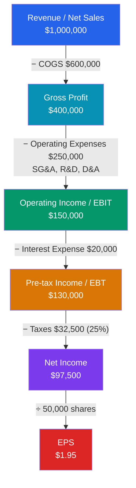

# 📈 The Income Statement

> [!abstract] TL;DR
> The income statement (or **profit & loss statement**) reports a company's **performance over a period** — a quarter or a year. It starts with **revenue** at the top and subtracts costs in layers to arrive at **net income** at the bottom: $Revenue - COGS = Gross\ Profit$, then minus operating expenses gives **operating income (EBIT)**, then minus interest and taxes gives **net income**, finally divided by shares to give **earnings per share (EPS)**. Each subtotal answers a different question about how the business makes money.

## Intuition — analogy FIRST

Think of the income statement as a set of nested funnels. A dollar of sales enters at the very top, and at each level of the funnel some of it drains away as a cost.

Imagine you run a lemonade stand for a day. You sell **$100** of lemonade (that's your **revenue**). The lemons, sugar, and cups cost you **$40** (that's **cost of goods sold**), leaving **$60** of **gross profit** — the profit on the product itself. But you also paid your cousin **$20** to hold a sign and spent **$5** on a permit (**operating expenses**), leaving **$35** of **operating income**. You borrowed money for the stand and owe **$5** in interest, and the tax collector takes a cut. What's left at the very bottom is **net income** — the money that's actually yours.

The whole statement is that funnel, formalized. Reading top-to-bottom tells you *where* the money goes: a company can have huge revenue but tiny net income if any layer of the funnel is leaking.

---

## How It Works — The Funnel from Revenue to EPS

## Key Concepts / Details

### The Line Items, Top to Bottom

**Revenue** (also *sales* or *the top line*) is the total value of goods or services delivered during the period, recognized when *earned* — not necessarily when cash arrives (see [[Accrual_Accounting_and_Standards]]). It is reported **net** of returns, allowances, and discounts.

**Cost of Goods Sold (COGS)** is the *direct* cost of producing what was sold — raw materials, direct labor, and manufacturing overhead. Crucially, COGS matches only the units actually *sold* this period, not everything produced.

$$Gross\ Profit = Revenue - COGS$$

**Gross profit** measures how much the core product earns before the cost of running the wider business. As a percentage it becomes **gross margin**, a key indicator of pricing power.

**Operating expenses** are the costs of running the business that are *not* tied directly to each unit sold:
- **SG&A** — selling, general & administrative (salaries, marketing, rent, office costs)
- **R&D** — research & development
- **Depreciation & amortization (D&A)** — the periodic write-down of long-lived assets

$$Operating\ Income\ (EBIT) = Gross\ Profit - Operating\ Expenses$$

**Operating income**, also called **EBIT** (earnings before interest and taxes), is profit from core operations, independent of how the firm is financed or taxed. It is the cleanest measure for comparing operating performance across companies.

Below EBIT come the **non-operating** items:

$$Pre\text{-}tax\ Income\ (EBT) = EBIT - Interest\ Expense \pm Other$$
$$Net\ Income = EBT - Taxes$$

**Net income** (the *bottom line*) is what remains for shareholders. Divide by shares outstanding to get **earnings per share**:

$$EPS_{basic} = \frac{Net\ Income - Preferred\ Dividends}{Weighted\ Avg\ Shares\ Outstanding}$$

**Diluted EPS** additionally assumes all options, warrants, and convertibles are exercised, giving the most conservative per-share figure.

### Single-Step vs Multi-Step Format

| Format | Structure | Used by |
|--------|-----------|---------|
| **Single-step** | All revenues grouped, all expenses grouped, one subtraction | Small firms, service businesses |
| **Multi-step** | Separates gross profit, operating income, non-operating items | Public companies, manufacturers, retailers |

The multi-step format (shown above) is standard for public firms because each subtotal is decision-useful.

### Worked Example — Northwind Retail Co.

Income statement for the year ended December 31, 2025 ($ thousands):

| Line item | Amount | Running margin |
|-----------|-------:|---------------:|
| Revenue (net sales) | 1,000,000 | — |
| Cost of goods sold | (600,000) | — |
| **Gross profit** | **400,000** | 40.0% |
| SG&A | (180,000) | |
| R&D | (40,000) | |
| Depreciation & amortization | (30,000) | |
| **Operating income (EBIT)** | **150,000** | 15.0% |
| Interest expense | (20,000) | |
| **Pre-tax income (EBT)** | **130,000** | 13.0% |
| Income tax (25%) | (32,500) | |
| **Net income** | **97,500** | 9.75% |
| Weighted avg shares | 50,000 | |
| **Basic EPS** | **$1.95** | |
| Diluted shares (52,000) | | |
| **Diluted EPS** | **$1.875** | |

The three margins tell the story: Northwind keeps **40 cents** of every sales dollar after making the product, **15 cents** after running the business, and **9.75 cents** for shareholders after financing and tax. A competitor with the same revenue but a 55% gross margin and 20% operating margin is fundamentally more profitable — and that gap is exactly what [[Financial_Ratio_Analysis]] quantifies.

---

## Real-World Notes

- **Apple (FY2023)**: revenue of ~$383B, gross margin of ~44%, operating margin of ~30%, and net margin of ~25% — extraordinary for a hardware company and driven by the high-margin Services segment. The multi-step layout makes this segment-level margin story visible.
- **Amazon's "profitless growth" era**: for years Amazon posted enormous revenue with razor-thin or negative net income because it deliberately reinvested gross profit into operating expenses (fulfillment, AWS build-out). The income statement showed a healthy top line and gross profit but a bottom line near zero — a *strategy*, not a failure.
- **One-time items**: restructuring charges, asset write-downs, and litigation settlements distort net income. Analysts often compute **"adjusted" or "pro forma" earnings** that strip these out — useful, but a red flag when a company excludes the same "one-time" cost every year (see [[Accrual_Accounting_and_Standards]] on earnings management).

---

## Common Pitfalls

- **Confusing revenue with cash collected.** Under accrual accounting, revenue is booked when *earned*; the cash may arrive later (as accounts receivable) or never (bad debt). Profit ≠ cash — that gap is the whole reason the [[The_Cash_Flow_Statement]] exists.
- **Treating EBIT and net income as interchangeable.** Two firms with identical EBIT can have very different net income if one carries heavy debt (large interest expense). Compare operations with EBIT; compare shareholder outcomes with net income.
- **Ignoring the difference between basic and diluted EPS.** A company with many outstanding options can have diluted EPS materially below basic EPS; always value on the diluted figure.
- **Forgetting COGS matches units *sold*, not produced.** Unsold production sits in inventory on the [[The_Balance_Sheet]] — it hits COGS only when the goods are sold.

---

## Related Concepts

- [[_MOC_Financial_Accounting|↑ Section MOC]]
- [[The_Balance_Sheet]] — Net income flows into retained earnings (equity) here
- [[The_Cash_Flow_Statement]] — Net income is the starting point of the indirect method
- [[Accrual_Accounting_and_Standards]] — The rules that govern when revenue and expenses are booked
- [[Financial_Ratio_Analysis]] — Margins, ROE, and coverage ratios are built from these lines
- [[Financial_Statement_Analysis]] — Using the P&L in equity and credit analysis (cross-vault)
- [[Three_Statement_Model]] — The income statement drives a fully linked financial model (cross-vault)

## Review Questions

1. A company reports revenue of $800,000, COGS of $500,000, operating expenses of $180,000, interest expense of $30,000, and a tax rate of 25%. Calculate gross profit, operating income (EBIT), pre-tax income, net income, and — with 40,000 weighted-average shares — basic EPS.
2. Explain why a company can grow revenue by 20% while net income *falls*. Give at least two distinct line-item mechanisms.
3. What is the difference between operating income and net income, and why might a lender care more about EBIT while a shareholder cares more about EPS?

## Sources

- CFA Institute, *CFA Program Curriculum* Level 1 — Financial Reporting and Analysis, "Understanding Income Statements"
- Robert Higgins, *Analysis for Financial Management*, 12th edition, Ch. 1
- Stephen Penman, *Financial Statement Analysis and Security Valuation*, 5th edition
- U.S. SEC, *Beginners' Guide to Financial Statements* (sec.gov)

#finance #financial-accounting #income-statement #EPS #profit-and-loss
