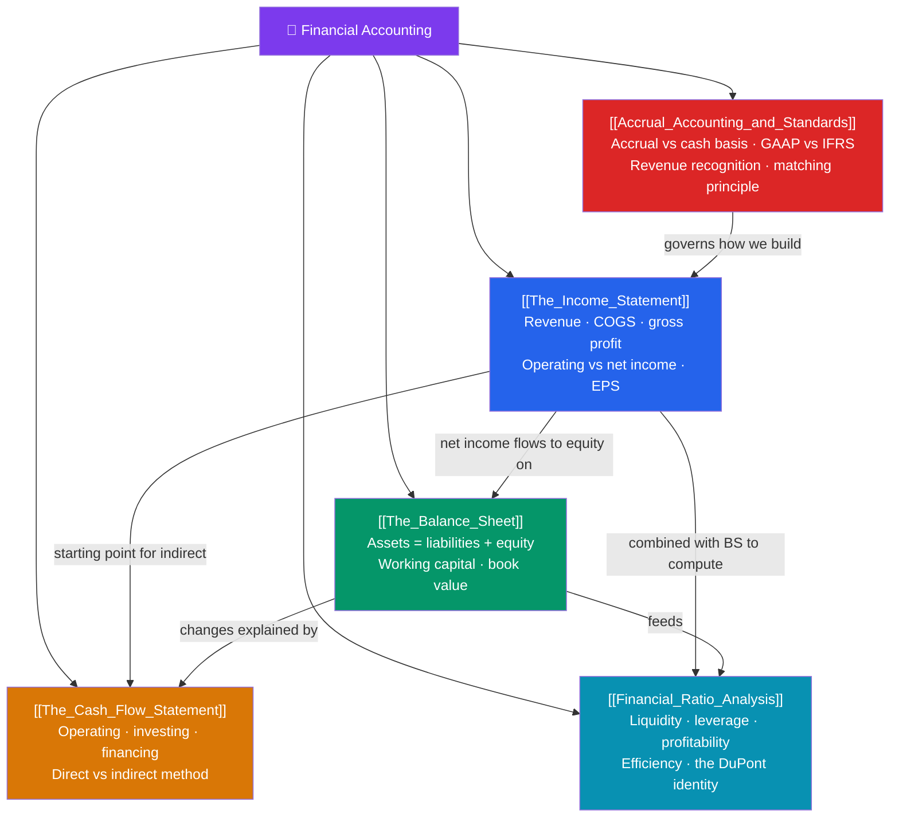

# 📒 Financial Accounting — Map of Content

> [!abstract] What This Section Covers
> Financial accounting is the language of business — the system that turns economic activity into three linked statements that let outsiders judge a firm. The **income statement** measures performance over a period (revenue − COGS = gross profit, down through operating income to net income and EPS). The **balance sheet** is a snapshot at a point in time, governed by the fundamental identity **Assets = Liabilities + Equity**. The **cash flow statement** reconciles accrual profit to actual cash across operating, investing, and financing activities. Underpinning all three is **accrual accounting** — recognizing revenue when earned and matching expenses to it, regardless of cash timing — as codified by **GAAP and IFRS**. Finally, **ratio analysis** (liquidity, leverage, profitability, efficiency, and the DuPont decomposition of ROE) turns raw statements into comparative insight. This is the CFA Level 1 Financial Reporting core and the input to every valuation model.

## Concept Map

## Learning Path
1. [[Accrual_Accounting_and_Standards]] — The rules of the game: accrual vs cash basis, GAAP vs IFRS, revenue recognition, and the matching principle.
2. [[The_Income_Statement]] — Performance over a period: revenue, COGS, operating income, net income, and EPS.
3. [[The_Balance_Sheet]] — Financial position at a point in time: the accounting equation and working capital.
4. [[The_Cash_Flow_Statement]] — Following the cash: operating, investing, and financing activities via direct vs indirect methods.
5. [[Financial_Ratio_Analysis]] — Turning statements into insight: liquidity, leverage, profitability, efficiency, and the DuPont identity.

## All Notes at a Glance

| Note | Difficulty | What You'll Learn |
|------|------------|-------------------|
| [[The_Income_Statement]] | Beginner | Revenue, COGS, gross/operating/net income, EPS, single- vs multi-step format |
| [[The_Balance_Sheet]] | Beginner | Assets = liabilities + equity, current vs non-current, working capital, book value |
| [[The_Cash_Flow_Statement]] | Intermediate | CFO/CFI/CFF, direct vs indirect method, free cash flow, non-cash adjustments |
| [[Accrual_Accounting_and_Standards]] | Intermediate | Accrual vs cash basis, GAAP vs IFRS differences, revenue recognition, matching |
| [[Financial_Ratio_Analysis]] | Intermediate | Current/quick ratios, debt-to-equity, margins, turnover, ROE via DuPont |

## Key Questions This Section Answers
- How do the three statements link together, and why must the balance sheet always balance?
- Why can a profitable company still run out of cash, and how does the cash flow statement reveal it?
- What is the difference between accrual and cash accounting, and when is revenue actually recognized?
- How do GAAP and IFRS differ on inventory, leases, and revenue?
- How does the DuPont identity break return on equity into margin, turnover, and leverage?

## Related Sections
- [[_MOC_Finance_Master|↑ Finance Master MOC]]
- [[_MOC_Behavioral_Finance|← Behavioral Finance]] — How investors misread the very numbers accounting produces
- [[_MOC_Fixed_Income|→ Fixed Income & Bonds]] — Credit analysis built on these statements

#MOC #Finance #FinancialAccounting
