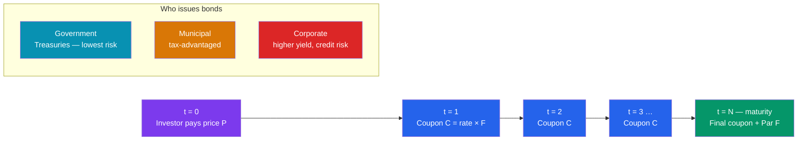

# 🏦 Bond Fundamentals

> [!abstract] TL;DR
> A **bond** is an IOU: you lend money to an issuer, who promises to pay you fixed **coupon** interest and return the **par (face) value** at **maturity**. The four defining terms are par value, coupon rate, maturity, and issuer. Bonds come from **governments** (Treasuries), **municipalities** (munis), and **corporations**, each with a different risk profile. A **coupon bond** pays periodic interest; a **zero-coupon bond** pays nothing until maturity and is bought at a deep discount. Unlike a stock (ownership, uncertain dividends, infinite life), a bond is a contractual loan with a scheduled end date and legal priority in bankruptcy.

## Intuition — analogy FIRST

Imagine your city needs $1,000 to fix a bridge. It hands you a printed certificate that says: *"We owe you $1,000. We'll pay you $50 every year for 10 years, and give you your $1,000 back at the end."*

That certificate is a bond. You are the lender; the city is the borrower. The $1,000 is the **par value**, the $50/year is the **coupon**, and "10 years" is the **maturity**. You've turned your cash into a stream of promised payments.

The key mental shift: a bond is not a mysterious financial instrument — it is a **loan sliced into a tradable security**. Everything else (pricing, yield, duration, credit risk) is just answering one question: *how much is that stream of promised payments worth, and how sure am I of getting it?*

---

## Anatomy and Cash Flows

## Key Concepts / Details

### The Four Defining Terms

- **Par (face) value** ($F$): the principal repaid at maturity — conventionally **$1,000** per bond (or $100 quoted "per 100"). It is *not* what you pay to buy the bond; it is what you get back at the end.
- **Coupon rate**: the fixed annual interest rate stated on the bond, applied to par. A 5% coupon on $1,000 par pays **$50/year**. This rate is set at issuance and (for a plain-vanilla bond) never changes.
- **Maturity**: the date the principal is repaid and the bond ceases to exist. Ranges from months (T-bills) to 30 years (long Treasuries) to a rare 100-year "century bond."
- **Issuer**: who owes the money — and therefore how likely you are to be repaid.

**Coupon payment formula** (semi-annual, the US standard):
$$\text{Coupon per period} = \frac{\text{coupon rate} \times F}{m}$$
where $m$ = payments per year. A 6% coupon, $1,000 par bond pays $\frac{0.06 \times 1000}{2} = \$30$ every six months.

### Coupon vs Zero-Coupon Bonds

A **coupon bond** streams interest periodically, then returns par. A **zero-coupon bond** pays *no* interest along the way — instead it is sold well below par, and your entire return is the gap between purchase price and the par you collect at maturity.

**Worked example — pricing a zero:** a 5-year zero-coupon bond with $1,000 par, priced to yield 5% annually:
$$P = \frac{F}{(1+y)^n} = \frac{1000}{(1.05)^5} = \frac{1000}{1.27628} = \$783.53$$

You pay $783.53 today and receive $1,000 in five years — the $216.47 gain *is* your interest, compounded. Because a zero has a single cash flow at the very end, it is maximally sensitive to interest-rate moves (see [[Duration_and_Convexity]]).

### The Three Big Issuer Types

| Issuer | Example | Key feature | Main risk |
|--------|---------|-------------|-----------|
| **Government** | US Treasuries, UK Gilts, German Bunds | Backed by taxing power; benchmark "risk-free" rate | Interest-rate risk (near-zero default risk for major sovereigns) |
| **Municipal** | US state/city "munis" | Interest often **exempt from federal (and local) tax** | Moderate credit risk; liquidity |
| **Corporate** | Apple, Ford, a startup | Higher coupons to compensate for **default risk** | Credit/default risk (see [[Credit_Risk_and_Ratings]]) |

Because muni interest is tax-free, a 3% muni can beat a 4% corporate for a high earner. The **tax-equivalent yield** = $\frac{\text{muni yield}}{1 - \text{tax rate}}$. At a 37% bracket, a 3% muni is worth $\frac{0.03}{1 - 0.37} = 4.76\%$ pre-tax — better than the 4% corporate.

### How Bonds Differ From Stocks

| Feature | Bond (debt) | Stock (equity) |
|---------|-------------|----------------|
| Legal claim | Creditor — you are owed money | Owner — you own a residual share |
| Cash flow | Fixed, contractual coupons | Discretionary dividends |
| Maturity | Finite; principal returned | Perpetual; no repayment date |
| Bankruptcy priority | **Senior** — paid before shareholders | **Last in line** — residual claimant |
| Upside | Capped at promised payments | Unlimited if the company grows |
| Voting rights | None | Usually yes |

The essence: bondholders trade upside for **safety and predictability**. A bond can't make you rich if the company triples, but it also can't be diluted or zeroed out while the firm can still pay.

---

## Real-World Notes

- **US Treasury "flavors":** T-bills mature in ≤1 year and are zero-coupon (sold at discount); T-notes run 2–10 years; T-bonds run 20–30 years; both notes and bonds pay semi-annual coupons. TIPS add inflation protection by indexing par to CPI.
- **The 100-year bond:** Austria issued a century bond in 2017 at a ~2.1% coupon. When rates later fell, its price soared over 60% — and when rates rose in 2022, it fell more than 50%, a vivid lesson that long maturity means extreme price sensitivity.
- **Bearer vs registered:** older bonds were physical "bearer" certificates with clip-off coupons you mailed in — literally where the word *coupon* comes from. Today nearly all bonds are electronic book-entry.

---

## Common Pitfalls

- **Confusing par value with market price.** Par is what you're repaid at maturity; the price you pay fluctuates daily with interest rates and can be above (premium) or below (discount) par.
- **Assuming the coupon rate equals your return.** Your actual return is the **yield to maturity**, which also reflects the price you paid — a discount bond returns *more* than its coupon. See [[Bond_Pricing_and_Yields]].
- **Treating all bonds as "safe."** A Treasury has almost no default risk but full interest-rate risk; a junk corporate has both. "Bond" is not a synonym for "low risk."
- **Forgetting the tax angle on munis.** Comparing a muni's headline yield directly to a taxable bond understates the muni — always use tax-equivalent yield.

---

## Related Concepts

- [[_MOC_Fixed_Income|↑ Section MOC]]
- [[Bond_Pricing_and_Yields]] — Turning these cash flows into a price and a yield
- [[Duration_and_Convexity]] — Why a zero-coupon bond is the most rate-sensitive
- [[The_Yield_Curve_and_Interest_Rates]] — How maturity maps to interest rates
- [[Credit_Risk_and_Ratings]] — Ranking issuers by default risk
- [[Fixed_Income_Markets]] — Where these bonds trade
- [[Time_Value_of_Money]] — The discounting engine beneath every bond price

## Review Questions

1. A corporate bond has $1,000 par, a 4% annual coupon paid semi-annually, and 7 years to maturity. What is each coupon payment, how many payments will you receive, and what is the final cash flow at maturity?
2. An investor in the 32% federal tax bracket is choosing between a 3.4% municipal bond and a 4.8% corporate bond of similar risk. Which offers the higher after-tax return? Show the tax-equivalent yield calculation.
3. Explain two concrete ways a bondholder's position differs from a shareholder's if the issuing company goes bankrupt. Why do bondholders accept limited upside in exchange?

## Sources

- Fabozzi, *Bond Markets, Analysis, and Strategies*, 9th edition, Ch. 1
- CFA Institute, *CFA Program Curriculum* Level 1 — Fixed Income: Features of Debt Securities
- Tuckman & Serrat, *Fixed Income Securities*, 3rd edition, Ch. 1
- US Treasury, *TreasuryDirect: Treasury Securities & Programs*

#finance #fixed-income #bonds #par-value #coupon #issuers
