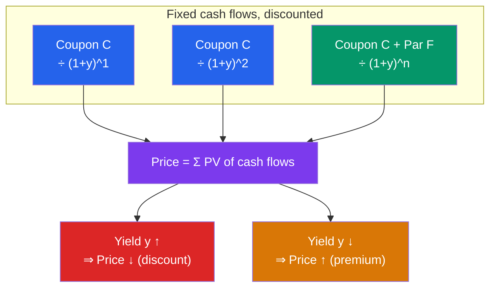

# 💵 Bond Pricing and Yields

> [!abstract] TL;DR
> A bond's price is simply the **present value of its future cash flows** — coupons plus par — discounted at the market interest rate. The single rate that makes that present value equal the market price is the **yield to maturity (YTM)**, a bond's true internal rate of return. Because price is a discounted sum, **price and yield move inversely**: when yields rise, prices fall. If a bond's coupon exceeds its yield it trades at a **premium** (above par); if the coupon is below the yield it trades at a **discount** (below par). Three yields rank in a fixed order that tells you instantly whether a bond is priced above or below par.

## Intuition — analogy FIRST

Suppose a friend promises you $50 a year for three years, then hands back $1,000. How much would you pay today for that promise?

It depends entirely on what *else* you could earn. If safe alternatives pay 5%, you'd discount each payment at 5% and arrive at exactly $1,000. But if rates jump and alternatives now pay 6%, your friend's fixed $50 payments suddenly look stingy — you'd only pay *less* than $1,000 to compensate. If rates fall to 4%, those locked-in $50 payments look generous, and you'd happily pay *more* than $1,000.

That is the whole of bond pricing. The bond's cash flows are frozen at issuance; only the **discount rate** moves. So when market rates rise, the price of an already-issued bond must fall to make its fixed payments competitive — the famous **inverse price-yield relationship**.

---

## Price as Present Value

## Key Concepts / Details

### The Pricing Equation

A bond's price is the present value of an **annuity of coupons** plus the **present value of par** — the exact machinery of [[Time_Value_of_Money]]:

$$P = \sum_{t=1}^{n} \frac{C}{(1+y)^t} + \frac{F}{(1+y)^n}$$

where $C$ = coupon per period, $F$ = par value, $y$ = yield per period, $n$ = number of periods. The coupon term can be collapsed with the annuity formula:

$$P = C \times \frac{1 - (1+y)^{-n}}{y} + \frac{F}{(1+y)^n}$$

### Worked Example — Premium vs Discount

Take a **3-year, $1,000 par bond with a 5% annual coupon** ($50/year). Watch what happens as the market yield changes:

**Case A — yield = 6% (above the 5% coupon):**
$$P = \frac{50}{1.06} + \frac{50}{1.06^2} + \frac{1050}{1.06^3} = 47.17 + 44.50 + 881.62 = \$973.29$$
Price **below par** → a **discount bond**. The coupon is too low for the market, so the price drops until the total return matches 6%.

**Case B — yield = 5% (equals the coupon):**
$$P = \frac{50}{1.05} + \frac{50}{1.05^2} + \frac{1050}{1.05^3} = 47.62 + 45.35 + 907.03 = \$1{,}000.00$$
Price **at par**. When coupon = yield, the bond is worth exactly its face value.

**Case C — yield = 4% (below the 5% coupon):**
$$P = \frac{50}{1.04} + \frac{50}{1.04^2} + \frac{1050}{1.04^3} = 48.08 + 46.23 + 933.45 = \$1{,}027.75$$
Price **above par** → a **premium bond**. The generous coupon is worth paying up for.

| Yield (YTM) | Price | vs. Par | Name |
|-------------|-------|---------|------|
| 4% | $1,027.75 | Above | Premium |
| 5% | $1,000.00 | At par | Par bond |
| 6% | $973.29 | Below | Discount |

This *is* the inverse relationship in a single table: as yield rose from 4% → 6%, price fell from $1,027.75 → $973.29.

### Three Yields — and Their Fixed Ordering

- **Coupon (nominal) yield** = $\frac{\text{annual coupon}}{\text{par}}$. Fixed at issuance: $\frac{50}{1000} = 5.00\%$.
- **Current yield** = $\frac{\text{annual coupon}}{\text{price}}$. For the discount bond: $\frac{50}{973.29} = 5.14\%$. It reflects income but ignores the gain/loss to par.
- **Yield to maturity (YTM)** = the internal rate of return that sets PV of all cash flows equal to price. It captures *both* coupon income *and* the pull-to-par capital gain/loss.

The three always line up predictably:

| Bond trades at | Ordering |
|----------------|----------|
| **Discount** | Coupon yield < Current yield < YTM |
| **Par** | Coupon yield = Current yield = YTM |
| **Premium** | Coupon yield > Current yield > YTM |

For our discount bond: 5.00% < 5.14% < 6.00%. ✓ The YTM is highest because the buyer *also* pockets the $26.71 climb from $973.29 back to $1,000 at maturity.

### Why Price and Yield Move Inversely

YTM is the discount rate; price is the discounted sum. Raising the denominator's growth rate shrinks every present-value term:
$$\frac{\partial P}{\partial y} < 0$$
This is not a market convention — it is arithmetic. The *magnitude* of the drop for a given yield change is measured by **duration**, and the curvature of the relationship by **convexity** (see [[Duration_and_Convexity]]).

### Reading a Quote and Accrued Interest

Bonds quote a **clean price** (what you see), but you pay the **dirty price** = clean price + accrued interest earned by the seller since the last coupon:
$$\text{Accrued interest} = C \times \frac{\text{days since last coupon}}{\text{days in coupon period}}$$
This lets coupon payments be prorated fairly between buyer and seller mid-period.

---

## Real-World Notes

- **Solving for YTM:** there is no closed-form solution for a coupon bond's YTM — it must be found iteratively (a root-finder, financial calculator, or Excel's `YIELD`/`RATE`). YTM is exactly the [[Time_Value_of_Money]] concept of IRR applied to a bond.
- **Pull to par:** regardless of where a bond trades today, its price converges to par as maturity approaches — a premium bond drifts down, a discount bond drifts up, both landing at $1,000 on the final day.
- **The 2022 repricing:** as the Fed hiked from ~0% to over 5%, existing long Treasuries with tiny coupons had to fall sharply in price to lift their yields — the 20+ year Treasury index lost roughly a third of its value, a textbook demonstration of the inverse relationship at long maturities.

---

## Common Pitfalls

- **Confusing current yield with YTM.** Current yield ignores the capital gain/loss to par and overstates the return on a premium bond, understates it on a discount bond.
- **Discounting annual but paying semi-annual.** US bonds pay twice a year — halve the coupon *and* the yield, and double the number of periods, or your price will be wrong.
- **Assuming YTM is guaranteed.** YTM's realized return assumes every coupon is reinvested at the YTM itself (reinvestment risk) and that you hold to maturity — neither is guaranteed.
- **Forgetting accrued interest.** The cash you wire is the dirty price; comparing your purchase to the clean quote makes the trade look mispriced.

---

## Related Concepts

- [[_MOC_Fixed_Income|↑ Section MOC]]
- [[Bond_Fundamentals]] — The cash flows being discounted here
- [[Duration_and_Convexity]] — How *much* price moves per unit of yield
- [[The_Yield_Curve_and_Interest_Rates]] — Where the discount rate comes from
- [[Credit_Risk_and_Ratings]] — Why risky bonds carry higher yields
- [[Time_Value_of_Money]] — Present value and IRR, the engine of bond pricing

## Review Questions

1. A 4-year, $1,000 par bond pays a 6% annual coupon. Market yields are 5%. Compute its price. Is it a premium or discount bond, and does the price/par relationship match the coupon-vs-yield rule?
2. A bond trades at $940 with a $1,000 par and a 4% annual coupon. Calculate its coupon yield and current yield. Without computing YTM exactly, state whether YTM is above or below the current yield and explain why.
3. Interest rates rise by 1%. Qualitatively, what happens to the price of an existing fixed-coupon bond, and why is this a mathematical necessity rather than a market preference?

## Sources

- Brealey, Myers, Allen, *Principles of Corporate Finance*, 13th edition, Ch. 3 (Valuing Bonds)
- Fabozzi, *Bond Markets, Analysis, and Strategies*, 9th edition, Ch. 2–3
- CFA Institute, *CFA Program Curriculum* Level 1 — Fixed Income: Introduction to Fixed-Income Valuation
- Tuckman & Serrat, *Fixed Income Securities*, 3rd edition, Ch. 2–3

#finance #fixed-income #bonds #ytm #valuation #price-yield
