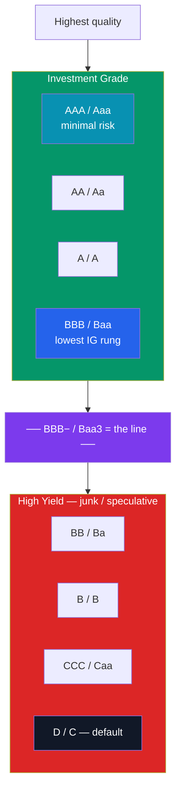

# ⚠️ Credit Risk and Ratings

> [!abstract] TL;DR
> **Credit risk** is the chance an issuer fails to pay coupons or principal — default risk. Three agencies (**Moody's, S&P, Fitch**) grade issuers on a letter scale, and one line matters most: **investment-grade** (BBB−/Baa3 and above) vs **high-yield / junk** (below it). Riskier issuers must pay a **credit spread** — extra yield over a same-maturity Treasury — to compensate lenders for expected loss plus a risk premium. Spreads are **cyclical**: they compress in booms and blow out in recessions. The **2008 crisis** exposed catastrophic ratings failures — AAA-stamped subprime securities that defaulted en masse — driven by flawed models and an issuer-pays conflict of interest.

## Intuition — analogy FIRST

You have $1,000 to lend and two people ask to borrow it. One is a government that can print money and tax millions of citizens. The other is a startup that might be gone in two years. You'd lend to the government at a low rate without a second thought — but you'd only lend to the startup if it promised you a *much* higher rate to offset the real chance it never pays you back.

That extra rate you demand is the **credit spread**, and the informal reputation you'd check before lending is what a **credit rating** formalizes. Rating agencies are, in effect, professional reference-checkers for borrowers, distilling mountains of financials into a single grade like "AA" or "B."

The catch — and the whole lesson of 2008 — is that a reference check is only as good as the checker's honesty and models. When the graders are paid by the borrowers and their models assume the good times never end, the grades can be dangerously wrong.

---

## The Rating Ladder

## Key Concepts / Details

### Default Risk, Recovery, and Expected Loss

Credit risk decomposes into three drivers, combined in the **expected loss** formula:

$$\mathbb{E}[\text{Loss}] = PD \times LGD \times EAD$$

- **PD** — *probability of default*: chance the issuer misses payments over the horizon.
- **LGD** — *loss given default* = $1 - \text{recovery rate}$: the fraction you *don't* get back. Senior secured bonds recover more (higher up the capital structure) than subordinated debt.
- **EAD** — *exposure at default*: the amount at risk (roughly the bond's value).

**Worked example:** a bond with a 2% annual default probability and a 40% recovery rate (so LGD = 60%) has an expected annual credit loss of $0.02 \times 0.60 = 1.2\% = 120$ bps of principal.

### The Credit Spread

A risky bond must out-yield a safe one by enough to cover that expected loss *and* pay a risk premium:

$$\text{Credit spread} = y_{\text{corporate}} - y_{\text{Treasury (same maturity)}}$$

A rough breakeven: **spread ≈ PD × LGD**, but observed spreads run *wider* because lenders also demand compensation for the *uncertainty* of default (risk premium), for illiquidity, and for taxes.

**Worked example:** a 5-year corporate yields 7.0% while the 5-year Treasury yields 4.0%, so the spread is **300 bps**. Of that, ~120 bps covers expected loss (above); the remaining ~180 bps is risk premium + liquidity + tax. This is the same math as the credit-spread component layered on top of the government [[The_Yield_Curve_and_Interest_Rates|yield curve]].

### The Rating Agencies and the Investment-Grade Line

| Tier | Moody's | S&P / Fitch | Meaning |
|------|---------|-------------|---------|
| **Investment grade** | Aaa | AAA | Minimal credit risk |
| | Aa | AA | Very strong |
| | A | A | Strong |
| | Baa | BBB | Adequate — **lowest IG** |
| **High yield (junk)** | Ba | BB | Speculative |
| | B | B | Highly speculative |
| | Caa–Ca | CCC–CC | Substantial risk / near default |
| | C | D | In default |

The **BBB− / Baa3 line** is the single most consequential threshold in credit. Many pension funds, insurers, and index mandates are *contractually barred* from holding sub-investment-grade debt, so a downgrade across the line ("falling angel") forces mechanical selling, widens spreads, and raises the issuer's borrowing cost — a cliff, not a step.

### Spreads Are Cyclical

Credit spreads are among the most **procyclical** variables in finance: they narrow when the economy is strong (default fears fade, investors reach for yield) and blow out violently in downturns (a flight to quality). US high-yield spreads sat near ~250–300 bps in the mid-2000s boom, then spiked above **~2,000 bps** at the depth of the 2008 panic before compressing again. Because spreads and prices move inversely, spread widening = credit losses even without any actual default.

### The 2008 Ratings Failures

The financial crisis was, in large part, a **credit-ratings failure**:

- **Structured products mis-rated:** pools of subprime mortgages were repackaged into **mortgage-backed securities and CDOs**, and huge tranches were stamped **AAA** — the same grade as US Treasuries — yet later suffered mass downgrades and defaults.
- **The issuer-pays conflict:** agencies are paid by the *issuers* they rate, creating pressure to award favorable grades and win business ("ratings shopping").
- **Broken model assumptions:** the models assumed home prices across regions were nearly *uncorrelated* and would keep rising, so a nationwide decline — precisely what happened — was treated as almost impossible, wildly understating tail risk.
- **Aftermath:** the episode prompted the Dodd-Frank Act (2010) and tighter oversight of Nationally Recognized Statistical Rating Organizations. The deeper lesson: a rating is an *opinion*, not a guarantee — see [[Financial_History_and_Crises]].

---

## Real-World Notes

- **Fallen angels vs rising stars:** a bond downgraded from IG to junk is a "fallen angel" (e.g., a wave of them in the 2020 COVID shock); one upgraded from junk to IG is a "rising star." Both trigger large forced flows around the BBB−/Baa3 line.
- **Credit default swaps (CDS):** the market prices default risk directly through CDS — insurance against an issuer's default — whose premium moves tightly with the cash-bond credit spread and often leads it.
- **Sovereign downgrades make headlines:** S&P's 2011 cut of the US from AAA to AA+, and periodic eurozone sovereign downgrades, show ratings apply to governments too — and can move global markets.

---

## Common Pitfalls

- **Treating ratings as risk-free truth.** Ratings are lagging opinions; markets often reprice credit (via spreads/CDS) well before an agency acts.
- **Ignoring recovery.** Two bonds with equal default probability can have very different expected losses if one is senior secured (high recovery) and the other subordinated.
- **Confusing spread widening with default.** You can lose money on a credit bond that never defaults — a spread blowout marks it down immediately (mark-to-market loss).
- **Overlooking the IG/HY cliff.** The economic gap between BBB− and BB+ is far larger than one notch suggests because of forced-selling mandates.

---

## Related Concepts

- [[_MOC_Fixed_Income|↑ Section MOC]]
- [[Bond_Fundamentals]] — Corporates and munis carry the credit risk graded here
- [[Bond_Pricing_and_Yields]] — Higher credit risk shows up as higher yield
- [[The_Yield_Curve_and_Interest_Rates]] — Credit spreads stack atop the government curve
- [[Duration_and_Convexity]] — Spread duration, the credit analogue of rate sensitivity
- [[Financial_History_and_Crises]] — The 2008 subprime and ratings collapse

## Review Questions

1. A high-yield bond has a 5% annual default probability and an expected recovery rate of 30%. Compute its expected annual credit loss in basis points. If its spread over Treasuries is 700 bps, roughly how much of that spread is *not* explained by expected loss, and what does that residual compensate for?
2. Define the investment-grade/high-yield boundary in both S&P and Moody's notation. Explain why a downgrade across this line can force selling and widen spreads far more than a one-notch downgrade elsewhere on the scale.
3. Identify two distinct reasons the rating agencies assigned AAA ratings to securities that later defaulted in 2008. How did the issuer-pays business model contribute?

## Sources

- Fabozzi, *Bond Markets, Analysis, and Strategies*, 9th edition, Ch. 7 (Credit Analysis)
- CFA Institute, *CFA Program Curriculum* Level 1 & 2 — Fixed Income: Fundamentals of Credit Analysis
- *The Financial Crisis Inquiry Report*, US Government Printing Office (2011) — Ch. on the rating agencies
- Moody's / S&P Global Ratings, *Rating Symbols and Definitions* (methodology publications)

#finance #fixed-income #credit-risk #ratings #credit-spread #high-yield
