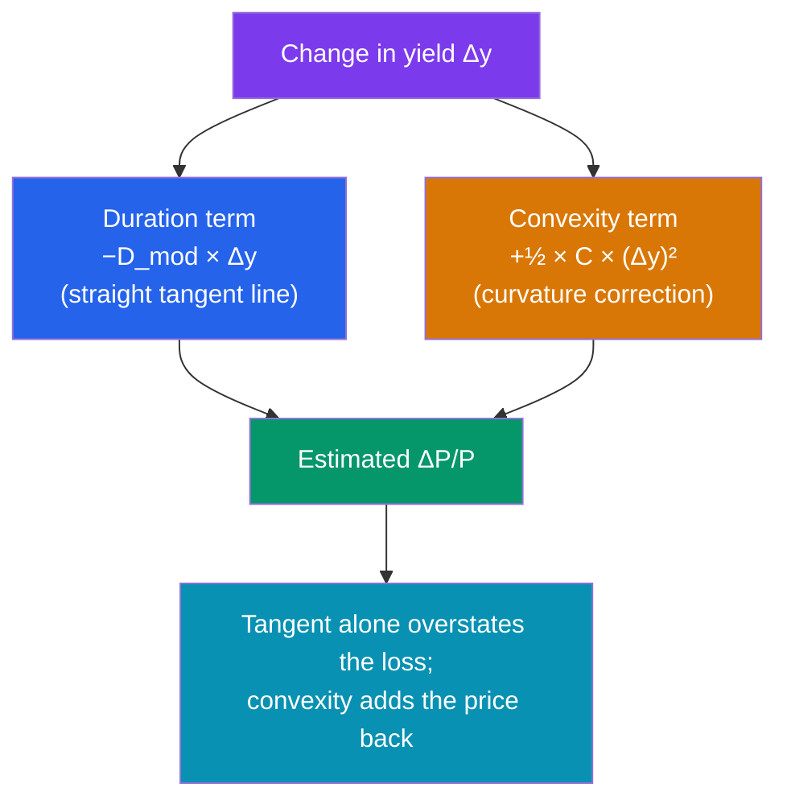

# 📐 Duration and Convexity

> [!abstract] TL;DR
> **Duration** measures a bond's sensitivity to interest rates. **Macaulay duration** is the weighted-average time to receive the bond's cash flows (in years); **modified duration** converts that into a percentage price change per 1% move in yield: $\frac{\Delta P}{P} \approx -D_{\text{mod}} \times \Delta y$. This linear approximation is a straight-line (tangent) estimate that always *overstates* the price drop and *understates* the rise, because the true price-yield curve bends. **Convexity** is the second-order correction that captures that curvature: $\frac{\Delta P}{P} \approx -D_{\text{mod}}\,\Delta y + \tfrac{1}{2}\,C\,(\Delta y)^2$. Higher convexity is desirable — it means bigger gains and smaller losses for the same yield move.

## Intuition — analogy FIRST

Think of a bond's price as a ball resting on a curved hill, where sideways position is the yield. Nudge the yield and the ball rolls to a new price. **Duration** is the *steepness of the slope* right under the ball — it tells you how fast the price moves for a small nudge. Point a ruler along that slope (the tangent line) and you can predict the next price... approximately.

But the hill is **curved**, not straight. For a small nudge, the ruler is nearly perfect. For a big shove, the ruler drifts away from the real curve — and because the curve bows *toward* you (it's convex), the real price is always a little *better* than the ruler predicts: prices fall less than duration says and rise more. **Convexity** measures exactly how much the hill curves, so you can correct the ruler's error.

Two numbers, then: duration for the slope, convexity for the bend.

---

## Slope and Curvature of the Price-Yield Curve

## Key Concepts / Details

### Macaulay Duration

**Macaulay duration** is the present-value-weighted average time (in years) until you receive the bond's cash flows:

$$D_{\text{Mac}} = \frac{\sum_{t=1}^{n} t \cdot \dfrac{CF_t}{(1+y)^t}}{P} = \sum_{t=1}^{n} t \cdot w_t, \quad w_t = \frac{PV(CF_t)}{P}$$

Each cash flow's weight $w_t$ is its share of the total price. A **zero-coupon bond** has duration exactly equal to its maturity (one cash flow, all the weight at the end); a coupon bond's duration is always *less* than its maturity because earlier coupons pull the average time forward.

### Modified Duration and the Linear Approximation

**Modified duration** rescales Macaulay duration into a price-sensitivity:

$$D_{\text{mod}} = \frac{D_{\text{Mac}}}{1 + y/m}$$

where $m$ = compounding periods per year. It gives the **first-order approximation**:

$$\boxed{\frac{\Delta P}{P} \approx -D_{\text{mod}} \times \Delta y}$$

A modified duration of 7 means a **+1% yield move costs ~7% of price**. The related **DV01** (dollar value of a basis point) = $D_{\text{mod}} \times P \times 0.0001$ — the dollar price change per 0.01% yield move, the workhorse of a rates trading desk.

### Worked Example — Duration of a 3-Year Bond

Take a **3-year, $1,000 par bond, 6% annual coupon, priced at par** (YTM = 6%). Cash flows: $60, $60, $1,060.

| $t$ | $CF_t$ | $PV = CF_t/1.06^t$ | Weight $w_t$ | $t \cdot w_t$ |
|-----|--------|--------------------|--------------|----------------|
| 1 | 60 | 56.60 | 0.05660 | 0.05660 |
| 2 | 60 | 53.40 | 0.05340 | 0.10680 |
| 3 | 1,060 | 890.00 | 0.89000 | 2.67000 |
| **Σ** | | **1,000.00** | 1.00000 | **2.8334** |

$$D_{\text{Mac}} = 2.8334 \text{ years}, \qquad D_{\text{mod}} = \frac{2.8334}{1.06} = 2.6730$$

**Predict the price at a 1% yield rise** (Δy = +0.01):
$$\frac{\Delta P}{P} \approx -2.6730 \times 0.01 = -2.673\% \;\Rightarrow\; P \approx \$973.27$$

The *actual* repriced value at YTM = 7% is **$973.76** (a −2.624% move). Duration overshot the loss by about $0.49 — the convexity gap.

### Convexity — the Second-Order Fix

**Convexity** $C$ measures the curvature of the price-yield relationship:

$$C = \frac{1}{P (1+y)^2} \sum_{t=1}^{n} t(t+1)\,\frac{CF_t}{(1+y)^t}$$

For our bond, the summation is:

| $t$ | $t(t+1)\,CF_t/1.06^t$ |
|-----|------------------------|
| 1 | $2 \times 60 / 1.06 = 113.21$ |
| 2 | $6 \times 60 / 1.06^2 = 320.41$ |
| 3 | $12 \times 1060 / 1.06^3 = 10{,}680.03$ |
| **Σ** | **11,113.65** |

$$C = \frac{11{,}113.65}{1000 \times 1.06^2} = \frac{11{,}113.65}{1123.6} = 9.891$$

The **full second-order estimate**:
$$\frac{\Delta P}{P} \approx \underbrace{-D_{\text{mod}}\,\Delta y}_{\text{duration}} + \underbrace{\tfrac{1}{2}\,C\,(\Delta y)^2}_{\text{convexity}}$$

For Δy = +0.01:
$$= -2.673\% + \tfrac{1}{2}(9.891)(0.01)^2 = -2.673\% + 0.0495\% = -2.6235\%$$

That predicts **$973.77** — essentially bang-on the true $973.76. Convexity closed the gap.

### Why Convexity Matters More on Big Moves

The duration term scales with $\Delta y$; the convexity term scales with $(\Delta y)^2$, so it grows in importance for large shocks. Repeat for **Δy = +2%** (YTM → 8%):

| Method | Estimated ΔP/P | Implied price |
|--------|----------------|---------------|
| Duration only | $-2.6730 \times 0.02 = -5.346\%$ | $946.54 |
| Duration + convexity | $-5.346\% + \tfrac{1}{2}(9.891)(0.02)^2 = -5.148\%$ | $948.52 |
| **Actual (recompute at 8%)** | **$-5.154\%$** | **$948.46** |

Duration alone was off by ~$1.9; adding convexity nails it to within a few cents. And notice the **asymmetry**: because the convexity term is always *positive*, it softens losses when yields rise and amplifies gains when they fall. That asymmetry is why, all else equal, investors *prefer* higher convexity.

### Practical Uses

- **Portfolio immunization:** matching the duration of assets to the duration of liabilities locks in a return against small rate moves — the core of pension and insurance ALM.
- **Hedging:** a trader neutralizes rate risk by setting the net DV01 of a book to zero.
- **Barbell vs bullet:** two portfolios with equal duration can have different convexity; the more convex one outperforms if rates move sharply in *either* direction.

---

## Real-World Notes

- **Zeros are the extreme case:** a 30-year zero-coupon bond has a modified duration near 30 — a 1% rate move swings its price ~30%. This is why STRIPS and long zeros are the sharpest instruments for expressing a rate view.
- **Negative convexity:** callable bonds and mortgage-backed securities can have *negative* convexity — when rates fall, borrowers refinance/prepay, capping price gains. Holders demand extra yield for that unfavorable curvature.
- **Effective duration:** for bonds with embedded options, analysts use *effective* (option-adjusted) duration, re-pricing the bond under shifted yield curves rather than relying on the closed-form formula.

---

## Common Pitfalls

- **Using duration for large yield moves.** The linear estimate degrades quadratically; beyond ~50–100 bps you need the convexity term.
- **Confusing Macaulay and modified duration.** Macaulay is in *years*; modified is a *percentage price sensitivity*. Divide by $(1+y/m)$ to convert.
- **Forgetting to scale for semi-annual bonds.** Compute duration in periods, then divide by $m$ to state it in years — and use the per-period yield throughout.
- **Ignoring negative convexity.** Applying the positive-convexity intuition to callable bonds or MBS gives dangerously optimistic price estimates when rates fall.

---

## Related Concepts

- [[_MOC_Fixed_Income|↑ Section MOC]]
- [[Bond_Pricing_and_Yields]] — The price-yield curve whose slope and bend we measure
- [[Bond_Fundamentals]] — Why a zero-coupon bond has duration equal to maturity
- [[The_Yield_Curve_and_Interest_Rates]] — Non-parallel curve shifts (key-rate duration)
- [[Credit_Risk_and_Ratings]] — Spread duration, the credit analogue of rate duration
- [[Time_Value_of_Money]] — The present-value weights behind duration

## Review Questions

1. A bond has a modified duration of 6.5 and a convexity of 70. Estimate the percentage price change for a +150 bps yield move using (a) duration only and (b) duration plus convexity. Which is larger in magnitude, and why does convexity reduce the estimated loss?
2. Explain why a zero-coupon bond's Macaulay duration equals its maturity while a coupon bond's is strictly less. What does this imply about which bond is riskier per year of maturity?
3. Two portfolios have identical modified duration but Portfolio X has higher convexity. If rates move sharply — up or down — which portfolio performs better, and what would you expect to pay for that advantage?

## Sources

- Fabozzi, *Bond Markets, Analysis, and Strategies*, 9th edition, Ch. 4 (Bond Price Volatility)
- Tuckman & Serrat, *Fixed Income Securities*, 3rd edition, Ch. 4–6
- CFA Institute, *CFA Program Curriculum* Level 1 — Fixed Income: Understanding Fixed-Income Risk and Return
- Hull, *Options, Futures, and Other Derivatives*, 11th edition, Ch. 4 (Duration and Convexity)

#finance #fixed-income #duration #convexity #interest-rate-risk #advanced
