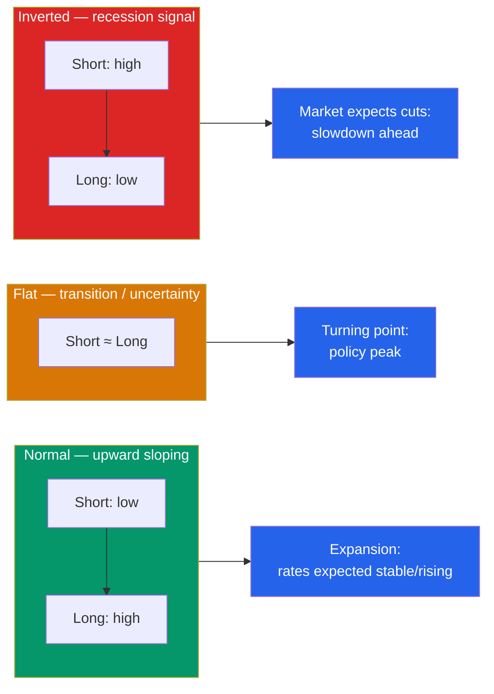

# 📉 The Yield Curve and Interest Rates

> [!abstract] TL;DR
> The **yield curve** plots interest rates against maturity — the **term structure** of interest rates. Its normal shape slopes **upward** (longer bonds pay more); a **flat** curve signals uncertainty; an **inverted** curve (long rates below short rates) has preceded nearly every US recession since the 1960s. Three theories explain the shape: the **expectations hypothesis** (long rates = average of expected future short rates), **liquidity preference** (investors demand a **term premium** for locking up money longer), and market segmentation. **Spreads** — differences between yields — turn the curve into a forecasting and relative-value tool.

## Intuition — analogy FIRST

Imagine a bank posts its CD rates: 1 year at 3%, 2 years at 3.5%, 5 years at 4%, 10 years at 4.5%. Plot those points and connect them — you've drawn a yield curve. Its upward slope says the bank pays you more to tie up your money longer, which feels natural: you're taking more risk and giving up flexibility, so you demand a premium.

Now imagine the board flips and the 1-year suddenly pays *more* than the 10-year. That's strange — why accept *less* to lend for longer? It only makes sense if the market expects rates to **fall** in the future, which usually means it expects the economy to weaken and the central bank to cut. That upside-down curve is the **inverted yield curve**, and its eerie track record as a recession bellwether is why it makes headlines.

The curve, in short, is the market's collective forecast of the path of interest rates — priced in real money.

---

## Shapes of the Curve

## Key Concepts / Details

### The Term Structure and Spot Rates

The **term structure** is the set of yields on zero-coupon (default-free) bonds across maturities — the **spot rates** $s_1, s_2, \dots, s_n$. A cash flow at year $t$ is discounted at its own spot rate $s_t$, so a coupon bond's price is really a bundle of zeros:

$$P = \sum_{t=1}^{n} \frac{CF_t}{(1+s_t)^t}$$

The curve is usually drawn from benchmark government yields (e.g., US Treasuries) because they strip out credit risk, isolating the pure **time-and-rates** component. Corporate curves sit above it by their [[Credit_Risk_and_Ratings|credit spread]].

### The Three Shapes

| Shape | Description | Typical meaning |
|-------|-------------|-----------------|
| **Normal (upward)** | Long yields > short yields | Healthy expansion; term premium dominates |
| **Flat** | Long ≈ short | Policy at a peak; transition/uncertainty |
| **Inverted (downward)** | Long yields < short yields | Market expects rate cuts → recession risk |

The most-watched gauges are the **10-year minus 2-year** and **10-year minus 3-month** spreads. When either goes negative, the curve is inverted. The 10y–3m spread inverted before every US recession since 1960 with only one false signal — which is why economists and the Fed track it closely.

### Forward Rates and the Expectations Hypothesis

The **pure expectations hypothesis** says a long rate is just the geometric average of the short rates the market expects along the way. This lets you extract an **implied forward rate** — the market's expectation of a future short rate — from today's spot curve:

$$(1+s_2)^2 = (1+s_1)(1+f_{1,2})$$

**Worked example:** the 1-year spot is 3% and the 2-year spot is 4%. The implied 1-year rate, one year from now:
$$f_{1,2} = \frac{(1+s_2)^2}{1+s_1} - 1 = \frac{1.04^2}{1.03} - 1 = \frac{1.0816}{1.03} - 1 = 5.01\%$$

So an upward-sloping curve embeds an expectation that short rates will *rise* to ~5%. If instead the curve were inverted, the same math would imply the market expects rates to *fall*.

### Why the Curve Usually Slopes Up — Liquidity Preference

Pure expectations can't be the whole story, because the curve slopes up on average even when rates aren't expected to rise. The **liquidity preference theory** adds a **term premium**: investors dislike locking up money and bearing price risk for longer (recall duration grows with maturity — see [[Duration_and_Convexity]]), so they demand extra yield. Observed long rate = expected average short rate **+ term premium**:

$$s_n \approx \underbrace{\text{avg. expected future short rates}}_{\text{expectations}} + \underbrace{TP_n}_{\text{term premium, rising with } n}$$

A third view, **market segmentation / preferred habitat**, holds that supply and demand within each maturity bucket (pension funds crave long bonds; banks want short paper) can bend the curve independent of expectations.

### Spreads as a Toolkit

- **Term spread** (e.g., 10y–2y): slope of the curve; the recession barometer above.
- **Credit spread**: corporate yield minus Treasury of same maturity — the price of default risk.
- **TED spread**: interbank rate minus T-bill — a bank-stress and liquidity gauge.
- **Real vs nominal (breakeven inflation)**: nominal Treasury yield minus TIPS yield = market-implied inflation.

---

## Real-World Notes

- **The 2022–2023 inversion:** the 10y–2y spread went deeply negative (below −100 bps, the widest since the early 1980s) as the Fed hiked aggressively to fight inflation — reviving intense debate over whether a recession would follow.
- **The Fed sets the short end, markets set the long end:** central banks control the overnight policy rate directly, but long-term yields are driven by market expectations of future policy, growth, and inflation — which is why the Fed can hike and see long yields barely move ("Greenspan's conundrum").
- **Bootstrapping the curve:** because most traded bonds pay coupons, desks *bootstrap* the zero-coupon spot curve maturity by maturity from coupon-bond prices, then derive forwards — the plumbing behind every discount factor.

---

## Common Pitfalls

- **Reading inversion as a precise timer.** Inversions have *led* recessions but with long and variable lags (often 6–18 months); it is a warning, not a countdown.
- **Assuming forwards are forecasts.** Implied forward rates are what the market *prices in*, not a guaranteed prediction — they also embed the term premium, so they systematically overstate expected future short rates.
- **Mixing coupon yields with spot rates.** Discounting each cash flow at a single YTM is an approximation; the theoretically correct price uses maturity-specific spot rates.
- **Ignoring which spread you're quoting.** 10y–2y and 10y–3m can disagree at turning points; specify the pair before drawing conclusions.

---

## Related Concepts

- [[_MOC_Fixed_Income|↑ Section MOC]]
- [[Bond_Pricing_and_Yields]] — Spot rates are the discount rates behind every bond price
- [[Duration_and_Convexity]] — Why longer maturities carry more price risk (the term premium's source)
- [[Credit_Risk_and_Ratings]] — Credit spreads stack on top of the government curve
- [[Bond_Fundamentals]] — Maturity, the horizontal axis of the curve
- [[Financial_History_and_Crises]] — Yield-curve inversions and past recessions

## Review Questions

1. The 1-year spot rate is 2.5% and the 3-year spot rate is 3.5%. Is the curve normal or inverted? Using the expectations hypothesis, is the market implying that future short rates will rise or fall?
2. Explain why the yield curve tends to slope upward *on average*, even in periods when investors do not expect short-term rates to rise. Which theory accounts for this, and what is the extra component called?
3. An investor sees the 10y–3m spread turn negative and concludes a recession will begin next quarter. Critique this conclusion. What can and cannot be inferred from an inverted curve?

## Sources

- CFA Institute, *CFA Program Curriculum* Level 1 & 2 — Fixed Income: The Term Structure and Interest Rate Dynamics
- Estrella & Mishkin, "The Yield Curve as a Predictor of U.S. Recessions," *Federal Reserve Bank of New York* (1996)
- Fabozzi, *Bond Markets, Analysis, and Strategies*, 9th edition, Ch. 5–6
- Federal Reserve Bank of St. Louis (FRED), *10-Year Treasury Minus 2-Year / 3-Month Treasury* series

#finance #fixed-income #yield-curve #term-structure #interest-rates #inverted-curve
