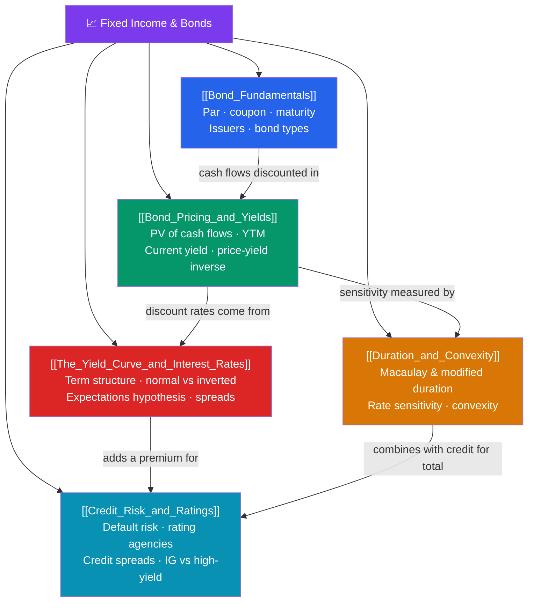

# 📈 Fixed Income & Bonds — Map of Content

> [!abstract] What This Section Covers
> The global bond market is larger than the equity market — well over $130 trillion — and it is where interest rates, credit, and the time value of money meet. This section builds from the ground up: **bond fundamentals** (par/face value, coupon, maturity, issuers from Treasuries to corporates and munis), then **pricing and yields** — a bond's price is the present value of its cash flows, and its yield to maturity is the single discount rate that equates price to those cash flows, which is why price and yield always move inversely. **Duration and convexity** quantify interest-rate risk: modified duration approximates the percentage price change per 1% yield move, and convexity corrects the curvature. The **yield curve** encodes the term structure of interest rates — normal, flat, or inverted (a classic recession signal) — while **credit risk and ratings** (Moody's/S&P/Fitch, investment-grade vs high-yield, credit spreads) capture default risk. This is the CFA fixed-income core and the foundation of rates trading.

## Concept Map

## Learning Path
1. [[Bond_Fundamentals]] — The building blocks: par, coupon, maturity, issuers, and the main bond types.
2. [[Bond_Pricing_and_Yields]] — Price as PV of cash flows, yield to maturity, current yield, and the price-yield inverse relationship.
3. [[Duration_and_Convexity]] — Measuring interest-rate risk: Macaulay and modified duration, plus the convexity correction.
4. [[The_Yield_Curve_and_Interest_Rates]] — The term structure: normal vs inverted curves, the expectations hypothesis, and spreads.
5. [[Credit_Risk_and_Ratings]] — Default risk, the rating agencies, credit spreads, and investment-grade vs high-yield.

## All Notes at a Glance

| Note | Difficulty | What You'll Learn |
|------|------------|-------------------|
| [[Bond_Fundamentals]] | Beginner | Par value, coupon rate, maturity, issuers, Treasuries/corporates/munis, zero-coupon |
| [[Bond_Pricing_and_Yields]] | Intermediate | Price = PV of cash flows, YTM, current yield, premium/discount, price-yield inverse |
| [[Duration_and_Convexity]] | Advanced | Macaulay vs modified duration, DV01, interest-rate sensitivity, convexity adjustment |
| [[The_Yield_Curve_and_Interest_Rates]] | Intermediate | Term structure, normal/flat/inverted, expectations hypothesis, spot vs forward rates |
| [[Credit_Risk_and_Ratings]] | Intermediate | Default/recovery, Moody's/S&P/Fitch scales, credit spreads, IG vs high-yield |

## Key Questions This Section Answers
- Why does a bond's price fall when interest rates rise, and by exactly how much?
- What is yield to maturity, and how does it differ from the coupon rate and current yield?
- How do duration and convexity let you estimate price changes and immunize a portfolio?
- Why is an inverted yield curve considered a recession warning?
- What separates investment-grade from high-yield debt, and how are credit spreads priced?

## Related Sections
- [[_MOC_Finance_Master|↑ Finance Master MOC]]
- [[_MOC_Financial_Accounting|← Financial Accounting]] — The statements behind credit analysis
- [[_MOC_Derivatives|→ Derivatives & Options]] — Interest-rate swaps and bond futures hedge this risk

#MOC #Finance #FixedIncome
