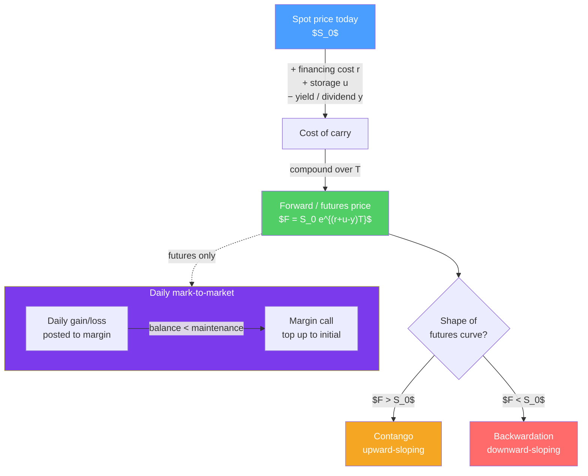

# 📈 Forwards and Futures

> [!abstract] TL;DR
> A **forward** and a **future** both lock in a price *today* for a transaction that settles *later*. A forward is a private, customized contract settled once at maturity; a future is a standardized, exchange-traded contract **marked-to-market** every day against a margin account. Fair pricing follows the **cost-of-carry** relationship $F = S_0 \, e^{(r+u-y)T}$ — the forward price is the spot price compounded forward at the financing rate plus storage minus any yield. When the futures curve slopes up ($F > S$) the market is in **contango**; when it slopes down ($F < S$) it is in **backwardation**. **Hedgers** use these contracts to remove price risk; **speculators** take it on for profit.

## Intuition — analogy FIRST

Imagine you run a bakery and you know you'll need 10 tonnes of wheat in three months. The price of wheat swings wildly. You could wait and gamble on the spot price at harvest — or you could call a farmer today and agree: *"I'll pay you \$6.10 per bushel in three months, no matter what."* You've just written a **forward contract**. Both sides sleep easier: you've capped your cost, the farmer has locked in revenue.

Now imagine thousands of bakers and farmers wanting the same deal. Instead of private phone calls, they meet on an **exchange** that standardizes the contract (same quantity, grade, delivery date) and inserts a **clearinghouse** as the counterparty to everyone. To keep the clearinghouse safe, gains and losses are settled *daily* — this is the future. The economics are nearly identical to the forward; the plumbing (margin, daily settlement, standardization) is what differs.

The forward price is not a forecast. It's just the spot price plus the cost of *carrying* the asset until delivery — financing, storage, minus any income it throws off. Get that wrong and an arbitrageur pockets the difference.

---

## How It Works

## Key Concepts / Details

### Forward vs Futures — the same idea, different plumbing

A **forward contract** is an agreement to buy or sell an asset at a set price $F$ on a set future date. A **futures contract** is the exchange-traded, standardized cousin. Both have **linear payoffs**: the long's payoff at delivery is $S_T - F$ and the short's is $F - S_T$.

| Feature | Forward | Futures |
|---------|---------|---------|
| Where it trades | Over-the-counter (private) | Organized exchange (CME, ICE) |
| Terms | Customized | Standardized (size, grade, date) |
| Counterparty risk | Each other (default risk) | Clearinghouse guarantees |
| Settlement of P&L | Once, at maturity | **Daily** (mark-to-market) |
| Margin | Usually none | Initial + maintenance required |
| Liquidity / unwinding | Hard to exit early | Offset anytime by trading out |
| Regulation | Light | Heavy (exchange-regulated) |

### Mark-to-Market and Margin

A futures position is settled **daily**. Each day the exchange computes the settlement price and credits or debits your **margin account** by the change in contract value. This replaces one big default risk at maturity with many tiny daily true-ups.

- **Initial margin** — the "good-faith" deposit required to open a position (a small fraction of contract value, e.g. 5–10%).
- **Maintenance margin** — a floor; if your balance falls below it, you get a **margin call** and must top the account back up to the *initial* level.

**Worked example — a margin call.** You go long 1 gold futures contract (100 oz) at \$2,000/oz. Initial margin \$9,000, maintenance margin \$7,000.

- Day 1: gold settles at \$1,950. Loss $= (1{,}950 - 2{,}000) \times 100 = -\$5{,}000$.
- New balance $= 9{,}000 - 5{,}000 = \$4{,}000$, which is below the \$7,000 maintenance floor.
- **Margin call**: you must deposit \$5,000 to restore the balance to the \$9,000 initial level.

This daily leverage is why futures can be so unforgiving — a 2.5% move against you wiped out more than half your posted margin.

### The Cost-of-Carry Forward Price

By no-arbitrage, the forward price equals the cost of *buying the asset now and carrying it* to delivery:

$$F = S_0 \, e^{(r + u - y)T}$$

where $S_0$ = spot price, $r$ = risk-free financing rate, $u$ = storage/insurance cost (as a rate), $y$ = income yield (dividend or convenience yield), $T$ = time to delivery. For a non-dividend asset it simplifies to $F = S_0 e^{rT}$ (or discretely $F = S_0(1+r)^T$).

**Worked example.** A non-dividend stock trades at \$100, the 1-year rate is 5%. The fair 1-year forward price:
$$F = 100 \times e^{0.05 \times 1} = 100 \times 1.0513 = \$105.13$$

If the actual forward traded at \$108, an arbitrageur would **short the forward** and **buy the stock with borrowed money**, locking in \$2.87 of riskless profit per share at delivery. That arbitrage force is what keeps $F$ pinned to the cost of carry.

### Contango vs Backwardation

- **Contango** — the futures price is *above* the current spot (and rises with maturity): $F > S_0$. This is the "normal" state for storable assets, because carry costs (financing + storage) push the forward up. A long roll *loses* money as expensive far contracts converge down to spot ("negative roll yield").
- **Backwardation** — the futures price is *below* spot: $F < S_0$. Common when there's a high **convenience yield** (a benefit to holding the physical asset now — e.g. an oil refinery that needs crude today, or a supply shortage). A long roll *earns* positive roll yield.

| | Contango | Backwardation |
|---|---|---|
| Curve shape | Upward-sloping | Downward-sloping |
| Relationship | $F > S_0$ | $F < S_0$ |
| Driver | Carry costs dominate | Convenience yield / scarcity dominate |
| Long roll yield | Negative (bleeds) | Positive (earns) |
| Typical example | Gold, most agriculturals | Crude oil during shortages |

### Hedgers vs Speculators (worked P&L)

- **Hedgers** hold (or will hold) the underlying and use futures to *remove* price risk. Their futures gain/loss offsets the change in their physical position.
- **Speculators** have no underlying exposure; they take a directional bet, providing liquidity and absorbing the hedgers' risk in exchange for expected profit.

**Worked hedge P&L.** A farmer will harvest **5,000 bushels** of wheat in 3 months. Spot is \$6.00; she **sells** (shorts) futures at \$6.10 to lock in her price. At harvest, wheat has fallen to \$5.50.

| Leg | Calculation | Result |
|-----|-------------|--------|
| Sell physical wheat | $5{,}000 \times \$5.50$ | \$27,500 |
| Futures gain (short) | $(6.10 - 5.50) \times 5{,}000$ | +\$3,000 |
| **Net proceeds** | $27{,}500 + 3{,}000$ | **\$30,500** |

That's exactly $5{,}000 \times \$6.10 = \$30{,}500$ — the hedge locked in the forward price regardless of the market crash. Had prices *risen* to \$6.80, the physical sale would earn \$34,000 but the futures would lose \$3,500, again netting \$30,500. The hedger trades away *upside* for *certainty*.

**Speculator's mirror image.** A speculator who bought those same futures at \$6.10 loses \$3,000 when prices fall — they accepted the risk the farmer shed.

---

## Real-World Notes

- **Negative oil prices (April 2020).** The expiring May WTI crude futures contract settled at **−\$37.63/barrel**. Storage at Cushing, Oklahoma had filled up; longs holding the physical-delivery contract literally had nowhere to put the oil and *paid* others to take it. A dramatic real-world lesson in convenience yield, storage costs, and the danger of holding a physical-delivery future into expiry.
- **Metallgesellschaft (1993).** A German firm hedged long-dated fuel supply contracts with short-dated futures, rolling them forward. When the market flipped into **contango**, the rolls bled cash and daily margin calls forced ~\$1.3 billion of losses before the "hedge" would have paid off — a classic study in rollover and margin risk.
- **Index futures for tactical hedging.** A pension fund that wants to reduce equity exposure fast can short **S&P 500 E-mini futures** rather than sell thousands of underlying stocks — cheaper, faster, and reversible.

---

## Common Pitfalls

- **Treating the forward price as a forecast.** $F$ is the arbitrage-free carry price, not the market's prediction of $S_T$. A contango curve does *not* mean traders expect prices to rise.
- **Ignoring roll yield.** A commodity ETF that holds futures in persistent contango can *lose* money even when spot is flat, purely from rolling into pricier contracts (e.g. the early USO oil ETF).
- **Underestimating margin/leverage.** Futures are marked-to-market daily; a "hedge" can generate crippling short-term cash calls before it pays off (see Metallgesellschaft).
- **Forgetting the yield term.** For dividend-paying stocks or high-convenience commodities, using $F = S_0 e^{rT}$ without subtracting $y$ overstates the forward price.
- **Assuming futures = forwards exactly.** When interest rates are correlated with the asset, daily settlement makes futures prices differ slightly from forwards (the "convexity" adjustment).

---

## Related Concepts

- [[_MOC_Derivatives|↑ Section MOC]]
- [[Options_Basics]] — Options add asymmetry; forwards/futures have symmetric linear payoffs
- [[The_Black_Scholes_Model]] — Uses the same risk-neutral, no-arbitrage carry logic
- [[Swaps_and_Hedging]] — A swap is essentially a portfolio of forward contracts
- [[Fixed_Income_Markets]] — Interest-rate futures and the financing rate $r$ that sets carry
- [[Quantitative_Finance]] — Cross-vault: the stochastic models behind derivative pricing

## Review Questions

1. A non-dividend stock trades at \$50 and the 6-month risk-free rate is 4% annualized. Compute the fair 6-month forward price. If the market forward is \$52, describe the arbitrage trade and the riskless profit per share.
2. You are long 2 crude oil futures contracts (1,000 barrels each) entered at \$80. Initial margin is \$6,000/contract, maintenance \$4,500/contract. Oil settles at \$77 the next day. What is your margin balance, and is there a margin call? If so, how much must you deposit?
3. An airline expects to buy 1 million gallons of jet fuel in 3 months and hedges by going long fuel futures at \$2.50/gallon. At delivery the spot is \$2.10. Show the airline's net effective cost per gallon and explain why hedging still "worked" even though it lost money on the futures leg.

## Sources

- John C. Hull, *Options, Futures, and Other Derivatives*, 11th edition, Ch. 3–5
- Robert McDonald, *Derivatives Markets*, 3rd edition, Ch. 5–6
- CME Group, *Introduction to Futures* and margin methodology (SPAN) documentation
- CFA Institute, *CFA Program Curriculum* Level 1 — Derivatives

#finance #derivatives #futures #forwards #hedging #cost-of-carry
