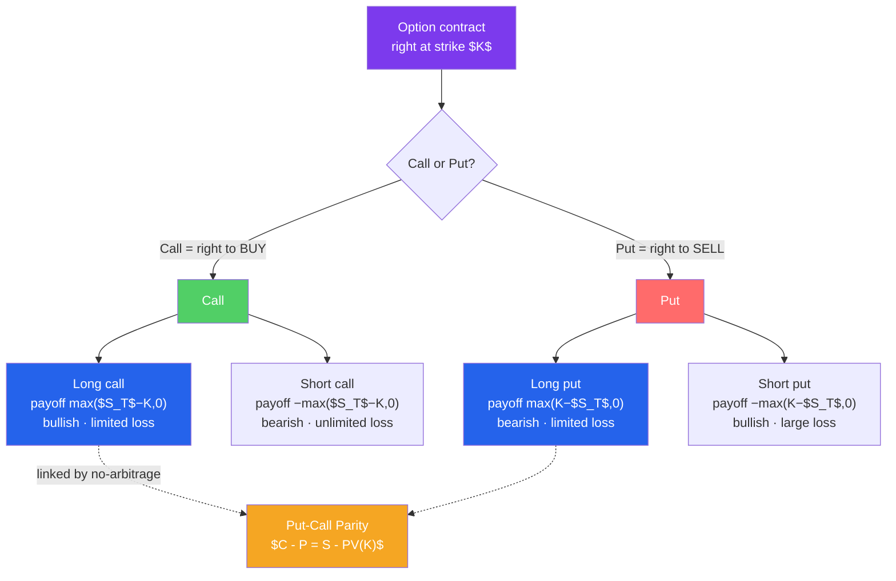

# 🎟️ Options Basics

> [!abstract] TL;DR
> An **option** gives its holder the *right, but not the obligation*, to trade an asset at a fixed **strike price** $K$. A **call** is the right to *buy*; a **put** is the right to *sell*. Buyers (**long**) pay a **premium** for asymmetric payoffs — capped losses, large upside; sellers (**short**) collect the premium and take on the risk. At expiry a call is worth $\max(S_T - K, 0)$ and a put $\max(K - S_T, 0)$. Every premium splits into **intrinsic value** (in-the-money amount) plus **time value**. The no-arbitrage anchor tying calls, puts, stock, and cash together is **put-call parity**: $C - P = S - PV(K)$.

## Intuition — analogy FIRST

Think of a **call option** as a *deposit on a house*. You pay the seller \$5,000 for the right to buy a \$400,000 house any time in the next year at \$400,000. If the market jumps to \$450,000, you exercise — buy at \$400,000, instantly \$50,000 richer (minus your \$5,000 deposit). If the market crashes to \$350,000, you simply walk away; you're out only the \$5,000. Your loss is *capped*, your upside is *open*. That asymmetry — pay a little to control a lot, with a floor under your loss — is the whole appeal of options.

A **put option** is the mirror: it's *insurance*. You pay a premium for the right to *sell* at a set price. If your asset collapses, the put pays off just when you need it — like a fire policy that pays when the house burns. If nothing bad happens, you lose only the premium, the same way an unused insurance policy simply expires.

The person on the *other* side — the option **seller (writer)** — is like the insurance company or the deposit-taker: they pocket the premium up front and hope the event never happens. They earn a little, often; they can lose a lot, rarely.

---

## How It Works

## Key Concepts / Details

### Calls and Puts, Long and Short

An option has four basic positions. Let $S_T$ = the asset price at expiry, $K$ = strike, and $p$ = premium paid/received.

| Position | View | Payoff at expiry | Profit | Max loss | Max gain |
|----------|------|------------------|--------|----------|----------|
| **Long call** | Bullish | $\max(S_T - K, 0)$ | payoff $- p$ | premium $p$ | unlimited |
| **Short call** | Bearish/neutral | $-\max(S_T - K, 0)$ | $p -$ payoff | unlimited | premium $p$ |
| **Long put** | Bearish | $\max(K - S_T, 0)$ | payoff $- p$ | premium $p$ | $K - p$ (large) |
| **Short put** | Bullish/neutral | $-\max(K - S_T, 0)$ | $p -$ payoff | $K - p$ (large) | premium $p$ |

Note the asymmetry: **buyers** have capped losses (the premium) and large or unlimited upside; **sellers** have capped gains (the premium) and large or unlimited downside. Options are a zero-sum transfer between the two.

### Payoff Diagrams

A payoff diagram plots value against $S_T$. Key features:

- **Long call** is flat at zero until $K$, then slopes up 45°. The *profit* line is the payoff shifted down by the premium; it crosses zero at the **breakeven** $S_T = K + p$.
- **Long put** slopes down-left, flat at zero above $K$; breakeven $S_T = K - p$.
- Short positions are the reflection of the long across the horizontal axis.

The "hockey-stick" kink at $K$ is the visual signature of optionality — the bend is exactly where the right becomes worth exercising.

### Moneyness (ITM / ATM / OTM)

**Moneyness** describes where the spot sits relative to the strike:

| Moneyness | Call ($S$ vs $K$) | Put ($S$ vs $K$) | Intrinsic value |
|-----------|-------------------|------------------|-----------------|
| **In-the-money (ITM)** | $S > K$ | $S < K$ | Positive |
| **At-the-money (ATM)** | $S \approx K$ | $S \approx K$ | ~Zero |
| **Out-of-the-money (OTM)** | $S < K$ | $S > K$ | Zero |

Only ITM options have intrinsic value; you'd never exercise an OTM option because you could trade at a better price in the open market.

### Intrinsic vs Time Value

Every option premium decomposes into two parts:

$$\text{Premium} = \underbrace{\text{Intrinsic Value}}_{\max(S - K,\,0)\text{ for a call}} + \underbrace{\text{Time Value}}_{\text{everything else}}$$

- **Intrinsic value** — what the option is worth if exercised *right now*: $\max(S - K, 0)$ for a call, $\max(K - S, 0)$ for a put. Never negative.
- **Time value** — the extra you pay for the *chance* that the option moves further into the money before expiry. It is largest for ATM options and **decays to zero at expiry** (this decay is the Greek theta, $\theta$).

**Worked example.** A stock trades at \$105. A call with strike \$100 trades at a \$7 premium.
- Intrinsic value $= \max(105 - 100, 0) = \$5$.
- Time value $= 7 - 5 = \$2$.

If instead the stock were at \$95 (OTM), intrinsic value is \$0 and the *entire* premium is time value.

### Put-Call Parity

For **European** options (exercisable only at expiry) on a non-dividend asset, a strict no-arbitrage relationship links calls, puts, the stock, and a bond:

$$C - P = S - PV(K) = S - K e^{-rT}$$

Intuition: a portfolio of **long call + short put** (both at strike $K$) has the exact same payoff at expiry as **owning the stock and borrowing $PV(K)$** — both deliver $S_T - K$ no matter what. Equal payoffs must have equal price today, or an arbitrageur builds the cheap side and shorts the dear side for free money. (With dividends, subtract $PV$ of dividends from $S$.)

**Worked example.** $S = \$100$, $K = \$100$, $r = 5\%$, $T = 1$ year, and the call trades at $C = \$10$.
$$PV(K) = 100 \times e^{-0.05} = \$95.12$$
$$P = C - S + PV(K) = 10 - 100 + 95.12 = \$5.12$$
The put *must* trade at \$5.12. If it traded at \$6, you'd sell the put, sell the call synthetically, and lock in a riskless \$0.88 — arbitrage that forces parity to hold.

### A Fuller Worked Payoff

You buy one **long call**, strike \$100, premium \$5 (one contract = 100 shares).

| Price at expiry $S_T$ | Payoff/share $\max(S_T-100,0)$ | Profit/share (− \$5) | Contract profit (×100) |
|-----------------------|-------------------------------|----------------------|------------------------|
| \$90 | \$0 | −\$5 | −\$500 |
| \$100 | \$0 | −\$5 | −\$500 |
| \$105 (breakeven) | \$5 | \$0 | \$0 |
| \$115 | \$15 | \$10 | \$1,000 |
| \$130 | \$30 | \$25 | \$2,500 |

Maximum loss is the \$500 premium; breakeven is \$105 ($K + p$); upside is unbounded. That capped-downside / open-upside shape is why traders pay for optionality.

---

## Real-World Notes

- **Protective puts as portfolio insurance.** A fund holding the S&P 500 buys index puts a few percent OTM. In a crash the puts spike in value, cushioning the loss — at the cost of a steady "insurance premium" that drags returns in calm markets.
- **Covered calls for income.** An investor who owns a stock *sells* calls against it, pocketing premium in exchange for capping upside — the single most popular retail options strategy.
- **The GameStop episode (2021).** Heavy retail buying of far-OTM calls forced market-makers who had *sold* those calls to buy stock to hedge (a "gamma squeeze"), mechanically pushing the price up and showing how options flow can move the underlying itself.

---

## Common Pitfalls

- **Confusing payoff with profit.** The payoff ignores the premium; the *profit* line is shifted by what you paid. An option can be ITM at expiry and still be a net loss if the premium exceeded the intrinsic value.
- **Thinking OTM options are "free lottery tickets."** They lose their entire time value if the move never comes; most expire worthless.
- **Applying put-call parity to American options.** Parity as stated holds for **European** options; early-exercise features and dividends require adjustments.
- **Ignoring assignment risk when short.** Sellers can be *assigned* (forced to deliver) at any time for American options, especially near dividends.
- **Forgetting time decay accelerates.** Time value doesn't melt linearly; it decays fastest in the final weeks (theta), punishing last-minute long holders.

---

## Related Concepts

- [[_MOC_Derivatives|↑ Section MOC]]
- [[Forwards_and_Futures]] — Linear payoffs; options add the asymmetric "right, not obligation"
- [[The_Black_Scholes_Model]] — Prices the time value that payoff diagrams take as given
- [[The_Greeks]] — Delta, gamma, theta quantify how the premium moves
- [[Swaps_and_Hedging]] — Options embed in caps, floors, and structured hedges
- [[Quantitative_Finance]] — Cross-vault: stochastic models of the underlying price

## Review Questions

1. A put option has strike \$50 and trades for \$4 when the stock is at \$47. Split the premium into intrinsic and time value. What is the breakeven stock price for a buyer of this put at expiry?
2. Using put-call parity with $S = \$80$, $K = \$75$, $r = 6\%$, $T = 0.5$ years, and a call priced at \$9, compute the arbitrage-free put price. If the market put trades at \$3, is there an arbitrage, and which side would you take?
3. You write (short) one call, strike \$120, for a \$6 premium. Draw the profit at $S_T = $ \$100, \$120, \$126, and \$140. Identify your maximum gain, breakeven, and describe your maximum loss.

## Sources

- John C. Hull, *Options, Futures, and Other Derivatives*, 11th edition, Ch. 10–11
- Sheldon Natenberg, *Option Volatility and Pricing*, 2nd edition, Ch. 1–3
- Robert McDonald, *Derivatives Markets*, 3rd edition, Ch. 2, 9
- CBOE, *Options Institute* educational materials on payoffs and moneyness

#finance #derivatives #options #calls-and-puts #put-call-parity
