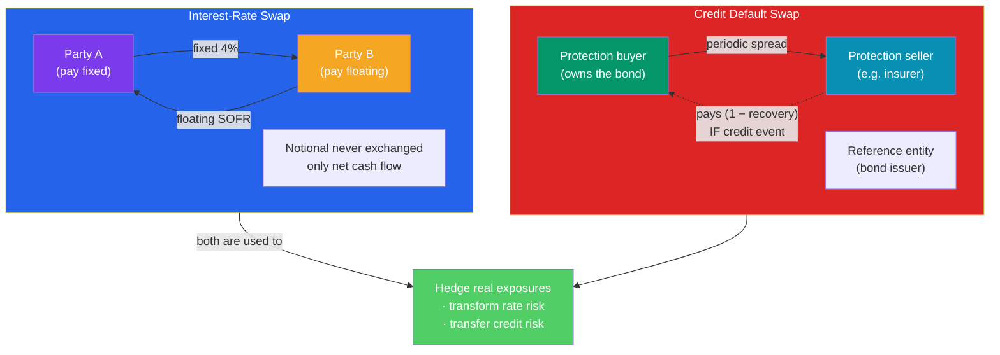

# 🔄 Swaps and Hedging

> [!abstract] TL;DR
> A **swap** is a contract to exchange two streams of cash flows. The workhorse is the **interest-rate swap (IRS)** — one party pays a **fixed** rate, the other pays a **floating** rate (e.g. SOFR) on the same **notional principal**, which is never itself exchanged. Swaps let a borrower transform floating debt into fixed (or vice-versa) without refinancing. A **credit default swap (CDS)** is insurance on a bond: the buyer pays a periodic **spread** and receives a payout if the reference entity defaults. Used well, derivatives **hedge** real exposures; used recklessly and unregulated, CDS on mortgage securities became a central amplifier of the **2008 financial crisis**.

## Intuition — analogy FIRST

Two homeowners have mortgages. Alice has a **variable-rate** loan and hates that her payment jumps whenever rates rise — she craves certainty. Bob has a **fixed-rate** loan but thinks rates are about to fall and wishes he could ride them down. They can't literally trade mortgages, but they *can* agree to swap the *payment streams*: Alice pays Bob a fixed amount each month, Bob pays Alice whatever her variable rate happens to be. Alice now effectively has a fixed payment; Bob now floats. Neither touched the underlying loan. That's an **interest-rate swap** — an exchange of cash-flow *shapes*, not principal.

Now a different worry: you own a bond issued by a shaky company and you're terrified it defaults. You'd love an insurance policy that pays out if it does. A **credit default swap** is exactly that: you pay a small annual premium, and if the company defaults, the seller makes you whole. Like insurance, it's wonderful for genuine hedgers — and dangerous when speculators buy "insurance" on houses they don't own, and when the insurer (as with AIG in 2008) sells far more policies than it could ever pay.

---

## How It Works

## Key Concepts / Details

### Interest-Rate Swaps (Fixed-for-Floating)

In a **plain-vanilla IRS**, two counterparties agree on a **notional principal** and exchange interest payments on it:

- The **fixed-rate payer** pays a constant **swap rate** each period.
- The **floating-rate payer** pays a market reference rate — historically LIBOR, now **SOFR** — reset each period.

Only the **net** difference changes hands; the notional is a reference figure, never exchanged. The **swap rate** is set at inception so the swap's value is **zero** to both sides — mathematically, the PV of the fixed leg equals the PV of the expected floating leg. A swap is economically a **portfolio of forward rate agreements**, one per payment date.

**Worked example — transforming debt.** Company A has a floating-rate loan costing **SOFR + 1%** and wants certainty. It enters a swap to **pay 4% fixed** and **receive SOFR**:

| Cash flow | Rate |
|-----------|------|
| Pays on its loan | −(SOFR + 1%) |
| Pays on swap (fixed leg) | −4% |
| Receives on swap (floating leg) | +SOFR |
| **Net effective cost** | **−5% fixed** |

The floating SOFR cancels, leaving A with a synthetic **5% fixed** cost — it converted floating debt to fixed without refinancing. If SOFR later spikes to 6%, A is protected; if it falls to 2%, A "overpays" versus floating — the price of certainty.

**Net settlement example.** On a \$100M notional with SOFR fixing at 5% for the period, A pays fixed $4\% \times \$100\text{M} = \$4\text{M}$ and receives floating $5\% \times \$100\text{M} = \$5\text{M}$; the counterparty nets **\$1M to A**.

### Credit Default Swaps (CDS)

A **CDS** transfers *default risk* on a **reference entity** (a company or sovereign) from the **protection buyer** to the **protection seller**:

- The **buyer** pays a periodic **CDS spread** (in basis points of notional per year) — the "insurance premium."
- If a defined **credit event** occurs (default, bankruptcy, restructuring), the **seller** pays the buyer the loss: notional $\times (1 - \text{recovery rate})$, typically settled via auction.

The CDS spread is a market price of credit risk: wider spread = higher perceived default probability.

**Worked example.** You own \$10M of a company's bonds and buy CDS protection at a **200 bps** spread.
- Annual premium $= 2\% \times \$10\text{M} = \$200{,}000$.
- The company defaults; the recovery rate is 40%.
- Seller pays $\$10\text{M} \times (1 - 0.40) = \$6\text{M}$.

Your \$6M payout offsets the \$6M you lost on the bonds — the hedge worked. A **"naked" CDS** buyer who owns *no* bond simply collects the \$6M as a speculative bet on default.

### Using Derivatives to Hedge

The unifying purpose across this section is **hedging** — taking an offsetting derivative position so gains on one leg cancel losses on the other:

| Exposure | Hedge instrument |
|----------|------------------|
| Floating-rate debt, fear rising rates | Pay-fixed **interest-rate swap** |
| Holding a risky bond, fear default | Buy **CDS** protection |
| Future commodity purchase | Long **futures / forward** |
| Equity portfolio, fear a crash | Long **index puts** or short **index futures** |
| FX receivable in foreign currency | **Currency forward / swap** |

Hedging trades away *risk* (and often upside) for *certainty*. The same instruments in the hands of a **speculator** — with no underlying exposure — become leveraged directional bets. The instrument is neutral; intent and scale determine whether it stabilizes or destabilizes.

### The Role of CDS and Derivatives in the 2008 Crisis

Derivatives were central to how the 2008 crisis metastasized from a US housing downturn into a global systemic event:

- **CDS on mortgage-backed securities.** Banks packaged subprime mortgages into MBS and CDOs, then bought and sold CDS on them. This let institutions take *huge* leveraged exposure to housing without owning a single mortgage.
- **AIG's one-way book.** AIG's Financial Products unit **sold** an estimated \$400+ billion of CDS protection, collecting premiums while assuming it would never pay out — and set aside almost no capital. When housing fell, collateral calls and payouts overwhelmed it, triggering an **~\$182 billion government bailout** to prevent its counterparties from failing.
- **Synthetic CDOs.** These referenced mortgages via CDS rather than owning them, *multiplying* the effective bet on subprime far beyond the actual mortgages outstanding — turning a limited pool of bad loans into unlimited exposure.
- **Opacity and counterparty risk.** CDS traded **over-the-counter**, so no one knew who owed whom. When Lehman failed, the tangle of bilateral exposures froze the system — nobody could tell which counterparty was next.

The aftermath brought **central clearing**, mandatory reporting, and margin rules (Dodd-Frank, EMIR) to make the OTC derivatives market more transparent and collateralized.

---

## Real-World Notes

- **The LIBOR-to-SOFR transition.** After the LIBOR rigging scandal, the ~\$400 trillion notional market of LIBOR-linked swaps migrated to **SOFR** (Secured Overnight Financing Rate) by 2023 — one of the largest financial-plumbing changes in history.
- **"The Big Short."** Investors like Michael Burry and Steve Eisman used **naked CDS** on subprime MBS to bet *against* housing, profiting enormously when the market collapsed — a vivid case of derivatives as speculation rather than hedge.
- **Sovereign CDS as a barometer.** During the 2010–12 European debt crisis, CDS spreads on Greek, Italian, and Spanish debt became the market's real-time gauge of default fear, moving faster than credit-rating agencies.

---

## Common Pitfalls

- **Thinking the notional is at risk.** In an interest-rate swap the notional is *never* exchanged; only the net interest difference does — swap credit exposure is a small fraction of notional.
- **Treating CDS as pure insurance.** Unlike insurance, you can buy CDS on debt you don't own (naked CDS), and the seller may lack the capital to pay — as AIG proved.
- **Ignoring counterparty risk.** A hedge only works if the counterparty can pay; OTC derivatives concentrate risk in the dealer network, which is why central clearing now exists.
- **Confusing hedging with speculation.** The same swap or CDS hedges a real exposure or creates a leveraged bet depending on whether you hold the underlying — scale and intent are everything.
- **Assuming recovery is zero.** CDS payouts are notional × (1 − recovery); a 40% recovery means the payout is only 60% of notional, not the full amount.

---

## Related Concepts

- [[_MOC_Derivatives|↑ Section MOC]]
- [[Forwards_and_Futures]] — A swap is economically a strip of forward contracts
- [[The_Greeks]] — Dynamic hedging techniques scale from single options to swap books
- [[Options_Basics]] — Caps, floors, and swaptions embed optionality into swaps
- [[Fixed_Income_Markets]] — The rates and bonds these instruments hedge
- [[Financial_History_and_Crises]] — Cross-vault: the 2008 crisis these instruments amplified

## Review Questions

1. Company B pays 5% fixed on a \$50M bond but expects rates to fall and wants floating exposure. Design an interest-rate swap for B (which leg does it pay?) and compute its net effective rate if the swap is "receive 5% fixed, pay SOFR" and SOFR is currently 3%.
2. You buy \$20M of CDS protection at a 150 bps spread. Compute the annual premium. If the reference entity defaults with a 30% recovery rate, what does the protection seller pay you, and how does that offset a bond loss?
3. Explain two distinct ways credit default swaps amplified the 2008 financial crisis. Why did the over-the-counter, uncleared nature of the CDS market make the situation worse than exchange-traded futures would have?

## Sources

- John C. Hull, *Options, Futures, and Other Derivatives*, 11th edition, Ch. 7 and 25
- Gillian Tett, *Fool's Gold* — the invention of the CDS and its role in 2008
- Financial Crisis Inquiry Commission, *The Financial Crisis Inquiry Report* (2011)
- ISDA (International Swaps and Derivatives Association) documentation on swaps and CDS

#finance #derivatives #swaps #cds #hedging #2008-crisis
