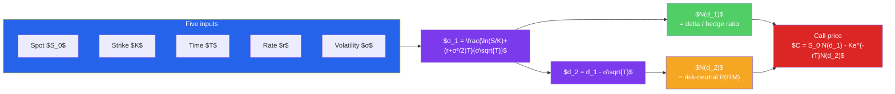

# 🧮 The Black-Scholes Model

> [!abstract] TL;DR
> The **Black-Scholes-Merton (BSM)** model gives a *closed-form* price for a European option under a set of idealized assumptions (lognormal prices, constant volatility, continuous frictionless trading). The call price is $C = S_0 N(d_1) - K e^{-rT} N(d_2)$, where $N(\cdot)$ is the standard-normal CDF. The magic is **risk-neutral valuation**: because you can continuously **delta-hedge** an option with the stock, its price doesn't depend on anyone's risk appetite — you discount the expected payoff at the risk-free rate. $N(d_2)$ is the risk-neutral probability the option finishes in-the-money; $N(d_1)$ is the hedge ratio (delta). Of the five inputs ($S, K, T, r, \sigma$), only **volatility** $\sigma$ is unobservable — so traders invert the formula to back out **implied volatility** from market prices.

## Intuition — analogy FIRST

Before 1973, pricing an option felt hopeless: it should depend on how *risky* the stock is and on whether investors are optimistic or fearful — subjective, unknowable things. Fischer Black, Myron Scholes, and Robert Merton found a stunning escape hatch. Suppose you sell a call and, at every instant, hold just enough shares to offset its price movements — a **delta hedge**. Then your combined position has *no* directional risk at all; it's momentarily riskless. And a riskless portfolio can only earn the risk-free rate, or arbitrage appears.

That single constraint — "a perfectly hedged option book must earn the risk-free rate" — is enough to pin down the option's price *exactly*, with no reference to expected returns or risk premia. It's as if you could price a fire-insurance policy purely from the physics of how fires spread, never asking how much people fear fire. The expected growth rate of the stock *vanishes* from the equation and is replaced by $r$. That's the **risk-neutral** trick, and it's the conceptual heart of modern derivatives.

---

## How It Works

## Key Concepts / Details

### The Assumptions

BSM is exact *only* in its idealized world. The core assumptions:

1. The stock price follows **geometric Brownian motion** — returns are normally distributed, so prices are **lognormal** (they can't go negative).
2. **Constant, known volatility** $\sigma$ and constant risk-free rate $r$.
3. **No arbitrage** and **continuous trading** — you can rebalance the hedge at every instant.
4. **No transaction costs or taxes**, and the asset is infinitely divisible.
5. **No dividends** over the option's life (the base model; extensions relax this).
6. The option is **European** (exercisable only at expiry).

Every real market violates several of these — which is precisely why the *pattern* of violations (the volatility smile) is so informative.

### The Black-Scholes-Merton Formula

For a European **call** and **put** on a non-dividend stock:

$$C = S_0\, N(d_1) - K e^{-rT} N(d_2)$$
$$P = K e^{-rT} N(-d_2) - S_0\, N(-d_1)$$

with

$$d_1 = \frac{\ln(S_0/K) + \left(r + \tfrac{1}{2}\sigma^2\right)T}{\sigma\sqrt{T}}, \qquad d_2 = d_1 - \sigma\sqrt{T}$$

where $N(\cdot)$ is the standard-normal cumulative distribution function. (The two formulas are consistent with **put-call parity**, $C - P = S_0 - Ke^{-rT}$.)

### The Intuition: N(d₁), N(d₂), and Risk-Neutral Valuation

The formula is really "*expected payoff, discounted at the risk-free rate*" written out:

- $K e^{-rT} N(d_2)$ — the present value of paying the strike, weighted by $N(d_2) = $ the **risk-neutral probability the option expires in-the-money**.
- $S_0 N(d_1)$ — the present value of receiving the stock *if* exercised. $N(d_1)$ is also the option's **delta**: the number of shares to hold to hedge one call.

So the price is (probability-weighted value of the stock you get) minus (probability-weighted cost of the strike you pay), both under the **risk-neutral measure** where every asset drifts at $r$. The stock's *actual* expected return never appears — that's the profound consequence of hedgeability.

**Worked example.** Price a 1-year ATM European call: $S_0 = \$100$, $K = \$100$, $r = 5\%$, $\sigma = 20\%$, $T = 1$.

$$d_1 = \frac{\ln(1) + (0.05 + 0.02)(1)}{0.20\sqrt{1}} = \frac{0.07}{0.20} = 0.35$$
$$d_2 = 0.35 - 0.20 = 0.15$$

From standard-normal tables, $N(0.35) \approx 0.6368$ and $N(0.15) \approx 0.5596$:

$$C = 100(0.6368) - 100\, e^{-0.05}(0.5596) = 63.68 - 95.12 \times 0.5596 = 63.68 - 53.23 = \boxed{\$10.45}$$

The call is worth about **\$10.45**. Its delta is $N(d_1) = 0.64$ — to hedge one call (100 shares), short roughly 64 shares.

### The Five Inputs — How Each Moves the Price

| Input | Symbol | Call price when input ↑ | Put price when input ↑ | Why |
|-------|--------|------------------------|------------------------|-----|
| Spot price | $S_0$ | **↑** | ↓ | Call gains from higher stock; put loses |
| Strike | $K$ | ↓ | **↑** | Higher strike is worse for a call buyer |
| Time to expiry | $T$ | ↑ | ↑ (usually) | More time = more chance to finish ITM |
| Risk-free rate | $r$ | ↑ | ↓ | Higher $r$ lowers $PV(K)$, helping calls |
| Volatility | $\sigma$ | **↑** | **↑** | More dispersion raises *both* — payoffs are one-sided |

The clean asymmetry to remember: **more volatility always raises option value** (calls *and* puts), because the capped-downside payoff means extra dispersion adds only upside.

### Implied Volatility

Four of the five inputs are directly observable; **volatility is not**. So traders run BSM *backwards*: given the option's market price, they solve for the $\sigma$ that reproduces it. That value is the **implied volatility (IV)** — the market's forward-looking estimate of how much the stock will move.

$$\text{Market price} = \text{BSM}(S, K, T, r, \sigma_{\text{implied}}) \;\Rightarrow\; \text{solve for } \sigma_{\text{implied}}$$

Because BSM's constant-volatility assumption is false, IV is *not* flat across strikes: plotting IV against strike reveals the **volatility smile / skew**. Equity index options typically show a downward skew — deep OTM puts trade at higher IV, reflecting crash fear the lognormal model omits. The **VIX index** is essentially the market's aggregate implied volatility on the S&P 500 — the famous "fear gauge."

---

## Real-World Notes

- **The 1997 Nobel Prize** in Economics went to Scholes and Merton (Black had died in 1995) for this framework — one of the few equations to spawn a multi-trillion-dollar industry almost overnight after the CBOE opened in 1973.
- **The volatility smile appeared after 1987.** Before the October 1987 crash, IV was roughly flat across strikes. Afterward, markets permanently priced in crash risk, bending the curve — a live reminder that BSM's constant-$\sigma$ assumption is a convenient fiction.
- **LTCM (1998).** Myron Scholes and Robert Merton were principals at Long-Term Capital Management, whose collapse showed that even the model's own architects could be undone by the fat tails and liquidity gaps the model assumes away.

---

## Common Pitfalls

- **Trusting the assumptions literally.** Prices aren't perfectly lognormal, volatility isn't constant, and you can't hedge continuously — BSM is a *benchmark*, not the truth.
- **Feeding in the wrong volatility.** Using historical (realized) vol when the market prices in a different (implied) vol will mis-price the option; IV is the market's view, not the past's.
- **Ignoring dividends.** The base formula assumes none; for dividend payers, use $S_0 e^{-qT}$ (Merton's continuous-dividend form) or subtract PV of discrete dividends.
- **Applying it to American options.** BSM prices *European* exercise; American options with early exercise (especially puts) need lattice or numerical methods.
- **Confusing $N(d_1)$ and $N(d_2)$.** $N(d_2)$ is the risk-neutral probability of finishing ITM; $N(d_1)$ is delta. They are not interchangeable.

---

## Related Concepts

- [[_MOC_Derivatives|↑ Section MOC]]
- [[Options_Basics]] — Provides the payoffs and intrinsic/time value that BSM prices
- [[The_Greeks]] — The partial derivatives of this very formula
- [[Forwards_and_Futures]] — Shares the same no-arbitrage, risk-neutral foundation
- [[Quantitative_Finance]] — Cross-vault: Itô calculus and the Black-Scholes PDE derivation
- [[Fixed_Income_Markets]] — Where the risk-free rate $r$ input is sourced

## Review Questions

1. Compute $d_1$ and $d_2$ for a European call with $S_0 = \$50$, $K = \$52$, $r = 4\%$, $\sigma = 30\%$, $T = 0.5$ years. Interpret $N(d_2)$ in words.
2. Explain why an increase in volatility raises the price of *both* a call and a put, whereas an increase in the spot price raises the call but lowers the put. Tie your answer to the shape of each payoff.
3. A trader observes a market call price *higher* than BSM predicts using 20% volatility. What does that imply about the option's implied volatility, and how would you extract it? Why might index puts show a higher implied volatility than calls (the skew)?

## Sources

- Black, F. & Scholes, M. (1973), "The Pricing of Options and Corporate Liabilities," *Journal of Political Economy*
- Merton, R. (1973), "Theory of Rational Option Pricing," *Bell Journal of Economics*
- John C. Hull, *Options, Futures, and Other Derivatives*, 11th edition, Ch. 15
- Paul Wilmott, *Paul Wilmott Introduces Quantitative Finance*, 2nd edition, Ch. 6–8

#finance #derivatives #options #black-scholes #implied-volatility
