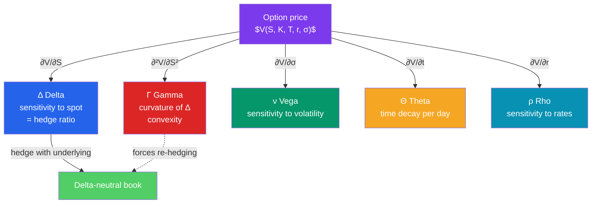

# 🔠 The Greeks

> [!abstract] TL;DR
> The **Greeks** are the partial derivatives of an option's price with respect to each input — a dashboard of risk sensitivities. **Delta** ($\Delta$) measures how much the price moves per \$1 change in the underlying (the hedge ratio). **Gamma** ($\Gamma$) is the rate of change of delta — the *convexity* that makes a static hedge drift. **Vega** ($\nu$) is sensitivity to volatility. **Theta** ($\Theta$) is time decay — how much value bleeds away each day. **Rho** ($\rho$) is sensitivity to interest rates. Traders build **delta-neutral** books by offsetting delta with the underlying, then manage the residual gamma, vega, and theta as the market moves.

## Intuition — analogy FIRST

Picture driving a car. The option's **price** is your position on the road. **Delta** is your *speed* — how fast the option's value changes as the stock moves. But speed isn't constant: **gamma** is your *acceleration*, telling you how fast the speed itself is changing. If you try to hold a fixed hedge (a fixed speed), gamma is the reason you keep drifting off course and must re-steer.

Meanwhile the clock is always running against a long option: **theta** is the fuel gauge draining even when you're parked — time value evaporates every single day. **Vega** is your sensitivity to road conditions (volatility): a bumpier road (higher vol) makes the option worth more. And **rho** is the gentle background tilt from interest rates, usually the least of your worries.

A professional options trader isn't betting on a single number; they're steering a multi-dimensional vehicle, watching all five gauges at once and trading the underlying, other options, and time to keep the whole book balanced.

---

## How It Works

## Key Concepts / Details

### The Five Greeks at a Glance

| Greek | Symbol | Measures | Definition | Long-call sign | Long-put sign |
|-------|--------|----------|------------|----------------|---------------|
| **Delta** | $\Delta$ | Price change per \$1 of spot | $\partial V / \partial S$ | 0 to +1 | −1 to 0 |
| **Gamma** | $\Gamma$ | Change in delta per \$1 of spot | $\partial^2 V / \partial S^2$ | + | + |
| **Vega** | $\nu$ | Price change per 1% of volatility | $\partial V / \partial \sigma$ | + | + |
| **Theta** | $\Theta$ | Value lost per day (time decay) | $\partial V / \partial t$ | − | − |
| **Rho** | $\rho$ | Price change per 1% of rates | $\partial V / \partial r$ | + | − |

(Vega isn't a real Greek letter, but the name stuck.) Note **gamma and vega are positive for all long options** — a buyer benefits from big moves and rising volatility; a seller has the opposite signs and lives in fear of them.

### Delta and Delta-Hedging

**Delta** is the hedge ratio: a call with $\Delta = 0.60$ behaves, for small moves, like 0.60 shares of stock. In BSM, a call's delta is exactly $N(d_1)$. To make a position immune to small moves in the underlying, hold offsetting stock so the *net* delta is zero — a **delta-neutral** hedge.

**Worked delta-hedge.** You **sell** 100 call contracts (each on 100 shares $\Rightarrow$ 10,000 options), delta $= 0.60$.

- Portfolio delta $= -0.60 \times 10{,}000 = -6{,}000$ (short calls are short delta).
- To neutralize, **buy 6,000 shares** ($+6{,}000$ delta). Net delta $= 0$.

Now a small stock move up is offset: the shares gain, the short calls lose, and the two cancel — *for small moves*.

### Gamma and Convexity

The catch is that delta itself changes as the stock moves — that curvature is **gamma**. Because the delta hedge is only valid *locally*, gamma forces you to re-hedge:

$$\Delta V \approx \Delta \cdot \Delta S + \tfrac{1}{2}\Gamma (\Delta S)^2$$

**Continuing the example.** With $\Gamma = 0.05$, suppose the stock rises \$1:
- New call delta $\approx 0.60 + 0.05 \times 1 = 0.65$.
- Your book delta drifts to $-0.65 \times 10{,}000 + 6{,}000 = -500$ — no longer neutral.
- You must **buy 500 more shares** to re-flatten.

A short-option book is **short gamma**: it must buy as prices rise and sell as they fall — chasing the market and losing money on realized volatility. A long-option book is **long gamma**: it re-hedges profitably (buy low, sell high). This is the fundamental tension between option sellers (collect theta, fear gamma) and buyers (pay theta, love gamma).

### Theta — Time Decay

**Theta** is the price paid for holding optionality: an option's time value bleeds away as expiry approaches, and it decays *fastest* in the final weeks. Theta is negative for long options — you lose money simply by the clock ticking.

**Worked example.** A long call has $\Theta = -0.05$ per day per share. On one contract (100 shares), you lose about $0.05 \times 100 = \$5$ per day, all else equal. Over a weekend (no trading, but time passes) you'd lose roughly \$15. Sellers of options *collect* this decay as their reward for bearing gamma and vega risk.

There's a deep link: **long gamma comes with negative theta**. You pay theta every day for the privilege of profitable gamma re-hedging — options are only worth buying if realized volatility exceeds the implied volatility baked into that theta.

### Vega and Rho

- **Vega** — how much the option gains per 1-percentage-point rise in implied volatility. Long options are long vega; a volatility spike (e.g. before earnings or during a crash) inflates every option's price. ATM, long-dated options have the most vega.
- **Rho** — sensitivity to the risk-free rate; positive for calls, negative for puts. Usually small for short-dated options but material for long-dated (e.g. LEAPS) and rate-sensitive products.

### Putting It Together — a Greek P&L Decomposition

A trader's daily P&L can be attributed to the Greeks:

$$\text{P\&L} \approx \underbrace{\Delta \cdot \Delta S}_{\text{direction}} + \underbrace{\tfrac{1}{2}\Gamma(\Delta S)^2}_{\text{gamma}} + \underbrace{\nu \cdot \Delta\sigma}_{\text{vol change}} + \underbrace{\Theta \cdot \Delta t}_{\text{decay}} + \underbrace{\rho \cdot \Delta r}_{\text{rates}}$$

A delta-hedged book zeroes the first term, leaving the trader exposed to (and betting on) the balance between gamma gains and theta cost as volatility realizes.

---

## Real-World Notes

- **Gamma squeezes.** When market-makers are heavily *short* calls (short gamma), a rising stock forces them to buy shares to re-hedge, which pushes the price higher, forcing more buying — the feedback loop behind the 2021 GameStop and other meme-stock spikes.
- **Volmageddon (February 2018).** Short-volatility products (short vega/gamma) blew up when the VIX doubled in a day; sellers of cheap volatility discovered exactly what "short gamma" costs when the move finally comes.
- **Dispersion and dealer positioning.** Desks publish estimates of aggregate dealer gamma; when dealers are *long gamma*, their re-hedging *dampens* moves (mean-reversion), and when *short*, it *amplifies* them — a widely watched market-structure signal.

---

## Common Pitfalls

- **Hedging delta once and walking away.** Gamma guarantees the hedge drifts; a delta-neutral book must be *continuously* re-balanced, and that re-hedging is where the real P&L lives.
- **Selling options for "easy" theta income.** Collecting theta means being short gamma and vega — a steady trickle of gains punctuated by rare, catastrophic losses when volatility spikes.
- **Forgetting Greeks are local and change.** They're first- and second-order approximations valid for *small* moves; a 10% gap invalidates the linearization.
- **Confusing implied and realized volatility for vega P&L.** Vega captures changes in *implied* vol; gamma/theta capture *realized* movement. They are different bets.
- **Ignoring second-order Greeks.** Vanna, volga, and charm matter for large, volatile books — delta/gamma/vega/theta/rho are necessary but not always sufficient.

---

## Related Concepts

- [[_MOC_Derivatives|↑ Section MOC]]
- [[The_Black_Scholes_Model]] — The Greeks are the partial derivatives of the BSM price
- [[Options_Basics]] — Payoffs and time value the Greeks measure the sensitivity of
- [[Swaps_and_Hedging]] — Dynamic hedging scales up to portfolio-level risk management
- [[Forwards_and_Futures]] — The delta-hedge instrument (underlying/futures) for options books
- [[Quantitative_Finance]] — Cross-vault: the stochastic calculus behind the derivatives

## Review Questions

1. You are short 50 put contracts (5,000 options) with delta $-0.40$. What is your net delta, and how many shares must you buy or sell to become delta-neutral?
2. An option has $\Delta = 0.55$ and $\Gamma = 0.08$. If the underlying jumps \$2, estimate the new delta and the approximate change in the option's value per share using the delta-plus-gamma expansion.
3. Explain why being "long gamma" necessarily means being "short theta." How does a long-gamma trader actually earn money, and what determines whether that trade is profitable over the option's life?

## Sources

- John C. Hull, *Options, Futures, and Other Derivatives*, 11th edition, Ch. 19
- Sheldon Natenberg, *Option Volatility and Pricing*, 2nd edition, Ch. 6–9
- Espen Gaarder Haug, *The Complete Guide to Option Pricing Formulas*, 2nd edition
- Euan Sinclair, *Option Trading: Pricing and Volatility Strategies and Techniques*

#finance #derivatives #options #greeks #delta-hedging
