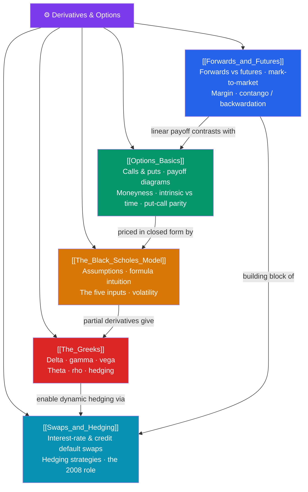

# ⚙️ Derivatives & Options — Map of Content

> [!abstract] What This Section Covers
> A derivative is a contract whose value *derives* from an underlying asset — a stock, bond, currency, commodity, or rate. This section builds the toolkit of modern risk management and speculation. **Forwards and futures** lock in a future price; futures are exchange-traded, marked-to-market daily, and margined, and they can trade in contango or backwardation. **Options** grant the right (not obligation) to buy (call) or sell (put) at a strike — with asymmetric payoff diagrams, intrinsic vs time value, moneyness, and the no-arbitrage anchor of put-call parity (C − P = S − Ke^(−rT)). The **Black-Scholes model** gives a closed-form price for European options under its famous assumptions (lognormal prices, constant volatility). **The Greeks** (delta, gamma, vega, theta, rho) measure sensitivity to each input and drive dynamic hedging. Finally, **swaps and hedging** cover interest-rate and credit default swaps — instruments central to the 2008 financial crisis. This is quantitative finance made practical.

## Concept Map

## Learning Path
1. [[Forwards_and_Futures]] — Linear derivatives: forwards vs futures, mark-to-market, margin, and contango/backwardation.
2. [[Options_Basics]] — Calls and puts, payoff diagrams, moneyness, intrinsic vs time value, and put-call parity.
3. [[The_Black_Scholes_Model]] — The Nobel-winning pricing formula: assumptions, intuition, and the five inputs.
4. [[The_Greeks]] — Risk sensitivities: delta, gamma, vega, theta, rho, and delta-hedging.
5. [[Swaps_and_Hedging]] — Interest-rate swaps, credit default swaps, hedging strategies, and the 2008 role.

## All Notes at a Glance

| Note | Difficulty | What You'll Learn |
|------|------------|-------------------|
| [[Forwards_and_Futures]] | Intermediate | Forwards vs futures, daily settlement, initial/maintenance margin, contango/backwardation |
| [[Options_Basics]] | Intermediate | Call/put payoffs, long/short, moneyness, intrinsic vs time value, put-call parity |
| [[The_Black_Scholes_Model]] | Advanced | BSM assumptions, d1/d2 intuition, N(d), the five inputs, implied volatility |
| [[The_Greeks]] | Advanced | Delta, gamma, vega, theta, rho; delta-neutral and gamma hedging |
| [[Swaps_and_Hedging]] | Advanced | Interest-rate swaps, CDS mechanics, hedging vs speculation, 2008 crisis role |

## Key Questions This Section Answers
- How do futures differ from forwards, and why does daily mark-to-market change the risk?
- What is put-call parity, and why must it hold to prevent arbitrage?
- What are the assumptions behind Black-Scholes, and what does each input do to an option's price?
- How do the Greeks let a trader hedge a portfolio dynamically?
- How did credit default swaps amplify the 2008 financial crisis?

## Related Sections
- [[_MOC_Finance_Master|↑ Finance Master MOC]]
- [[_MOC_Fixed_Income|← Fixed Income & Bonds]] — The rates and credit these instruments hedge
- [[_MOC_FinTech|→ FinTech & Payments]] — How technology is reshaping derivatives markets
- [[Quantitative_Finance]] — Cross-vault: the stochastic calculus behind option pricing

#MOC #Finance #Derivatives
