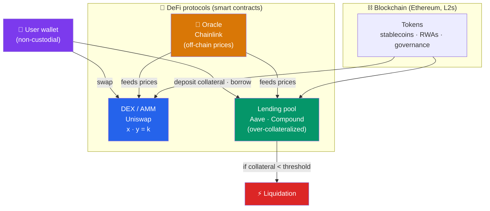

# ⛓️ Blockchain and DeFi in Finance

> [!abstract] TL;DR
> Blockchain lets value move like data — peer-to-peer, programmable, without a central operator. **Stablecoins** (USDC, USDT) are tokens pegged 1:1 to fiat that act as the settlement money of crypto and a fast cross-border rail. **Decentralized finance (DeFi)** rebuilds financial services as open smart contracts: over-collateralized **lending** (Aave), **decentralized exchanges (DEXs)** using **automated market makers (AMMs)** (Uniswap), and yield protocols — all non-custodial and composable ("**money legos**"). **Tokenization** puts real-world assets (Treasuries, funds, real estate) on-chain. The promise is transparency, speed, and open access; the risks are severe — smart-contract exploits, de-pegs, oracle manipulation, and unresolved **regulatory** questions about who is liable when there's no company.

## Intuition — analogy FIRST

Traditional finance runs on **ledgers held by trusted middlemen**. Your bank keeps the master record of your balance; you trust it not to lie or lose it. Every institution keeps its own private ledger, and reconciling them across banks and borders is what makes payments slow and expensive.

A **blockchain** is a *shared* ledger that everyone can read and no single party controls — updated by consensus, secured by cryptography. Once value lives on this shared ledger as **tokens**, you can attach *programs* to money: "release these funds only if X happens," enforced automatically by a **smart contract** with no bank in the loop.

**DeFi** is what you get when you rebuild lending, trading, and exchanges as such programs. Instead of a bank matching lenders and borrowers, an open contract does it, and its rules are public code anyone can inspect or build on top of — like **Lego bricks** you snap together. The catch: if the code has a bug, there's no manager to call and often no one to sue. You've traded *trust in an institution* for *trust in code and cryptography* — which is liberating when the code is sound and catastrophic when it isn't.

---

## How It Works

## Key Concepts / Details

### Stablecoins — crypto's settlement money

A **stablecoin** is a token designed to hold a stable value, almost always **pegged 1:1 to the US dollar**. They are the "cash leg" of crypto markets and, increasingly, a genuine payments rail. Types by backing mechanism:

| Type | Mechanism | Examples | Risk |
|------|-----------|----------|------|
| **Fiat-collateralized** | 1 token = $1 in reserves (cash + T-bills) | **USDC** (Circle), **USDT** (Tether) | Reserve quality/transparency; issuer solvency |
| **Crypto-collateralized** | Over-collateralized with crypto | **DAI** (MakerDAO) | Collateral crash; liquidation cascades |
| **Algorithmic** | Balanced by code/incentives, little/no backing | **UST (Terra)** — collapsed | **Death spiral** — proven fragile |

Stablecoins settle **24/7, near-instantly, globally**, which is why they've become a serious cross-border alternative to SWIFT-based transfers (see [[Payment_Systems_and_Rails]]) — a dollar can reach a wallet in Argentina in seconds for cents. The 2023 **USDC de-peg** (briefly to ~$0.88 when Circle disclosed reserves stuck in the failing Silicon Valley Bank) showed that even "fully backed" stablecoins carry **reserve counterparty risk**. Regulation is arriving fast: the EU's **MiCA** and the U.S. **GENIUS Act** frameworks aim to mandate reserves, audits, and redemption rights.

### DeFi — lending, DEXs, and AMMs

**Decentralized finance** rebuilds core financial primitives as permissionless smart contracts. Two pillars:

**1. On-chain lending (Aave, Compound).** Users deposit crypto into a pool to earn yield; borrowers take loans against collateral. Because there's no identity or credit check, loans are **over-collateralized** — you might post $150 of ETH to borrow $100 of stablecoin. If your collateral value falls below a threshold, the contract **liquidates** it automatically. **Flash loans** — uncollateralized loans that must be borrowed and repaid within a *single transaction* — are a uniquely on-chain primitive (and a common attack vector).

**2. Decentralized exchanges via AMMs (Uniswap).** Instead of an order book matching buyers and sellers, a **DEX** uses an **automated market maker**: liquidity providers deposit pairs into a pool, and a formula sets the price. The classic **constant-product** formula is:

$$x \cdot y = k$$

where $x$ and $y$ are the pool's two token reserves and $k$ is held constant. A trade that removes token $y$ must add enough token $x$ to keep $k$ constant, so price moves along the curve — larger trades get worse prices (**slippage**). Liquidity providers earn fees but face **impermanent loss** when the pool's price diverges from the market.

DeFi's signature property is **composability** — protocols call each other freely, so you can supply collateral to Aave, borrow a stablecoin, and swap it on Uniswap in one atomic flow. This "**money legos**" quality accelerates innovation but also chains risk: a failure in one protocol can cascade through everything built on it. Everything runs **non-custodially** — you hold your own keys; "not your keys, not your coins."

### Oracles — the bridge to reality

Smart contracts can't natively see off-chain data (like the ETH/USD price). **Oracles** (e.g., **Chainlink**) feed external data on-chain. This is a critical vulnerability: if an attacker manipulates the price an oracle reports (often via a flash loan on a thin market), they can trick a lending protocol into mispricing collateral and drain it — the mechanism behind many of DeFi's largest hacks.

### Tokenization of real-world assets (RWAs)

**Tokenization** represents ownership of a real asset — a Treasury bond, a money-market fund, real estate, private credit — as an on-chain token. Benefits: **fractional ownership**, near-instant settlement (**atomic delivery-versus-payment**, no T+2 lag), 24/7 markets, and programmability. This is where institutional finance is actually engaging:

- **BlackRock's BUIDL** — a tokenized U.S. Treasury/money-market fund on Ethereum, reaching billions in assets.
- **Franklin Templeton's** tokenized government money fund (FOBXX / BENJI).
- **JPMorgan's** Onyx / Kinexys for tokenized collateral and intraday repo.

Tokenized Treasuries have become a favored on-chain "safe yield," blurring the line between DeFi and regulated TradFi.

### The promise vs. the risks

| Promise | Risk / open question |
|---------|----------------------|
| Transparent, auditable, 24/7 settlement | **Smart-contract exploits** — code bugs, reentrancy; billions lost (Ronin ~$625M, Poly ~$611M) |
| Open access, no gatekeepers | **De-pegs & death spirals** (Terra/UST wiped ~$40B) |
| Composable "money legos" | **Cascading/contagion** risk across composable protocols |
| Disintermediation, lower cost | **Oracle manipulation**, MEV, front-running |
| Programmable, self-custodial | **Regulatory ambiguity** — who is liable with no issuer? Securities law? AML on anonymous wallets? |

The core unresolved tension: DeFi's value comes from decentralization, but regulators (and consumers) want an accountable party. Reconciling **permissionless code** with **KYC/AML and investor protection** (see [[Regtech_and_Financial_Data]]) is the defining challenge.

---

## Real-World Notes

- **The Terra/UST collapse (May 2022)**: The *algorithmic* stablecoin UST held its $1 peg via an arbitrage loop with its sister token LUNA. When confidence cracked, the loop ran in reverse — a **death spiral** — vaporizing ~$40B in days, cascading into hedge funds (Three Arrows) and lenders (Celsius, Voyager). It's the canonical proof that "stable" backed only by incentives is not stable.
- **BlackRock BUIDL — TradFi meets tokenization**: When the world's largest asset manager launched a tokenized money-market fund on a public blockchain (2024), it signaled that **tokenization of real-world assets** had moved from theory to institutional product — using DeFi rails for the settlement layer of very ordinary Treasuries.
- **The USDC / SVB de-peg (March 2023)**: Circle disclosed ~$3.3B of USDC reserves were stuck at the collapsing Silicon Valley Bank; USDC briefly traded to ~$0.88 before the peg restored once deposits were guaranteed. A "fully reserved" stablecoin still inherited the counterparty risk of its *banking partner* — a pointed reminder that on-chain money rests on off-chain plumbing.

---

## Common Pitfalls

- **Treating all stablecoins as equivalent.** Fiat-backed (USDC), crypto-backed (DAI), and algorithmic (UST) have radically different risk profiles. Algorithmic "stablecoins" have repeatedly failed.
- **Thinking "fully backed" means risk-free.** Reserves can sit in a failing bank (USDC/SVB) or in opaque assets (historic Tether scrutiny). Reserve *quality and transparency* matter.
- **Ignoring over-collateralization.** DeFi lending isn't credit in the [[Lending_and_Credit_Technology]] sense — with no identity, it requires posting *more* collateral than you borrow, which limits it to those who already hold crypto.
- **Underestimating oracle and composability risk.** Most large DeFi hacks aren't "breaking the blockchain" — they're manipulating an oracle or exploiting one contract that others depend on.
- **Assuming decentralization equals no regulation.** Regulators increasingly hold front-ends, developers, and token issuers accountable; "it's just code" is not a reliable legal shield.

## Related Concepts

- [[_MOC_FinTech|↑ Section MOC]]
- [[Payment_Systems_and_Rails]] — Stablecoins compete as a cross-border settlement rail
- [[Digital_Banking_and_Neobanks]] — A non-custodial, disintermediated vision of "banking"
- [[Lending_and_Credit_Technology]] — Contrast: DeFi lending is over-collateralized, identity-free
- [[Regtech_and_Financial_Data]] — KYC/AML on pseudonymous chains is a core tension
- [[_MOC_Blockchain_Master]] — Cross-vault: the distributed-ledger, consensus, and smart-contract foundations

## Review Questions

1. Compare the three stablecoin backing models (fiat-collateralized, crypto-collateralized, algorithmic) on how they hold their peg and their primary failure mode. Use USDC, DAI, and UST as examples, and explain why UST's design was inherently fragile.
2. A Uniswap ETH/USDC pool holds reserves such that $x \cdot y = k$. Explain how the constant-product formula sets the price, why large trades incur slippage, and what "impermanent loss" means for a liquidity provider when ETH's price rises sharply.
3. DeFi advocates say it is more transparent and open than traditional finance. Identify three distinct categories of risk (technical, economic, regulatory) that this transparency does *not* eliminate, giving a concrete example of each from recent history.

## Sources

- BIS, "The financial stability risks of decentralised finance" and Annual Economic Report (DeFi chapter)
- Circle, "USDC Transparency & Reserves" reports; MakerDAO and Aave protocol documentation
- Uniswap v2/v3 whitepapers (constant-product and concentrated-liquidity AMMs)
- Chainalysis, "Crypto Crime Report" — DeFi hacks and stablecoin usage data

#finance #fintech #blockchain #defi #stablecoins #tokenization
