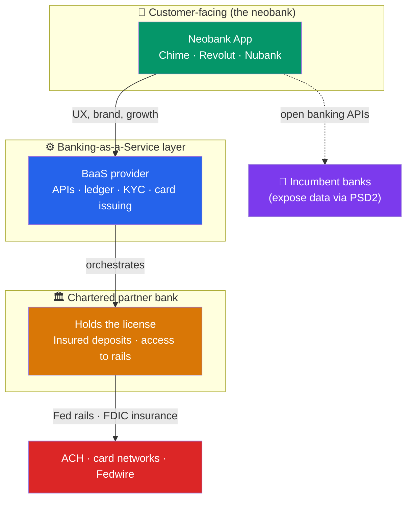

# 🏦 Digital Banking and Neobanks

> [!abstract] TL;DR
> A **neobank** is a bank experience delivered entirely through software — no branches, mobile-first, cheaper to run. Most neobanks (Chime, Revolut, Nubank) are *not* licensed banks; they partner with a chartered bank and rent its license and rails through **banking-as-a-service (BaaS)**. **Open banking** (regulation like PSD2) forces incumbent banks to expose customer data and payment initiation via **APIs**, letting third parties build on top. Together these forces **unbundle** the bank into modular pieces — payments, deposits, lending, cards — that anyone can recombine, then **rebundle** into new all-in-one "super apps." The bank becomes a set of APIs.

## Intuition — analogy FIRST

For a century a bank was a *building*: you went to a branch, a teller knew your name, and everything — checking, savings, loans, cards — came from that one institution. It was **vertically integrated**, like a department store that made its own clothes.

Software broke this apart. Once your account lives on a phone, the branch is worthless overhead. And once a bank must expose its functions as **APIs**, you no longer need a full bank to *feel* like a bank to a customer — you need an app, a good UX, and a partner bank quietly holding the deposits behind the scenes.

Think of it like AWS for finance. A startup doesn't build data centers; it rents compute from Amazon. A neobank doesn't get a banking charter (which takes years and huge capital); it rents "regulated banking capacity" from a chartered partner via **BaaS**. The startup owns the customer and the experience; the partner owns the license and the risk. The bank has become **cloud infrastructure**.

---

## How It Works

## Key Concepts / Details

### Neobanks — the software-first bank

A **neobank** (or "challenger bank") delivers banking through an app with no physical branches, typically undercutting incumbents on fees. Business models differ sharply by market:

| Neobank | Region | Model & revenue |
|---------|--------|-----------------|
| **Chime** | USA | No-fee checking; earns mostly **interchange** on its debit card + early-payday hook |
| **Revolut** | UK/EU | Multi-currency, FX, subscriptions, crypto, stock trading — a "super app" |
| **Nubank** | Brazil/LatAm | Started with a no-fee credit card; now full bank, 100M+ customers |
| **Monzo / Starling** | UK | Fully *licensed* banks (not BaaS) with real charters |
| **N26** | EU | App-first bank with a German banking license |

Two structural facts matter:

- **Most U.S. neobanks are not banks.** Chime is a fintech; deposits are held by partner banks (e.g., The Bancorp Bank, Stride Bank) and FDIC insurance "passes through" the partner. The neobank owns the interface and the customer relationship.
- **Interchange is the engine.** Because U.S. debit interchange is *not* capped for small banks (the Durbin Amendment exempts banks under $10B in assets), neobanks deliberately partner with small banks to earn ~1%+ on debit swipes — funding the "free" account.

### Banking-as-a-Service (BaaS) and embedded finance

**BaaS** is the middleware that lets any company offer banking without a charter. A BaaS provider (or the partner bank's platform) exposes APIs for opening accounts, issuing cards, running KYC, moving money, and keeping a ledger. Providers include **Unit, Treasury Prime, Synapse (which collapsed in 2024), Marqeta** (card issuing), and **Stripe Treasury**.

This enables **embedded finance** — banking features stitched invisibly into non-bank products:

- **Shopify Balance / Capital** — a merchant's bank account and loans inside their store dashboard.
- **Uber** — an instant-pay debit card for drivers.
- **Apple Card / Apple Pay Later** — Apple's brand on Goldman Sachs' (former) balance sheet.

The strategic idea: **"every company will be a fintech company"** — software firms with distribution add financial products because the marginal cost of embedding an account is now an API call. The regulated bank recedes to the background as a utility.

### Open banking and APIs

**Open banking** is the regulatory mandate that customers *own* their financial data and can direct banks to share it (or initiate payments) through secure APIs — breaking incumbents' data monopoly.

- **PSD2** (EU, 2018) mandates **AISP** (Account Information Service Provider — read data) and **PISP** (Payment Initiation Service Provider — push a payment directly from the bank, bypassing cards).
- The **UK Open Banking** standard operationalized this with common APIs across the nine largest banks.
- In the U.S. there's no equivalent mandate historically; aggregation grew via screen-scraping and firms like **Plaid** — though the **CFPB's Section 1033 rule** (finalized 2024) now moves the U.S. toward mandated open banking.

Open banking is the technical substrate for account aggregation, "connect your bank" flows, and A2A payments (see [[Regtech_and_Financial_Data]] for the data/aggregation angle and [[Payment_Systems_and_Rails]] for A2A rails).

### Unbundling and rebundling

The dominant narrative of fintech:

1. **Unbundling** — startups peel off *one* profitable product the bank did poorly and do it better: Wealthfront (investing), SoFi (student loans), Venmo (P2P), Klarna (checkout credit). The bank's "everything under one roof" advantage erodes.
2. **Rebundling** — successful single-product fintechs then add more products to raise lifetime value and switching costs: Revolut and SoFi now offer accounts, cards, loans, investing, crypto — becoming *new* full-stack banks (**super apps**). Nubank did the same in LatAm.

The cycle rewards whoever owns the customer relationship and the data, while regulated balance sheets increasingly commoditize into rentable infrastructure.

---

## Real-World Notes

- **Nubank's scale from zero branches**: Founded 2013 in Brazil, Nubank reached 100M+ customers across Brazil, Mexico, and Colombia — one of the world's largest digital banks — by attacking a market of high fees and low competition with a purple no-fee credit card, then rebundling into full banking. It IPO'd in 2021 at a valuation exceeding many century-old incumbents.
- **The Synapse collapse (2024)**: The BaaS middleware provider Synapse failed, and because the *ledger* reconciling which end-customer owned which dollars sat with the fintech intermediary — not cleanly at the partner bank — **~$85M in customer funds were frozen or unaccounted for**. It exposed the core risk of BaaS: FDIC insurance protects against *bank* failure, not against a middleware firm's broken bookkeeping.
- **Goldman's Marcus retreat**: Goldman Sachs built the digital consumer bank Marcus and the Apple Card, then largely retreated after billions in losses — showing that even a great charter and brand can't guarantee success in software-first consumer banking, where UX and unit economics rule.

---

## Common Pitfalls

- **Calling every neobank a "bank."** Most (Chime, many U.S. players) are fintech front-ends on a partner bank's charter. The distinction determines who holds deposits, who's liable, and how FDIC coverage actually flows.
- **Assuming "FDIC insured" means fully safe.** Pass-through insurance covers the *partner bank* failing — not a BaaS middleware collapse or a broken ledger, as Synapse showed.
- **Ignoring the interchange dependency.** Many "free" neobanks are one regulatory change (e.g., extending the Durbin cap) away from a broken business model.
- **Confusing open banking with open finance.** PSD2 covers payment accounts; broader "open finance" (investments, pensions, insurance) is a larger, still-emerging mandate.
- **Overrating unbundling as permanent.** The market repeatedly rebundles — single-product fintechs that don't expand often get squeezed on economics and churn.

---

## Related Concepts

- [[_MOC_FinTech|↑ Section MOC]]
- [[Payment_Systems_and_Rails]] — Neobanks depend on rails they don't own
- [[Lending_and_Credit_Technology]] — Rebundled neobanks add credit products
- [[Regtech_and_Financial_Data]] — Open banking APIs and Plaid power aggregation
- [[Blockchain_and_DeFi_in_Finance]] — An alternative, non-custodial vision of "banking"
- [[_MOC_System_Design_Master|Cross-vault: API and platform design]] — The API-first architecture behind BaaS

## Review Questions

1. Explain the difference between a licensed neobank (e.g., Monzo) and a BaaS-based neobank (e.g., Chime). Who holds the deposits in each case, and what does that imply for how FDIC/deposit protection reaches the end customer?
2. A U.S. neobank offers a "free" checking account with no monthly fee. Describe the primary revenue mechanism that funds this, and explain why the neobank deliberately partners with a *small* bank rather than a large one.
3. Describe the unbundling/rebundling cycle using two real companies as examples. Why does rebundling tend to happen even after successful unbundling, and who captures the most value in the end state?

## Sources

- CFPB, "Required Rulemaking on Personal Financial Data Rights" (Section 1033), 2024
- European Banking Authority, PSD2 / Revised Payment Services Directive guidelines
- Nubank and Revolut annual reports / investor disclosures
- a16z, "Every Company Will Be a Fintech Company" (Angela Strange)

#finance #fintech #neobank #banking-as-a-service #open-banking #embedded-finance
