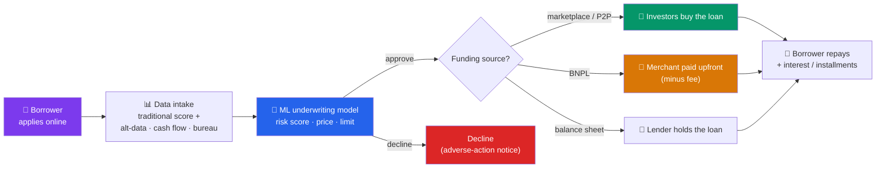

# 💰 Lending and Credit Technology

> [!abstract] TL;DR
> Credit technology reinvents *who gets a loan, how fast, and on what data*. **Marketplace / P2P lending** (LendingClub, Prosper) matches borrowers to investors online, unbundling the bank's balance sheet. **Buy-now-pay-later (BNPL)** (Klarna, Affirm, Afterpay) splits a purchase into installments at checkout, monetizing merchants and consumers. **Alternative credit scoring** and **ML underwriting** use non-traditional data — cash flow, telecom, behavioral signals — to extend credit to thin-file borrowers. The upside is speed and inclusion; the risks are real: **fair-lending** violations, **model bias** in opaque algorithms, and heavy **credit-cycle exposure** when a downturn hits under-priced risk.

## Intuition — analogy FIRST

Traditional lending is like a bouncer with one rulebook: a **FICO score**. Above 700 you're in; below 620 you're turned away, no matter your story. The rulebook is simple and stable — but it's blind to anyone without a long borrowing history (the "thin file"): new immigrants, young adults, the cash economy.

Credit tech changes the bouncer in three ways. First, it lets *the crowd* fund the loan instead of the bank's own vault — that's **marketplace lending**. Second, it moves the lending decision to the exact moment of desire, at checkout, in one tap — that's **BNPL**. Third, it swaps the single rulebook for a machine-learning model reading *thousands* of signals — how you manage cash flow, whether you pay rent on time, even how you fill out the application.

The promise: catch the creditworthy people the old rulebook missed. The peril: a model reading thousands of signals can quietly re-encode discrimination, and a lender that grows fast in good times has priced in a recession that hasn't arrived yet. Credit always looks brilliant — until the cycle turns.

---

## How It Works

## Key Concepts / Details

### Marketplace / P2P lending

**Peer-to-peer (P2P) lending** platforms originate loans online and sell them to investors rather than holding them on a bank balance sheet — an **originate-to-distribute** model. The platform earns **origination and servicing fees**; the investor bears the credit risk.

- **LendingClub** and **Prosper** pioneered U.S. consumer P2P (personal loans, debt consolidation). Over time the "peer" funding gave way to institutional buyers (hedge funds, banks) — LendingClub eventually *bought a bank* (Radius) to fund loans with cheaper deposits, a telling rebundling.
- **Funding Circle** did the same for small-business loans; **SoFi** for student-loan refinancing.

The structural insight: separating **origination** (customer acquisition + underwriting) from **funding** (whose money is at risk) lets each be optimized independently — but it also means the originator may not "eat its own cooking," weakening incentives to underwrite carefully.

### Buy-Now-Pay-Later (BNPL)

**BNPL** splits a purchase into interest-free installments (classically "**pay-in-4**": 25% now, three more every two weeks). It's a point-of-sale product embedded at checkout.

| Provider | Angle |
|----------|-------|
| **Klarna** | Broad checkout financing, shopping app, Europe-led |
| **Affirm** | Longer-term, often interest-bearing installments; transparent APR |
| **Afterpay** | Pure pay-in-4, acquired by Block (Square) |
| **PayPal** | "Pay in 4" bundled into its wallet |

**Economics — who pays?**

- The **merchant** pays a fee (~2–8%, higher than card interchange) because BNPL demonstrably lifts conversion and average order value.
- The **consumer** typically pays no interest on pay-in-4 — the merchant fee funds it — but **late fees** and longer interest-bearing plans add revenue.

BNPL grew explosively because it's frictionless credit hidden inside a purchase. Regulators worry it encourages overextension and sits *outside* traditional credit reporting — so a consumer can "loan-stack" across five BNPL apps invisibly. The CFPB moved to treat pay-in-4 BNPL more like credit cards (dispute rights, disclosures).

### Alternative data and ML underwriting

Traditional scoring (**FICO**) leans on bureau data: payment history, utilization, length of history. It fails the **~1.4 billion unbanked/thin-file** worldwide and ~45M "credit invisible" Americans. **Alternative credit scoring** adds:

- **Cash-flow underwriting** — actual bank-transaction inflows/outflows (via Plaid-style aggregation), often more predictive than a score.
- **Telecom & utility** payment records, rent payments.
- **Behavioral / device signals** — used heavily by emerging-market lenders (e.g., Tala, Branch) for smartphone microloans.

**Machine-learning underwriting** replaces linear scorecards with gradient-boosted trees or neural nets that ingest hundreds of features to predict default probability, set the price (APR), and the limit. Done well, it approves more good borrowers at each risk level (Upstart claims this expansion vs. FICO-only models). Done badly, it becomes an opaque box that's hard to explain — colliding directly with the law.

### The risks

| Risk | What goes wrong |
|------|-----------------|
| **Fair lending** | ECOA / Fair Housing Act ban discrimination by race, sex, age, etc.; a model can violate this via **disparate impact** even without using protected variables |
| **Model bias / proxies** | ZIP code, shopping patterns, or education can act as **proxies** for race — re-encoding redlining. Models must be tested for disparate impact |
| **Explainability** | Lenders must send **adverse-action notices** stating *why* an applicant was declined — hard with a black-box model; drives demand for explainable AI |
| **Credit-cycle exposure** | Models trained only on benign years under-price recession risk; fast growth = a large book of untested loans when unemployment spikes |
| **Loan stacking / thin regulation** | Especially in BNPL, invisible parallel borrowing inflates true leverage |

Fairness and explainability aren't optional niceties — they're legal requirements (ECOA, Reg B) that constrain what models lenders can deploy.

---

## Real-World Notes

- **LendingClub's rebundling**: Born as the flagship "P2P disruptor" that would route around banks, LendingClub found that *deposits are the cheapest funding*. In 2021 it acquired Radius Bank to become a chartered bank itself — a vivid case of a disruptor rebundling back into the thing it set out to replace.
- **Upstart in the 2022–23 rate shock**: Upstart's ML models expanded approvals impressively in the low-rate boom, but as rates rose and funding markets seized, it struggled to sell loans to investors and had to hold more on its own balance sheet — a live demonstration of **credit-cycle and funding-model exposure** in ML lending.
- **BNPL and the "phantom debt" concern**: Because most pay-in-4 BNPL wasn't reported to bureaus, regulators and economists warned of invisible household leverage — a consumer could be current on their credit report while juggling installment plans across Klarna, Afterpay, and Affirm simultaneously.

---

## Common Pitfalls

- **Believing "we don't use race, so we can't discriminate."** Fair-lending law targets **disparate impact**; a model using proxies (ZIP, device, spending) can discriminate without any protected variable. Models must be explicitly tested and monitored.
- **Confusing origination with risk-bearing.** In marketplace lending the originator may hold *none* of the risk — check who actually funds the loan before judging underwriting incentives.
- **Reading BNPL as "free."** Someone always pays: merchants via fees, consumers via late fees and interest on longer plans. And it's real credit, increasingly regulated as such.
- **Extrapolating benign-cycle performance.** A model that's never seen a recession will look flawless right up until it doesn't. Growth in good times can mask mispriced risk.
- **Ignoring the adverse-action requirement.** A black-box model that can't explain a denial isn't just bad UX — it may be illegal under ECOA/Reg B.

---

## Related Concepts

- [[_MOC_FinTech|↑ Section MOC]]
- [[Payment_Systems_and_Rails]] — BNPL sits at the point-of-sale, atop card and A2A rails
- [[Digital_Banking_and_Neobanks]] — Rebundled neobanks add lending to raise LTV
- [[Regtech_and_Financial_Data]] — Alternative data comes from aggregation (Plaid); fairness needs monitoring
- [[Blockchain_and_DeFi_in_Finance]] — DeFi offers over-collateralized, code-based lending as a contrast
- [[_MOC_AI_ML_Master|Cross-vault: model bias, fairness, and explainability]] — The ML techniques behind underwriting

## Review Questions

1. A fintech lender claims its ML model is fair because it never uses race, gender, or age as inputs. Explain, using the concept of disparate impact and proxy variables, why this claim does not by itself establish compliance with fair-lending law. What should the lender do instead?
2. Compare the economics of BNPL "pay-in-4" for the three parties (merchant, consumer, provider). Who pays, who benefits, and why do merchants accept fees higher than card interchange?
3. An ML-driven lender shows exceptional approval and low default rates after three years of operation in a strong economy. Identify the key risk this track record may hide and explain how the funding model (balance-sheet vs. marketplace) affects the lender's vulnerability when the credit cycle turns.

## Sources

- CFPB, "Buy Now, Pay Later: Market trends and consumer impacts" (2022) and interpretive rule (2024)
- Federal Reserve / FDIC guidance on model risk management (SR 11-7) and fair lending (ECOA, Reg B)
- LendingClub and Upstart annual reports / SEC filings
- FinRegLab, "The Use of Cash-Flow Data in Underwriting Credit" (empirical study)

#finance #fintech #lending #bnpl #credit-scoring #machine-learning
