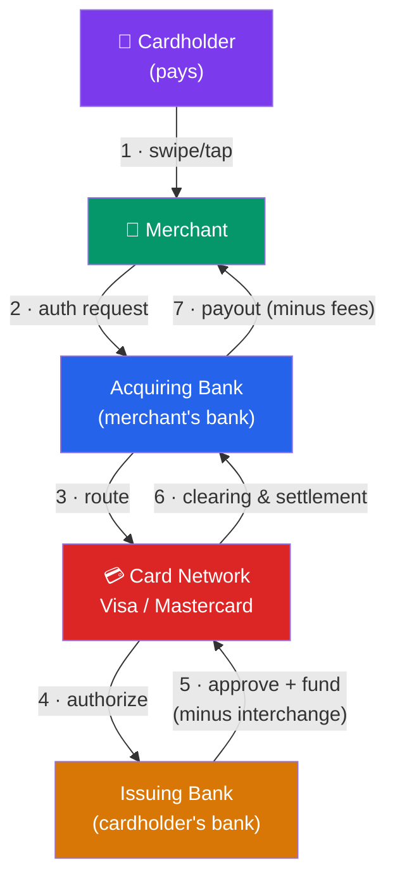

# 💳 Payment Systems and Rails

> [!abstract] TL;DR
> A **payment rail** is the infrastructure that moves money between parties. Different rails trade off **speed, cost, reach, and finality**: **card networks** (Visa/Mastercard) are fast at the point of sale but expensive and reversible; **ACH** is cheap but batch-settled over 1–3 days; **wire/RTGS** (Fedwire) settles high-value payments instantly with finality; **SWIFT** is a messaging layer that coordinates cross-border transfers; and **real-time payment** rails (FedNow, UPI, Pix) settle small-value payments in seconds, 24/7. Understanding who touches the money — the **four-party model** — explains where fees, delays, and fraud risk live.

## Intuition — analogy FIRST

Think of moving money like shipping a package. You have several couriers, and you pick one based on what matters.

Need it there *this second* and you'll pay for it? That's a **wire** — expensive, instant, irreversible, used for house closings and settling markets. Sending a routine, predictable payment like payroll where a day or two is fine? Use the cheap bulk courier — **ACH** — which batches everyone's parcels together overnight. Buying a coffee? You tap a **card**, and a whole relay team invisibly authorizes, clears, and settles the payment while you walk out with your latte.

Crucially, most "payments" are not the money moving — they're *messages* that promise money will move. **SWIFT** doesn't ship any dollars across borders; it's the courier's tracking-and-instruction system. The actual dollars settle later through correspondent bank accounts. Separating the **message** from the **settlement** is the single biggest idea in payments.

---

## How It Works

## Key Concepts / Details

### The Four-Party Model

Almost every card payment runs through four distinct parties, plus the network in the middle:

| Party | Role | Real example |
|-------|------|--------------|
| **Cardholder** | Consumer who pays | You, holding a debit card |
| **Merchant** | Business that gets paid | A coffee shop |
| **Acquirer** | Merchant's bank / processor | Chase Paymentech, Adyen, Stripe |
| **Issuer** | Cardholder's bank | Bank of America, Capital One |
| **Network** | Routes and sets rules | Visa, Mastercard |

The network never touches the money — it routes authorization messages and coordinates settlement. This is why Visa and Mastercard are extraordinarily profitable "toll road" businesses: they take a small **network fee** on enormous volume without taking credit risk.

**Interchange** is the fee the merchant's side pays the **issuer** on each transaction (typically ~1.5–2.5% for U.S. credit cards). It is set by the network but paid *to* the issuer — which is why issuers push rewards cards: interchange funds the airline miles. In the EU, interchange is capped by regulation at 0.2% (debit) / 0.3% (credit), which is why European rewards cards are far stingier. A **three-party (closed-loop)** network like American Express is both issuer and acquirer, so it captures the whole spread — and historically charged merchants more.

### ACH — the batch workhorse

The **Automated Clearing House** moves the vast majority of U.S. payments by *volume of dollars* for recurring, non-urgent transfers: payroll (direct deposit), bill pay, and account-to-account transfers. Key traits:

- **Batch, not real-time**: transactions are collected and processed in windows; classic settlement is **1–3 business days** (Same-Day ACH now clears within hours during business days).
- **Two flavors**: **ACH credit** (pusher sends money, e.g., payroll) and **ACH debit** (payee pulls money, e.g., a utility auto-debiting your account).
- **Cheap**: often a few cents per transaction, versus a percentage for cards.
- **Reversible**: unauthorized consumer debits can be returned (Reg E), which is why ACH carries return-risk rather than chargeback-risk.

In the UK the analogous rails are **Bacs** (batch, 3-day) and **Faster Payments** (near-instant); the EU uses **SEPA** for euro transfers.

### Wire / RTGS — big, fast, final

A **wire transfer** moves high value with immediate finality. In the U.S. the primary rail is **Fedwire**, operated by the Federal Reserve as a **Real-Time Gross Settlement (RTGS)** system: each payment settles *individually and irrevocably* in central-bank money the moment it's processed. **CHIPS** (private, operated by The Clearing House) nets large-value and international USD payments.

- **RTGS** (gross): every payment settled one-by-one → maximum finality, higher liquidity needs.
- **Deferred net settlement** (ACH, CHIPS netting): obligations are netted and settled in bulk → cheaper, but riskier between settlement windows.

Wires are used for real-estate closings, securities settlement, and corporate treasury. They're expensive ($15–$50) and, once sent, effectively **irreversible** — which is why wire fraud is so damaging.

### SWIFT and cross-border

**SWIFT** (Society for Worldwide Interbank Financial Telecommunication) is *not* a payment rail — it's a **standardized messaging network** (~11,000+ institutions) that carries payment instructions between banks. The money itself moves through **correspondent banking**: banks hold accounts (**nostro/vostro**) with each other, and a cross-border payment hops across a chain of these relationships. This is why international transfers are slow (days), opaque, and layered with fees at each hop. SWIFT's **gpi** initiative added tracking and faster settlement; fintechs like **Wise** bypass the chain by pre-funding local accounts on both ends and netting internally.

### Real-time payments — instant, 24/7, account-to-account

The newest rail class settles small-value payments in **seconds, any time of day**, directly between bank accounts:

| System | Country | Launched | Notes |
|--------|---------|----------|-------|
| **UPI** | India | 2016 | ~15B+ transactions/month; free P2P, QR-based |
| **Pix** | Brazil | 2020 | Central-bank run; near-universal adoption |
| **FedNow** | USA | 2023 | Fed-operated instant settlement rail |
| **RTP** | USA | 2017 | The Clearing House's private instant rail |
| **Faster Payments** | UK | 2008 | Early mover in instant A2A |

These rails threaten card interchange because they let merchants and apps move money **account-to-account** without the network toll. UPI and Pix show how a public, low-cost instant rail can leapfrog cards entirely in adoption.

---

## Real-World Notes

- **Starbucks' closed loop**: When you load money into the Starbucks app and pay, most transactions never touch a card network — Starbucks holds a stored-value balance and settles internally, dodging interchange on billions in volume. That float is effectively a large interest-free deposit base.
- **India's UPI leapfrog**: Because India built a free, interoperable, government-backed instant rail (UPI) before cards saturated, a street vendor with a QR code can accept digital payment at ~zero cost — something the card model, with its ~2% interchange, could never economically reach at that scale.
- **The 2016 Bangladesh Bank heist**: Attackers sent fraudulent **SWIFT** messages instructing the New York Fed to transfer ~$81M out of Bangladesh Bank's account. The theft exploited the gap between *messaging* (SWIFT) and *settlement* — a stark lesson that a payment message is only as safe as the credentials behind it.

---

## Common Pitfalls

- **Confusing SWIFT with a payment rail.** SWIFT moves *instructions*, not money; the funds settle through correspondent accounts. Treating it as a rail hides where delay and cost actually accrue.
- **Assuming faster is always better.** Instant, irreversible rails (wires, FedNow) remove the safety net of reversibility — great for legitimate speed, catastrophic for fraud and mistaken payments. Cards' reversibility (chargebacks) is a feature, not a bug.
- **Ignoring who pays interchange.** Interchange flows *to the issuer*, not the network. Merchants often blame Visa for fees that actually fund the cardholder's rewards.
- **Conflating clearing and settlement.** *Authorization* (is there money?), *clearing* (reconciling who owes whom), and *settlement* (money actually moves) are three separate steps that can happen seconds — or days — apart.
- **Netting vs. gross confusion.** Deferred net settlement is cheaper but carries counterparty risk between windows; RTGS eliminates that risk at the cost of liquidity.

---

## Related Concepts

- [[_MOC_FinTech|↑ Section MOC]]
- [[Digital_Banking_and_Neobanks]] — Neobanks ride on top of these rails without owning them
- [[Lending_and_Credit_Technology]] — Card and BNPL flows depend on settlement timing
- [[Blockchain_and_DeFi_in_Finance]] — Stablecoins propose a new settlement rail entirely
- [[Regtech_and_Financial_Data]] — Every rail is monitored for AML and fraud
- [[_MOC_International_Finance|Cross-section: International Finance & FX]] — Cross-border rails and currency conversion

## Review Questions

1. A merchant pays roughly 2.3% on a $100 credit-card sale. Walk through the four-party model and identify which party receives the interchange portion of that fee, and explain why issuers favor rewards cards as a result.
2. A company needs to send $2M to close a property purchase today with guaranteed finality, and also run its biweekly payroll for 500 employees. Which rail fits each need, and why? Address speed, cost, and reversibility.
3. Explain why SWIFT is described as a messaging network rather than a payment rail. How does correspondent banking actually move the money, and why does this make cross-border payments slow and expensive?

## Sources

- Federal Reserve, "FedNow Service" and "Fedwire Funds Service" documentation (frbservices.org)
- Bank for International Settlements (BIS), *Red Book* — Statistics on payment and settlement systems
- The Clearing House, "RTP Network" and "CHIPS" overviews
- National Payments Corporation of India (NPCI), UPI Product Statistics

#finance #fintech #payments #ach #card-networks #rtgs #real-time-payments
