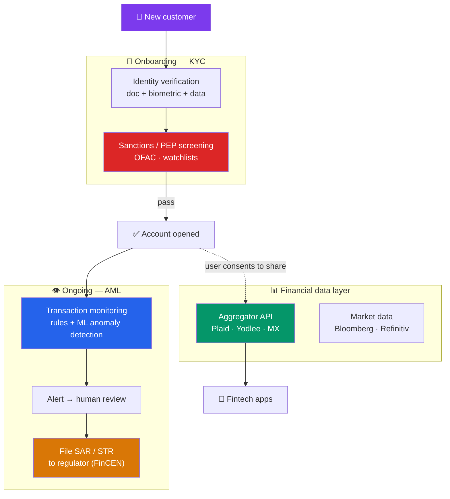

# 🛡️ Regtech and Financial Data

> [!abstract] TL;DR
> Every financial firm sits on top of two invisible backbones: **compliance** and **data**. **KYC** (Know Your Customer) and **AML** (Anti-Money Laundering) are legal duties to verify who customers are and monitor for illicit flows — enforced by huge fines. **Regtech** automates this burden with identity verification, transaction monitoring, and sanctions screening. On the data side, the **market-data ecosystem** (Bloomberg, Refinitiv, exchanges) and **financial-data APIs / aggregators** (Plaid, Yodlee) supply the raw material for every app that "connects your bank." Underneath it all runs a fierce debate: who **owns** your financial data — the bank, the aggregator, or you — and how is your **privacy** protected?

## Intuition — analogy FIRST

Picture a bank as a nightclub with a legal duty far stricter than checking IDs at the door. It must know *who* every patron really is (**KYC**), watch the whole floor for suspicious behavior all night (**AML transaction monitoring**), and immediately eject anyone on the government's banned list (**sanctions screening**) — and if it fails, it isn't a bad review, it's a *nine-figure fine* and possibly criminal liability.

Doing this by hand, for millions of customers and billions of transactions, is impossible. So a whole industry — **regtech** — builds the automated bouncers, cameras, and watchlists: software that verifies an ID in seconds, scores every transaction for risk, and flags anomalies for a human to review.

Now flip to the *data* side. That same nightclub generates an enormous, valuable record of who spent what, where. Fintech apps want to read it — to show you your net worth, underwrite your loan, or move your money. The plumbing that carries this data (**Plaid** and friends) has become critical infrastructure. And it raises the fight of the decade: is that spending record the *bank's* asset, the aggregator's, or *yours*?

---

## How It Works

## Key Concepts / Details

### KYC / AML — the compliance duty

Financial institutions are legally required to prevent their rails (see [[Payment_Systems_and_Rails]]) from being used for money laundering, terrorist financing, and sanctions evasion. The core obligations:

| Obligation | What it requires |
|------------|------------------|
| **KYC / CIP** | Verify customer identity at onboarding (Customer Identification Program) |
| **CDD / EDD** | Customer Due Diligence; **Enhanced** DD for high-risk customers and **PEPs** (politically exposed persons) |
| **Sanctions screening** | Check names against **OFAC** and global watchlists — before and continuously |
| **Transaction monitoring** | Detect suspicious patterns (structuring, layering) |
| **SAR / CTR filing** | File **Suspicious Activity Reports** and **Currency Transaction Reports** (>$10k) to **FinCEN** |
| **Recordkeeping** | Retain records; support audits and law-enforcement requests |

The legal backbone in the U.S. is the **Bank Secrecy Act (BSA)** plus the USA PATRIOT Act; globally, the **FATF** sets standards. Enforcement is brutal: **HSBC paid ~$1.9B (2012)** and **Danske Bank** faced multi-billion penalties over a ~€200B Estonian laundering scandal. Compliance is not overhead — it's existential.

**The pain point:** legacy monitoring generates enormous **false-positive** rates (often 90%+ of alerts are noise), forcing armies of analysts to manually review benign transactions. This is precisely what regtech attacks.

### Regtech — automating compliance

**Regtech** ("regulatory technology") applies software, data, and ML to make compliance faster, cheaper, and more accurate:

- **Identity verification / onboarding** — document + biometric checks, liveness detection: **Onfido, Jumio, Persona, Socure**.
- **Transaction monitoring & AML** — ML-based anomaly detection to cut false positives and surface real risk: **ComplyAdvantage, Feedzai, Featurespace**.
- **Sanctions / adverse-media screening** — real-time watchlist and news matching.
- **Fraud detection** — behavioral biometrics and device fingerprinting.
- **Regulatory reporting** — automating the assembly and filing of reports.

The value proposition mirrors [[Lending_and_Credit_Technology]]: replace rigid rule-based systems with ML that catches more true positives at fewer false positives — while inheriting the same governance challenge (**explainability** and audit trails for regulators).

### The market-data ecosystem

Separately from compliance, finance runs on **market data** — prices, quotes, fundamentals, news, reference data. It's a concentrated, lucrative industry:

- **Bloomberg Terminal** — ~$30k/user/year, the dominant professional workstation; its network effect (chat + data + analytics) is famously sticky.
- **Refinitiv** (LSEG) / **FactSet / S&P Capital IQ / Morningstar** — competing data platforms.
- **Exchanges** (NYSE, Nasdaq, CME) sell their own real-time feeds — market-data fees are a major exchange revenue line.

Data is sold in tiers by latency and depth (delayed vs. real-time, top-of-book vs. full depth). Reference data (identifiers like **CUSIP, ISIN, LEI**) is the unglamorous glue that lets systems agree on *which* security is which.

### APIs, data aggregation, and Plaid

The consumer-fintech explosion runs on **financial-data aggregation** — the ability for an app to securely read your bank data with your consent:

- **Plaid** is the dominant U.S. aggregator: it sits between fintech apps (Venmo, Robinhood, Coinbase, budgeting tools) and thousands of banks, normalizing account and transaction data behind one API. **Yodlee, MX, Finicity** (Mastercard), and **Akoya** compete.
- **Legacy mechanism: screen scraping.** Early aggregation logged in *as the user* with stored credentials and scraped the HTML — brittle, insecure, and disliked by banks.
- **The shift to open banking APIs.** Regulation and industry pressure are moving aggregation from scraping to permissioned **APIs** with **tokenized access** (OAuth-style) — exactly the [[Digital_Banking_and_Neobanks]] open-banking mandate (PSD2 in the EU; the CFPB's **Section 1033** rule in the U.S.).

### Privacy and the data-ownership debate

The central fight: **who owns and controls financial data?**

- **Banks** historically treated transaction data as *their* proprietary asset and resisted sharing it (some throttled Plaid).
- **Aggregators** built businesses on *access* to that data and, in some cases, on *selling* derived insights.
- **Consumers/regulators** increasingly assert that the customer owns the data and has a right to **portability** and to **revoke** access.

**Open banking (Section 1033, PSD2)** resolves this in favor of consumer control: your bank must share your data, via secure APIs, with providers *you* authorize. Privacy regimes (**GDPR**, **CCPA**) add rights to access, delete, and limit use. The unresolved tensions: minimizing data collected to what's needed, preventing "consent" from becoming a blanket data grab, and securing the aggregators themselves — which are now high-value breach targets holding the keys to millions of financial accounts.

---

## Real-World Notes

- **The Visa–Plaid deal that regulators blocked (2020–21)**: Visa agreed to buy Plaid for **$5.3B**, but the U.S. DOJ sued to block it, arguing Visa was neutralizing a nascent competitive threat to its debit "monopoly" and gaining control of critical data infrastructure. The deal collapsed — a landmark signal that **financial-data plumbing** is now strategically as important as the payment rails themselves.
- **Danske Bank's €200B AML failure**: Through its small Estonian branch, Danske Bank processed an estimated **€200 billion** of suspicious non-resident flows over years — a scandal that ended in criminal settlements, a CEO resignation, and a wholesale rethink of transaction monitoring. It's the textbook case for why automated, ML-driven regtech monitoring replaced manual, rules-only systems.
- **The 90% false-positive problem**: Traditional rule-based AML systems flag so many benign transactions that compliance teams drown in review queues — a widely cited industry figure is that the large majority of alerts are false positives. This inefficiency, not just accuracy, is the core business case for ML-based regtech.

---

## Common Pitfalls

- **Treating compliance as optional overhead.** BSA/AML failures draw nine- and ten-figure fines and criminal liability (HSBC, Danske). It is a first-order business risk, not a back-office cost.
- **Assuming ML monitoring is "set and forget."** Regulators demand **explainable** decisions and audit trails; an opaque model that can't justify why it did (or didn't) flag activity is a compliance liability itself.
- **Confusing market data with financial-account data.** Market data (Bloomberg, exchange feeds) and consumer account aggregation (Plaid) are entirely different ecosystems with different business models and regulators.
- **Believing screen scraping equals open banking.** Scraping with stored credentials is the insecure *legacy*; open banking replaces it with consented, tokenized API access — a meaningful security and privacy upgrade.
- **Reading "user consented" as unlimited license.** Under GDPR/CCPA and open-banking rules, consent must be specific, revocable, and data use minimized — a checkbox is not a blanket data grab.

## Related Concepts

- [[_MOC_FinTech|↑ Section MOC]]
- [[Payment_Systems_and_Rails]] — Every rail must be monitored for AML and sanctions
- [[Digital_Banking_and_Neobanks]] — Open banking APIs are the sanctioned path for aggregation
- [[Lending_and_Credit_Technology]] — Aggregated cash-flow data feeds alternative underwriting
- [[Blockchain_and_DeFi_in_Finance]] — KYC/AML on pseudonymous chains is an open problem
- [[_MOC_Cybersecurity_Master|Cross-vault: identity, data protection, and breach risk]] — Securing the aggregators and PII

## Review Questions

1. List the core KYC/AML obligations a bank must fulfill from customer onboarding through ongoing operation, and explain what a Suspicious Activity Report (SAR) is and when it's filed. Why is transaction monitoring's false-positive rate the central business case for regtech?
2. Explain the difference between "screen scraping" and open-banking API access for financial-data aggregation. Why is the API model more secure and privacy-preserving, and how do PSD2 and the CFPB's Section 1033 rule push the industry toward it?
3. In the blocked Visa–Plaid acquisition, the DOJ argued Plaid was strategically critical. Explain what makes a financial-data aggregator so valuable, and articulate the data-ownership debate: what claims do banks, aggregators, and consumers each make on your transaction data?

## Sources

- FATF (Financial Action Task Force), "International Standards on Combating Money Laundering"
- FinCEN, Bank Secrecy Act / AML program requirements and SAR guidance
- U.S. DOJ, "Complaint: United States v. Visa Inc. and Plaid Inc." (2020)
- CFPB Section 1033 final rule (2024); GDPR / CCPA data-rights provisions

#finance #fintech #regtech #kyc-aml #market-data #data-aggregation
