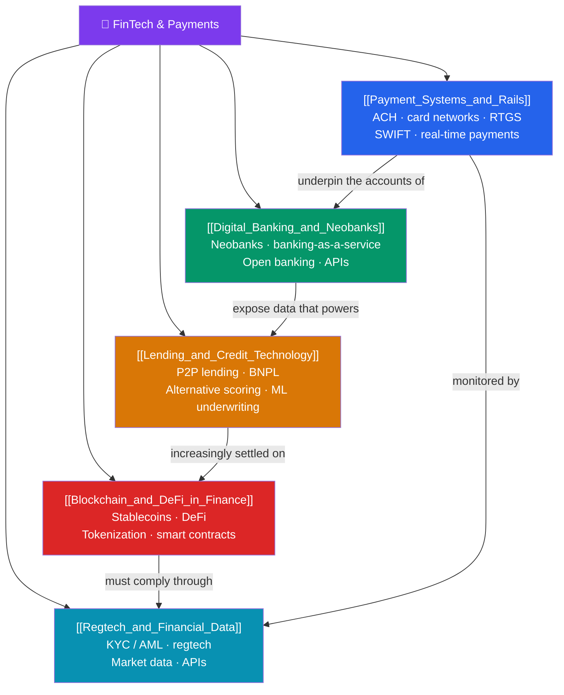

# 🏦 FinTech & Payments — Map of Content

> [!abstract] What This Section Covers
> Financial technology is rewiring how money moves, who provides banking, and how credit is granted. It starts with the plumbing — the **payment systems and rails** that settle trillions daily: ACH batch transfers, card networks (Visa/Mastercard interchange), RTGS systems like Fedwire, SWIFT messaging for cross-border, and the new wave of real-time payments (FedNow, UPI, Pix). On top sit **digital banks and neobanks** (Chime, Revolut) powered by **banking-as-a-service** and **open banking** APIs (PSD2). **Lending and credit technology** disrupts underwriting through P2P lending, buy-now-pay-later, alternative data, and machine-learning credit scoring. **Blockchain and DeFi** introduce stablecoins, decentralized finance, and asset tokenization. Finally, **regtech and financial data** address the compliance backbone — KYC/AML, fraud detection, and the market-data and API economy. This is where finance meets software engineering.

## Concept Map

## Learning Path
1. [[Payment_Systems_and_Rails]] — The plumbing of money: ACH, card networks, RTGS, SWIFT, and real-time payments.
2. [[Digital_Banking_and_Neobanks]] — Software-first banks: neobanks, banking-as-a-service, and open banking APIs.
3. [[Lending_and_Credit_Technology]] — Reinventing credit: P2P lending, BNPL, alternative data, and ML underwriting.
4. [[Blockchain_and_DeFi_in_Finance]] — Decentralized rails: stablecoins, DeFi protocols, and tokenization.
5. [[Regtech_and_Financial_Data]] — The compliance and data backbone: KYC/AML, regtech, market data, and APIs.

## All Notes at a Glance

| Note | Difficulty | What You'll Learn |
|------|------------|-------------------|
| [[Payment_Systems_and_Rails]] | Beginner | ACH batches, interchange, RTGS/Fedwire, SWIFT, FedNow/UPI/Pix real-time rails |
| [[Digital_Banking_and_Neobanks]] | Intermediate | Neobank models, banking-as-a-service, open banking, PSD2, API-first banking |
| [[Lending_and_Credit_Technology]] | Intermediate | P2P/marketplace lending, BNPL economics, alternative data, ML credit scoring |
| [[Blockchain_and_DeFi_in_Finance]] | Advanced | Stablecoins, DeFi lending/DEXs, tokenization of real-world assets, smart contracts |
| [[Regtech_and_Financial_Data]] | Intermediate | KYC/AML, transaction monitoring, regtech automation, market-data feeds and APIs |

## Key Questions This Section Answers
- How does money actually move between banks, and why can ACH take days while FedNow settles instantly?
- What is banking-as-a-service, and how do neobanks operate without a full banking license?
- How does alternative data and machine learning expand credit access beyond traditional scores?
- What can DeFi and stablecoins do that legacy rails cannot, and where do they still fall short?
- Why has regtech become essential to KYC/AML compliance at scale?

## Related Sections
- [[_MOC_Finance_Master|↑ Finance Master MOC]]
- [[_MOC_Derivatives|← Derivatives & Options]] — Instruments increasingly traded on digital platforms
- [[_MOC_International_Finance|→ International Finance & FX]] — Cross-border payments and currency rails
- [[_MOC_Blockchain_Master]] — Cross-vault: the distributed-ledger foundations of DeFi

#MOC #Finance #FinTech
