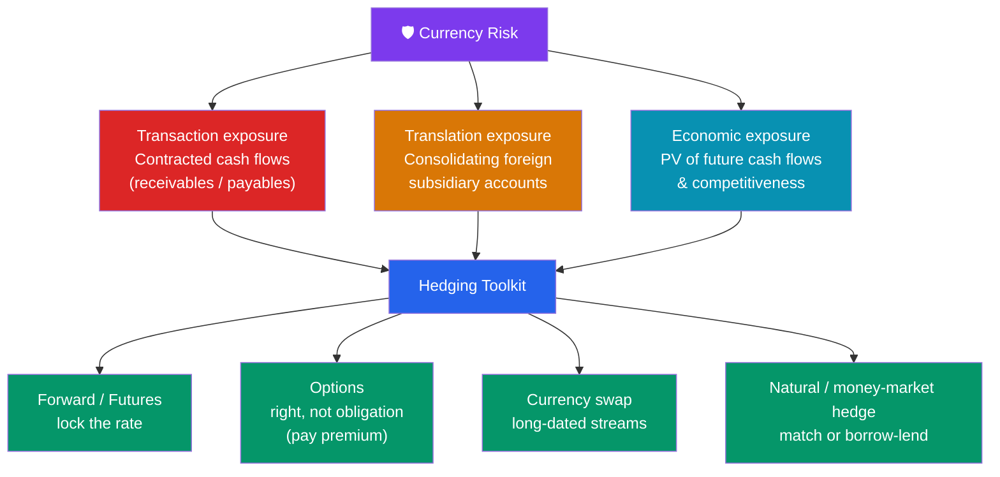

# 🛡️ Currency Risk and Hedging

> [!abstract] TL;DR
> A firm doing business across borders faces **currency risk** in three forms: **transaction exposure** (contracted foreign-currency cash flows), **translation exposure** (accounting effects of consolidating foreign subsidiaries), and **economic exposure** (the effect of FX moves on the present value of *future* cash flows and competitiveness). Firms hedge with **forwards, futures, options, and swaps**, or structurally via a **natural hedge** (matching currency of revenues and costs) or a **money-market hedge** (replicating a forward with borrowing and lending). Options cost a premium but preserve upside; forwards lock the rate for free but forgo it.

## Intuition — analogy FIRST

Suppose you're a US firm that just sold machinery to a French buyer for **€10 million, payable in one year**. On paper you've booked a nice sale. But you don't get *dollars* — you get euros, a year from now, at whatever EUR/USD happens to be then. If the euro weakens from 1.10 to 1.00, your €10M shrinks from $11M to $10M. You made the sale and *still* lost a million dollars to the currency market.

That uncertainty is **transaction exposure**, and it's the sharpest, most concrete flavor of currency risk. The remedy is to **lock the rate today** — sell the euros forward, or borrow against them now, so the dollar value is fixed no matter where the euro goes. Hedging doesn't *make* money; it *removes a bet* you never wanted to make in the first place. The art is choosing the instrument: a **forward** nails the rate for free but you're committed; an **option** lets you walk away if the euro rallies, but you pay a premium for that escape hatch.

---

## How It Works

## Key Concepts / Details

### The Three Exposures

| Exposure | What it hits | Time horizon | Certainty |
|----------|--------------|--------------|-----------|
| **Transaction** | Specific contracted cash flows (a payable/receivable in FX) | Short (weeks–year) | Amount & date known |
| **Translation (accounting)** | Reported financials when foreign subsidiary statements are consolidated into the parent's currency | Reporting-period | Non-cash, book effect |
| **Economic (operating)** | PV of *all* future cash flows and competitive position | Long, ongoing | Uncertain, strategic |

- **Transaction exposure** is the most hedgeable — you know the currency, amount, and date.
- **Translation exposure** is an accounting artifact (current-rate vs temporal method); many firms leave it unhedged because it's non-cash, though it moves reported equity.
- **Economic exposure** is the deepest and hardest: even a firm with no foreign sales can be hurt if a rival's home currency weakens and undercuts its prices. It's managed strategically (diversifying markets, production locations), not with a single forward.

### The Hedging Toolkit

| Instrument | Mechanism | Cost | Upside kept? |
|------------|-----------|------|--------------|
| **Forward** | OTC contract to exchange at a set rate on a date | No upfront premium | No — locked both ways |
| **Futures** | Exchange-traded, standardized, margined forward | Margin; small basis risk | No |
| **Option** | Right (not obligation) to exchange at a strike | Upfront premium | Yes — walk away if favorable |
| **Swap** | Exchange principal + interest streams in two currencies | Rate spread | No — matched streams |

Forwards and futures are near-perfect hedges of a known cash flow; the choice is customization (forward) vs standardization and no counterparty risk (futures). **Options** cost a premium but give asymmetric protection — ideal when the cash flow itself is uncertain (e.g., a bid you might not win). **Currency swaps** hedge long-dated, recurring streams such as foreign-currency debt service. Option pricing sensitivity is governed by [[The_Greeks]].

### Natural Hedge and Money-Market Hedge

- **Natural hedge** — restructure the *business* so exposures offset: source inputs in the same currency you sell in, or **borrow in the currency of your revenues**. A US carmaker with a European plant paying euro wages *and* earning euro revenues is naturally hedged. No derivative needed.
- **Money-market hedge** — replicate a forward synthetically using the spot market plus borrowing and lending, exploiting [[Exchange_Rate_Regimes_and_Determination|interest rate parity]].

### Worked Example — Money-Market Hedge

A US firm has a **€10,000,000 receivable due in one year**. Market data (same as the IRP example in the regimes note):
- Spot **EUR/USD = 1.1000**
- 1-year euro borrowing rate = **3%**
- 1-year US deposit rate = **5%**

**Steps to lock in dollars today:**
1. **Borrow** the present value of €10M in euros now: $\dfrac{10{,}000{,}000}{1.03} = €9{,}708{,}738$.
2. **Convert** to dollars at spot: $9{,}708{,}738 \times 1.1000 = \$10{,}679{,}612$.
3. **Invest** those dollars at 5% for one year: $10{,}679{,}612 \times 1.05 = \$11{,}213{,}592$.
4. In one year, the **€10M receivable arrives** and exactly repays the euro loan: $9{,}708{,}738 \times 1.03 = €10{,}000{,}000$. ✓

The firm has **locked in \$11,213,592** regardless of where EUR/USD ends up. The implied effective rate:
$$\frac{11{,}213{,}592}{10{,}000{,}000} = 1.1214$$

**Compare to a forward hedge:** the [[Exchange_Rate_Regimes_and_Determination|CIRP]] forward is $1.1000 \times \frac{1.05}{1.03} = 1.1214$, so selling €10M forward yields $10{,}000{,}000 \times 1.1214 = \$11{,}213{,}592$ — **identical**. Interest rate parity guarantees the money-market hedge and the forward hedge produce the same result; the choice comes down to which market (credit vs forward) is cheaper to access.

**Option alternative:** buy a 1-year put on the euro (right to sell €10M at, say, strike 1.1000) for an upfront premium. If the euro falls to 1.00 you exercise and still get $11M; if it rallies to 1.20 you let the put lapse and sell at 1.20 for $12M, keeping the upside minus the premium. That asymmetry is what the premium buys.

---

## Real-World Notes

- **Airlines and fuel-plus-FX**: carriers buy jet fuel priced in dollars while earning revenue in many currencies; a non-US airline layers FX hedges on top of fuel hedges, and mismatches have swung quarterly earnings by hundreds of millions.
- **Porsche's currency bets**: German exporters famously hedge dollar receivables years out; in some years the *hedging* desk out-earned the car business, blurring the line between hedging and speculation — a cautionary tale about hedge sizing.
- **The natural hedge of "build where you sell"**: Toyota and BMW built US plants partly so that dollar costs match dollar revenues, insulating profits from yen/euro swings far more durably than any rolling forward program.

---

## Common Pitfalls

- **Confusing translation with transaction exposure.** Translation is a non-cash accounting effect; hedging it can *create* real cash risk to protect a book number.
- **Over-hedging or hedging uncertain flows with forwards.** A forward on a contract you might not win turns a hedge into a speculative position; use options for uncertain exposures.
- **Ignoring economic exposure because it's not on the balance sheet.** The competitive hit from a rival's cheaper currency is real even with zero foreign sales.
- **Forgetting the premium in option comparisons.** Options look attractive for keeping upside, but the premium is a certain, upfront cost that a forward avoids.
- **Assuming the forward "beats" the money-market hedge.** Interest rate parity makes them equivalent; a persistent gap signals a market frictions or credit issue, not free money.

---

## Related Concepts

- [[_MOC_International_Finance|↑ Section MOC]]
- [[Foreign_Exchange_Markets]] — The spot and forward market these hedges use
- [[Exchange_Rate_Regimes_and_Determination]] — Interest rate parity that equates forward and money-market hedges
- [[The_Balance_of_Payments]] — Firm-level exposures aggregate into national flows
- [[International_Capital_Flows_and_Crises]] — Why unhedged FX debt is so dangerous
- [[The_Greeks]] — Cross-section: option sensitivities behind option hedges
- [[Currency_Risk_and_Hedging]] — This note anchors the section's risk-management thread

## Review Questions

1. Classify each as transaction, translation, or economic exposure: (a) a €5M payable due in 90 days; (b) the euro value of a German subsidiary's equity when consolidated into a US parent's statements; (c) a US toy maker losing share because a weaker yuan makes Chinese rivals cheaper. Explain each.
2. A UK firm expects to *pay* $2,000,000 in one year. Spot GBP/USD = 1.2500, the 1-year dollar rate is 5%, and the 1-year pound rate is 4%. Design a money-market hedge that locks in the pound cost today, and compute that cost.
3. When should a treasurer prefer a currency **option** over a **forward** to hedge a foreign-currency inflow? Explain the trade-off in terms of premium, obligation, and the certainty of the underlying cash flow.

## Sources

- Eun & Resnick, *International Financial Management*, 9th edition, Ch. 8–9
- Shapiro, *Multinational Financial Management*, 10th edition
- CFA Institute, *CFA Program Curriculum* — Derivatives and Currency Management
- Bank for International Settlements, *Triennial Central Bank Survey* (FX derivatives), 2022

#finance #international-finance #hedging #fx-exposure #forwards-options
