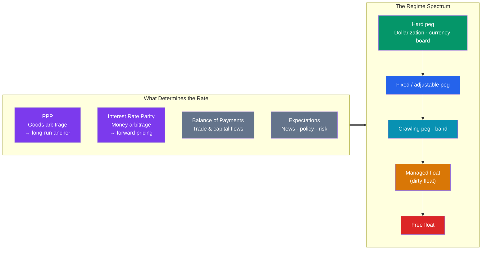

# ⚖️ Exchange Rate Regimes and Determination

> [!abstract] TL;DR
> A country chooses an **exchange-rate regime** along a spectrum from **fixed** (the rate is pegged and defended) to **floating** (the market sets it), with **managed floats and pegs** in between. Where the rate *settles* is anchored by no-arbitrage parity conditions: **Purchasing Power Parity (PPP)** says exchange rates adjust so identical goods cost the same everywhere (the law of one price); **Interest Rate Parity (IRP)** says the forward rate offsets the interest-rate differential, so covered arbitrage earns nothing. In the short run, rates are dominated by **interest rates, capital flows, and expectations**; in the long run they gravitate toward **PPP**.

## Intuition — analogy FIRST

Think of a currency's exchange rate like the water level in a lake. A **fixed regime** is a dam: the central bank promises to keep the level exactly where it wants, buying and selling reserves to hold the line. A **floating regime** removes the dam entirely and lets rain (trade flows) and evaporation (capital flows) set the level minute by minute. A **managed float** is a dam with adjustable gates — mostly market-driven, but the authorities nudge it when it swings too far.

Now, *why* does the water settle where it does? Two invisible forces pull it. First, **goods arbitrage**: if a basket of goods is cheaper abroad, people buy there, demand for the foreign currency rises, and the rate adjusts until prices roughly equalize — that is **PPP**. Second, **money arbitrage**: if one currency pays a higher interest rate, its forward price must fall by just enough that you can't profit risk-free by parking money in it — that is **interest rate parity**. These two conditions are the gravity of the FX world.

---

## How It Works

## Key Concepts / Details

### The Regime Spectrum

| Regime | Mechanism | Real example |
|--------|-----------|--------------|
| **Dollarization / union** | Abandon own currency entirely | Ecuador (USD), Eurozone members |
| **Currency board** | Domestic money 100% backed by hard-currency reserves at a fixed rate | Hong Kong (HKD pegged 7.80 to USD) |
| **Fixed peg** | Central bank defends a set rate with reserves | Saudi riyal pegged to USD |
| **Crawling peg / band** | Rate adjusts on a pre-set path or within a band | Historical China RMB reference-rate band |
| **Managed (dirty) float** | Mostly market-set, with discretionary intervention | China, India (de facto) |
| **Free (clean) float** | Market sets the rate, no routine intervention | US, Eurozone, Japan, UK |

**Trade-off:** a fixed rate delivers stability and low inflation credibility but forces the central bank to give up either monetary independence or free capital flows — the [[International_Capital_Flows_and_Crises|impossible trinity]].

### Purchasing Power Parity (PPP)

PPP is built on the **law of one price**: identical goods should cost the same everywhere once expressed in a common currency.

**Absolute PPP** — the exchange rate equals the ratio of price levels:
$$S = \frac{P_{\text{domestic}}}{P_{\text{foreign}}}$$

**Relative PPP** — the *change* in the exchange rate tracks the **inflation differential**. For a pair quoted BASE/QUOTE:
$$\%\Delta S_{\text{BASE/QUOTE}} \approx \pi_{\text{quote}} - \pi_{\text{base}}$$

So EUR/USD rises (the dollar weakens) when US inflation exceeds Eurozone inflation. The **Big Mac Index** (The Economist) is a famous, tongue-in-cheek PPP gauge: it compares burger prices worldwide to spot over- and under-valued currencies. PPP holds poorly in the short run (many goods aren't traded) but is a decent long-run anchor.

### Interest Rate Parity (IRP)

IRP links spot, forward, and the two currencies' interest rates.

**Covered Interest Rate Parity (CIRP)** — an *arbitrage identity* enforced by the forward market. For a pair quoted BASE/QUOTE:
$$F = S \times \frac{1 + i_{\text{quote}}}{1 + i_{\text{base}}}$$

The currency with the **higher** interest rate trades at a **forward discount**; the lower-rate currency trades at a forward premium. Because it is arbitrage-enforced, CIRP holds almost exactly in normal markets.

**Uncovered Interest Rate Parity (UIRP)** — a *theory* (not arbitrage): the expected change in the spot rate offsets the interest differential, so the higher-rate currency is *expected* to depreciate by the differential. UIRP fails empirically — high-rate currencies tend *not* to depreciate as predicted, which is exactly why the **carry trade** is profitable on average (the "forward premium puzzle").

### Worked Example — Covered Interest Rate Parity

Suppose:
- Spot **EUR/USD = 1.1000** (1 euro = 1.1000 dollars)
- 1-year US interest rate $i_{\text{USD}} = 5\%$
- 1-year Eurozone interest rate $i_{\text{EUR}} = 3\%$

Here USD is the quote currency and EUR is the base. The no-arbitrage 1-year forward is:
$$F = 1.1000 \times \frac{1 + 0.05}{1 + 0.03} = 1.1000 \times \frac{1.05}{1.03} = 1.1000 \times 1.01942 = 1.1214$$

The dollar trades at a **forward discount** (you get *more* dollars per euro forward, 1.1214 vs 1.1000) precisely because the dollar pays the higher rate.

**Why it must hold — covered interest arbitrage.** Start with $1{,}000$:
- **Dollar path:** invest at 5% → \$1{,}050 in one year.
- **Euro path:** convert to €909.09 at spot, invest at 3% → €936.36, then sell forward at 1.1214 → \$1{,}050.0.

Both paths yield the same \$1,050. If the forward were, say, 1.15, you could earn a risk-free profit by borrowing dollars and taking the euro path — arbitrageurs would pounce until the forward snapped back to 1.1214. This exact number reappears in the money-market hedge in [[Currency_Risk_and_Hedging]].

### Short Run vs Long Run

| Horizon | Dominant driver |
|---------|-----------------|
| Intraday–weeks | Interest-rate news, risk sentiment, capital flows, expectations |
| Months–years | Balance of payments, relative growth, policy credibility |
| Many years | Purchasing power parity (inflation differentials) |

---

## Real-World Notes

- **The Swiss franc floor (2011–2015)**: the SNB pegged EUR/CHF at a 1.20 floor to stop the franc from strengthening. Defending it meant printing francs to buy euros — until January 2015, when the SNB abandoned it and the franc jumped ~20% in minutes, bankrupting several brokers. A vivid lesson that pegs bind only until they break.
- **The Big Mac Index in action**: when a Big Mac costs far less abroad than at home in dollar terms, that currency looks "undervalued" against the dollar on a PPP basis — a rough but memorable illustration of the law of one price.
- **Carry trade and UIRP's failure**: for a decade, borrowing low-rate yen to buy higher-rate Australian dollars earned steady carry — a direct bet that uncovered interest parity would *not* hold. It works until a risk shock reverses it violently.

---

## Common Pitfalls

- **Confusing CIRP with UIRP.** Covered parity is an arbitrage identity that holds tightly; uncovered parity is a forecast that routinely fails.
- **Assuming the higher-rate currency is "better."** Under CIRP its forward price is *lower* — the interest advantage is exactly offset in the forward market.
- **Expecting PPP to hold day-to-day.** Many prices are non-traded (rent, haircuts) and sticky; PPP is a long-run tendency, not a short-run rule.
- **Getting the parity formula's currency sides backwards.** Always match numerator/denominator to the base/quote convention of the pair, or the forward premium flips sign.
- **Believing a peg is permanent.** Defending a fixed rate drains reserves; markets test pegs that fundamentals no longer support.

---

## Related Concepts

- [[_MOC_International_Finance|↑ Section MOC]]
- [[Foreign_Exchange_Markets]] — The market where these rates are quoted and traded
- [[The_Balance_of_Payments]] — Trade and capital flows that push rates around
- [[International_Capital_Flows_and_Crises]] — The impossible trinity that constrains regime choice
- [[Currency_Risk_and_Hedging]] — Uses the same IRP-implied forward rate
- [[_MOC_Macroeconomics_Master]] — Cross-vault: open-economy macro and monetary policy

## Review Questions

1. The spot USD/JPY is 150.00, the 1-year US rate is 5%, and the 1-year Japanese rate is 1%. Compute the no-arbitrage 1-year forward USD/JPY and state whether the yen trades at a forward premium or discount, and why.
2. US inflation is expected to run at 4% while Eurozone inflation runs at 1%. Using relative PPP, in which direction and by roughly how much should EUR/USD move over the year? Explain the mechanism.
3. Explain the difference between covered and uncovered interest rate parity. Why does covered parity hold almost exactly while uncovered parity fails — and how does the carry trade exploit that failure?

## Sources

- Krugman, Obstfeld & Melitz, *International Economics: Theory and Policy*, 11th edition, Ch. 14–16
- CFA Institute, *CFA Program Curriculum* — Economics: Currency Exchange Rates and Parity Conditions
- The Economist, *The Big Mac Index* (methodology and data)
- Levich, *International Financial Markets: Prices and Policies*, 2nd edition

#finance #international-finance #exchange-rates #ppp #interest-rate-parity
