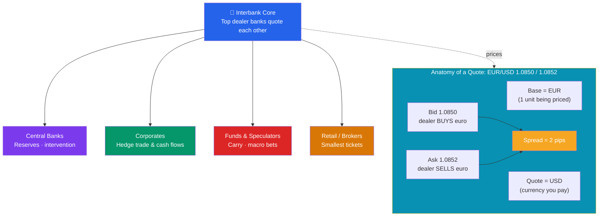

# 💱 Foreign Exchange Markets

> [!abstract] TL;DR
> The foreign exchange (FX) market is where currencies are traded — the **largest and most liquid market on Earth**, turning over roughly **$7.5 trillion per day** (BIS 2022). Prices are quoted as **currency pairs** (EUR/USD, USD/JPY): the **base** currency is priced in units of the **quote** currency. Dealers post a two-way **bid/ask** and profit on the spread, measured in **pips**. Trades settle **spot** (T+2) or **forward** (a locked rate for future delivery). When no direct quote exists, a **cross rate** is computed from two other pairs. The market runs 24 hours across time zones, driven by banks, corporates, central banks, and speculators.

## Intuition — analogy FIRST

Imagine a giant, always-open money-changing bazaar with no single building. A Tokyo bank, a German exporter, a London hedge fund, and the Federal Reserve are all standing at different stalls, and every price is a *ratio*: "how many dollars for one euro?"

If a stall shows **EUR/USD = 1.0850**, it means one euro costs 1.0850 dollars. The euro is the thing being priced (the **base**); the dollar is what you pay (the **quote**). When that number rises to 1.0900, the euro got *stronger* (or the dollar *weaker*) — the same euro now buys more dollars.

Because the bazaar spans every time zone, it never closes. Trading rolls from Sydney to Tokyo to London to New York and back, so unlike a stock exchange there is no opening bell and no closing price — just a continuous, 24-hour flow of quotes.

---

## How It Works

## Key Concepts / Details

### Size and Structure

The FX market's ~$7.5 trillion daily turnover dwarfs global equity trading (a few hundred billion per day). It is an **over-the-counter (OTC)** market — a decentralized network of dealers linked electronically, not a single central exchange. The most-traded currency is the **US dollar**, involved in roughly 88% of all trades because it is the world's dominant reserve and **vehicle currency** (you often convert A→USD→B rather than A→B directly).

### Currency Pairs and Quoting

Every price is a pair written **BASE/QUOTE**:

- **Base currency** — the unit being priced (the "1").
- **Quote (counter) currency** — the price you pay for one unit of the base.

**EUR/USD = 1.0850** → 1 euro = 1.0850 dollars. Market convention fixes which currency is the base (the rough priority order is EUR > GBP > AUD > NZD > USD > CAD > CHF > JPY).

**Pips** measure the smallest standard price increment. For most pairs a pip is the **4th decimal place (0.0001)**; for JPY pairs it is the **2nd decimal (0.01)**. A move from 1.0850 to 1.0851 is one pip.

**Bid/Ask spread**: dealers quote two prices. The **bid** is where the dealer buys the base (and you sell); the **ask (offer)** is where the dealer sells the base (and you buy). The gap is the **spread**, the dealer's compensation and a measure of liquidity — 0.1–1 pip for EUR/USD, much wider for illiquid emerging-market pairs.

| Pair | Nickname | Base / Quote | Typical spread |
|------|----------|--------------|----------------|
| EUR/USD | "Fiber" | Euro / US dollar | ~0.1–0.5 pip |
| USD/JPY | "Dollar-yen" | US dollar / Japanese yen | ~0.3–0.8 pip |
| GBP/USD | "Cable" | British pound / US dollar | ~0.5–1.0 pip |
| USD/CHF | "Swissy" | US dollar / Swiss franc | ~0.5–1.5 pip |
| AUD/USD | "Aussie" | Australian dollar / US dollar | ~0.4–1.0 pip |

### Spot vs Forward

- **Spot** — the current rate for immediate delivery. "Immediate" actually settles **T+2** (two business days later; USD/CAD is T+1). Spot is what news headlines quote.
- **Forward (outright)** — a contract to exchange currencies at an agreed rate on a **future date**. The forward rate is *not* a forecast; it is the spot rate adjusted by the **interest-rate differential** between the two currencies (this is [[Exchange_Rate_Regimes_and_Determination|covered interest rate parity]]). The difference, quoted in **forward points**, can be a premium or discount.
- **FX swap** — the most common instrument by volume: simultaneously buy spot and sell forward (or vice-versa), rolling a position without taking directional risk.

### Market Participants

- **Banks (interbank market)** — the dealer core; a handful of large banks (JPMorgan, UBS, Deutsche Bank, Citi, etc.) make markets to each other and to clients.
- **Corporates** — importers, exporters, and multinationals converting revenues and hedging payables/receivables.
- **Central banks** — hold FX reserves, intervene to influence their currency, and settle official flows.
- **Asset managers & hedge funds** — speculators and carry traders seeking return from rate differentials and macro moves.
- **Retail traders / brokers** — the smallest slice, accessing the market through leveraged retail platforms.

### Cross Rates — Worked Example

A **cross rate** is an exchange rate between two currencies derived from each one's rate against a third (usually the USD).

**Case 1 — multiply (chain through a shared middle currency):** you want **GBP/JPY** but only see GBP/USD and USD/JPY.

$$\text{GBP/JPY} = \text{GBP/USD} \times \text{USD/JPY} = 1.2700 \times 150.00 = 190.50$$

One pound buys 1.27 dollars, and each dollar buys 150 yen, so one pound buys **190.50 yen**.

**Case 2 — divide (two pairs share the same quote currency):** you want **EUR/GBP** but only see EUR/USD and GBP/USD (both quoted against USD).

$$\text{EUR/GBP} = \frac{\text{EUR/USD}}{\text{GBP/USD}} = \frac{1.0850}{1.2700} = 0.8543$$

One euro is worth **0.8543 pounds**. In practice, dealers build the cross from the correct sides of each bid/ask, which is why cross-rate spreads are wider than the two underlying dollar pairs.

---

## Real-World Notes

- **The dollar as the world's plumbing**: because ~88% of trades touch the USD, a Brazilian firm paying a Korean supplier often routes real → dollars → won. This is why dollar liquidity stress (e.g., March 2020) ripples through every currency at once and forces the Fed to open **swap lines** with other central banks.
- **The London hour**: the largest single burst of daily volume is the **4pm London "fix"**, when index and benchmark trades cluster. This window has been the subject of major manipulation scandals (banks fined billions in 2014–2015 for colluding around the fix).
- **Carry trade**: for years traders borrowed low-yielding yen to buy higher-yielding currencies, pocketing the rate differential — profitable until a risk-off shock sends the funding currency sharply higher and unwinds the trade violently.

---

## Common Pitfalls

- **Reading the pair backwards.** EUR/USD *rising* means the euro strengthened and the dollar weakened — not the reverse. Always identify the base first.
- **Confusing bid and ask direction.** You buy the base at the dealer's *ask* and sell at the *bid*; retail traders routinely underestimate this round-trip cost.
- **Treating the forward rate as a forecast.** A currency at a forward premium is not "expected to rise" — the premium simply offsets its lower interest rate under no-arbitrage.
- **Ignoring pip conventions for JPY pairs.** A pip in USD/JPY is 0.01, not 0.0001; miscounting inflates or deflates a position's value by 100×.
- **Forgetting settlement lag.** "Spot" is T+2; treating it as instantaneous causes cash-management and value-date errors.

---

## Related Concepts

- [[_MOC_International_Finance|↑ Section MOC]]
- [[Exchange_Rate_Regimes_and_Determination]] — What determines the level of the rates traded here
- [[The_Balance_of_Payments]] — Where FX transactions are ultimately recorded
- [[International_Capital_Flows_and_Crises]] — When FX markets seize up and reverse
- [[Currency_Risk_and_Hedging]] — Using spot and forward to manage exposure
- [[Money_Markets]] — The short-term rates that price FX forwards
- [[_MOC_Macroeconomics_Master]] — Cross-vault: the open-economy macro behind currency moves

## Review Questions

1. A dealer quotes USD/JPY as 150.10 / 150.14. You are a US importer who needs to buy 30 million yen to pay a supplier. At which price do you transact, how many dollars does it cost, and what is the spread in pips?
2. You observe AUD/USD = 0.6600 and NZD/USD = 0.6100. Compute the AUD/NZD cross rate and state in words what it means.
3. Explain why the forward EUR/USD rate can trade *below* spot even when the market broadly expects the euro to appreciate. What actually determines the forward points?

## Sources

- Bank for International Settlements, *Triennial Central Bank Survey of Foreign Exchange and OTC Derivatives Markets*, 2022
- Levich, *International Financial Markets: Prices and Policies*, 2nd edition
- CFA Institute, *CFA Program Curriculum* — Economics: Currency Exchange Rates
- Federal Reserve, "The Foreign Exchange Market" (educational materials)

#finance #international-finance #fx #currency-pairs #spot-forward
