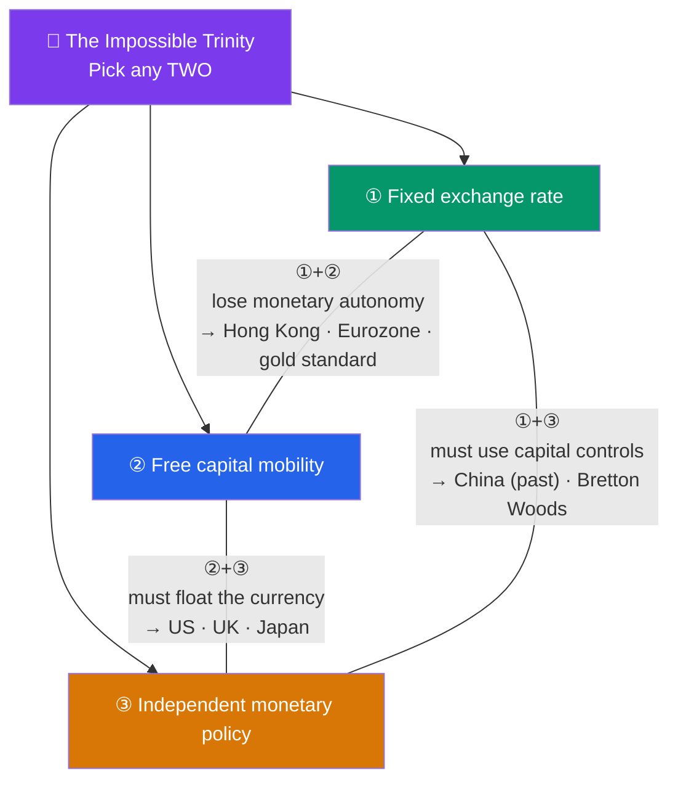

# 🌊 International Capital Flows and Crises

> [!abstract] TL;DR
> Capital flows across borders chasing return and safety — but they can **reverse violently**. A **sudden stop** is an abrupt halt or reversal of inflows that collapses a currency and crushes output. The governing constraint is the **impossible trinity (trilemma)**: a country can have at most **two** of {fixed exchange rate, free capital mobility, independent monetary policy} — never all three. Trying to hold all three invites a **currency crisis**, as in the **1997 Asian financial crisis** and repeated **Latin American crises**. Policy responses include floating the currency, IMF programs, and **capital controls**.

## Intuition — analogy FIRST

Imagine you're trying to do three things at once with a garden hose: (1) keep the water pressure *fixed* at exactly 40 psi, (2) leave the tap *wide open* so water flows freely in and out, and (3) *independently* adjust the flow to water different beds as you like. You quickly discover you can only pick two. Fix the pressure with the tap wide open, and you lose control of where the water goes — the open tap dictates it. Want independent control *and* an open tap? The pressure has to float.

Countries face the exact same bind with money. **Fixed exchange rate**, **free capital movement**, and **independent monetary policy** are the three settings, and you can only hold two. When a government stubbornly clings to all three, speculators notice the contradiction and attack the weak link — usually the peg. Money that flooded in during good times **suddenly stops** and rushes for the exits, the currency cracks, banks and firms with foreign-currency debt go underwater, and a full-blown crisis erupts. The 1997 Asian crisis was this movie, played across half a continent.

---

## How It Works

## Key Concepts / Details

### Capital Flows: Push and Pull

Cross-border capital comes in flavors of decreasing stability:
- **FDI** — factories, acquisitions; long-horizon, "sticky," least prone to sudden reversal.
- **Portfolio flows** — stocks and bonds; "hot money" that can exit in days.
- **Bank / other flows** — short-term loans and deposits, often in foreign currency; the most crisis-prone.

Flows are driven by **pull factors** (a country's own growth, high rates, reforms) and **push factors** (global conditions — low rates in advanced economies push money toward emerging markets). Push factors are dangerous because they reverse for reasons unrelated to the recipient: when the Fed hikes, capital flees *even well-run* emerging markets.

### Sudden Stops

Coined by Guillermo Calvo, a **sudden stop** is a sharp, unexpected reversal of net capital inflows. The mechanism cascades:
1. Inflows abruptly halt or reverse (a push shock or loss of confidence).
2. The currency plunges as everyone sells local assets for dollars.
3. Firms and banks with **foreign-currency debt** see their liabilities balloon in local terms (a **balance-sheet effect**).
4. Credit freezes, investment collapses, output contracts sharply.

Sudden stops are why **currency mismatch** (borrowing in dollars, earning in local currency — "original sin") is so lethal.

### The Impossible Trinity (Trilemma)

A country can pick only **two** of the three corners:

| Choose | Give up | Examples |
|--------|---------|----------|
| Fixed rate + free capital | **Monetary independence** | Hong Kong (currency board), Eurozone members, classical gold standard |
| Free capital + monetary independence | **Fixed rate** (must float) | US, UK, Japan, Eurozone as a bloc |
| Fixed rate + monetary independence | **Free capital** (need controls) | China (historically), Bretton Woods era, Malaysia 1998 |

The trilemma is the deepest constraint in open-economy policy. Most currency crises are the market forcing a country that tried to hold all three to release one — usually by breaking the peg.

### Generations of Crisis Models

- **First generation (Krugman)** — unsustainable fiscal/monetary policy (money-printing) inevitably drains reserves and forces a peg to break; the timing is when reserves hit a floor.
- **Second generation (Obstfeld)** — **self-fulfilling** crises: a peg is defensible, but if enough speculators *expect* devaluation, defending it becomes too costly and the government abandons it, validating the attack.
- **Third generation** — **balance-sheet / banking** crises: currency mismatch and weak banks turn a currency shock into a twin banking-and-currency collapse (the Asian-crisis template).

### Case Studies

**1997 Asian financial crisis.** Thailand, Indonesia, South Korea, and Malaysia had pegged (or quasi-pegged) currencies, current-account deficits, and companies/banks that had borrowed heavily in short-term dollars. When Thailand's reserves ran down, it **floated the baht on 2 July 1997**; the currency collapsed, foreign-currency debts exploded, and **contagion** spread across the region as investors fled all emerging Asia. The IMF arranged large bailouts with harsh conditionality; output fell double digits in the worst-hit economies before recovery.

**Latin American crises.** A recurring pattern: Mexico's **Tequila crisis** (1994–95, peso devaluation and US-led rescue); Brazil's 1999 real devaluation; and **Argentina's 2001–02 collapse**, when a rigid **currency board** (one peso = one dollar) proved unsustainable amid fiscal stress — Argentina broke the peg, defaulted on ~$100bn of debt, and the peso lost most of its value. Each episode combined fixed/quasi-fixed rates with fragile fundamentals and volatile capital.

### Capital Controls

Once heretical, **capital controls** are now seen (even by the IMF) as a legitimate tool in some conditions:
- **Chile's *encaje*** — an unremunerated reserve requirement on inflows that taxed short-term "hot money" while allowing FDI.
- **Malaysia (1998)** — imposed outright controls during the Asian crisis to regain monetary autonomy, a controversial but partly vindicated choice.
- **Tobin tax** — a proposed small tax on FX transactions to throw "sand in the gears" of speculative flows.

Controls buy the third corner of the trilemma (monetary independence with a fixed rate) at the cost of market efficiency and enforcement difficulty.

---

## Real-World Notes

- **The 2013 "Taper Tantrum"**: when the Fed merely *hinted* at slowing bond purchases, capital fled the "Fragile Five" emerging markets (Brazil, India, Indonesia, Turkey, South Africa), spiking their yields and sinking their currencies — a textbook push-factor sudden-stop scare with no change in their own fundamentals.
- **Hong Kong's enduring currency board**: since 1983 the HKD has been pegged near 7.80 to the USD, and Hong Kong has explicitly *given up* monetary independence to keep the peg with open capital — the trilemma lived out for four decades.
- **Argentina, the serial defaulter**: the 2001 currency-board collapse was one of history's largest sovereign defaults, and Argentina has defaulted repeatedly since, a standing reminder that rigid pegs plus fiscal weakness end badly.

---

## Common Pitfalls

- **Believing a country can hold all three trilemma corners.** Attempting it is the classic setup for a speculative attack.
- **Treating all capital inflows as equal.** FDI is stabilizing; short-term dollar debt is the accelerant in nearly every crisis.
- **Ignoring currency mismatch.** A cheap dollar loan looks great until the local currency falls and the debt doubles in real terms.
- **Assuming crises are always fundamentals-driven.** Second-generation models show pegs can fall to *self-fulfilling* panics even when defensible.
- **Viewing capital controls as always harmful or always helpful.** Their value is conditional — useful against hot-money surges, costly if used to prop up bad policy.

---

## Related Concepts

- [[_MOC_International_Finance|↑ Section MOC]]
- [[Foreign_Exchange_Markets]] — Where speculative attacks are executed
- [[Exchange_Rate_Regimes_and_Determination]] — The regime choice the trilemma constrains
- [[The_Balance_of_Payments]] — Financial-account reversals are the sudden stop
- [[Currency_Risk_and_Hedging]] — How firms protect against the FX shocks crises unleash
- [[Financial_History_and_Crises]] — Cross-vault: the broader history of financial panics
- [[_MOC_Macroeconomics_Master]] — Cross-vault: open-economy monetary policy

## Review Questions

1. State the impossible trinity and, for each of the three possible two-corner combinations, name a real country or system that lives it and explain what it gives up.
2. Walk through the mechanism of a sudden stop for an emerging market whose banks borrowed heavily in short-term US dollars. Why does the *currency mismatch* turn an exchange-rate move into a solvency crisis?
3. Contrast first-, second-, and third-generation currency-crisis models. Which best explains the 1997 Asian crisis, and why?

## Sources

- Krugman, Obstfeld & Melitz, *International Economics: Theory and Policy*, 11th edition, Ch. 18–22
- Calvo, "Capital Flows and Capital-Market Crises: The Simple Economics of Sudden Stops," *Journal of Applied Economics*, 1998
- Obstfeld, Shambaugh & Taylor, "The Trilemma in History," *Review of Economics and Statistics*, 2005
- Reinhart & Rogoff, *This Time Is Different: Eight Centuries of Financial Folly*, 2009

#finance #international-finance #crises #impossible-trinity #sudden-stops
