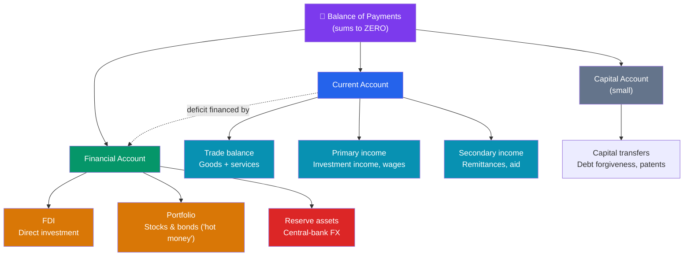

# 🧾 The Balance of Payments

> [!abstract] TL;DR
> The **balance of payments (BoP)** is a country's double-entry ledger of every transaction with the rest of the world over a period. It has three parts: the **current account** (trade in goods and services, plus income and transfers), the small **capital account** (transfers of capital assets), and the **financial account** (cross-border purchases of assets — FDI, portfolio flows, reserves). By construction the whole thing **sums to zero**: a **current-account deficit must be financed by a financial-account surplus** — the country is borrowing from or selling assets to the rest of the world. A CA deficit isn't automatically "bad"; it means a nation is consuming/investing more than it produces and importing the savings to fund the gap.

## Intuition — analogy FIRST

Picture a household's finances for a year. The **current account** is like your paycheck-and-spending: wages earned abroad, money spent buying imported goods, interest received on foreign savings. If you spend more than you earn, you run a deficit — and that gap *must* be plugged somehow.

How? You either **borrow** (take a loan) or **sell assets** (dip into savings, sell the car). That plugging-the-gap side is the **financial account**. The magic of the balance of payments is that these two sides are two views of the *same* transactions, recorded by double-entry bookkeeping — so they always net to zero. If a country buys $100 of foreign goods, that $100 either came from exporting something, or from a foreigner lending it/buying an asset. There is no third option.

So the phrase "current-account deficit" is not a mysterious ailment. It literally means: *this year the country consumed more than it produced, and financed the difference by borrowing from abroad or selling assets to foreigners.*

---

## How It Works

## Key Concepts / Details

### The Three Accounts

**1. Current account (CA)** — flows of goods, services, and income:
- **Trade balance** — exports minus imports of goods and services (the largest and most-watched piece).
- **Primary income** — income earned on cross-border investments (dividends, interest) and cross-border wages.
- **Secondary income (transfers)** — one-way flows: remittances from workers abroad, foreign aid, gifts.

**2. Capital account (KA)** — a small account for transfers of capital assets: debt forgiveness, transfers by migrants, and sales of non-produced, non-financial assets (patents, mineral rights).

**3. Financial account (FA)** — cross-border acquisition of financial assets:
- **Foreign direct investment (FDI)** — lasting control (building a factory, buying a company); "sticky" and stabilizing.
- **Portfolio investment** — stocks and bonds without control; "hot money" that can reverse fast.
- **Other investment** — bank loans, trade credit, currency and deposits.
- **Reserve assets** — the central bank's holdings of foreign currency and gold, the buffer used to intervene.

### Why the BoP Always Balances

The BoP uses **double-entry bookkeeping**: every transaction is recorded twice, as a credit and an offsetting debit. Export a $100 machine (credit, current account) and the foreign buyer's $100 payment enters as a debit somewhere (financial account). The accounting identity, under the modern IMF (BPM6) convention, is:

$$\underbrace{CA + KA}_{\text{net lending / borrowing}} \; = \; \underbrace{FA}_{\text{net acquisition of foreign assets}} \; (+\ \text{errors \& omissions})$$

Intuitively (older sign convention): **CA + KA + FA = 0**. A current-account *deficit* is exactly matched by a financial-account *surplus* — net capital flowing *in* to finance the gap. **Errors & omissions** is a plug for measurement error; the underlying identity is exact.

### What a Current-Account Deficit Really Means

From national income accounting:
$$CA = S - I = (S_{\text{private}} - I) + (T - G)$$

A current-account deficit means **domestic saving falls short of domestic investment** — the country imports the difference in the form of foreign savings. It is neither inherently good nor bad:
- **Benign**: a fast-growing economy borrowing to fund productive investment (19th-century US, modern Australia).
- **Dangerous**: financing consumption or a budget deficit with volatile short-term capital that can reverse (many pre-crisis emerging markets — see [[International_Capital_Flows_and_Crises]]).

### Twin Deficits

The identity above exposes the **twin-deficits** link: the government budget balance $(T - G)$ sits *inside* the current account. When a government runs a large fiscal deficit and private saving doesn't rise to offset it, the current account tends to widen too — hence the US "twin deficits" of the 1980s and 2000s. The link is an accounting tendency, not an iron law: the relationship can be broken by shifts in private saving or investment.

### Worked Example — A Country's BoP

Country X, one year (US$ billions):

| Account | Item | Balance |
|---------|------|--------:|
| **Current account** | Goods & services exports | +500 |
| | Goods & services imports | −600 |
| | Primary income (net) | +20 |
| | Secondary income (net) | −10 |
| | **Current account balance** | **−90** |
| **Capital account** | Capital transfers (net) | +2 |
| **Financial account** | FDI + portfolio + other (net inflow) | +85 |
| | Change in reserve assets | +0 |
| **Errors & omissions** | Statistical discrepancy | +3 |
| | **Total** | **0** |

Reading it: Country X ran a **$90bn current-account deficit** (it imported $100bn more goods/services than it exported, partly offset by $20bn of net investment income and $10bn of net transfers out). That deficit was **financed** by a **$85bn net capital inflow** plus a $2bn capital-account surplus, with a $3bn statistical discrepancy. The accounts net to **zero**, exactly as the identity requires. Country X consumed/invested $90bn more than it produced and borrowed the difference from the rest of the world.

---

## Real-World Notes

- **The US: the world's borrower**: the United States has run persistent current-account deficits for decades, financed by foreigners' appetite for dollar assets (Treasuries in particular). Because the dollar is the reserve currency, the US enjoys an "exorbitant privilege" — it can borrow cheaply in its own currency, something no emerging market can do.
- **China: the mirror image**: for years China ran large current-account *surpluses*, accumulating trillions in FX **reserve assets** (mostly US Treasuries). One country's deficit is literally another's surplus — global current-account balances must sum to zero.
- **Germany's surplus debate**: Germany's chronically large surplus reflects saving exceeding investment; critics argue it exports demand weakness to trading partners, showing that "surplus = healthy" is too simple.

---

## Common Pitfalls

- **Thinking a deficit means "losing money."** It means importing savings — borrowing or selling assets to fund investment/consumption, which can be perfectly sound.
- **Confusing the balance *of payments* with the *trade* balance.** The trade balance is only one line inside the current account.
- **Forgetting the sign conventions.** Under BPM6 a financial-account "surplus" (net asset acquisition abroad) accompanies a current-account surplus; sloppy signs make the identity look violated.
- **Treating the twin-deficits link as mechanical.** Fiscal and current-account deficits often move together, but private saving/investment shifts can decouple them.
- **Assuming reserves change on every deficit.** Under a floating rate the exchange rate adjusts and reserves needn't move; under a peg the central bank absorbs the gap through reserves.

---

## Related Concepts

- [[_MOC_International_Finance|↑ Section MOC]]
- [[Foreign_Exchange_Markets]] — Where the transactions recorded here are executed
- [[Exchange_Rate_Regimes_and_Determination]] — How flows push the exchange rate
- [[International_Capital_Flows_and_Crises]] — When financial-account flows reverse suddenly
- [[Currency_Risk_and_Hedging]] — Firm-level FX exposure behind these aggregate flows
- [[_MOC_Macroeconomics_Master]] — Cross-vault: national income accounting and open-economy macro

## Review Questions

1. Country Y exports $300bn of goods and services, imports $250bn, receives $10bn net primary income, and pays $20bn net transfers. Compute its current-account balance. Must its financial account be in surplus or deficit, and by how much (ignoring the capital account and errors)?
2. Using the identity $CA = S - I$, explain how a large government budget deficit can widen a country's current-account deficit — and give one reason the "twin deficits" might *not* move together.
3. A politician says a current-account deficit means "the country is being drained of wealth." Explain why this is misleading, and describe one scenario where a deficit is benign and one where it is dangerous.

## Sources

- International Monetary Fund, *Balance of Payments and International Investment Position Manual (BPM6)*, 6th edition
- Krugman, Obstfeld & Melitz, *International Economics: Theory and Policy*, 11th edition, Ch. 13
- Feenstra & Taylor, *International Macroeconomics*, 4th edition
- Bureau of Economic Analysis (BEA), US International Transactions data and methodology

#finance #international-finance #balance-of-payments #current-account #twin-deficits
