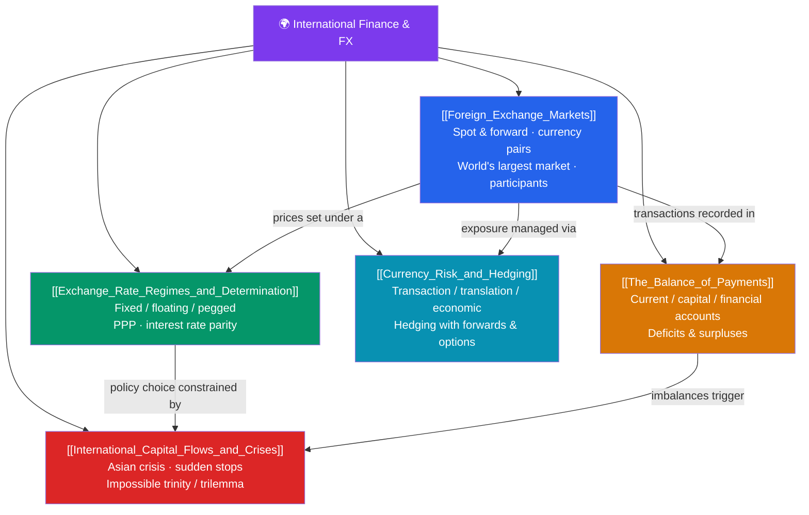

# 🌍 International Finance & FX — Map of Content

> [!abstract] What This Section Covers
> International finance studies money across borders — where exchange rates, capital flows, and sovereign policy interact. It opens with the **foreign exchange market**, the world's largest and most liquid market at roughly $7.5 trillion in daily turnover, trading spot and forward in currency pairs (EUR/USD, USD/JPY). **Exchange-rate regimes and determination** cover the spectrum from fixed to floating to pegged, and the parity conditions that anchor rates: purchasing power parity (the law of one price) and interest rate parity (covered and uncovered). The **balance of payments** accounts for a nation's transactions with the world — current, capital, and financial accounts — and why deficits and surpluses matter. **International capital flows and crises** examine the Asian financial crisis, sudden stops, and the **impossible trinity**: a country cannot simultaneously have a fixed exchange rate, free capital movement, and independent monetary policy. Finally, **currency risk and hedging** teach firms to manage transaction, translation, and economic exposure with forwards and options. This bridges finance and macroeconomics.

## Concept Map

## Learning Path
1. [[Foreign_Exchange_Markets]] — The world's largest market: spot and forward, currency pairs, and participants.
2. [[Exchange_Rate_Regimes_and_Determination]] — Fixed/floating/pegged regimes plus PPP and interest rate parity.
3. [[The_Balance_of_Payments]] — A nation's accounts: current, capital, and financial, with deficits and surpluses.
4. [[International_Capital_Flows_and_Crises]] — The Asian crisis, sudden stops, and the impossible trinity.
5. [[Currency_Risk_and_Hedging]] — Transaction, translation, and economic exposure, hedged with forwards and options.

## All Notes at a Glance

| Note | Difficulty | What You'll Learn |
|------|------------|-------------------|
| [[Foreign_Exchange_Markets]] | Beginner | Spot vs forward, base/quote pairs, ~$7.5T daily turnover, market participants |
| [[Exchange_Rate_Regimes_and_Determination]] | Intermediate | Fixed/floating/pegged, PPP, covered and uncovered interest rate parity |
| [[The_Balance_of_Payments]] | Intermediate | Current/capital/financial accounts, trade balance, surplus vs deficit |
| [[International_Capital_Flows_and_Crises]] | Advanced | 1997 Asian crisis, sudden stops, capital flight, the impossible trinity |
| [[Currency_Risk_and_Hedging]] | Intermediate | Transaction/translation/economic exposure, forward and option hedges, natural hedging |

## Key Questions This Section Answers
- Why is FX the world's largest market, and how are spot and forward rates quoted?
- What forces pull exchange rates toward purchasing power parity and interest rate parity?
- What does a current-account deficit really mean for a country's financing?
- Why can't a nation simultaneously fix its exchange rate, allow free capital flows, and run independent monetary policy?
- How does a multinational hedge transaction and economic exposure with forwards and options?

## Related Sections
- [[_MOC_Finance_Master|↑ Finance Master MOC]]
- [[_MOC_FinTech|← FinTech & Payments]] — The cross-border payment rails behind FX
- [[_MOC_Macroeconomics_Master]] — Cross-vault: the open-economy macro behind exchange rates and crises

#MOC #Finance #InternationalFinance
