# 💰 Finance — Master Map of Content

> [!abstract] About This Vault
> A complete finance reference: **65 notes across 13 sections**, covering the theory and practice taught in MBA finance courses and the CFA curriculum — now extended from the professional core into personal and applied finance. The original stack runs from financial markets and instruments, through corporate finance (TVM, capital budgeting, WACC, capital structure), valuation (DCF, comps, precedents, LBO), investment analysis, risk and return (portfolio theory, CAPM), and financial modeling. The **2026 expansion** adds **personal finance, behavioral finance, financial accounting, fixed income & bonds, derivatives & options, FinTech & payments, and international finance & FX**. Every note pairs an intuition-first analogy with real-world examples, worked numerical examples, mermaid diagrams, and review questions. Cross-linked to [[Quantitative_Finance]], [[Macroeconomics]], [[_MOC_Psychology_Master]] (behavioral), and the History vault's [[Financial_History_and_Crises]]. Start at the section matching your goal, or follow one of the five learning paths below.

---

## Vault Architecture

```mermaid
graph TD
    Master["💰 Finance Master"]

    Master --> S01["01 Financial Markets"]
    Master --> S02["02 Corporate Finance"]
    Master --> S03["03 Valuation"]
    Master --> S04["04 Investment Analysis"]
    Master --> S05["05 Risk & Return"]
    Master --> S06["06 Financial Modeling"]
    Master --> S07["07 Personal Finance"]
    Master --> S08["08 Behavioral Finance"]
    Master --> S09["09 Financial Accounting"]
    Master --> S10["10 Fixed Income & Bonds"]
    Master --> S11["11 Derivatives & Options"]
    Master --> S12["12 FinTech & Payments"]
    Master --> S13["13 International Finance & FX"]

    S01 --> FM1["Market Structure\n& Participants"]
    S01 --> FM2["Equity Markets"]
    S01 --> FM3["Fixed Income\nMarkets"]
    S01 --> FM4["Money Markets"]
    S01 --> FM5["Market\nMicrostructure"]

    S02 --> CF1["Time Value\nof Money"]
    S02 --> CF2["Capital\nBudgeting"]
    S02 --> CF3["WACC"]
    S02 --> CF4["Capital\nStructure"]
    S02 --> CF5["Dividend\nPolicy"]

    S03 --> V1["DCF Analysis"]
    S03 --> V2["Comparable\nCompany Analysis"]
    S03 --> V3["Precedent\nTransactions"]
    S03 --> V4["LBO Analysis"]
    S03 --> V5["Sum-of-Parts\nValuation"]

    S04 --> IA1["Fundamental\nAnalysis"]
    S04 --> IA2["Financial Statement\nAnalysis"]
    S04 --> IA3["Equity Research"]
    S04 --> IA4["Fixed Income\nAnalysis"]
    S04 --> IA5["Alternative\nInvestments"]

    S05 --> RR1["Risk & Return\nFundamentals"]
    S05 --> RR2["Portfolio Theory\nBasics"]
    S05 --> RR3["CAPM &\nFactor Models"]
    S05 --> RR4["Behavioral\nFinance"]
    S05 --> RR5["Performance\nMeasurement"]

    S06 --> MO1["Three-Statement\nModel"]
    S06 --> MO2["Excel Best\nPractices"]
    S06 --> MO3["Scenario &\nSensitivity Analysis"]
    S06 --> MO4["Mergers &\nAcquisitions"]
    S06 --> MO5["Financial\nForecasting"]

    S07 --> PF1["Budgeting & Saving"]
    S07 --> PF2["Compounding"]
    S07 --> PF3["Debt & Credit"]
    S07 --> PF4["Retirement & FIRE"]
    S07 --> PF5["Insurance"]

    S08 --> BF1["Foundations"]
    S08 --> BF2["Prospect Theory"]
    S08 --> BF3["Investing Biases"]
    S08 --> BF4["Anomalies & Bubbles"]
    S08 --> BF5["Nudges"]

    S09 --> FA1["Income Statement"]
    S09 --> FA2["Balance Sheet"]
    S09 --> FA3["Cash Flow Statement"]
    S09 --> FA4["Accrual / GAAP & IFRS"]
    S09 --> FA5["Ratio Analysis"]

    S10 --> FI1["Bond Fundamentals"]
    S10 --> FI2["Pricing & Yields"]
    S10 --> FI3["Duration & Convexity"]
    S10 --> FI4["Yield Curve"]
    S10 --> FI5["Credit Risk"]

    S11 --> D1["Forwards & Futures"]
    S11 --> D2["Options Basics"]
    S11 --> D3["Black-Scholes"]
    S11 --> D4["The Greeks"]
    S11 --> D5["Swaps & Hedging"]

    S12 --> FT1["Payment Rails"]
    S12 --> FT2["Digital Banking"]
    S12 --> FT3["Lending Tech"]
    S12 --> FT4["Blockchain & DeFi"]
    S12 --> FT5["Regtech & Data"]

    S13 --> IF1["FX Markets"]
    S13 --> IF2["Exchange-Rate Regimes"]
    S13 --> IF3["Balance of Payments"]
    S13 --> IF4["Capital Flows & Crises"]
    S13 --> IF5["Currency Risk"]

    style Master fill:#7c3aed,color:#fff
    style S01 fill:#2563eb,color:#fff
    style S02 fill:#059669,color:#fff
    style S03 fill:#d97706,color:#fff
    style S04 fill:#dc2626,color:#fff
    style S05 fill:#7c3aed,color:#fff
    style S06 fill:#0891b2,color:#fff
    style S07 fill:#2563eb,color:#fff
    style S08 fill:#059669,color:#fff
    style S09 fill:#d97706,color:#fff
    style S10 fill:#dc2626,color:#fff
    style S11 fill:#db2777,color:#fff
    style S12 fill:#0891b2,color:#fff
    style S13 fill:#4a9eff,color:#fff
```

---

## Sections at a Glance

| # | Section | Notes | Entry Point | Difficulty |
|---|---------|-------|-------------|------------|
| 01 | Financial Markets | 5 | [[_MOC_Financial_Markets]] | Beginner |
| 02 | Corporate Finance | 5 | [[_MOC_Corporate_Finance]] | Beginner → Intermediate |
| 03 | Valuation | 5 | [[_MOC_Valuation]] | Intermediate → Advanced |
| 04 | Investment Analysis | 5 | [[_MOC_Investment_Analysis]] | Intermediate |
| 05 | Risk & Return | 5 | [[_MOC_Risk_Return]] | Intermediate → Advanced |
| 06 | Financial Modeling | 5 | [[_MOC_Financial_Modeling]] | Intermediate → Advanced |
| 07 | Personal Finance | 5 | [[_MOC_Personal_Finance]] | Beginner |
| 08 | Behavioral Finance | 5 | [[_MOC_Behavioral_Finance]] | Intermediate |
| 09 | Financial Accounting | 5 | [[_MOC_Financial_Accounting]] | Beginner → Intermediate |
| 10 | Fixed Income & Bonds | 5 | [[_MOC_Fixed_Income]] | Intermediate → Advanced |
| 11 | Derivatives & Options | 5 | [[_MOC_Derivatives]] | Advanced |
| 12 | FinTech & Payments | 5 | [[_MOC_FinTech]] | Intermediate |
| 13 | International Finance & FX | 5 | [[_MOC_International_Finance]] | Intermediate → Advanced |

---

## Learning Paths

### Path 1 — Investment Banker

> Best for: analysts and associates building deal models, pitch books, and executing M&A and capital markets transactions.

**Markets → Corporate Finance → Valuation → Modeling**

[[Market_Structure_and_Participants]] → [[Equity_Markets]] → [[Fixed_Income_Markets]] → [[Time_Value_of_Money]] → [[Cost_of_Capital_and_WACC]] → [[Capital_Structure]] → [[DCF_Analysis]] → [[Comparable_Company_Analysis]] → [[Precedent_Transactions]] → [[LBO_Analysis]] → [[Three_Statement_Model]] → [[Mergers_and_Acquisitions]] → [[Scenario_and_Sensitivity_Analysis]]

---

### Path 2 — Equity Analyst

> Best for: buy-side and sell-side analysts building investment theses, researching stocks, and writing research reports.

**Analysis → Valuation → Risk**

[[Financial_Statement_Analysis]] → [[Fundamental_Analysis]] → [[Equity_Research]] → [[DCF_Analysis]] → [[Comparable_Company_Analysis]] → [[Sum_of_Parts_Valuation]] → [[Risk_and_Return_Fundamentals]] → [[CAPM_and_Factor_Models]] → [[Performance_Measurement]] → [[Behavioral_Finance]]

---

### Path 3 — Corporate Finance Professional

> Best for: CFOs, finance managers, and treasury teams making capital allocation, financing, and dividend decisions.

**Foundations → Corporate Finance → Modeling**

[[Time_Value_of_Money]] → [[Capital_Budgeting]] → [[Cost_of_Capital_and_WACC]] → [[Capital_Structure]] → [[Dividend_Policy]] → [[Three_Statement_Model]] → [[Financial_Forecasting]] → [[Scenario_and_Sensitivity_Analysis]] → [[DCF_Analysis]]

---

### Path 4 — CFA Candidate

> Best for: Level I–III CFA candidates covering the full curriculum systematically.

- **Ethics & Markets:** [[Market_Structure_and_Participants]] → [[Equity_Markets]] → [[Fixed_Income_Markets]] → [[Money_Markets]] → [[Market_Microstructure]]
- **Corporate Finance:** [[Time_Value_of_Money]] → [[Capital_Budgeting]] → [[Cost_of_Capital_and_WACC]] → [[Capital_Structure]] → [[Dividend_Policy]]
- **Equity & Fixed Income:** [[Fundamental_Analysis]] → [[Financial_Statement_Analysis]] → [[Fixed_Income_Analysis]] → [[Equity_Research]]
- **Portfolio Management:** [[Risk_and_Return_Fundamentals]] → [[Portfolio_Theory_Basics]] → [[CAPM_and_Factor_Models]] → [[Performance_Measurement]] → [[Behavioral_Finance]]
- **Alternative Investments:** [[Alternative_Investments]]

---

### Path 5 — Personal Investor & Everyday Finance (2026 expansion)

> Best for: managing your own money and understanding the instruments and forces behind the headlines.

[[_MOC_Personal_Finance]] → [[The_Power_of_Compounding]] → [[Budgeting_and_Saving]] → [[Retirement_Planning_and_FIRE]] → [[_MOC_Behavioral_Finance]] → [[Prospect_Theory_and_Loss_Aversion]] → [[Cognitive_Biases_in_Investing]] → [[_MOC_Financial_Accounting]] → [[Financial_Ratio_Analysis]] → [[_MOC_Fixed_Income]] → [[Bond_Fundamentals]] → [[_MOC_Derivatives]] → [[Options_Basics]] → [[_MOC_International_Finance]]

---

## Cross-Vault Links

This vault covers core finance theory; related vaults handle quantitative methods and macro context:

- **Quantitative Finance vault** — [[Quantitative_Finance]] covers options pricing (Black-Scholes), derivatives, risk models (VaR, CVaR), and algorithmic trading — the mathematical toolkit layered on top of the concepts here.
- **Macroeconomics vault** — [[Macroeconomics]] covers GDP, inflation, monetary policy, and interest rate theory that drives the discount rates and market conditions analyzed in this vault.
- **Microeconomics vault** — [[Microeconomics]] covers supply/demand, pricing theory, and competitive dynamics underlying industry and company analysis.

---

## Section MOC Index

- [[_MOC_Financial_Markets]] — How markets are structured: exchanges, participants, equity/fixed-income/money markets, and market microstructure.
- [[_MOC_Corporate_Finance]] — The theory of the firm: TVM, investment decisions (NPV/IRR), cost of capital, capital structure (Modigliani-Miller), and dividend policy.
- [[_MOC_Valuation]] — How to value a business: DCF, comparable company analysis, precedent transactions, LBO, and sum-of-parts.
- [[_MOC_Investment_Analysis]] — How to analyze investments: fundamental analysis, financial statement analysis, equity research, fixed income analysis, and alternatives.
- [[_MOC_Risk_Return]] — The risk-return framework: diversification, portfolio theory, CAPM and factor models, behavioral finance, and performance measurement.
- [[_MOC_Financial_Modeling]] — Building financial models: three-statement model, Excel best practices, scenario/sensitivity analysis, M&A modeling, and forecasting.

**2026 expansion:**
- [[_MOC_Personal_Finance]] — Managing your own money: budgeting, compounding, debt, retirement/FIRE, and insurance.
- [[_MOC_Behavioral_Finance]] — Why real investors err: prospect theory, biases, anomalies, bubbles, and nudges.
- [[_MOC_Financial_Accounting]] — Reading the books: the three statements, accrual accounting, GAAP/IFRS, and ratio analysis.
- [[_MOC_Fixed_Income]] — Bonds in depth: fundamentals, pricing & yields, duration/convexity, the yield curve, and credit risk.
- [[_MOC_Derivatives]] — Forwards, futures, options, Black-Scholes, the Greeks, swaps, and hedging.
- [[_MOC_FinTech]] — The technology layer: payment rails, digital banking, lending tech, DeFi, and regtech.
- [[_MOC_International_Finance]] — Cross-border finance: FX markets, exchange-rate regimes, balance of payments, capital flows, and currency risk.

#MOC #Finance #MasterMOC
