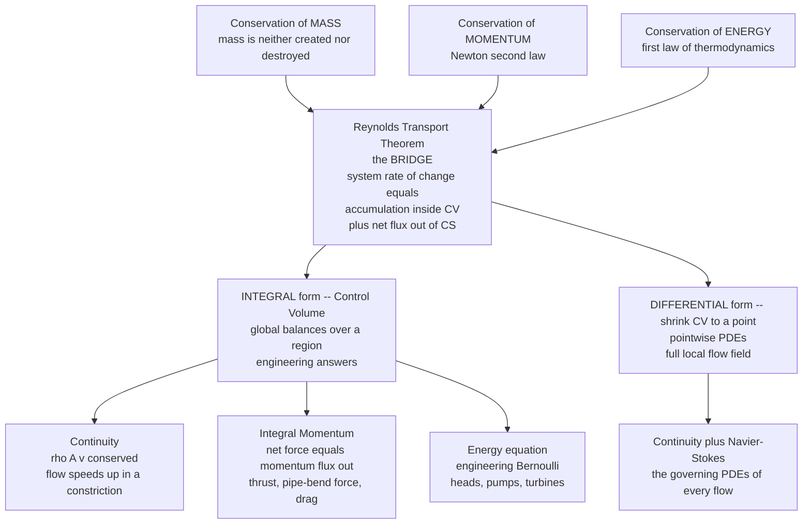

# 🌊 Conservation Laws and Control Volumes

> [!abstract] TL;DR
> All of fluid dynamics rests on three physical laws — conservation of **mass**, **momentum**, and **energy** — plus thermodynamics. The **Reynolds Transport Theorem** rewrites these laws (naturally stated for a moving lump of fluid) as balances over a **fixed region in space**: *rate of accumulation inside = net flux across the boundary + sources*. This bookkeeping yields the **continuity equation** (why flow speeds up in a constriction) and the **integral momentum equation** — an engineer's superpower that computes thrust and forces (jet engines, rockets, pipe bends) from what crosses the boundary alone, without ever solving the churning interior flow. Shrink the region to a point and the same laws become the differential Navier-Stokes equations.

---

## Intuition

**Analogy:** Imagine drawing an invisible box in the middle of a flowing river. You do **not** track every water molecule inside — instead you stand at the box's walls and do accounting: whatever mass flows *in* must flow *out* or pile up inside; whatever momentum enters and leaves, plus the forces pushing on the box, must balance. This "control volume" bookkeeping is an engineer's superpower — it computes the thrust of a jet engine or the force of water on a pipe bend **without knowing a single detail of the turbulent flow inside**, purely from what crosses the boundary.

The trick is that conservation laws are *global* statements. If you pick your box cleverly — so that the messy physics stays *inside* and only clean, measurable quantities cross the walls — you can extract an exact answer (a force, a flow rate, a thrust) from arithmetic on the boundary. That is the entire philosophy of control-volume analysis.

---

## How It Works

### Core Mechanics

**1. The conservation laws are the bedrock.** Three physical statements, borrowed from mechanics and thermodynamics, hold for *any* fluid:

- **Mass** is neither created nor destroyed.
- **Momentum** changes only under a net force (Newton's second law).
- **Energy** is conserved (first law of thermodynamics — internal, kinetic, and potential energy, plus heat and work).

Every governing equation of fluid dynamics — up to and including the full Navier-Stokes system — is *derived* from these, so getting the accounting right is the whole game.

**2. System vs. Control Volume — two viewpoints.**

- A **system** (Lagrangian view) is a fixed set of fluid particles you follow as they move — like tagging one packet of water and chasing it downstream. Conservation laws are *naturally* written this way ("the momentum of *these* particles changes under force"). But chasing a deforming blob through a flowing, mixing fluid is hopeless in practice.
- A **control volume** (Eulerian view) is a fixed — or moving — region in space that fluid flows *through*, like our imaginary box in the river. You watch a window, not a wandering blob. This is the engineer's choice because inlets, outlets, and walls are exactly where we can measure and where boundary conditions live.

**3. The Reynolds Transport Theorem (RTT) is the bridge.** It converts a law written for a *system* into a statement about a *control volume*. For any extensive property $B$ (mass, momentum, energy) with intensive counterpart $b = B/m$:

$$\underbrace{\frac{dB_{\text{sys}}}{dt}}_{\text{law lives here}} = \underbrace{\frac{\partial}{\partial t}\int_{CV}\rho\,b\,dV}_{\text{accumulation inside}} + \underbrace{\int_{CS}\rho\,b\,(\vec{v}\cdot\hat{n})\,dA}_{\text{net flux out of the surface}}$$

In words: **the rate of change for the system = what piles up inside the control volume + what streams out across the control surface.** This one accounting identity is the master framework; the three conservation laws are just three choices of $b$.

**4. Mass → the Continuity equation.** Set $B = m$, so $b = 1$. Mass of the system is constant ($dB_{\text{sys}}/dt = 0$):

$$\frac{\partial}{\partial t}\int_{CV}\rho\,dV + \int_{CS}\rho\,(\vec{v}\cdot\hat{n})\,dA = 0$$

*Storage inside + net outflow = 0.* For **steady** flow the storage term vanishes, so mass flux in equals mass flux out. Along a stream tube with one inlet and one outlet:

$$\rho_1 A_1 v_1 = \rho_2 A_2 v_2 \qquad(\dot m = \rho A v = \text{const})$$

If density is constant (incompressible), $A_1 v_1 = A_2 v_2$: **halve the area and the flow doubles its speed** — the reason a nozzle or a pinched garden hose accelerates the jet. Shrinking the control volume to a point gives the **differential** form:

$$\frac{\partial\rho}{\partial t} + \nabla\cdot(\rho\vec{v}) = 0 \quad\xrightarrow{\text{incompressible}}\quad \nabla\cdot\vec{v} = 0$$

**5. Momentum → the Integral Momentum equation.** Set $b = \vec{v}$. The system law is $dB_{\text{sys}}/dt = \sum\vec{F}$ (Newton's second law), giving:

$$\sum\vec{F} = \frac{\partial}{\partial t}\int_{CV}\rho\vec{v}\,dV + \int_{CS}\rho\vec{v}\,(\vec{v}\cdot\hat{n})\,dA$$

**The net force on the control volume equals the storage of momentum plus the net momentum flux out.** For steady flow this collapses to $\sum\vec{F} = \dot m\,(\vec{v}_{\text{out}} - \vec{v}_{\text{in}})$ — forces computed *entirely from boundary velocities and mass flow*, with the interior flow left as a black box. This single equation delivers rocket and jet **thrust**, the force of a jet on a plate or vane, the reaction on a **pipe bend**, sluice-gate loads, and control-volume drag.

**6. Energy → the engineering energy equation.** Set $b = e = \hat u + \tfrac{1}{2}v^2 + gz$. The first law ($\dot Q - \dot W = dB_{\text{sys}}/dt$) becomes a control-volume energy balance. For steady incompressible flow along a stream tube it reduces to the **engineering Bernoulli / head form**, with terms for pump work, turbine extraction, and friction head loss — the topic foreshadowing the sibling note *Bernoulli_and_Energy_in_Flows*.

**7. Integral vs. differential — the same laws, two forms.** The **integral** (control-volume) form gives *global* answers — total forces, flow rates, thrust — with no need to resolve the flow field; ideal for engineering. The **differential** form is obtained by applying the divergence theorem and shrinking the control volume to a point, yielding *pointwise* PDEs — the continuity equation and the Navier-Stokes momentum equations — that describe the full local flow field. They are complementary tools: pick the integral form for a quick exact force, the differential form for the whole velocity field.

### Flow / Architecture



---

## Key Concepts

### Secondary Level

- **Nothing disappears.** Mass, momentum, and energy are conserved — you can only move them around or store them. Fluid dynamics is the accounting of that movement.
- **Continuity in a hose.** Water speeds up where a pipe narrows because the same amount of water per second must pass every cross-section: $A_1 v_1 = A_2 v_2$. Pinch the hose and the jet shoots farther.
- **Push equals momentum change.** A rocket flies because it throws mass backward fast; the reaction on the rocket equals the rate at which it hurls momentum out the nozzle.

### Undergraduate Level

- **Control volume vs. system.** Lagrangian (follow the particles) vs. Eulerian (watch a fixed window). The RTT converts one to the other.
- **The RTT master equation.** $\frac{dB_{\text{sys}}}{dt} = \frac{\partial}{\partial t}\int_{CV}\rho b\,dV + \int_{CS}\rho b\,(\vec v\cdot\hat n)\,dA$ — choose $b\in\{1,\vec v,e\}$ to recover mass, momentum, energy balances.
- **Steady-flow shortcuts.** Storage terms drop: $\dot m_{\text{in}}=\dot m_{\text{out}}$ and $\sum\vec F = \dot m(\vec v_{\text{out}}-\vec v_{\text{in}})$.
- **Choosing a smart control volume.** Draw the surface so unknown pressures/velocities are avoided and only measurable fluxes cross it. Include gauge-pressure forces on cut inlets/outlets and the anchoring reaction force.
- **Differential forms.** Continuity $\partial_t\rho + \nabla\cdot(\rho\vec v)=0$; incompressible $\nabla\cdot\vec v = 0$.

### Graduate Level

- **From integral to differential via the divergence theorem.** $\int_{CS}\rho b\,(\vec v\cdot\hat n)\,dA = \int_{CV}\nabla\cdot(\rho b\,\vec v)\,dV$ (Gauss). Since the CV is arbitrary, the integrand vanishes pointwise — this is *exactly* how the PDEs are born.
- **Moving and deforming control volumes.** Replace $\vec v$ in the flux term with the relative velocity $\vec v_r = \vec v - \vec v_{CS}$; non-inertial CVs add fictitious body forces (useful for turbomachinery in a rotating frame).
- **Reynolds Transport in tensor form.** Momentum flux is the tensor $\rho\vec v\otimes\vec v$; its divergence yields the nonlinear convective term $(\vec v\cdot\nabla)\vec v$, the seed of turbulence.
- **Angular momentum control volumes.** Taking $b = \vec r\times\vec v$ gives the Euler turbomachine equation for pumps and turbines.
- **Compressible energy accounting.** Retaining internal energy and flow work ($p/\rho$) produces enthalpy-based balances central to *Compressible_Flow_and_Gas_Dynamics*.

---

## Python Demo

```python
# Control-volume analysis in action: extract FORCES, THRUST, and the
# continuity speed-up from BOUNDARY FLUXES alone -- never solving the
# interior flow. Then verify the differential continuity law div(v)=0.
import numpy as np
import matplotlib.pyplot as plt

rho_gas = 1.2       # kg/m^3  (exhaust gas, order of magnitude)
rho_w   = 1000.0    # kg/m^3  (water)

# ---------------------------------------------------------------
# (a1) ROCKET/JET THRUST from the INTEGRAL MOMENTUM balance
#      Steady CV around the engine:  sum(F) = mdot*(v_out - v_in)
#      Rocket (no air inlet):        Thrust  = mdot * Ve
#      -> computed purely from the momentum FLUX crossing the exit plane
# ---------------------------------------------------------------
Ve = np.linspace(500, 3500, 300)                 # exhaust velocity [m/s]
mdots = [50, 100, 200]                            # propellant flow [kg/s]

# ---------------------------------------------------------------
# (a2) FORCE OF A JET ON A FLAT PLATE (normal impact)
#      CV around the plate: incoming momentum flux is destroyed in x.
#      Steady:  F = mdot * Vjet = (rho*A*Vjet) * Vjet = rho*A*Vjet^2
# ---------------------------------------------------------------
Vjet = np.linspace(1, 30, 300)                    # jet speed [m/s]
A_jet = 1e-3                                       # jet area 10 cm^2 [m^2]
F_plate = rho_w * A_jet * Vjet**2                  # force on plate [N]

# ---------------------------------------------------------------
# (b1) CONTINUITY in a converging duct: A1*v1 = A(x)*v(x)
#      Mass conservation alone forces the speed-up -- no dynamics needed.
# ---------------------------------------------------------------
x  = np.linspace(0.0, 1.0, 300)                    # position along duct [m]
A1, A2 = 0.10, 0.02                                # inlet/outlet area [m^2]
v1 = 2.0                                            # inlet velocity [m/s]
A_x = A1 + (A2 - A1) * x                            # linear taper
v_x = v1 * A1 / A_x                                 # continuity: v = v1*A1/A(x)

# ---------------------------------------------------------------
# (b2) VERIFY differential continuity div(v)=0 for an incompressible
#      field v = (-y, x) (rigid rotation) on a grid.
# ---------------------------------------------------------------
gx = np.linspace(-2, 2, 40)
gy = np.linspace(-2, 2, 40)
GX, GY = np.meshgrid(gx, gy)
U, V = -GY, GX                                      # incompressible field
dUdx = np.gradient(U, gx, axis=1)
dVdy = np.gradient(V, gy, axis=0)
div = dUdx + dVdy                                   # should be ~ 0 everywhere
print(f"Continuity check: max|div(v)| = {np.max(np.abs(div)):.2e} (expect ~0)")
print(f"Rocket example: mdot=100 kg/s, Ve=3000 m/s -> Thrust = {100*3000/1e3:.0f} kN")
print(f"Contraction: A drops {A1/A2:.0f}x -> exit speed = {v_x[-1]:.1f} m/s "
      f"(inlet {v1} m/s)")

# ---------------------------------------------------------------
# Plots
# ---------------------------------------------------------------
fig, ax = plt.subplots(2, 2, figsize=(13, 10))

# (a1) Thrust vs exhaust velocity
for md in mdots:
    ax[0, 0].plot(Ve, md * Ve / 1e3, lw=2, label=f"mdot = {md} kg/s")
ax[0, 0].set_title("Rocket THRUST from momentum flux (T = mdot * Ve)")
ax[0, 0].set_xlabel("exhaust velocity Ve [m/s]")
ax[0, 0].set_ylabel("thrust [kN]")
ax[0, 0].legend(); ax[0, 0].grid(alpha=0.3)

# (a2) Force of jet on plate vs jet speed
ax[0, 1].plot(Vjet, F_plate, color="#d1495b", lw=2)
ax[0, 1].set_title("Force of water JET on a plate (F = rho*A*V^2)")
ax[0, 1].set_xlabel("jet velocity V [m/s]")
ax[0, 1].set_ylabel("force on plate [N]")
ax[0, 1].grid(alpha=0.3)

# (b1) Continuity speed-up in a contraction
ax2 = ax[1, 0]
ax2.plot(x, v_x, color="#1b6ca8", lw=2, label="velocity v(x)")
ax2.set_title("CONTINUITY: flow speeds up as area shrinks")
ax2.set_xlabel("position along duct [m]")
ax2.set_ylabel("velocity [m/s]", color="#1b6ca8")
ax2b = ax2.twinx()
ax2b.plot(x, A_x, color="#e08e0b", lw=2, ls="--", label="area A(x)")
ax2b.set_ylabel("cross-section area [m^2]", color="#e08e0b")
ax2.grid(alpha=0.3)

# (b2) Incompressible field with div ~ 0
ax[1, 1].quiver(GX[::2, ::2], GY[::2, ::2], U[::2, ::2], V[::2, ::2],
                color="#2a9d8f")
ax[1, 1].set_title(f"Incompressible field v=(-y,x): max|div| = "
                   f"{np.max(np.abs(div)):.1e}")
ax[1, 1].set_xlabel("x"); ax[1, 1].set_ylabel("y")
ax[1, 1].set_aspect("equal")

plt.tight_layout()
plt.savefig("control_volume_analysis.png", dpi=110)
print("Saved control_volume_analysis.png")
```

**What it shows.** Panels (a1) and (a2) extract a rocket's thrust and a jet's force on a plate straight from the integral momentum balance — the answers depend only on mass flow and boundary velocities, never on the interior flow. Panel (b1) shows the continuity equation forcing the flow to accelerate as the duct contracts ($A_1v_1 = A(x)v(x)$). Panel (b2) confirms the differential continuity law: the incompressible field $\vec v = (-y, x)$ has numerically zero divergence everywhere.

---

## Real-World Applications

> **Jet and rocket propulsion.** Engine thrust is computed by a control volume drawn around the engine: $T = \dot m_e v_e - \dot m_i v_i + (p_e - p_a)A_e$. Engineers size turbofans and rocket nozzles from this integral momentum balance long before any CFD of the combustor's chaotic interior.

- **Pipe bends and elbows** — plant piping is anchored using the momentum equation: a 90° bend carrying high-speed water feels a large reaction force that must be restrained by thrust blocks.
- **Pelton and Kaplan turbines / Francis pumps** — the angular-momentum control volume (Euler turbomachine equation) sets the torque and power from inlet/outlet swirl velocities.
- **Fire hoses and water jets** — the backward force on a firefighter and the cutting force of a water-jet cutter both come from $F = \rho A v^2$.
- **HVAC and nozzle design** — continuity ($\rho A v = \text{const}$) sizes ducts and nozzles so target velocities are met as area changes.
- **CFD solvers** — finite-volume methods (the dominant CFD approach) *are* control-volume analysis applied to millions of tiny cells, enforcing the same flux balances discretely.

---

## Common Pitfalls

- **Forgetting the pressure forces on the control surface.** $\sum\vec F$ in the momentum equation includes gauge-pressure forces acting on cut inlet/outlet areas, plus the anchoring reaction. Omitting the $pA$ terms is the most common momentum-balance error.
- **Using absolute instead of relative velocity on a moving CV.** For a moving or deforming control volume, the flux must use $\vec v_r = \vec v - \vec v_{CS}$. Mixing frames gives wrong thrust for accelerating vehicles.
- **Dropping the unsteady storage term too early.** The $\partial_t\int_{CV}$ term is zero only for *steady* flow. Filling tanks, water hammer, and starting transients need it.
- **Sign errors from the outward normal.** The flux $\rho b(\vec v\cdot\hat n)$ is positive for outflow, negative for inflow, with $\hat n$ pointing *out* of the surface. Flip a sign and inflow looks like a source.
- **Confusing mass flux with volume flux for compressible gases.** $\dot m = \rho A v$ is conserved in steady flow, but volume flux $Av$ is not when density changes — a trap in nozzle and gas-dynamics problems.
- **Assuming incompressible ($\nabla\cdot\vec v=0$) when it is not.** Valid for liquids and low-speed gas (Mach $<0.3$); high-speed compressible flow keeps the full $\partial_t\rho + \nabla\cdot(\rho\vec v)=0$.

Deeper development of these ideas lives in the sibling notes *The_Navier_Stokes_Equations* (the differential momentum law in full), *Kinematics_of_Fluid_Flow* (velocity fields, material derivative, streamlines that define the fluxes), *Bernoulli_and_Energy_in_Flows* (the energy balance specialized to streamlines), *The_Continuum_Hypothesis_and_Fluid_Properties* (why $\rho$ and $\vec v$ are well-defined fields at all), and *Compressible_Flow_and_Gas_Dynamics* (control volumes when density varies).

---

## Related Concepts

- [[Newtons_Laws_and_Kinematics]] — the momentum control-volume equation is Newton's second law rewritten for a flowing region.
- [[Work_Energy_and_Conservation]] — the energy balance is the first law applied to a control volume; conservation principles carry straight over.
- [[Integral_Theorems]] — the divergence (Gauss) theorem converts the surface-flux integrals into volume integrals, turning integral balances into differential PDEs.
- [[Euler_Equations_and_Ideal_Fluids]] — the inviscid differential form these control-volume laws collapse to; Bernoulli is their steady energy specialization.
- [[Viscous_Fluids_and_Navier_Stokes]] — the full differential momentum law obtained by shrinking the momentum control volume to a point and adding viscous stresses.
- [[Fluid_Statics_and_Properties]] — the zero-velocity limit, where all flux terms vanish and only pressure forces on the control surface remain.
- [[Vector_Calculus_and_Differential_Operators]] — divergence and flux are the operators the flux integrals and continuity equation are built from.
- [[Laws_of_Thermodynamics]] — supplies the first law that closes the energy balance and the thermodynamic relations for compressible flow.

---

## Review Questions

1. **Secondary:** Water flows at $2\ \text{m/s}$ through a pipe of area $100\ \text{cm}^2$ that narrows to $25\ \text{cm}^2$. Using conservation of mass alone, what is the speed in the narrow section? Why does the water speed up without anything pushing it?
2. **Undergraduate:** A horizontal jet of water ($\rho = 1000\ \text{kg/m}^3$, area $10\ \text{cm}^2$, speed $20\ \text{m/s}$) strikes a stationary flat plate normally and spreads sideways. Draw a control volume and use the *integral momentum equation* to find the force on the plate — without solving the flow field. Which terms of the RTT vanish, and why?
3. **Graduate:** Starting from the Reynolds Transport Theorem with $b=1$, apply the divergence theorem to the mass balance over an *arbitrary* control volume and argue why the integrand must vanish pointwise, recovering $\partial_t\rho + \nabla\cdot(\rho\vec v)=0$. Then state precisely the assumptions that reduce it to $\nabla\cdot\vec v = 0$, and give one flow regime where each assumption fails.

---

## Sources

- White, F. M. — *Fluid Mechanics*, 8th ed., Ch. 3 (Integral Relations for a Control Volume). McGraw-Hill.
- Munson, Young, Okiishi & Huebsch — *Fundamentals of Fluid Mechanics*, Chs. 4–5 (Reynolds Transport Theorem, finite control-volume analysis). Wiley.
- Kundu, Cohen & Dowling — *Fluid Mechanics*, 6th ed., Ch. 4 (Conservation Laws). Academic Press.
- Çengel & Cimbala — *Fluid Mechanics: Fundamentals and Applications*, Ch. 5–6 (Mass, Bernoulli, Energy; Momentum Analysis). McGraw-Hill.
- Batchelor, G. K. — *An Introduction to Fluid Dynamics*, Ch. 2 (Kinematics and conservation of mass). Cambridge University Press.

---

#fluid-dynamics #conservation-laws #control-volume #continuity #reynolds-transport-theorem
