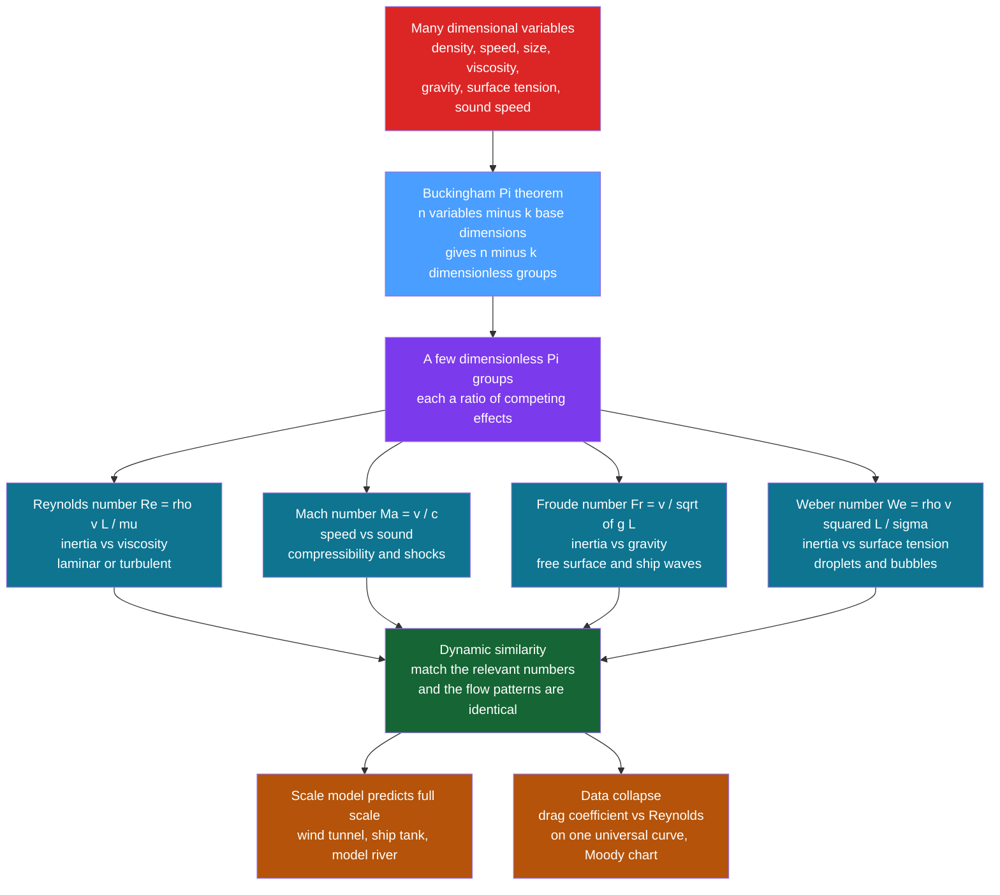

# 🌬️ Dimensional Analysis and Similarity

> [!abstract] TL;DR
> Physical laws must be **dimensionally consistent** and cannot depend on our arbitrary choice of units, so any true relationship can be rewritten purely in terms of **dimensionless groups**. The **Buckingham Pi theorem** makes this precise: a problem with $n$ variables built from $k$ independent dimensions collapses to just $n-k$ dimensionless numbers. In fluid dynamics those numbers each measure a **ratio of competing effects** — Reynolds $\mathrm{Re}=\rho v L/\mu$ (inertia vs viscosity), Mach $\mathrm{Ma}=v/c$ (speed vs sound), Froude $\mathrm{Fr}=v/\sqrt{gL}$ (inertia vs gravity), Weber $\mathrm{We}=\rho v^2 L/\sigma$ (inertia vs surface tension) — and tell you which physics **dominates** and which terms you may drop. **Dynamic similarity** is the payoff: match the relevant numbers and a wind-tunnel model, ship-tank hull, or model river reproduces the full-scale flow exactly, scaled. Plotting dimensionless quantities then **collapses** data from every size, speed, and fluid onto one universal curve — the $C_D$-vs-$\mathrm{Re}$ curve for a sphere, the Moody chart for pipe friction.

---

## Intuition

**Analogy:** How can a tiny model airplane in a wind tunnel tell you how a full-size jet will fly? The secret is that **nature does not care about absolute sizes and speeds — it cares about ratios.** If the little model and the real jet share the same key dimensionless ratio (their Reynolds number), the flow patterns around them are *identical*, just scaled up or down like a photograph enlarged. Nothing in the physics can "see" a metre or a second; those are human conventions. So every real law must be expressible using only pure numbers — ratios that survive any change of units.

Dimensional analysis is the almost magical art of extracting deep physics — even the **form of an unknown law** — purely from the units of the quantities involved, *before solving a single equation*. Tell me only that drag depends on density, speed, size, and viscosity, and without touching the Navier-Stokes equations I can already tell you it must take the form "drag coefficient is some function of the Reynolds number" — reducing an intimidating four-variable problem to a single universal curve you can measure once and reuse forever.

---

## How It Works

### Core Mechanics

1. **The principle: dimensional homogeneity.** Every additive term in a valid physical equation must carry the *same* dimensions — you cannot add a length to a time. More strongly, a law cannot depend on whether you measured in metres or feet. This *unit-independence* forces every genuine relationship to be expressible as a relation among **dimensionless combinations** of the variables. That single constraint is the entire engine of the method.

2. **Choosing base dimensions.** In mechanics, most fluid quantities are built from three independent base dimensions: mass $M$, length $L$, and time $T$ (add temperature $\Theta$ for heat transfer). Velocity is $LT^{-1}$, density $ML^{-3}$, viscosity $ML^{-1}T^{-1}$, pressure $ML^{-1}T^{-2}$, and so on. The number of *independent* base dimensions appearing is $k$.

3. **The Buckingham Pi theorem — the central tool.** If a physical problem involves $n$ dimensional variables and those variables are built from $k$ independent dimensions, then the problem can be recast in terms of exactly $n-k$ independent **dimensionless groups**, the "Pi groups" $\Pi_1,\Pi_2,\dots$ The unknown law $f(q_1,\dots,q_n)=0$ becomes $F(\Pi_1,\dots,\Pi_{n-k})=0$. A tangle of many parameters collapses to a handful of pure numbers — often just one or two.

4. **Constructing the Pi groups.** Pick $k$ *repeating variables* that together span all the base dimensions (a classic fluids choice is density $\rho$, velocity $v$, length $L$). Then form each remaining variable into a dimensionless group by multiplying it by powers of the repeating variables and solving so the exponents of $M$, $L$, $T$ all cancel. Feeding viscosity $\mu$ through this recipe with $\rho, v, L$ produces $\Pi=\mu/(\rho v L)$ — the inverse Reynolds number. The whole zoo of fluid numbers drops out of this one procedure.

5. **The key numbers as ratios of competing effects.** Each fluid Pi group is best *read* as a battle between two physical forces. Reynolds $\mathrm{Re}=\rho v L/\mu$ pits **inertia against viscosity** (it is the master parameter dividing laminar from turbulent). Mach $\mathrm{Ma}=v/c$ pits **speed against the speed of sound** (compressibility and shocks). Froude $\mathrm{Fr}=v/\sqrt{gL}$ pits **inertia against gravity** (free-surface and ship waves, hydraulics). Weber $\mathrm{We}=\rho v^2 L/\sigma$ pits **inertia against surface tension** (droplets, bubbles, sprays). Others follow the same logic: Strouhal (vortex-shedding unsteadiness), Prandtl and Péclet (momentum vs heat diffusion, advection vs diffusion), Rossby (inertia vs planetary rotation), Knudsen (mean free path vs size, the breakdown of the continuum).

6. **Dimensionless numbers *are* the physics.** The value of a number tells you which term in the governing equations may be dropped, and hence which simplified theory applies. High $\mathrm{Re}$ means viscosity is negligible except in thin boundary layers (inviscid outer flow, the world of *Lift_Drag_and_Aerodynamics*). Low $\mathrm{Re}$ means inertia is negligible and you get linear, reversible creeping flow (*Low_Reynolds_Number_Flow*). Low $\mathrm{Ma}$ means density is effectively constant (incompressible). This regime-map is the organizing framework of the entire field, and it is why *Fluid_Dynamics_Overview* is really a tour of dimensionless numbers.

7. **Dynamic similarity — the practical payoff.** Two flows are **dynamically similar** if they are (i) *geometrically* similar (same shape, scaled), (ii) *kinematically* similar (same streamline pattern), and (iii) *dynamically* similar (same ratios of forces) — and the third follows automatically when the relevant dimensionless numbers match. So a scale model reproduces full-scale behaviour **if and only if** the governing numbers (typically Reynolds, plus Froude for free surfaces or Mach for high speed) are equal.

8. **The challenge of matching, and data collapse.** You usually *cannot* match every number at once at reduced scale — the notorious ship-model conflict is that Froude scaling fixes the model speed, but that speed gives the wrong Reynolds number, so viscous drag must be corrected separately (a "scale effect"). The art is choosing which number to honour and correcting the rest. When the physics *does* reduce to one group, the reward is spectacular: plotting a dimensionless quantity against it **collapses** data taken across many sizes, speeds, and fluids onto a single universal curve — the sphere's $C_D$-vs-$\mathrm{Re}$ curve (including the sudden **drag crisis** near $\mathrm{Re}\approx3\times10^{5}$) or the Moody chart for pipe friction.

### Flow / Architecture



---

## Key Concepts

### Secondary (intuitive)
- **Nature ignores our units.** Metres and seconds are human inventions; the physics only responds to *ratios* that stay the same no matter what units you pick.
- **Every real formula balances its units.** You can never add a speed to a temperature. This simple bookkeeping rule is powerful enough to guess the shape of laws.
- **One number sets the character of a flow.** The Reynolds number decides whether a flow is smooth and syrupy or fast and turbulent — the same water is "thin" for a fish and "like honey" for a bacterium.
- **A model works when its ratios match.** A little wind-tunnel model behaves like the real jet when they share the same key ratio, which is why engineers can test cheaply before building.

### Undergraduate (quantitative)
- **Buckingham Pi.** For $n$ variables and $k$ independent dimensions, form $n-k$ groups. Sphere-drag example: variables $\{F, \rho, v, D, \mu\}$ give $n=5$, dimensions $\{M,L,T\}$ give $k=3$, so $n-k=2$ groups: the **drag coefficient** $C_D=\dfrac{F}{\tfrac12\rho v^2 A}$ and the **Reynolds number** $\mathrm{Re}=\dfrac{\rho v D}{\mu}$. Hence $C_D=g(\mathrm{Re})$ — one curve replaces a four-parameter surface.
- **The canonical numbers.**
$$\mathrm{Re}=\frac{\rho v L}{\mu}=\frac{vL}{\nu},\quad \mathrm{Ma}=\frac{v}{c},\quad \mathrm{Fr}=\frac{v}{\sqrt{gL}},\quad \mathrm{We}=\frac{\rho v^2 L}{\sigma},\quad \mathrm{St}=\frac{fL}{v},\quad \mathrm{Pe}=\frac{vL}{D}.$$
- **Non-dimensionalizing Navier-Stokes.** Scaling lengths by $L$, speeds by $U$, pressure by $\rho U^2$ turns the incompressible momentum equation into $\partial_t\hat{\vec v}+(\hat{\vec v}\cdot\hat\nabla)\hat{\vec v}=-\hat\nabla\hat p+\dfrac{1}{\mathrm{Re}}\hat\nabla^2\hat{\vec v}$. **Only $\mathrm{Re}$ remains** — proof that two geometrically similar flows with equal $\mathrm{Re}$ obey the identical dimensionless equation and boundary conditions, so their solutions are identical.
- **Similarity types.** *Geometric* (shape), *kinematic* (velocity-field pattern), *dynamic* (force ratios). Achieving dynamic similarity requires equal values of every *relevant* dimensionless group.
- **Data collapse in practice.** $C_D(\mathrm{Re})$ for a sphere shows the $24/\mathrm{Re}$ Stokes line at low $\mathrm{Re}$, a broad plateau near $C_D\approx0.4$–$0.5$, then the **drag crisis** dip when the boundary layer turns turbulent and reattaches. The Moody chart plays the same role for pipe friction factor vs $\mathrm{Re}$ and relative roughness.

### Graduate (advanced)
- **Rigorous statement.** Buckingham Pi rests on the fact that the exponent matrix of dimensions has rank $k$; the null space of that matrix has dimension $n-k$ and each basis vector is a Pi group. The theorem is really a statement about the invariance group of the equations under the scaling group $\mathrm{GL}$ acting on units.
- **Self-similarity and intermediate asymptotics.** Many flows admit *similarity solutions* where the profile depends only on a similarity variable (Blasius boundary layer, Stokes' first problem, the spreading of a gravity current). Barenblatt distinguishes **complete** similarity (a clean power law from dimensional analysis) from **anomalous / incomplete** similarity, where anomalous exponents appear that dimensional analysis alone *cannot* predict — a subtle and important caveat.
- **Turbulence scaling.** Kolmogorov's 1941 theory is pure dimensional reasoning: assuming the energy cascade depends only on dissipation rate $\varepsilon$ and scale, the inertial-range spectrum must be $E(\kappa)\sim\varepsilon^{2/3}\kappa^{-5/3}$, and the smallest eddies have the Kolmogorov microscale $\eta=(\nu^3/\varepsilon)^{1/4}$. See [[Turbulence_and_Instabilities]].
- **The matching conflict, quantified.** Ship models are run at matched **Froude** number (to reproduce wave-making resistance), which fixes $v_m=v_f\sqrt{L_m/L_f}$; this makes the model $\mathrm{Re}$ far *too low*, so viscous (frictional) resistance is estimated separately (Froude's hypothesis: total resistance = frictional + residual) and corrected — the origin of "scale effects". Aircraft face the reverse squeeze: matching $\mathrm{Re}$ on a small model demands very high speed, which raises $\mathrm{Ma}$ into compressible territory, so engineers use **pressurized** or **cryogenic** wind tunnels to raise $\rho$ or lower $\mu$ instead.
- **Beyond MLT.** Adding temperature $\Theta$ brings in Prandtl, Nusselt, Grashof, Rayleigh; adding charge brings in magnetic Reynolds and Hartmann numbers for MHD. The method scales to any field once you enumerate the base dimensions.

---

## Python Demo

```python
# Dimensional analysis and similarity in three acts:
#   A) DATA COLLAPSE  - dimensional drag force on spheres (many sizes, speeds,
#      fluids) scatters everywhere, but plotting the dimensionless drag
#      coefficient C_D against the Reynolds number Re collapses it all onto ONE
#      universal curve (including the drag crisis) - the essence of the method.
#   B) DIMENSIONLESS NUMBERS - compute Re, Ma, Fr, We for several real flows and
#      see which physical effect dominates each.
#   C) DYNAMIC SIMILARITY - how a scale model matches the full scale by matching
#      the Reynolds number, and why matching every number at once can be impossible.
import numpy as np
import matplotlib.pyplot as plt

rng = np.random.default_rng(0)

# ---------------------------------------------------------------------------
# Morrison (2013) empirical drag coefficient of a smooth sphere, valid to Re~1e6.
# It reproduces the Stokes 24/Re law, the ~0.4 plateau, and the drag crisis.
# ---------------------------------------------------------------------------
def cd_sphere(Re):
    Re = np.asarray(Re, dtype=float)
    t1 = 24.0 / Re
    t2 = (2.6 * (Re / 5.0)) / (1.0 + (Re / 5.0) ** 1.52)
    t3 = (0.411 * (Re / 2.63e5) ** (-7.94)) / (1.0 + (Re / 2.63e5) ** (-8.00))
    t4 = (0.25 * (Re / 1.0e6)) / (1.0 + (Re / 1.0e6))
    return t1 + t2 + t3 + t4

# ---------------------------------------------------------------------------
# PART A - generate "experimental" drag data for wildly different spheres.
# Each case sweeps velocity, giving a different Re band. In dimensional units
# the F-vs-v curves look unrelated; in C_D-vs-Re units they must coincide.
# ---------------------------------------------------------------------------
# name, rho[kg/m^3], mu[Pa.s], D[m], velocity sweep [m/s]
cases = [
    ("2 mm bead in water",     1000, 1.0e-3, 0.002, np.linspace(0.01, 2.0, 40)),
    ("2 cm ball in water",     1000, 1.0e-3, 0.02,  np.linspace(0.02, 5.0, 40)),
    ("2 cm ball in air",       1.2,  1.8e-5, 0.02,  np.linspace(0.5, 40.0, 40)),
    ("5 mm drop in glycerin",  1260, 1.4,    0.005, np.linspace(0.05, 20.0, 40)),
    ("0.2 m sphere in air",    1.2,  1.8e-5, 0.20,  np.linspace(5.0, 60.0, 40)),
]

collapsed = []   # (Re, C_D_measured) points from every case, for the collapse plot
dimensional = [] # (name, v, F) curves, for the "no collapse" plot
for name, rho, mu, D, v in cases:
    A  = 0.25 * np.pi * D**2
    Re = rho * v * D / mu
    F_true = cd_sphere(Re) * 0.5 * rho * v**2 * A       # ground-truth force
    F_meas = F_true * (1.0 + 0.05 * rng.standard_normal(v.shape))  # add 5% noise
    CD_meas = F_meas / (0.5 * rho * v**2 * A)           # back out C_D from data
    dimensional.append((name, v, F_meas))
    collapsed.append((Re, CD_meas))

# ---------------------------------------------------------------------------
# PART B - key dimensionless numbers for several real flows.
# name, rho, v, L, mu, c[sound m/s], sigma[N/m]
# ---------------------------------------------------------------------------
g = 9.81
flows = [
    ("Swimming bacterium", 1000, 3e-5, 2e-6, 1.0e-3, 1480, 0.072),
    ("Falling raindrop",   1.2,  9.0,  3e-3, 1.8e-5, 340,  0.072),
    ("Inkjet droplet",     1000, 8.0,  3e-5, 1.0e-3, 1480, 0.072),
    ("Ocean-going ship",   1025, 10.0, 100., 1.2e-3, 1500, 0.072),
    ("Cruising airliner",  0.40, 250., 3.0,  1.5e-5, 295,  0.072),
]
fnames = [f[0] for f in flows]
Re_f = np.array([rho*v*L/mu       for _,rho,v,L,mu,c,s in flows])
Ma_f = np.array([v/c              for _,rho,v,L,mu,c,s in flows])
Fr_f = np.array([v/np.sqrt(g*L)   for _,rho,v,L,mu,c,s in flows])
We_f = np.array([rho*v**2*L/s     for _,rho,v,L,mu,c,s in flows])

print("Dimensionless numbers of real flows")
print(f"{'flow':22s}{'Re':>12s}{'Ma':>10s}{'Fr':>10s}{'We':>12s}")
for i, n in enumerate(fnames):
    print(f"{n:22s}{Re_f[i]:12.2e}{Ma_f[i]:10.3f}{Fr_f[i]:10.2f}{We_f[i]:12.2e}")

# ---------------------------------------------------------------------------
# PART C - dynamic similarity: a 1/4-scale car model matches full scale by
# matching Re. Same air, so the model must run FASTER to hit the same Re.
# ---------------------------------------------------------------------------
rho_air, mu_air = 1.2, 1.8e-5
L_full, v_full  = 1.5, 30.0                      # full-size car chord & road speed
Re_full = rho_air * v_full * L_full / mu_air
scale   = 0.25
L_model = scale * L_full
v_naive = v_full                                 # naive: model at same speed
Re_naive = rho_air * v_naive * L_model / mu_air  # -> Re too low by 1/scale
v_match = Re_full * mu_air / (rho_air * L_model) # speed needed to match Re
Re_match = rho_air * v_match * L_model / mu_air
print("\nDynamic similarity - 1/4 scale car in a wind tunnel")
print(f"  full scale : L={L_full} m,  v={v_full} m/s,  Re={Re_full:.2e}")
print(f"  model same v: Re={Re_naive:.2e}  (a factor {Re_full/Re_naive:.0f} too low)")
print(f"  to MATCH Re : model must run at v={v_match:.0f} m/s -> Re={Re_match:.2e}")
print("  Aircraft caveat: matching Re on a small wing needs near-sonic speed,")
print("  which corrupts the Mach number -> use pressurized or cryogenic tunnels.")

# ---------------------------------------------------------------------------
# Plots
# ---------------------------------------------------------------------------
fig, ax = plt.subplots(2, 2, figsize=(14, 11))
palette = ['#dc2626', '#0e7490', '#7c3aed', '#b45309', '#166534']

# (A-left) dimensional drag force vs velocity - curves look unrelated
for (name, v, F), col in zip(dimensional, palette):
    ax[0, 0].loglog(v, F, 'o-', ms=3, color=col, alpha=0.8, label=name)
ax[0, 0].set_xlabel("velocity  v  [m/s]")
ax[0, 0].set_ylabel("drag force  F  [N]")
ax[0, 0].set_title("Dimensional data: 5 unrelated F-vs-v curves")
ax[0, 0].legend(fontsize=7); ax[0, 0].grid(alpha=0.3, which='both')

# (A-right) dimensionless: everything collapses onto the C_D vs Re curve
Re_ref = np.logspace(-1, 6, 500)
ax[0, 1].loglog(Re_ref, cd_sphere(Re_ref), 'k-', lw=2, label="Morrison curve")
ax[0, 1].loglog(Re_ref, 24.0/Re_ref, 'k--', lw=1, alpha=0.6, label="Stokes 24/Re")
for (Re, CD), col in zip(collapsed, palette):
    ax[0, 1].loglog(Re, CD, 'o', ms=4, color=col, alpha=0.7)
ax[0, 1].axvspan(1e5, 5e5, color='gray', alpha=0.15)
ax[0, 1].text(1.2e5, 0.9, "drag\ncrisis", fontsize=8)
ax[0, 1].set_xlabel("Reynolds number  Re = rho v D / mu")
ax[0, 1].set_ylabel("drag coefficient  C_D")
ax[0, 1].set_title("Dimensionless: all 5 cases collapse onto ONE curve")
ax[0, 1].legend(fontsize=8); ax[0, 1].grid(alpha=0.3, which='both')

# (B) grouped bar chart of Re, Ma, Fr, We across flows (log scale)
x = np.arange(len(fnames)); w = 0.2
ax[1, 0].bar(x - 1.5*w, Re_f, w, label="Re", color='#0e7490')
ax[1, 0].bar(x - 0.5*w, Ma_f, w, label="Ma", color='#dc2626')
ax[1, 0].bar(x + 0.5*w, Fr_f, w, label="Fr", color='#166534')
ax[1, 0].bar(x + 1.5*w, We_f, w, label="We", color='#b45309')
ax[1, 0].set_yscale('log')
ax[1, 0].set_xticks(x); ax[1, 0].set_xticklabels(fnames, rotation=20, ha='right', fontsize=8)
ax[1, 0].axhline(1.0, color='k', ls=':', lw=1)
ax[1, 0].set_ylabel("value  (log scale)")
ax[1, 0].set_title("Which effect dominates? Re, Ma, Fr, We per flow")
ax[1, 0].legend(fontsize=8, ncol=4); ax[1, 0].grid(alpha=0.3, axis='y', which='both')

# (C) dynamic similarity bar chart
labels = ["full scale", "model, same speed", "model, Re matched"]
vals   = [Re_full, Re_naive, Re_match]
cols   = ['#166534', '#dc2626', '#0e7490']
ax[1, 1].bar(labels, vals, color=cols)
ax[1, 1].set_yscale('log')
ax[1, 1].axhline(Re_full, color='#166534', ls='--', lw=1)
ax[1, 1].set_ylabel("Reynolds number  (log scale)")
ax[1, 1].set_title(f"Similarity: 1/4 car model must run at {v_match:.0f} m/s to match Re")
for i, val in enumerate(vals):
    ax[1, 1].text(i, val*1.15, f"{val:.1e}", ha='center', fontsize=8)
ax[1, 1].tick_params(axis='x', labelsize=8)
ax[1, 1].grid(alpha=0.3, axis='y', which='both')

plt.tight_layout()
plt.show()
```

**What you should see:** Part A is the punchline of the whole subject. The top-left panel shows five drag-force curves for wildly different spheres and fluids sprawling across the plane with no obvious relationship; the top-right panel replots the *same* data as $C_D$ versus $\mathrm{Re}$ and they snap onto a single universal curve — the Stokes $24/\mathrm{Re}$ line at low $\mathrm{Re}$, the plateau, and the shaded drag-crisis dip. Part B's bar chart reveals the personality of each flow: viscosity rules the bacterium (tiny $\mathrm{Re}$), gravity/free-surface waves rule the ship (its $\mathrm{Fr}$ sits near order one while $\mathrm{Ma}$ is negligible), compressibility rules the airliner ($\mathrm{Ma}\approx0.85$), and surface tension matters for the droplets ($\mathrm{We}$ of order tens). Part C shows the quarter-scale car model needing four times the road speed to match $\mathrm{Re}$, and the printout flags the aircraft dilemma where matching $\mathrm{Re}$ and $\mathrm{Ma}$ simultaneously is impossible in an ordinary tunnel.

---

## Real-World Applications

> **Example — the wind tunnel and the cryogenic trick.** Every airliner wing, race car, and skyscraper is validated on a scale model long before it is built, and the entire enterprise rests on Reynolds-number matching. The problem: a 1/20 model at the same speed has 1/20 the Reynolds number, so its boundary layer and separation behave wrongly. NASA's National Transonic Facility solves this by filling the tunnel with **nitrogen gas cooled to about 110 K**, which slashes the viscosity $\mu$ and raises the density $\rho$ enough to reach full-scale, flight-level Reynolds numbers on a small model — a direct engineering exploitation of $\mathrm{Re}=\rho v L/\mu$.

- **Ship design and towing tanks.** Hull resistance is dominated by wave-making, governed by the **Froude** number, so scale hulls are tested at matched $\mathrm{Fr}$. Because that mismatches $\mathrm{Re}$, frictional drag is computed separately and added back (Froude's method) — the textbook example of the matching conflict.
- **The Moody chart.** All of turbulent and laminar pipe-friction data ever measured collapses onto the friction-factor-vs-Reynolds-number chart parameterized by relative roughness — one chart designs every water main, oil pipeline, and HVAC duct. A dimensionless triumph.
- **Sprays, inkjet, and combustion.** Atomization, droplet breakup, and fuel injection are organized by the **Weber** and Ohnesorge numbers, which decide whether a jet forms clean drops or shatters. Inkjet printheads are tuned to sit in a specific $\mathrm{We}$-$\mathrm{Re}$ window.
- **Aerodynamics and gas turbines.** Compressor and turbine blade testing matches **Mach** number to reproduce shock and choking behaviour, while heat-transfer design leans on Prandtl, Nusselt, and Rayleigh numbers.
- **Microfluidics and biology.** Lab-on-a-chip devices live at $\mathrm{Re}\sim10^{-3}$ (pure Stokes flow, no turbulent mixing), and organisms span twelve decades of $\mathrm{Re}$ — the story told in [[Fluid_Dynamics_in_Biology]].

---

## Common Pitfalls

- **Forgetting to include a relevant variable (or including a spurious one).** Buckingham Pi is only as good as your variable list. Omit gravity when a free surface matters and you will never recover the Froude number; include an irrelevant quantity and you invent a meaningless group. Dimensional analysis tells you the *form*, not the *physics you left out*.
- **Believing dimensional analysis gives the constant.** It yields $C_D=g(\mathrm{Re})$ but never the numerical function $g$ or the leading coefficient — those come from experiment or from solving the equations. Anomalous (incomplete) similarity can even hide exponents that pure dimensions cannot predict.
- **Trying to match every number at once.** At reduced scale you generally *cannot* match Reynolds, Froude, and Mach simultaneously. Pick the number that governs the dominant physics, and correct the rest as scale effects — do not pretend the conflict does not exist.
- **Using the wrong characteristic length or speed.** $\mathrm{Re}$ for a pipe uses diameter; for a plate, distance along it; for a sphere, its diameter. Mixing conventions makes published correlations and charts disagree by large factors. Always state your $L$, $v$, and property reference.
- **Assuming similarity of one part guarantees similarity everywhere.** Matching $\mathrm{Re}$ for the outer flow does not guarantee similar cavitation, heat transfer, or surface-tension behaviour — each brings its own dimensionless number that may be badly mismatched.
- **Sloppiness with property values.** Viscosity and density depend strongly on temperature and pressure; a "matched" $\mathrm{Re}$ computed with the wrong fluid properties is not matched at all. This is the quiet killer behind many failed model tests.

---

## Related Concepts

- [[Viscous_Fluids_and_Navier_Stokes]] — where the Reynolds number is born; non-dimensionalizing Navier-Stokes leaves $1/\mathrm{Re}$ as the only parameter, the mathematical root of dynamic similarity.
- [[Turbulence_and_Instabilities]] — high-$\mathrm{Re}$ regime and Kolmogorov's $-5/3$ spectrum, itself a pure dimensional-analysis result on the energy cascade.
- [[Euler_Equations_and_Ideal_Fluids]] — the high-$\mathrm{Re}$, low-$\mathrm{Ma}$ inviscid, incompressible limit that dimensional reasoning tells you when to use.
- [[Fluid_Statics_and_Properties]] — defines viscosity $\mu$, density $\rho$, and surface tension $\sigma$, the physical properties that build every fluid dimensionless number.
- [[Waves_in_Fluids_and_Acoustics]] — the speed of sound $c$ and gravity waves set the Mach and Froude numbers respectively.
- [[Kinetic_Theory_of_Gases]] — the mean free path behind the Knudsen number and the microscopic origin of viscosity and sound speed.
- [[Fluid_Dynamics_in_Biology]] — biology across twelve decades of Reynolds number; a vivid application of reading a flow by its dimensionless numbers.
- [[Scales_Units_and_Orders_of_Magnitude_in_Biophysics]] — the number-sense and unit discipline that dimensional analysis formalizes.
- [[Allometry_and_Scaling_Laws_in_Biology]] — biological scaling laws, the same power-law reasoning applied to organisms.
- [[Diffusion_and_Brownian_Motion_in_Cells]] — the Péclet number (advection vs diffusion) as another ratio-of-effects dimensionless group.
- [[Introduction_to_PDEs]] — non-dimensionalization is a standard PDE technique for exposing the controlling parameters of a model.

---

## Review Questions

1. **(Secondary / conceptual)** A model car is tested in a wind tunnel at 1/4 scale in ordinary air. Explain, without equations, why running the model at the *same* speed as the real car gives the wrong result, and what must change to make the model behave like the full-size car. Why does "nature not caring about units" make this trick possible at all?
2. **(Undergraduate / scenario)** The drag force $F$ on a sphere depends on $\rho, v, D, \mu$. Use the Buckingham Pi theorem to show the problem reduces to two dimensionless groups, name them, and write the resulting relationship. Given experimental $F$-vs-$v$ data taken in three different fluids for three different sphere sizes, describe exactly how you would collapse all nine curves onto one, and what physical feature you would expect to see near $\mathrm{Re}\approx3\times10^{5}$.
3. **(Graduate / trade-off)** A 1/50 scale ship model is towed to predict full-scale resistance. Explain why you match the **Froude** number rather than the Reynolds number, what error this introduces, and how Froude's decomposition of resistance corrects for it. Then contrast this with a transonic aircraft model, where matching Reynolds on a small model would force the Mach number into the wrong regime — what tunnel technologies resolve that conflict, and why? Where does incomplete (anomalous) similarity warn you that pure dimensional analysis is not enough?

---

## Sources

- G. I. Barenblatt, *Scaling, Self-Similarity, and Intermediate Asymptotics*, Cambridge University Press (1996) — the definitive modern treatment, including complete vs incomplete similarity.
- E. Buckingham, "On Physically Similar Systems; Illustrations of the Use of Dimensional Equations," *Physical Review* 4, 345–376 (1914) — the original Pi theorem paper.
- G. K. Batchelor, *An Introduction to Fluid Dynamics*, Cambridge University Press (2000) — Ch. 4 on dimensional analysis and dynamic similarity.
- Frank M. White, *Fluid Mechanics*, 8th ed., McGraw-Hill (2016) — Ch. 5, dimensional analysis, the $C_D$-$\mathrm{Re}$ curve and the Moody chart.
- F. A. Morrison, *An Introduction to Fluid Mechanics*, Cambridge University Press (2013) — source of the sphere drag-coefficient correlation used in the demo.

---

#fluid-dynamics #dimensional-analysis #buckingham-pi #reynolds-number #dynamic-similarity
