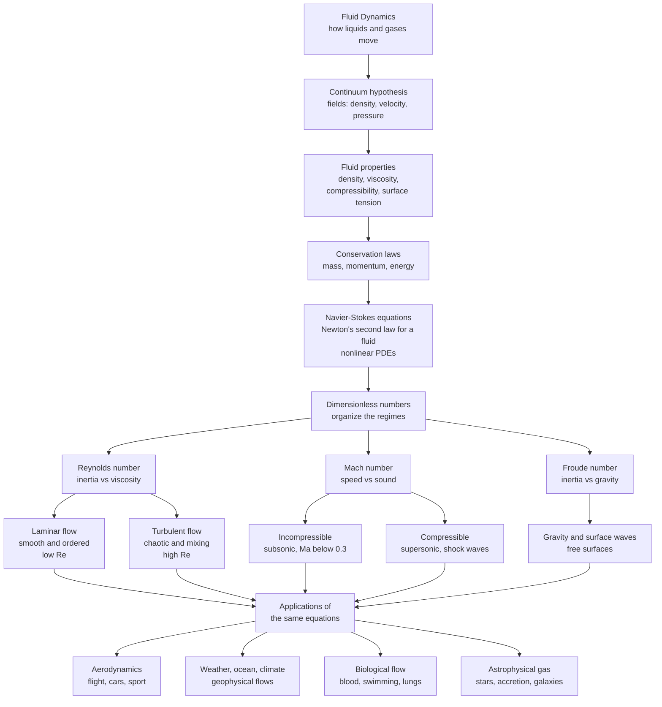

# 🌊 Fluid Dynamics: The Physics of Flow

> [!abstract] TL;DR
> **Fluid dynamics** is the study of how liquids and gases **move** and of the forces that make them move — one of physics' richest, most applied, and most mathematically punishing fields. Treating a fluid not as swarms of molecules but as a smooth **continuum** of density, velocity, and pressure fields, it writes down the conservation of **mass, momentum, and energy** and arrives at the **Navier-Stokes equations** — Newton's second law for a fluid. Those equations are nonlinear, and that nonlinearity is the source of both the field's beauty and its difficulty: the same governing laws describe honey oozing, blood pulsing, an airliner's wing, a hurricane's eye, ocean currents, and a collapsing cloud of galactic gas, yet whether their solutions even remain smooth is an unsolved **Clay Millennium Prize** problem. The organizing principle that tames this universality is **dimensionless numbers** — above all the **Reynolds number** (inertia versus viscosity), which decides whether flow is orderly (laminar) or chaotic (turbulent), and the **Mach number** (speed versus sound), which decides whether it is incompressible or riddled with shock waves. Fluid dynamics is simultaneously the most practical of sciences — flight, weather forecasting, engine design, medicine — and the frontier where turbulence still stands as "the last great unsolved problem of classical physics."

## Intuition

**Analogy:** Fluids are the shape-shifters of physics. Watch smoke curl off a candle, a river braid around rocks, cream folding into coffee, or clouds boiling up on a summer afternoon, and you are watching the *same* physics that lifts a 400-tonne aircraft, spins a hurricane, and drives gas spiralling into a black hole. Nothing in the fluid plans these shapes; each parcel only obeys a few local rules — get pushed by pressure, dragged by its neighbours' viscosity, squeezed by gravity — and out of those simple rules erupts the endless, self-similar, never-quite-repeating complexity of flow. That is the astonishing part: fluid dynamics is where local simplicity blossoms into global complexity so intricate that we still cannot fully predict it.

And it hides one of physics' deepest open questions in plain sight. The **Navier-Stokes equations** that describe every one of those flows are so tangled that mathematicians cannot prove their solutions always stay smooth — a river might, on paper, develop an infinitely sharp spike of velocity out of nowhere. Whether that can happen is a **million-dollar Millennium Prize question**. So when you stir your coffee and watch the swirls cascade into ever-smaller eddies until they vanish, you are looking at a piece of mathematics no one on Earth has solved. Fluid dynamics is the study of flow: simple push, squeeze, and drag, erupting into the beautiful, unsolved chaos of the moving world.

---

## How It Works

### Core Mechanics

Fluid dynamics is built in layers, from a foundational modelling choice up through the equations and then out into the great regimes of flow.

1. **The continuum hypothesis.** A cubic millimetre of air holds about $10^{16}$ molecules — far too many to track. Instead we make the founding assumption of the whole field: forget the molecules and treat the fluid as a **continuous medium** described by smooth **fields** — a density $\rho(\vec{x},t)$, a velocity $\vec{v}(\vec{x},t)$, a pressure $p(\vec{x},t)$, and a temperature $T(\vec{x},t)$ defined at every point. This is valid whenever the **Knudsen number** (mean free path over flow scale) is tiny, which covers almost all everyday and engineering flows (the sibling note *The_Continuum_Hypothesis_and_Fluid_Properties* develops this, along with the material **properties** it introduces: **density**, **viscosity**, **compressibility**, and **surface tension**).

2. **Conservation laws.** Once the fluid is a continuum, physics enters as three bookkeeping statements applied to any chunk of fluid, or "control volume": **mass** is conserved (the continuity equation), **momentum** is conserved (Newton's second law), and **energy** is conserved (the first law of thermodynamics). Recasting these from a fixed control volume to a moving fluid parcel — the **Reynolds transport theorem** — is the machinery of *Conservation_Laws_and_Control_Volumes*.

3. **The Navier-Stokes equations.** Applying momentum conservation to a Newtonian fluid gives the centrepiece of the field: $$\rho\left(\frac{\partial \vec{v}}{\partial t} + (\vec{v}\cdot\nabla)\vec{v}\right) = -\nabla p + \mu\nabla^2\vec{v} + \rho\vec{g}.$$ Read it as force balance: the left side is mass-times-acceleration for a fluid parcel; on the right, pressure gradients push it, viscosity $\mu$ smears out velocity differences, and gravity pulls. The villain is the term $(\vec{v}\cdot\nabla)\vec{v}$ — the fluid advecting its *own* momentum. It is **nonlinear**, and that single nonlinearity is why fluids are hard: it couples every scale of motion to every other, breeds turbulence and chaos, and defeats attempts to prove that solutions stay smooth. Drop viscosity and you recover the **Euler equations** for an ideal fluid; keep it and you have the full problem (the sibling *The_Navier_Stokes_Equations*, complementing the Physics vault's [[Viscous_Fluids_and_Navier_Stokes]] and [[Euler_Equations_and_Ideal_Fluids]]).

4. **Dimensionless numbers carve the regimes.** Because the same equations govern a bacterium and a hurricane, the field's master trick is **dimensional analysis**: non-dimensionalize the equations and the entire behaviour collapses onto a handful of pure numbers (see *Dimensional_Analysis_and_Similarity*). The **Reynolds number** $Re = \rho v L/\mu$ compares inertia to viscosity and decides **laminar versus turbulent**; the **Mach number** $Ma = v/c$ compares flow speed to the speed of sound and decides **incompressible versus compressible** (and, above $Ma=1$, the appearance of **shock waves**); the **Froude number** $Fr = v/\sqrt{gL}$ compares inertia to gravity and governs **surface and gravity waves**. Dynamic **similarity** — matching these numbers — is exactly why a small wind-tunnel model faithfully predicts a full-size aircraft.

5. **The phenomena the vault explores.** From this backbone the field fans out into the topics this vault covers in depth: **potential flow** and how a wing generates **lift** via circulation (*Potential_Flow_and_Complex_Analysis*, *Lift_Drag_and_Aerodynamics*); Prandtl's revolutionary insight that viscosity concentrates into a thin **boundary layer** near surfaces, controlling drag and flow separation (*The_Boundary_Layer*); **vorticity** and circulation as the "spin" content of a flow; **turbulence** and its energy **cascade** from large eddies to the smallest dissipating scales (*Kolmogorov_Theory_and_the_Energy_Cascade*); hydrodynamic **instabilities** such as Kelvin-Helmholtz and Rayleigh-Taylor that seed that chaos; **compressible flow** and **shock waves** in supersonic regimes (*Shock_Waves_and_Supersonic_Flow*); **waves** in fluids — water, sound, and internal; large-scale **rotating and geophysical** flows that make weather and ocean currents (*Geophysical_Fluid_Dynamics*); and the numerical revolution of **computational fluid dynamics** (*Computational_Fluid_Dynamics*, which bridges to the [[Computational_Physics_Overview|Computational Physics]] vault). The concluding *The_Reach_and_Future_of_Fluid_Dynamics* steps back to survey the whole sweep.

### Flow / Architecture



---

## Key Concepts

### Secondary Level

- **A fluid is anything that flows.** Both liquids and gases are fluids: they have no fixed shape and deform continuously under a shearing push. Air and water obey the same laws.
- **Thick versus thin — viscosity.** Honey resists flowing; water does not. That internal "stickiness" is **viscosity**, and it is the single most important property in deciding how a flow behaves.
- **Two kinds of flow.** Slow, smooth, orderly flow is **laminar** (syrup off a spoon, water from a barely-open tap); fast, churning, mixing flow is **turbulent** (a rushing river, smoke high above a candle). The **Reynolds number** is the referee that decides which one you get.
- **Faster flow, lower pressure.** Where a fluid speeds up, its pressure drops — the **Bernoulli** idea behind why a wing lifts, why a shower curtain sucks inward, and why a spinning ball curves.

### Undergraduate Level

- **The continuum and its fields.** Model the fluid by continuous fields $\rho, \vec{v}, p$; valid when the Knudsen number is small. Follow a fluid parcel with the **material derivative** $\tfrac{D}{Dt} = \partial_t + \vec{v}\cdot\nabla$.
- **Continuity.** Mass conservation gives $\partial_t\rho + \nabla\cdot(\rho\vec{v}) = 0$; for an incompressible fluid this reduces to $\nabla\cdot\vec{v} = 0$.
- **Navier-Stokes momentum equation.** $\rho\,\tfrac{D\vec{v}}{Dt} = -\nabla p + \mu\nabla^2\vec{v} + \rho\vec{g}$; the advection term $(\vec{v}\cdot\nabla)\vec{v}$ is the nonlinearity that makes everything hard.
- **Dimensionless numbers.** $Re=\rho vL/\mu$ (inertia vs viscosity), $Ma=v/c$ (speed vs sound), $Fr=v/\sqrt{gL}$ (inertia vs gravity). **Dynamic similarity** = matching these, the reason wind-tunnel and towing-tank models work.
- **Bernoulli and potential flow.** Along a streamline of steady inviscid flow, $p + \tfrac12\rho v^2 + \rho g h = \text{const}$. Irrotational, incompressible flow reduces to **Laplace's equation** for a velocity potential — solvable with complex analysis in 2-D.
- **Circulation and lift.** Lift per span equals $\rho v \Gamma$ (**Kutta-Joukowski**), where $\Gamma$ is the circulation bound to the wing.
- **Boundary layers and the low-Re world.** Prandtl: viscosity matters chiefly in a thin layer of thickness $\delta \sim L/\sqrt{Re}$ near walls. Deep in the viscous regime lie **Stokes drag** $F = 6\pi\mu R v$ and **Hagen-Poiseuille** pipe flow with its parabolic velocity profile.

### Graduate Level

- **Vorticity dynamics.** Recast Navier-Stokes in terms of vorticity $\vec{\omega} = \nabla\times\vec{v}$; in 3-D the **vortex-stretching** term $(\vec{\omega}\cdot\nabla)\vec{v}$ intensifies vorticity and is the engine of turbulence — and precisely why 2-D and 3-D turbulence differ so profoundly.
- **Turbulence and the cascade.** **Kolmogorov's 1941** theory: energy injected at large scales cascades through an inertial range with an $E(k)\propto \varepsilon^{2/3}k^{-5/3}$ spectrum down to the dissipation scale $\eta = (\nu^3/\varepsilon)^{1/4}$; the number of degrees of freedom scales as $Re^{9/4}$, which is why direct simulation of high-Re flow is so costly.
- **Hydrodynamic instabilities.** **Kelvin-Helmholtz** (shear layers), **Rayleigh-Taylor** (heavy over light), **Rayleigh-Bénard** (thermal convection), and **Taylor-Couette** — the routes by which laminar flow loses stability and becomes turbulent.
- **Compressible flow and shocks.** For $Ma>1$, information cannot outrun the flow; characteristics converge into **shock waves** across which the **Rankine-Hugoniot** relations enforce jumps in $p$, $\rho$, and $T$; expansion fans and the de Laval nozzle follow.
- **Rotating and geophysical flows.** On a spinning planet the **Coriolis** force dominates; the **Rossby number** $Ro = U/(fL)$ is small, giving near-**geostrophic** balance, thermal-wind shear, and **Ekman** boundary layers — the dynamics of weather systems and ocean gyres.
- **The Navier-Stokes problem and CFD.** Whether smooth 3-D solutions exist for all time given smooth initial data is a **Clay Millennium Prize** problem; turbulence still resists a complete first-principles theory. In practice we integrate the equations numerically — finite-difference, finite-volume, finite-element, and spectral schemes — the domain of **computational fluid dynamics**.

---

## Python Demo

```python
# A tour of flow regimes through the Reynolds number:  Re = rho * v * L / eta.
# Re compares inertia to viscosity and selects LAMINAR vs TURBULENT flow.
# We ladder Re across real flows spanning ~17 orders of magnitude, then
# contrast a smooth laminar (Poiseuille) profile with a turbulent vortex street.
# Requires: numpy, matplotlib
import numpy as np
import matplotlib.pyplot as plt

# --- Reynolds number for a range of real flows:  (rho, v, L, eta) in SI ---
# rho [kg/m^3], v [m/s], L [m], eta [Pa*s]
flows = {
    "Bacterium\nswimming":  (1000.0, 3e-5,  1e-6, 1.0e-3),
    "Blood in a\ncapillary":(1060.0, 1e-3,  8e-6, 3.5e-3),
    "Flying\ninsect":       (1.2,    1.0,   3e-3, 1.8e-5),
    "Water in a\npipe":     (1000.0, 1.0,   0.02, 1.0e-3),
    "Car on the\nhighway":  (1.2,    30.0,  4.0,  1.8e-5),
    "Airliner\nwing":       (1.2,    250.0, 5.0,  1.8e-5),
    "Hurricane":            (1.2,    50.0,  5e5,  1.8e-5),
}
names = list(flows.keys())
Re = np.array([rho * v * L / eta for (rho, v, L, eta) in flows.values()])

print("=== Reynolds number ladder:  Re = rho v L / eta ===")
for n, r in zip(names, Re):
    regime = "laminar" if r < 2000 else "turbulent"
    print(f"{n.replace(chr(10),' '):22s}: Re = {r:9.1e}   ({regime})")

# --- Panel B data: laminar Hagen-Poiseuille pipe flow (parabolic profile) ---
R = 1.0
r = np.linspace(-R, R, 200)
u_lam = 1.0 * (1.0 - (r / R) ** 2)          # u(r) = u_max (1 - (r/R)^2)

# --- Panel C data: laminar vs turbulent velocity signal at a fixed point ---
rng = np.random.default_rng(0)
t = np.linspace(0, 10, 1200)
u_steady = np.ones_like(t)                                  # laminar: steady
u_turb   = (1.0
            + 0.22 * np.sin(2 * np.pi * 0.6 * t)
            + 0.12 * np.sin(2 * np.pi * 3.1 * t + 1.0)
            + 0.15 * rng.standard_normal(t.size))           # broadband noise

# --- Panel D data: a von Karman vortex street via streamfunction contours ---
gx = np.linspace(0, 13, 420)
gy = np.linspace(-2.2, 2.2, 200)
X, Y = np.meshgrid(gx, gy)
psi = 1.0 * Y                                # uniform background flow
for k in range(6):
    xk = 1.8 + 1.9 * k
    r2_top = (X - xk) ** 2 + (Y - 0.5) ** 2 + 0.05          # clockwise row
    r2_bot = (X - (xk + 0.95)) ** 2 + (Y + 0.5) ** 2 + 0.05 # counter-clockwise
    psi += (0.55 / (2 * np.pi)) * np.log(r2_top)
    psi -= (0.55 / (2 * np.pi)) * np.log(r2_bot)

# ----------------------------- plotting -----------------------------
fig, ax = plt.subplots(2, 2, figsize=(13, 9))
fig.suptitle("Flow Regimes Through the Reynolds Number", fontsize=15, fontweight="bold")

# A: the Reynolds-number ladder
axA = ax[0, 0]
colors = ["#4a9eff" if r < 2000 else "#ff6b6b" for r in Re]
axA.barh(names, Re, color=colors)
axA.axvspan(1e3, 4e3, color="gray", alpha=0.25)             # transition band
axA.axvline(2300, ls="--", color="k", lw=1)
axA.text(2300, len(names) - 0.4, " laminar -> turbulent\n (Re ~ 2000-4000)",
         fontsize=8, va="top")
axA.set_xscale("log")
axA.set_xlim(1e-6, 1e13)
axA.set_xlabel("Reynolds number  (log scale)")
axA.set_title("A. One number spans bacteria to hurricanes\nblue = laminar, red = turbulent")

# B: laminar Poiseuille profile
axB = ax[0, 1]
axB.plot(u_lam, r, color="#4a9eff", lw=2.5)
axB.fill_betweenx(r, 0, u_lam, color="#4a9eff", alpha=0.15)
axB.quiver(np.zeros(9), np.linspace(-0.9, 0.9, 9),
           1.0 - np.linspace(-0.9, 0.9, 9) ** 2, np.zeros(9),
           color="#1f77b4", scale=6, width=0.006)
axB.axhline(R, color="k", lw=3)
axB.axhline(-R, color="k", lw=3)
axB.set_xlabel("velocity  u(r)")
axB.set_ylabel("radius  r")
axB.set_title("B. LAMINAR: smooth parabolic pipe flow\n(Hagen-Poiseuille, low Re)")

# C: laminar vs turbulent time signal
axC = ax[1, 0]
axC.plot(t, u_turb, color="#ff6b6b", lw=1.0, label="turbulent (high Re)")
axC.plot(t, u_steady, color="#4a9eff", lw=2.5, label="laminar (low Re)")
axC.set_xlabel("time")
axC.set_ylabel("velocity at a point")
axC.set_title("C. What a probe sees\nsteady line vs chaotic fluctuations")
axC.legend(loc="upper right", fontsize=8)

# D: turbulent / vortex-shedding schematic
axD = ax[1, 1]
axD.contour(X, Y, psi, levels=40, colors="#ff6b6b", linewidths=0.8)
axD.add_patch(plt.Circle((0.6, 0.0), 0.35, color="k"))     # the shedding body
axD.set_xlim(0, 13)
axD.set_ylim(-2.2, 2.2)
axD.set_aspect("equal")
axD.set_xlabel("downstream ->")
axD.set_title("D. TURBULENT onset: von Karman vortex street\n(alternating eddies shed behind a body)")

plt.tight_layout(rect=[0, 0, 1, 0.95])
plt.show()
```

Running this prints the Reynolds-number ladder and produces four panels. Panel **A** shows a *single* dimensionless number sorting seven wildly different flows — from a bacterium at $Re\sim 10^{-5}$ (viscosity utterly dominates; the world feels like honey) through the laminar-to-turbulent transition band near $Re\sim 2000$–$4000$, up to a hurricane at $Re\sim 10^{12}$ (inertia crushes viscosity; chaos reigns). Panels **B**, **C**, and **D** make the two regimes vivid: laminar flow is the smooth parabolic profile of pipe flow with a steady velocity trace, while turbulent flow is the churning **von Karman vortex street** shed behind an obstacle and the noisy, broadband signal a probe would record. The Reynolds number is the knob that turns one into the other.

---

## Real-World Applications

> **Example:** **Commercial aircraft design** is fluid dynamics from nose to tail. A wing's **lift** is explained by circulation and the Kutta condition (potential-flow theory); its **drag** is set by the **boundary layer** and whether that layer stays attached or **separates** into a stall; the whole airframe is validated at reduced scale in a **wind tunnel** by matching **Reynolds and Mach numbers** so the model flow is dynamically similar to the real one; and modern airfoils are refined by **computational fluid dynamics** solving discretized Navier-Stokes on millions of cells. Every one of those steps is a chapter of this vault applied to a single machine.

- **Weather and climate.** Numerical weather prediction and climate models integrate the rotating, stratified Navier-Stokes equations over the whole atmosphere and ocean; turbulence and convection are the dominant sources of forecast uncertainty.
- **Cardiovascular medicine.** Blood flow through arteries is modelled to predict where atherosclerotic plaques form (low wall shear stress), to design stents and heart valves, and to plan surgeries — mostly laminar, but turbulent past a stenosis.
- **Industrial process engineering.** Pipes, pumps, mixers, heat exchangers, and chemical reactors are all sized with pressure-drop, mixing, and heat-transfer correlations built on Reynolds- and Nusselt-number scaling.
- **Astrophysics.** Accretion disks, stellar convection, supernova blast waves, and the turbulent interstellar medium are all fluid (and magnetofluid) dynamics on cosmic scales.
- **Sport and vehicles.** The curve of a football, the drag crisis on a golf ball's dimpled surface, the aerodynamics of racing cars and cyclists — all are boundary-layer and separation phenomena tuned deliberately.

---

## Common Pitfalls

- **Forgetting the Reynolds number sets the whole regime.** Intuition built at human scale ("things coast, then slow down") is simply wrong for a swimming bacterium at $Re\ll 1$, where motion stops the instant propulsion does and reciprocal strokes get you nowhere. Always estimate $Re$ *first* — it tells you which physics dominates.
- **Assuming incompressibility everywhere.** For $Ma<0.3$ air behaves as if incompressible, a huge simplification — but push past $Ma\approx 1$ and shock waves, compressibility, and a completely different set of equations take over. The same fluid, opposite behaviour.
- **Neglecting viscosity because it looks small.** Air and water have tiny viscosities, tempting you to use inviscid Euler flow everywhere. But viscosity concentrates in the boundary layer and there it controls drag, separation, and lift; ignoring it gives d'Alembert's paradox — the (false) prediction that a body in flow feels no drag at all.
- **Expecting turbulence to be predictable.** Turbulent flow is deterministic yet chaotic: tiny changes in initial conditions diverge exponentially, so only *statistical* quantities are reproducible. Treating a turbulent trace as a fixable, repeatable curve misunderstands the phenomenon.
- **Trusting a CFD result you have not resolved.** A simulation that fails to resolve the boundary layer or the turbulent dissipation scale ($\propto Re^{-3/4}$) can produce a plausible, colourful, and completely wrong answer. Mesh convergence and validation against experiment are not optional.

---

## Related Concepts

**Physics fluid mechanics — this vault deep-dives what these introduce**
- [[Viscous_Fluids_and_Navier_Stokes]] — the Navier-Stokes equations, Stokes flow, and boundary layers at survey level
- [[Euler_Equations_and_Ideal_Fluids]] — the inviscid limit, Bernoulli, and potential flow
- [[Turbulence_and_Instabilities]] — the energy cascade and the instabilities that trigger chaos
- [[Fluid_Statics_and_Properties]] — pressure, buoyancy, and the material properties of fluids
- [[Waves_in_Fluids_and_Acoustics]] — sound, water waves, and internal waves
- [[Magnetohydrodynamics]] — fluid dynamics of electrically conducting fluids and plasmas
- [[Kinetic_Theory_of_Gases]] — the molecular basis of viscosity and the continuum limit

**Mathematical machinery**
- [[Introduction_to_PDEs]] — the partial-differential-equation framework Navier-Stokes lives in
- [[Partial_Differential_Equations]] — physics-oriented treatment of the PDEs of continuum mechanics
- [[Vector_Calculus_and_Differential_Operators]] — divergence, gradient, and curl, the language of flow fields
- [[Vector_Fields_and_Line_Integrals]] — circulation and the vector fields that represent velocity
- [[Integral_Theorems]] — divergence and Stokes theorems behind control-volume analysis
- [[Complex_Analysis_for_Physics]] — the tool that solves 2-D potential flow around wings

**Computational fluid dynamics**
- [[Computational_Physics_Overview]] — the numerical-methods vault that CFD draws on
- [[Finite_Difference_Methods]] — discretizing derivatives to march the equations forward
- [[Spectral_Methods_and_the_FFT]] — high-accuracy schemes central to turbulence simulation
- [[Classification_of_PDEs_and_Discretization]] — elliptic, parabolic, and hyperbolic character of flow equations
- [[Chaos_and_Nonlinear_Dynamics_Numerically]] — the nonlinear-dynamics view of the transition to turbulence

**Where the same equations show up**
- [[Fluid_Dynamics_in_Biology]] — low-Reynolds-number swimming, blood flow, and the physics of life
- [[Diffusion_and_Brownian_Motion_in_Cells]] — transport when viscosity, not inertia, rules
- [[Coriolis_Effect_and_Geostrophic_Balance]] — rotating flow that makes weather systems turn
- [[Tropical_Cyclones_and_Hurricanes]] — a rotating, moist, high-Reynolds fluid engine
- [[Numerical_Weather_Prediction]] — integrating the atmospheric Navier-Stokes equations forward
- [[Atmospheric_Boundary_Layer]] — the turbulent layer where air meets the ground
- [[Surface_Gravity_Waves]] — Froude-number physics on the ocean surface
- [[Wind_Driven_Circulation_and_Sverdrup_Balance]] — large-scale ocean gyres as geophysical flow
- [[Turbulence_and_Diapycnal_Mixing]] — turbulence stirring the stratified ocean
- [[Accretion_Disks_and_X_ray_Binaries]] — astrophysical fluid dynamics around compact objects
- [[The_Interstellar_Medium]] — turbulent, compressible galactic gas
- [[Star_Formation]] — gravitational collapse of gas governed by fluid instabilities

---

## Review Questions

**Secondary**
1. Air and water seem totally different, yet fluid dynamics treats them with the same equations. Explain what "being a fluid" means and give one everyday example each of laminar and turbulent flow. Why does a river run smoothly in one place and churn white in another?

**Undergraduate**
2. A wind-tunnel engineer tests a 1/20-scale model of a car and wants the model's airflow to behave exactly like the full-size car's. Which dimensionless number must be matched, and what is the equation for it? If the model is 20 times smaller, what must change about the wind-tunnel flow to keep that number the same — and what practical difficulty does that create? Relate your answer to the term "dynamic similarity."

**Graduate**
3. The Navier-Stokes momentum equation contains the nonlinear advection term $(\vec{v}\cdot\nabla)\vec{v}$. Explain (i) why this single term is responsible both for turbulence and for the open Millennium-Prize question of global smoothness, (ii) how the Reynolds number quantifies its importance relative to the viscous term, and (iii) using Kolmogorov's cascade, why the number of degrees of freedom needed to fully resolve a turbulent flow grows like $Re^{9/4}$ — and what that implies for the feasibility of direct numerical simulation of, say, a full aircraft.

---

## Sources

- G. K. Batchelor — *An Introduction to Fluid Dynamics* (Cambridge University Press, 1967; reissued 2000)
- P. K. Kundu, I. M. Cohen & D. R. Dowling — *Fluid Mechanics*, 6th ed. (Academic Press, 2015)
- D. J. Acheson — *Elementary Fluid Dynamics* (Oxford University Press, 1990)
- L. D. Landau & E. M. Lifshitz — *Fluid Mechanics* (Course of Theoretical Physics, Vol. 6), 2nd ed. (Butterworth-Heinemann, 1987)
- U. Frisch — *Turbulence: The Legacy of A. N. Kolmogorov* (Cambridge University Press, 1995); and the Clay Mathematics Institute, "Navier-Stokes Existence and Smoothness" Millennium Problem statement, claymath.org

---

#fluid-dynamics #navier-stokes #reynolds-number #flow-regimes #interdisciplinary
