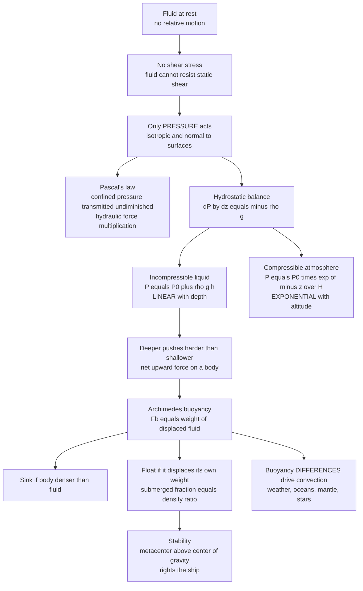

# 🌊 Fluid Statics and Buoyancy

> [!abstract] TL;DR
> A fluid at rest cannot resist a static shear stress, so the only force it exerts is **pressure**, acting equally in all directions (**Pascal**) and normal to every surface. The whole of fluid statics collapses to one balance — the **hydrostatic equation** $\frac{dP}{dz} = -\rho g$ — pressure must rise with depth to hold up the weight of the fluid above. In an incompressible liquid this is *linear* ($P = P_0 + \rho g h$); in the *compressible* atmosphere it is *exponential* (the barometric formula $P = P_0 e^{-z/H}$). Because deeper fluid pushes harder on a body's underside than shallower fluid pushes on its top, every submerged or floating object feels a net upward **buoyant force equal to the weight of the fluid it displaces** (**Archimedes**) — the reason steel ships and hot-air balloons rise, why ~90% of an iceberg hides underwater, and, through buoyancy *differences*, the engine that drives convection in weather, oceans, mantle, and stars.

---

## Intuition

**Analogy first.** Dive to the bottom of a pool and your ears ache. The deeper you go, the more water is piled on top of you, and all of that water has weight pressing down — so the fluid squeezes back harder on your eardrums. That single sensation *is* fluid statics: **pressure grows with depth because it must hold up the weight of everything stacked above.** Nothing more mysterious is happening.

Now the companion mystery: a 300,000-tonne steel supertanker floats, yet a pebble you toss sinks instantly. Archimedes solved this in his bath — legend has the water sloshing over the rim as he leapt out shouting *"Eureka!"* His insight: an object is **buoyed up by the weight of the fluid it shoves aside**. The tanker's hull encloses so much air that to sink to its waterline it must push away a volume of water weighing *exactly* its own 300,000 tonnes — and water is heavy enough to supply that upthrust. The pebble displaces only a pebble-sized sliver of water, far lighter than the pebble, so down it goes. The same principle lifts helium balloons, raises the warm updraft of a thunderstorm, and holds up mountains on the yielding mantle beneath.

---

## How It Works

### No shear, only pressure

A **fluid** is by definition a substance that *cannot* sustain a static shear stress: apply any tangential force and it flows until the shear vanishes. So a fluid **at rest** (or moving with no relative motion between its parts) carries no shear — the stress state reduces to a single scalar, the **pressure** $P$. This is the great simplification that makes statics the most intuitive branch of fluid mechanics, and it rests on the [[Fluid_Statics_and_Properties|continuum picture of a fluid]] (density, pressure, and viscosity as smooth fields), the subject the sibling note *The_Continuum_Hypothesis_and_Fluid_Properties* will develop in full.

### Pressure is isotropic and normal (Pascal)

Consider a tiny wedge of fluid at rest. Balancing forces on its faces (and letting the wedge shrink to a point so that its weight — scaling as volume — vanishes faster than the surface forces — scaling as area) forces the pressure to be **the same in every direction at a point**: pressure is *isotropic*. And because a fluid cannot pull or shear, the pressure force on any imagined surface acts **purely normal** to it. **Pascal's law** adds the confined-fluid corollary: pressure applied to an enclosed fluid is transmitted *undiminished* to every part. A small force on a narrow piston ($A_1$) becomes a large force on a wide piston ($A_2$): $F_2 = F_1\,(A_2/A_1)$ — the hydraulic jack, brake, and press multiply force at the cost of stroke (work is conserved).

### The hydrostatic equation

Take a thin horizontal slab of fluid, area $A$, thickness $dz$, with $z$ pointing up. Its weight $\rho g A\,dz$ pulls down; the pressure on its bottom pushes up harder than the pressure on its top pushes down. Force balance gives the **central result of statics**:

$$\frac{dP}{dz} = -\rho g$$

- **Incompressible liquid** ($\rho$ constant): integrate to get $P(h) = P_0 + \rho g h$, **linear** in depth $h$. Every 10 m of water adds ~1 atm.
- **Compressible gas** (atmosphere): $\rho$ itself falls as pressure drops. Using the ideal-gas law $\rho = PM/(RT)$, the balance becomes $\frac{dP}{dz} = -\frac{Mg}{RT}P$, whose isothermal solution is the **barometric formula** $P(z) = P_0\,e^{-z/H}$ with **scale height** $H = RT/(Mg) \approx 8.5$ km for Earth's troposphere. Pressure falls **exponentially** with altitude.

### Measuring pressure

Hydrostatics is also how we *measure* pressure. A **barometer** balances an atmospheric column against a column of mercury (760 mm Hg = 1 atm). A **manometer** reads a pressure difference as a height difference $\Delta P = \rho g \Delta h$. Note the distinction between **gauge** pressure (relative to ambient atmosphere, what $\rho g h$ gives) and **absolute** pressure (relative to vacuum, needed for gas laws and thermodynamics).

### Buoyancy (Archimedes)

Integrate the hydrostatic pressure over the closed surface of a submerged body. Because pressure is larger on the deeper (lower) faces than on the shallower (upper) faces, the net pressure force points **up** and equals the weight of the fluid the body displaces:

$$F_b = \rho_{\text{fluid}}\, V_{\text{displaced}}\, g$$

That is **Archimedes' principle** — buoyancy is not a new force but the *residual of hydrostatic pressure*. A body **sinks** if $\rho_{\text{body}} > \rho_{\text{fluid}}$ and **floats** if it can displace its own weight before fully submerging. At floating equilibrium the submerged **volume fraction equals the density ratio**:

$$\frac{V_{\text{sub}}}{V_{\text{total}}} = \frac{\rho_{\text{body}}}{\rho_{\text{fluid}}}$$

Ice ($917\ \text{kg/m}^3$) in seawater ($1025\ \text{kg/m}^3$) floats with $\approx 89\%$ of its bulk hidden below the surface — the proverbial "tip of the iceberg."

### Stability of floating bodies

Floating is not enough; a ship must *stay upright*. Two points matter: the **center of gravity** $G$ (where weight acts) and the **center of buoyancy** $B$ (the centroid of the *displaced* volume, where buoyancy acts). When a hull heels over, the underwater shape changes and $B$ shifts sideways; the buoyant force's line of action crosses the ship's centerline at the **metacenter** $M$. If $M$ lies **above** $G$ (positive **metacentric height** $\overline{GM} > 0$), the couple rights the ship; if $M$ falls below $G$, the same couple *capsizes* it. Metacentric height is the master parameter of naval architecture — too small and the ship rolls dangerously; too large and it snaps back with punishing, uncomfortable stiffness.



---

## Key Concepts

### Secondary Level

- **Pressure** = force per area, $P = F/A$, in pascals ($1\ \text{Pa} = 1\ \text{N/m}^2$; $1\ \text{atm} \approx 101{,}325\ \text{Pa}$).
- **Deeper = higher pressure.** In water, pressure grows by ~1 atm for every 10 m of depth. It acts equally in all directions.
- **Archimedes' principle:** upthrust = weight of the fluid pushed aside. Float if you're less dense than the fluid, sink if denser.
- **Why ships float:** a steel hull encloses air, so its *average* density is far below water's; the tiny pebble has no such trick.
- **Iceberg rule:** since ice is ~90% as dense as seawater, ~90% of an iceberg sits underwater.

### Undergraduate Level

- **Hydrostatic equation:** $\dfrac{dP}{dz} = -\rho g$, or in vector form $\nabla P = \rho \vec g$. Integrates to $P = P_0 + \rho g h$ for constant $\rho$.
- **Pascal / hydraulics:** $F_2/F_1 = A_2/A_1$; the volume swept is equal on both sides, so $F_1 d_1 = F_2 d_2$ (work conserved).
- **Barometric formula (isothermal atmosphere):** $P(z) = P_0 e^{-z/H}$, $H = RT/(Mg) \approx 8.5$ km. Half the atmosphere's mass lies below ~5.5 km.
- **Gauge vs absolute:** $P_{\text{abs}} = P_{\text{gauge}} + P_{\text{atm}}$.
- **Force on submerged surfaces:** the total force on a flat gate is $F = \rho g h_c A$ ($h_c$ = depth of the *centroid*), but it acts at the **center of pressure**, which lies *below* the centroid because pressure grows with depth: $y_{cp} = y_c + I_{xc}/(y_c A)$. This is the load a dam wall must carry.

### Graduate Level

- **General hydrostatics:** for a barotropic fluid $\rho = \rho(P)$ in a conservative body-force field $\vec g = -\nabla\Phi$, equilibrium requires $\nabla P = -\rho\nabla\Phi$, so surfaces of constant $P$, $\rho$, and $\Phi$ coincide (isobaric = isopycnal = equipotential). Baroclinic misalignment ($\nabla\rho \times \nabla P \neq 0$) *cannot* be static and instead drives motion — the seed of baroclinic instability in *Rotating_and_Stratified_Flows*.
- **Non-isothermal atmospheres:** for a general lapse rate $T(z)$, $P(z) = P_0 \exp\!\left[-\int_0^z \frac{Mg}{RT(z')}\,dz'\right]$. A constant-lapse-rate (polytropic) atmosphere yields a power law; the **adiabatic** atmosphere ($T \propto P^{R/c_p}$) sets the neutral-stability reference against which convective (in)stability is judged.
- **Static stability & buoyancy frequency:** a parcel displaced upward by $\delta z$ in a stratified fluid feels a restoring acceleration $-N^2\,\delta z$ with **Brunt–Väisälä frequency** $N^2 = -\frac{g}{\rho}\frac{d\rho}{dz}$ (or $\frac{g}{\theta}\frac{d\theta}{dz}$ for the atmosphere). $N^2 > 0$ ⇒ stable stratification and internal gravity waves; $N^2 < 0$ ⇒ convective overturning. This is where *statics hands off to dynamics.*
- **Metacentric height:** $\overline{GM} = \overline{BM} - \overline{BG}$ with $\overline{BM} = I_{wp}/V_{\text{disp}}$, where $I_{wp}$ is the second moment of the waterplane area. A wide, flat hull (large $I_{wp}$) is stiffly stable.

---

## Python Demo

```python
# Hydrostatics and buoyancy in one figure:
#  (a) pressure vs depth in WATER (linear, incompressible)
#  (b) pressure vs altitude in AIR (exponential barometric formula, compressible)
#  (c) float-or-sink and submerged fraction for common materials (Archimedes)
#  (d) force balance on a floating block (weight vs buoyant force)
import numpy as np
import matplotlib.pyplot as plt

g = 9.81  # m/s^2

# ---------------------------------------------------------------
# (a) HYDROSTATIC PRESSURE IN WATER  ->  linear  P = P0 + rho*g*h
# ---------------------------------------------------------------
rho_water = 1000.0                 # kg/m^3
P0 = 101325.0                      # Pa (surface atmospheric pressure)
depth = np.linspace(0, 1000, 400)  # m below surface
P_water = (P0 + rho_water * g * depth) / 1e5   # convert Pa -> bar

# ---------------------------------------------------------------
# (b) ATMOSPHERE  ->  exponential barometric formula P = P0*exp(-z/H)
# ---------------------------------------------------------------
R, M, T = 8.314, 0.0289, 250.0     # J/mol/K, kg/mol, K (mean troposphere)
H = R * T / (M * g)                # scale height ~ 7-8.5 km
alt = np.linspace(0, 40000, 400)   # m above surface
P_air = (P0 * np.exp(-alt / H)) / 1e5           # bar

# ---------------------------------------------------------------
# (c) ARCHIMEDES: float-or-sink and submerged fraction in SEAWATER
# ---------------------------------------------------------------
rho_fluid = 1025.0  # seawater kg/m^3
materials = {
    "Cork":        240,
    "Ice":         917,
    "Human body":  985,
    "Ship (avg)":  500,    # steel hull + enclosed air -> low average density
    "Seawater":   1025,
    "Aluminium":  2700,
    "Steel":      7850,
}
names = list(materials.keys())
rho_b = np.array(list(materials.values()), dtype=float)
frac_sub = np.clip(rho_b / rho_fluid, 0, 1)     # submerged fraction if floating
floats = rho_b < rho_fluid

print("Object        density   floats?   submerged fraction")
for n, r, f, fs in zip(names, rho_b, floats, frac_sub):
    tag = "FLOATS" if f else "SINKS "
    print(f"{n:12s}  {r:6.0f}   {tag}   {100*fs:5.1f}%")
# Iceberg check: ~89% of an iceberg is underwater
print(f"\nIceberg submerged fraction = {100*917/1025:.1f}%  (tip-of-the-iceberg)")

# ---------------------------------------------------------------
# PLOTTING
# ---------------------------------------------------------------
fig, ax = plt.subplots(2, 2, figsize=(13, 10))

# (a) water: pressure grows LINEARLY with depth
ax[0, 0].plot(P_water, depth, color="#1f77b4", lw=2)
ax[0, 0].invert_yaxis()
ax[0, 0].set_xlabel("Pressure (bar)")
ax[0, 0].set_ylabel("Depth below surface (m)")
ax[0, 0].set_title("(a) Water: LINEAR hydrostatic pressure\nP = P0 + rho g h")
ax[0, 0].grid(alpha=0.3)
ax[0, 0].annotate("+1 bar per ~10 m", xy=(50, 500),
                  xytext=(20, 300),
                  arrowprops=dict(arrowstyle="->", color="k"))

# (b) atmosphere: pressure decays EXPONENTIALLY with altitude
ax[0, 1].plot(P_air, alt / 1000, color="#d62728", lw=2)
ax[0, 1].set_xlabel("Pressure (bar)")
ax[0, 1].set_ylabel("Altitude (km)")
ax[0, 1].set_title(f"(b) Atmosphere: EXPONENTIAL barometric\nP = P0 exp(-z/H),  H = {H/1000:.1f} km")
ax[0, 1].axhline(H / 1000, color="gray", ls="--")
ax[0, 1].text(0.35, H / 1000 + 1, "1 scale height -> P falls to 37%", fontsize=8)
ax[0, 1].grid(alpha=0.3)

# (c) float-or-sink bar chart
colors = ["#2ca02c" if f else "#7f7f7f" for f in floats]
ax[1, 0].barh(names, np.where(floats, 100 * frac_sub, 100), color=colors)
ax[1, 0].axvline(100, color="k", lw=0.8)
ax[1, 0].set_xlabel("Submerged fraction (%)   [grey bars = SINK]")
ax[1, 0].set_title("(c) Archimedes in seawater (1025 kg/m3)\nsubmerged fraction = density ratio")
ax[1, 0].invert_yaxis()

# (d) force balance on a floating block (density 600 in water 1000 -> 60% under)
rho_block, rho_liq = 600.0, 1000.0
f_sub = rho_block / rho_liq                       # 0.6
ax[1, 1].set_xlim(0, 4); ax[1, 1].set_ylim(0, 4)
ax[1, 1].axhspan(0, 2.0, color="#a6cee3", alpha=0.6)   # water
ax[1, 1].axhline(2.0, color="#1f77b4", lw=2)           # waterline
# block: bottom submerged fraction f_sub of a 1.0-tall block sitting at waterline
h_block = 1.0
y_bot = 2.0 - f_sub * h_block
ax[1, 1].add_patch(plt.Rectangle((1.4, y_bot), 1.2, h_block,
                   facecolor="#8c564b", edgecolor="k"))
ax[1, 1].annotate("", xy=(2.0, y_bot - 0.9), xytext=(2.0, y_bot + 0.5 * f_sub * h_block),
                  arrowprops=dict(arrowstyle="->", color="k", lw=2))
ax[1, 1].text(2.1, y_bot - 0.5, "Weight  m g", fontsize=10)
ax[1, 1].annotate("", xy=(2.0, y_bot + 1.4), xytext=(2.0, y_bot + h_block - 0.1),
                  arrowprops=dict(arrowstyle="->", color="#d62728", lw=2))
ax[1, 1].text(2.1, y_bot + 1.5, "Buoyant force  rho_liq V_sub g", color="#d62728", fontsize=10)
ax[1, 1].text(0.15, 3.6, f"Block rho = {rho_block:.0f} kg/m3 in water {rho_liq:.0f}\n"
                         f"=> {100*f_sub:.0f}% submerged at equilibrium", fontsize=9)
ax[1, 1].set_title("(d) Floating equilibrium: weight = buoyancy")
ax[1, 1].axis("off")

plt.tight_layout()
plt.savefig("fluid_statics_buoyancy.png", dpi=130)
plt.show()
```

Running the script prints a float/sink table (cork, ice, and the low-average-density ship float; aluminium and steel sink), confirms the ~89% iceberg submersion, and produces four panels: the **linear** water-pressure curve beside the **exponential** atmospheric curve — the visual heart of incompressible-vs-compressible hydrostatics — plus the Archimedes bar chart and the weight-vs-buoyancy force balance of a floating block.

---

## Real-World Applications

- **Dams and gates:** walls thicken toward the base because the hydrostatic load grows with depth and the resultant acts at the center of pressure, below mid-height; failure to account for this overturning moment topples structures.
- **Hydraulics:** car brakes, jacks, excavator arms, and forging presses all exploit Pascal's law to trade small forces over long strokes for huge forces over short ones.
- **Naval architecture:** ships and offshore platforms are designed around a positive metacentric height; ballast, beam, and freeboard are tuned so the vessel rights itself and rides comfortably.
- **Submarines:** ballast tanks flood with seawater to sink and blow compressed air to surface, actively setting average density above or below the surrounding water.
- **Barometry & altimetry:** aircraft and weather stations invert the barometric formula to convert measured pressure into altitude; the sibling meteorology note develops the same balance as the backbone of every forecast model.
- **Balloons and airships:** hot-air and helium balloons float in *air* by the identical Archimedes rule — the envelope displaces air weighing more than balloon-plus-gas.
- **Geophysics — isostasy:** continents "float" on the denser mantle like icebergs on water; thick crust and mountain roots ride high, exactly as buoyancy predicts.
- **Convection everywhere:** warm, light fluid rising and cool, dense fluid sinking powers thunderstorm updrafts, ocean overturning, mantle circulation, and stellar interiors — buoyancy *differences* set fluids in motion, the theme picked up in *Convection_and_Thermal_Fluid_Dynamics*.

---

## Common Pitfalls

- **Gauge vs absolute pressure** — $\rho g h$ gives pressure *above* atmospheric. Feed gauge pressure into a gas law or an absolute-pressure formula and every subsequent number is wrong.
- **"Buoyancy depends on the object's weight or depth"** — it does not. $F_b = \rho_{\text{fluid}} V_{\text{disp}} g$ depends only on the *fluid* density and the *displaced volume*. A fully submerged body at 10 m and at 1000 m feels the same buoyant force (for an incompressible fluid).
- **Confusing displaced volume with object volume** — a *floating* body displaces a volume of fluid equal to its own *weight*, which is **less** than its total volume. Only a fully submerged body displaces its whole volume.
- **Assuming the atmosphere is linear like water** — air is compressible, so pressure falls *exponentially*, not linearly. Using $P = P_0 + \rho g h$ with constant $\rho$ for a tall air column is badly wrong above a few hundred metres.
- **Floating ≠ stable** — a body can float yet capsize. Stability is a separate condition ($\overline{GM} > 0$): the metacenter must sit above the center of gravity. Top-heavy loading sinks $M$ below $G$ and the vessel rolls over.
- **Center of pressure = centroid** — a common exam trap. On a submerged wall the *force* uses the centroid depth, but the force *acts lower*, at the center of pressure, because pressure increases with depth.
- **Ignoring air buoyancy in precision weighing** — every object in air is buoyed by the air it displaces; high-accuracy mass metrology must correct for it.

---

## Related Concepts

- [[Fluid_Statics_and_Properties]] — the broader Physics note (pressure, surface tension, viscosity, compressibility); **this note is the focused statics-and-buoyancy deep-dive that complements it, not a duplicate.**
- [[Atmospheric_Pressure_and_the_Hydrostatic_Equation]] — the same $\frac{dP}{dz}=-\rho g$ balance and barometric formula, developed for the atmosphere and NWP.
- [[Pressure_Gradient_Force_and_Winds]] — what happens when the horizontal pressure field is *not* in static balance: it drives wind.
- [[Density_Stratification_and_Mixing]] — buoyancy and the Brunt–Väisälä frequency governing stable/unstable layering in the ocean.
- [[Mantle_Convection_and_Hotspots]] — buoyancy differences driving solid-rock convection over geologic time.
- [[Gravity_Isostasy_and_the_Geoid]] — crustal blocks floating on the mantle by Archimedes' principle (isostasy).
- [[Euler_Equations_and_Ideal_Fluids]] — statics is the zero-velocity limit; add motion and the pressure balance becomes Euler's equation.

*Fluid-Dynamics siblings referenced in prose (to be built): The_Continuum_Hypothesis_and_Fluid_Properties, Conservation_Laws_and_Control_Volumes, Bernoulli_and_Energy_in_Flows, Convection_and_Thermal_Fluid_Dynamics, Rotating_and_Stratified_Flows.*

---

## Review Questions

1. **(Secondary)** A wooden cube of density $600\ \text{kg/m}^3$ floats in fresh water ($1000\ \text{kg/m}^3$). What fraction sits below the surface? If you move it to the Dead Sea ($\rho \approx 1240\ \text{kg/m}^3$), does more or less of it stick out, and why?
2. **(Undergraduate)** Starting from $\frac{dP}{dz} = -\rho g$, derive (a) the linear law $P = P_0 + \rho g h$ for an incompressible liquid and (b) the barometric formula $P = P_0 e^{-z/H}$ for an isothermal ideal-gas atmosphere. Explain physically why one is linear and the other exponential, and estimate $H$ for air at $250\ \text{K}$.
3. **(Graduate)** A cargo ship rides in calm water with metacentric height $\overline{GM} = 0.6$ m. Explain, using $B$, $G$, and $M$, why raising the cargo (shifting $G$ upward) can cause the vessel to capsize, and connect the sign of $N^2 = -\frac{g}{\rho}\frac{d\rho}{dz}$ in a stratified fluid to the same stability logic. Under what condition does static equilibrium become impossible and hand off to buoyancy-driven convection?

---

## Sources

- Frank M. White, *Fluid Mechanics*, 8th ed. — Ch. 2 (Pressure Distribution in a Fluid; buoyancy and stability).
- Kundu, Cohen & Dowling, *Fluid Mechanics*, 6th ed. — Ch. 1 (hydrostatics) and stratification/stability sections.
- Batchelor, *An Introduction to Fluid Dynamics* — Ch. 1 (fluids at rest, buoyancy).
- Munson, Young & Okiishi, *Fundamentals of Fluid Mechanics* — Ch. 2 (fluid statics, forces on submerged surfaces, manometry).
- Landau & Lifshitz, *Fluid Mechanics*, Vol. 6 — §§3–4 (hydrostatics, atmosphere in equilibrium).

---

#fluid-dynamics #hydrostatics #buoyancy #archimedes-principle #pressure
