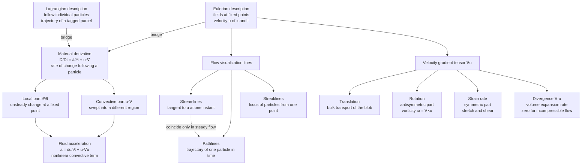

# 🌊 Kinematics of Fluid Flow

> [!abstract] TL;DR
> Fluid **kinematics** is the geometric, descriptive language of flow — how a fluid *moves* (velocity, acceleration, deformation) **before** we ask what *forces* cause it. Its two pillars are the choice between the **Eulerian** description (watch fields $\vec{u}(\vec{x},t)$ at fixed points) and the **Lagrangian** description (follow individual particles), bridged by the **material derivative** $D/Dt = \partial/\partial t + \vec{u}\cdot\nabla$. That bridge injects a *nonlinear convective term* $(\vec{u}\cdot\nabla)\vec{u}$ into the acceleration — the root of most of fluid dynamics' difficulty. Kinematics also gives us the visualization lines (streamlines, pathlines, streaklines — which coincide only in steady flow), the decomposition of local motion into **translation + rotation (vorticity) + strain**, and the incompressibility constraint $\nabla\cdot\vec{u}=0$.

## Intuition — analogy FIRST

There are two ways to study a river. You can **stand on the bank and watch the water rush past a fixed spot** — measuring how fast the water is going *right here* at each instant. This is the **Eulerian view**, and it is what almost all fluid mathematics uses: you attach your instruments to fixed points in space and record the *field* of velocities. Or you can **hop into a canoe and drift with the current**, feeling it speed up as the channel narrows and swirl as you round a bend. This is the **Lagrangian view**: you ride along with an individual parcel of water and track *its* history.

Switching between "watching the flow go by" and "riding along with it" is the single key mental move of fluid kinematics. And it is exactly why the acceleration of a fluid has a sneaky extra term. **Even in a perfectly steady flow — one where the velocity at every fixed point never changes — a fluid particle can still speed up**, simply because the current *carries it* into a region where the water is moving faster. The rock in the middle of the stream never moves, the pattern is frozen, yet a leaf drifting past accelerates as it enters the fast, narrow channel. That "carried into a faster region" effect is the **convective acceleration** $(\vec{u}\cdot\nabla)\vec{u}$, and translating it from the drifting-canoe frame into the fixed-bank field is the whole job of the **material derivative**.

---

## How It Works

### Core Mechanics

1. **Kinematics vs dynamics.** Kinematics describes *motion* — position, velocity, acceleration, rotation, stretching — as pure geometry, with no mention of pressure, viscosity, or Newton's second law. It is the vocabulary the dynamics (*Conservation_Laws_and_Control_Volumes*, *The_Navier_Stokes_Equations*) is later written in.
2. **Two descriptions.** The **Lagrangian** description labels each particle by where it started, $\vec{a}$, and tracks its trajectory $\vec{x}=\vec{X}(\vec{a},t)$ — natural for particle mechanics but awkward for a continuum of infinitely many parcels. The **Eulerian** description records fields at fixed points, $\vec{u}(\vec{x},t)$, $p(\vec{x},t)$ — the standard for fluids because instruments and grid cells sit at fixed locations.
3. **The material derivative bridges them.** The rate of change of any quantity $f$ *following a particle* is $\dfrac{Df}{Dt} = \underbrace{\dfrac{\partial f}{\partial t}}_{\text{local}} + \underbrace{(\vec{u}\cdot\nabla)f}_{\text{convective}}$. The local term is the unsteady change at a fixed point; the convective term is the change from being *swept into* a region of different $f$.
4. **Acceleration is nonlinear.** Setting $f=\vec{u}$ gives the fluid acceleration $\vec{a}=\dfrac{\partial\vec{u}}{\partial t}+(\vec{u}\cdot\nabla)\vec{u}$. The convective term is quadratic in $\vec{u}$ — the nonlinearity that makes turbulence and most of fluid dynamics hard.
5. **Local motion decomposes.** Near any point the relative motion of neighboring particles is governed by the velocity-gradient tensor $\nabla\vec{u}$, which splits into a symmetric **strain-rate** part (stretching/shearing) and an antisymmetric **rotation** part (whose axial vector is the **vorticity** $\vec{\omega}=\nabla\times\vec{u}$), on top of bulk **translation**.
6. **A kinematic constraint.** Mass conservation forces $\nabla\cdot\vec{u}=0$ for incompressible flow — fluid elements keep their volume. In 2D this lets a single scalar **stream function** $\psi$ encode the whole velocity field.

### Flow / Architecture



---

## Key Concepts

### Secondary Level

- **Velocity field.** A flow is described by giving the velocity vector at every point and time, $\vec{u}(x,y,z,t)$. This is a *field* — a value everywhere in space, like temperature on a weather map.
- **Steady vs unsteady.** A flow is **steady** if the field does not change with time at any fixed point ($\partial/\partial t = 0$) — the pattern is frozen even though the fluid keeps moving through it. Otherwise it is **unsteady**.
- **Uniform vs non-uniform.** **Uniform** means the velocity is the same everywhere in space at a given instant; **non-uniform** means it varies from place to place (e.g. faster in a narrow pipe).
- **The three "lines" you see in a wind tunnel.** *Streamlines* are the arrows of the flow at one frozen instant; *pathlines* are the trail one smoke particle actually leaves; *streaklines* are the smoke *streak* from a fixed nozzle. In a steady flow all three look identical — which is why photographs of steady flows are so clean.

### Undergraduate Level

**The material (substantial) derivative.** For any field $f(\vec{x},t)$ carried by the flow,
$$\frac{Df}{Dt} = \frac{\partial f}{\partial t} + (\vec{u}\cdot\nabla)f,\qquad (\vec{u}\cdot\nabla) = u\,\partial_x + v\,\partial_y + w\,\partial_z.$$
Applied to velocity it gives the **acceleration** of a fluid particle,
$$\vec{a} = \frac{D\vec{u}}{Dt} = \frac{\partial\vec{u}}{\partial t} + (\vec{u}\cdot\nabla)\vec{u}.$$
The second term is the **convective acceleration**: a particle in a *steady* nozzle flow ($\partial\vec{u}/\partial t = 0$) still accelerates because it is carried from the wide, slow inlet into the narrow, fast throat.

**Streamlines, pathlines, streaklines — defined.**
- **Streamline:** a curve everywhere tangent to $\vec{u}$ at a *single instant* $t$: $\dfrac{dx}{u} = \dfrac{dy}{v} = \dfrac{dz}{w}$. A snapshot of flow direction.
- **Pathline:** the actual trajectory of one particle over time, $\dfrac{d\vec{x}}{dt} = \vec{u}(\vec{x},t)$, integrated from its release.
- **Streakline:** at a given instant, the locus of *all* particles that have ever passed through a fixed point — a dye streak.
- **Key fact:** in **steady** flow these three coincide; in **unsteady** flow they generally differ. Confusing them is one of the most common conceptual errors in the subject.

**Divergence and incompressibility.** The divergence $\nabla\cdot\vec{u} = \partial_x u + \partial_y v + \partial_z w$ is the fractional rate of change of a fluid element's volume, $\frac{1}{V}\frac{DV}{Dt}$. **Incompressible** flow means $\nabla\cdot\vec{u}=0$: elements conserve volume. This kinematic constraint (a consequence of mass conservation) dramatically simplifies analysis and is an excellent approximation for liquids and for gases at low Mach number.

**The 2D stream function.** For a 2D incompressible flow, define $\psi(x,y)$ by
$$u = \frac{\partial\psi}{\partial y},\qquad v = -\frac{\partial\psi}{\partial x}.$$
Then $\nabla\cdot\vec{u} = \partial_x\partial_y\psi - \partial_y\partial_x\psi = 0$ **automatically** — incompressibility is satisfied for free. Contours of constant $\psi$ **are** the streamlines, and the difference $\psi_2-\psi_1$ between two streamlines equals the volume flow rate between them. This tool foreshadows the complex-potential machinery of *Potential_Flow_and_Complex_Analysis*.

### Graduate Level

**Decomposition of local motion (the velocity-gradient tensor).** Expand the velocity of a neighbor at $\vec{x}+d\vec{x}$:
$$u_i(\vec{x}+d\vec{x}) = u_i(\vec{x}) + \frac{\partial u_i}{\partial x_j}\,dx_j.$$
Split the gradient $\nabla\vec{u}$ (with components $\partial u_i/\partial x_j$) into symmetric + antisymmetric parts:
$$\frac{\partial u_i}{\partial x_j} = \underbrace{\tfrac{1}{2}\!\left(\frac{\partial u_i}{\partial x_j}+\frac{\partial u_j}{\partial x_i}\right)}_{S_{ij}\ \text{strain-rate}} + \underbrace{\tfrac{1}{2}\!\left(\frac{\partial u_i}{\partial x_j}-\frac{\partial u_j}{\partial x_i}\right)}_{\Omega_{ij}\ \text{spin}}.$$
So the relative motion of a small blob is **translation** (the $u_i(\vec{x})$ term) + **rigid rotation** (the antisymmetric $\Omega_{ij}$, dual to the vorticity) + **pure straining** (the symmetric $S_{ij}$, which stretches and shears the blob into an ellipse). A tiny spherical dye blob translates, rotates as a whole, and deforms into an ellipsoid — the three parts of $\nabla\vec{u}$ made visible.

**Vorticity.** The antisymmetric part is encoded by the **vorticity**
$$\vec{\omega} = \nabla\times\vec{u},$$
which equals **twice** the local angular velocity of a fluid element. A flow with $\vec{\omega}=0$ everywhere is **irrotational** (elements translate and strain but do not spin about their own centers); otherwise it is **rotational**. Note that solid-body rotation $\vec{u}=\vec{\Omega}\times\vec{r}$ has uniform $\vec{\omega}=2\vec{\Omega}$, while a *free vortex* $u_\theta\propto 1/r$ is irrotational everywhere except at its singular core — curved streamlines do **not** imply nonzero vorticity. The full dynamics of $\vec{\omega}$ is the subject of the sibling note *Vorticity_and_Circulation*.

**From kinematics to dynamics.** All of the above is force-free. The moment we assert Newton's second law on a fluid particle, the acceleration $D\vec{u}/Dt$ from this note becomes the left-hand side of the momentum equation, and pressure, gravity, and viscous stresses appear on the right — giving the Euler and Navier–Stokes equations (*The_Navier_Stokes_Equations*). The continuum fields $\vec{u},p,\rho$ themselves presuppose the averaging argument of *The_Continuum_Hypothesis_and_Fluid_Properties*. Fluid kinematics is thus the descriptive foundation on which every dynamical result is built.

---

## Python Demo

```python
# Fluid kinematics, three ideas in one figure:
#   (a) streamlines vs pathlines vs streaklines  (coincide in steady flow, DIFFER in unsteady)
#   (b) convective acceleration in a STEADY narrowing nozzle (particle speeds up though du/dt=0)
#   (c) decomposing local motion into ROTATION (vorticity) + STRAIN by deforming a tracer blob
import numpy as np
import matplotlib.pyplot as plt

fig, ax = plt.subplots(2, 3, figsize=(16, 10))

# ---------------------------------------------------------------------------
# (a1) STEADY flow: solid-body rotation u=(-y, x). Streamlines and pathlines COINCIDE.
# ---------------------------------------------------------------------------
gx = np.linspace(-3, 3, 25)
X, Y = np.meshgrid(gx, gx)
U, V = -Y, X                                   # steady field, no explicit t
ax[0, 0].streamplot(X, Y, U, V, color="#4a9eff", density=1.1, linewidth=0.7)
th = np.linspace(0, 2*np.pi, 200)              # pathline of particle released at (2,0)
ax[0, 0].plot(2*np.cos(th), 2*np.sin(th), "r--", lw=2.5, label="pathline of one particle")
ax[0, 0].set_title("(a1) STEADY flow (solid-body rotation)\nstreamlines = pathlines = streaklines")
ax[0, 0].set_aspect("equal"); ax[0, 0].legend(loc="upper right", fontsize=8)

# ---------------------------------------------------------------------------
# (a2) UNSTEADY flow: u=U0 (const), v=V0*cos(w t). The three lines DIFFER.
# ---------------------------------------------------------------------------
U0, V0, w = 1.0, 1.0, 2*np.pi                   # temporal period = 1
T = 1.5                                         # observation time (1.5 periods)

# streamline through origin at instant T: straight line, slope = V0 cos(wT)/U0
s = np.linspace(0, T, 200)
ax[0, 1].plot(U0*s, (V0*np.cos(w*T)/U0)*(U0*s), color="#4a9eff", lw=2.5,
              label="streamline at t=T (snapshot)")
# pathline of particle emitted from origin at t=0, integrated to T
t = np.linspace(0, T, 300)
ax[0, 1].plot(U0*t, (V0/w)*np.sin(w*t), "r-", lw=2.5, label="pathline (one particle)")
# streakline at time T: particles emitted from origin at all tau in [0,T]
tau = np.linspace(0, T, 300)
xs = U0*(T - tau)
ys = (V0/w)*(np.sin(w*T) - np.sin(w*tau))
ax[0, 1].plot(xs, ys, color="#51cf66", lw=2.5, label="streakline (dye from origin)")
ax[0, 1].scatter([0], [0], c="k", zorder=5)
ax[0, 1].set_title("(a2) UNSTEADY flow  u=U0, v=V0 cos(wt)\nall three lines DIFFER")
ax[0, 1].set_aspect("equal"); ax[0, 1].legend(loc="upper right", fontsize=8)

# ---------------------------------------------------------------------------
# (b) CONVECTIVE ACCELERATION in a steady narrowing nozzle. du/dt = 0, yet a != 0.
#     width h(x) shrinks -> continuity u*h = const -> u(x) rises -> a = u du/dx > 0.
# ---------------------------------------------------------------------------
L, h0, Uin = 4.0, 1.0, 1.0
x = np.linspace(0, L, 400)
h = h0*(1 - 0.6*x/L)                            # converging wall
u = Uin*h0/h                                    # continuity  u*h = Uin*h0
dudx = np.gradient(u, x)
a_conv = u*dudx                                 # convective acceleration u du/dx

axb = ax[0, 2]
axb.fill_between(x, h/2, 1.6, color="#cfd8dc")  # nozzle walls (schematic)
axb.fill_between(x, -1.6, -h/2, color="#cfd8dc")
axb.plot(x, u, color="#4a9eff", lw=2.5, label="speed u(x)")
# tracer released at inlet, integrated dx/dt=u(x); markers at equal time -> spread out = speeding up
xt, dt = 0.0, 0.02
marks = []
for _ in range(300):
    xt += dt*(Uin*h0/(h0*(1 - 0.6*xt/L)))
    if xt >= L: break
    marks.append(xt)
marks = np.array(marks[::15])                   # sample every 15 equal-time steps
axb.scatter(marks, Uin*h0/(h0*(1 - 0.6*marks/L)), c="k", zorder=5,
            label="tracer at equal time steps")
axtwin = axb.twinx()
axtwin.plot(x, a_conv, "r--", lw=2.0, label="convective accel  u du/dx")
axtwin.set_ylabel("acceleration", color="r")
axb.set_title("(b) STEADY nozzle: du/dt=0 but particle ACCELERATES\nvia convective term u du/dx")
axb.set_xlabel("x"); axb.set_ylabel("speed u", color="#4a9eff")
axb.legend(loc="upper left", fontsize=8)

# ---------------------------------------------------------------------------
# (c) LOCAL MOTION = ROTATION + STRAIN. Deform a small circular blob under linear fields.
#     Integrate dX/dt = L @ X for a tracer ring of points.
# ---------------------------------------------------------------------------
def advect(Lmat, pts, Tend=0.6, nsteps=400):
    Xp = pts.copy(); dt = Tend/nsteps
    for _ in range(nsteps):
        Xp = Xp + dt*(Lmat @ Xp)                # forward-Euler advection of tracer points
    return Xp

phi = np.linspace(0, 2*np.pi, 200)
blob = 0.5*np.vstack([np.cos(phi), np.sin(phi)])   # small circle at origin, shape (2, N)

fields = [
    ("(c1) PURE ROTATION\nvorticity=3, strain=0",   np.array([[0.0, -1.5], [1.5, 0.0]])),
    ("(c2) PURE STRAIN\nvorticity=0, stretch+squeeze", np.array([[0.8, 0.0], [0.0, -0.8]])),
    ("(c3) SIMPLE SHEAR = rotation + strain",         np.array([[0.0, 2.0], [0.0, 0.0]])),
]
gx2 = np.linspace(-1.5, 1.5, 22)
XX, YY = np.meshgrid(gx2, gx2)
for k, (title, Lmat) in enumerate(fields):
    a = ax[1, k]
    UU = Lmat[0, 0]*XX + Lmat[0, 1]*YY
    VV = Lmat[1, 0]*XX + Lmat[1, 1]*YY
    a.streamplot(XX, YY, UU, VV, color="#b0bec5", density=0.9, linewidth=0.6)
    a.plot(blob[0], blob[1], "k--", lw=1.5, label="initial blob")
    d = advect(Lmat, blob)
    a.plot(d[0], d[1], color="#ff6b6b", lw=2.5, label="deformed blob")
    a.set_title(title); a.set_aspect("equal")
    a.set_xlim(-1.5, 1.5); a.set_ylim(-1.5, 1.5)
    a.legend(loc="upper right", fontsize=8)

plt.suptitle("Kinematics of Fluid Flow: description, material derivative, and local decomposition",
             fontsize=13)
plt.tight_layout(rect=[0, 0, 1, 0.97])
plt.show()
```

Running this produces: **(a1)** a steady rotation where the pathline sits exactly on a streamline; **(a2)** an unsteady flow where the streamline (straight snapshot), pathline (one particle's wavy trail), and streakline (the dye streak) are three visibly different curves; **(b)** a steady nozzle where equal-time tracer markers spread apart as the particle accelerates, with the convective acceleration $u\,\partial_x u$ growing toward the throat despite $\partial u/\partial t=0$; and **(c)** a circular blob left unchanged-in-shape by pure rotation, stretched into an ellipse by pure strain, and both rotated and sheared by simple shear (which is rotation + strain superposed).

---

## Real-World Applications

- **CFD grids and weather models.** Virtually every computational fluid dynamics solver and numerical weather model uses the **Eulerian** description on a fixed mesh; the nonlinear convective term $(\vec{u}\cdot\nabla)\vec{u}$ is precisely what must be discretized carefully (upwinding, flux limiters) to stay stable.
- **Particle Image Velocimetry (PIV) and flow visualization.** Wind-tunnel smoke and laser-sheet PIV literally photograph **streaklines** and reconstruct velocity fields; interpreting an unsteady image requires knowing that the streak is *not* a streamline.
- **Lagrangian ocean/atmosphere tracking.** Drifting buoys, pollutant plumes, and ash clouds are followed in the **Lagrangian** frame (pathlines), while the underlying current is stored as an Eulerian field — the material derivative is the conversion.
- **Nozzles, diffusers, and cardiovascular flow.** The convective acceleration explains why fluid speeds up in a converging nozzle or an arterial stenosis even under steady pumping, and it sets the pressure gradients engineers must design for.
- **Vorticity-based aircraft and turbomachinery design.** Splitting $\nabla\vec{u}$ into strain and rotation underlies wake analysis, vortex shedding predictions, and mixing-rate estimates (strain rate controls how fast a scalar blob is stretched and mixed).

---

## Common Pitfalls

- **Confusing streamlines with pathlines/streaklines.** They coincide *only in steady flow*. Reading an unsteady visualization as if the smoke streak were a streamline gives the wrong flow direction. Always ask "is this flow steady?" first.
- **Forgetting the convective term.** Writing acceleration as just $\partial\vec{u}/\partial t$ misses $(\vec{u}\cdot\nabla)\vec{u}$. A particle can accelerate in a steady flow; $\partial\vec{u}/\partial t=0$ does **not** mean $D\vec{u}/Dt=0$.
- **Equating curved streamlines with vorticity.** A free vortex $u_\theta\propto 1/r$ has beautifully curved streamlines yet is irrotational ($\vec{\omega}=0$) everywhere except its core. Vorticity is *local spin of an element*, not curvature of the path.
- **Thinking irrotational means "not rotating."** Irrotational parcels still translate and strain, and can even orbit a center; they simply do not spin about their own axis. Vorticity is $\nabla\times\vec{u}$, not the mere presence of circular motion.
- **Applying the stream function to compressible or 3D flow.** The single scalar $\psi$ works only for **2D incompressible** flow, where $\nabla\cdot\vec{u}=0$ is what it enforces. Compressible or fully 3D flows need a different tool.
- **Mixing up $\nabla\cdot\vec{u}$ and $\nabla\times\vec{u}$.** Divergence measures volume change (compressibility); curl measures rotation (vorticity). They are independent — a flow can have either, both, or neither.

---

## Related Concepts

- [[Euler_Equations_and_Ideal_Fluids]] — the immediate sequel: Newton's law applied to the acceleration $D\vec{u}/Dt$ derived here, giving the inviscid momentum equation and Bernoulli.
- [[Viscous_Fluids_and_Navier_Stokes]] — the full dynamics where this kinematic acceleration meets pressure and viscous stresses.
- [[Fluid_Statics_and_Properties]] — the zero-velocity limit, where every kinematic term vanishes and only pressure balance remains.
- [[Vector_Calculus_and_Differential_Operators]] — the gradient, divergence, and curl that build $\vec{u}\cdot\nabla$, $\nabla\cdot\vec{u}$, and $\vec{\omega}=\nabla\times\vec{u}$.
- [[Vector_Fields_and_Line_Integrals]] — the velocity field as a vector field; field lines are streamlines.
- [[Integral_Theorems]] — the divergence and Stokes theorems that connect $\nabla\cdot\vec{u}$ to volume flux and $\vec{\omega}$ to circulation.
- [[Partial_Derivatives]] — the $\partial/\partial t$ and spatial partials that compose the material derivative.
- [[Lagrangian_Mechanics]] — the particle-following viewpoint whose name the Lagrangian description borrows.
- [[Newtons_Laws_and_Kinematics]] — the particle-mechanics distinction between kinematics (description) and dynamics (forces), transplanted to a continuum.
- [[Turbulence_and_Instabilities]] — where the nonlinear convective term $(\vec{u}\cdot\nabla)\vec{u}$ dominates and the flow becomes chaotic.

---

## Review Questions

1. **Secondary.** A wind tunnel photograph shows a smooth smoke streak curving over a wing. Under what condition can you read that streak directly as the flow direction (a streamline)? What are the three "flow lines," and which one does the smoke actually trace?
2. **Undergraduate.** Water flows steadily through a nozzle whose speed doubles from inlet to throat over a length $L$. Since the flow is steady, $\partial u/\partial t=0$. Explain, using the material derivative, how a fluid particle can nonetheless accelerate, and write the expression for that acceleration. Then explain why a *free vortex* $u_\theta = k/r$ is irrotational even though its streamlines are circles.
3. **Graduate.** Given the linear velocity field $\vec{u}=(\,\gamma y,\ 0\,)$ (simple shear), compute the velocity-gradient tensor $\partial u_i/\partial x_j$, split it into its symmetric strain-rate and antisymmetric spin parts, and hence find the vorticity. Sketch how a small circular fluid blob evolves, and identify which portion of the motion is rotation and which is pure strain. What is the principal stretching direction?

---

## Sources

- Kundu, Cohen & Dowling — *Fluid Mechanics*, Ch. 3 (Kinematics) and Ch. 4 (Conservation Laws).
- Batchelor — *An Introduction to Fluid Dynamics*, Ch. 2 (Kinematics of the flow field).
- Acheson — *Elementary Fluid Dynamics*, Ch. 1 (The equations of fluid motion).
- Pope — *Turbulent Flows*, Ch. 2 (Eulerian and Lagrangian fields, the material derivative).
- White — *Fluid Mechanics*, Ch. 4 (Differential relations for fluid flow; streamlines, pathlines, streaklines).

#fluid-dynamics #kinematics #material-derivative #streamlines #eulerian-lagrangian
