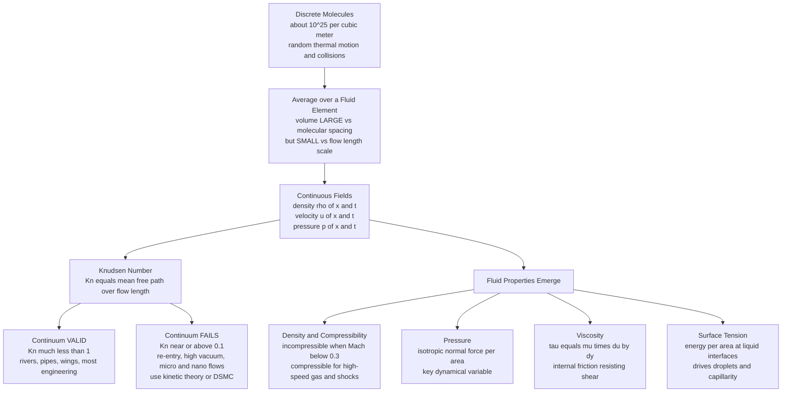

# 🌊 The Continuum Hypothesis and Fluid Properties

> [!abstract] TL;DR
> A fluid is really a swarm of chaotically colliding molecules, but fluid dynamics works by pretending it is a smooth continuous substance with a well-defined density $\rho(\mathbf{x},t)$, velocity $\mathbf{u}(\mathbf{x},t)$, and pressure $p(\mathbf{x},t)$ at *every* point. This **continuum hypothesis** holds whenever the mean free path is tiny compared to the flow scale — quantified by the **Knudsen number** $Kn \ll 1$ — and it defines the physical properties (density and compressibility, pressure, and especially **viscosity** via Newton's law $\tau = \mu\,du/dy$, plus surface tension) that, bundled into dimensionless numbers, govern every flow. This is the bedrock on which all of fluid mechanics is built.

## Intuition — analogy FIRST

A fluid is really a swarm of frantic, colliding molecules — roughly $10^{25}$ of them in every cubic meter of air, each zig-zagging and slamming into its neighbors billions of times a second. Yet nobody models a river by tracking every water molecule. Instead we **blur our eyes**: we zoom out just enough that the molecular graininess vanishes and the fluid looks like a smooth, continuous substance with a single density and a single velocity at each point in space.

That "blurring" is the **continuum hypothesis**. It is a genuine sleight of hand — we replace an unimaginable number of discrete particles with a handful of smooth mathematical fields — and it is what makes fluid dynamics tractable at all. But the trick quietly *fails* for a rocket in the near-vacuum of the upper atmosphere: up there the molecules are so sparse that a spacecraft might sit between collisions, the blur has nothing to average over, and "density at a point" stops meaning anything. Knowing *when* the blur works and *when* it breaks is the first thing to master before writing a single equation of motion.

This note is the foundation of the *Fluid_Dynamics* vault. It sits just after *Fluid_Dynamics_Overview* and feeds directly into *Conservation_Laws_and_Control_Volumes*, *The_Navier_Stokes_Equations*, *Dimensional_Analysis_and_Similarity*, and the deeper treatment in *Viscosity_and_Stress_in_Fluids* — all forthcoming siblings referenced here in prose.

---

## How It Works

The continuum hypothesis rests on a **separation of scales**. Pick a small blob of fluid — a **fluid element** (or "fluid particle") — and shrink it. If you shrink it to molecular size, the number of molecules inside fluctuates wildly and "density" jumps around meaninglessly. If you grow it to the size of the whole flow, it averages over real macroscopic gradients and blurs out the physics you care about. In between lies a **plateau**: a volume *large* compared to the molecular spacing (so statistical fluctuations are negligible) yet *small* compared to the flow length scale (so it still resolves gradients). On that plateau we define smooth fields:

$$\rho(\mathbf{x},t),\qquad \mathbf{u}(\mathbf{x},t),\qquad p(\mathbf{x},t),\qquad T(\mathbf{x},t)$$

The validity of this averaging is captured by one dimensionless number, the **Knudsen number**:

$$Kn = \frac{\lambda}{L}$$

where $\lambda$ is the molecular **mean free path** (average distance between collisions) and $L$ is the characteristic flow length. When $Kn \ll 1$ the continuum is excellent; when $Kn \gtrsim 0.1$ molecular effects intrude (slip, rarefaction) and you must reach for **kinetic theory** — the Boltzmann equation or **Direct Simulation Monte Carlo (DSMC)** — instead of Navier-Stokes.

Once the continuum holds, a small set of **fluid properties** emerges as smooth fields and material constants: density and its compressibility, pressure, viscosity, surface tension, plus transport coefficients (thermal conductivity, diffusivity) and an equation of state tying them together.



---

## Key Concepts / Details

### Secondary Level

**Solid vs fluid — the defining test.** A solid resists a shear stress *statically*: push tangentially on a block of steel and it deforms a little, then stops. A **fluid cannot resist shear at rest** — apply *any* shear stress and it keeps deforming (it flows) for as long as the stress is applied. That single property is the definition of "fluid" and unites both liquids and gases.

**Density** $\rho$ is mass per unit volume ($\text{kg/m}^3$): water $\approx 1000$, air $\approx 1.2$ at sea level. Under the continuum hypothesis, density is a smooth field $\rho(\mathbf{x},t)$ — it has a value at every point, even though at the molecular level it is really "some molecules in a tiny box."

**Pressure** $p$ is the normal force a fluid pushes with, per unit area ($\text{Pa} = \text{N/m}^2$). In a fluid at rest it is **isotropic**: the same in every direction, because it comes from molecular collisions arriving equally from all sides.

**Viscosity** is a fluid's internal "thickness" or friction. Honey is very viscous (pours slowly); water is much less; air barely at all. Viscosity is why stirring honey takes effort and why syrup coats a spoon.

**Surface tension** is the "skin" on a liquid surface that lets water striders walk on ponds and pulls small droplets into spheres.

### Undergraduate Level

**The fluid element and the Lagrangian picture.** A **fluid element** is a small blob of fluid — large enough to contain a statistically huge number of molecules, small enough to be treated as a point in the continuum. Tracking one such blob as it *moves, deforms, and rotates* is the **Lagrangian description**, and it is the basis of the **material (substantial) derivative** $D/Dt = \partial_t + \mathbf{u}\cdot\nabla$ developed in *Conservation_Laws_and_Control_Volumes*.

**Density and compressibility.** A flow is **incompressible** when density is essentially constant along fluid elements ($D\rho/Dt \approx 0$). This holds for nearly all liquids and for gases at low speed — specifically when the **Mach number** $Ma = U/c \lesssim 0.3$ (density variations then stay below a few percent). It is a *huge* simplification: the continuity equation collapses to $\nabla\cdot\mathbf{u} = 0$. **Compressible** flow ($\rho$ varies with $p$) is essential for high-speed aerodynamics, shock waves, and acoustics. The isothermal compressibility is $\kappa = -\tfrac{1}{V}\,\partial V/\partial p = \rho^{-1}\,\partial\rho/\partial p$, and the speed of sound is $c = \sqrt{\partial p/\partial\rho}$.

**Pressure as a dynamical variable.** Beyond statics, pressure is a *field* $p(\mathbf{x},t)$ that does mechanical work and enforces incompressibility (it becomes a Lagrange multiplier for $\nabla\cdot\mathbf{u}=0$). Thermodynamic pressure links to density and temperature through an **equation of state**, e.g. the ideal gas law $p = \rho R T / M$.

**Newton's law of viscosity.** Consider **Couette flow**: fluid between a fixed lower plate and an upper plate dragged at speed $U$, gap $h$. The fluid develops a *linear* velocity profile $u(y) = U\,y/h$, and the shear stress transmitted through it is

$$\tau = \mu\,\frac{du}{dy}$$

Fluids obeying this linear relation are **Newtonian** (water, air, most simple liquids). Here $\mu$ is the **dynamic viscosity** ($\text{Pa·s}$); the **kinematic viscosity** is $\nu = \mu/\rho$ ($\text{m}^2/\text{s}$), the quantity that actually appears in the **Reynolds number**. The range of $\mu$ is staggering — air $\sim 1.8\times10^{-5}$, water $\sim 1.0\times10^{-3}$, honey $\sim 10$, cold glass $\sim 10^{19}\ \text{Pa·s}$ — spanning over twenty orders of magnitude. Temperature dependence runs *opposite* for the two phases: **gas viscosity rises with $T$** (faster molecules transport more momentum), while **liquid viscosity falls with $T$** (thermal energy loosens intermolecular bonds).

**Surface tension** $\gamma$ ($\text{N/m}$ or $\text{J/m}^2$) is the excess energy of a liquid interface: molecules at the surface have unbalanced attraction (fewer neighbors on the vapor side), so the liquid minimizes area. It sets the Young-Laplace pressure jump $\Delta p = \gamma(1/R_1 + 1/R_2)$ across a curved interface and dominates at small scales — captured by the **Weber number** $We = \rho U^2 L/\gamma$ and the **capillary number** $Ca = \mu U/\gamma$.

### Graduate Level

**Physical origin of viscosity.** In a *gas*, viscosity is **molecular momentum transport**. Kinetic theory (see [[Kinetic_Theory_of_Gases]]) gives $\mu \approx \tfrac{1}{3}\rho\,\bar{v}\,\lambda$, where $\bar{v}$ is the mean molecular speed and $\lambda$ the mean free path. Molecules from a fast-moving layer wander (a distance $\sim\lambda$) into a slow layer carrying their extra momentum, exerting a drag — hence the counterintuitive Maxwell result that **gas viscosity is independent of pressure** and rises as $\sqrt{T}$. In a *liquid*, viscosity is dominated instead by intermolecular cohesion and cage escape, giving an Arrhenius-like $\mu \propto e^{E_a/k_B T}$ that *falls* with temperature.

**The Knudsen regimes.** With $Kn = \lambda/L$:

| Regime | Range | Governing description |
|---|---|---|
| Continuum | $Kn < 0.01$ | Navier-Stokes, no-slip walls |
| Slip flow | $0.01 < Kn < 0.1$ | Navier-Stokes with velocity-slip and temperature-jump boundary conditions |
| Transitional | $0.1 < Kn < 10$ | Boltzmann equation / DSMC |
| Free-molecular | $Kn > 10$ | Ballistic molecules, collisionless kinetics |

Rarefied regimes appear in **spacecraft re-entry** (thin upper atmosphere), **high vacuum systems**, and **MEMS / nano-channels** (tiny $L$). For air at sea level $\lambda \approx 70\ \text{nm}$, so a $70\ \text{nm}$ channel already has $Kn \approx 1$.

**Full stress tensor and Newtonian closure.** The continuum stress is $\sigma_{ij} = -p\,\delta_{ij} + \tau_{ij}$, and the Newtonian constitutive law relates deviatoric stress linearly to the strain-rate tensor $e_{ij} = \tfrac{1}{2}(\partial_i u_j + \partial_j u_i)$:

$$\tau_{ij} = 2\mu\, e_{ij} + \lambda_b\, (\nabla\cdot\mathbf{u})\,\delta_{ij}$$

with $\lambda_b$ the **second (bulk) viscosity**; Stokes' hypothesis sets $\lambda_b = -\tfrac{2}{3}\mu$. This closure is what turns Cauchy's momentum equation into the **Navier-Stokes equations**, derived in full in *The_Navier_Stokes_Equations* and *Viscosity_and_Stress_in_Fluids*.

**Ideal vs real fluids.** The **ideal fluid** idealization — *inviscid* ($\mu = 0$) and *incompressible* — yields the Euler equations and clean results like Bernoulli's theorem (see [[Euler_Equations_and_Ideal_Fluids]]). It is superb *away from walls* at high Reynolds number, but it produces paradoxes at boundaries (d'Alembert's paradox: zero drag). **Real fluids** carry viscosity and compressibility; even a vanishingly small $\mu$ creates a thin **boundary layer** where the inviscid picture fails. Choosing which idealization applies — and where it breaks — is the central modeling judgment of fluid mechanics.

---

## Python Demo

```python
# Two ideas in one figure:
#   (a) THE CONTINUUM LIMIT — measure "density" by counting molecules in an
#       averaging window of increasing size. At tiny windows the reading
#       FLUCTUATES wildly (few molecules); at intermediate windows it
#       STABILIZES on the continuum PLATEAU; at huge windows it DRIFTS as the
#       window smears over a macroscopic density bump.
#   (b) VISCOSITY — Newton's law via a linear Couette shear profile, plus the
#       ~24-order-of-magnitude spread of real-fluid viscosities.
import numpy as np
import matplotlib.pyplot as plt

rng = np.random.default_rng(0)

# ----------------------------------------------------------------------
# (a) CONTINUUM LIMIT: molecules on a 1D line with a smooth macroscopic
#     density BUMP centered at x0. Number density n(x) = n0 * (1 + A*bump).
# ----------------------------------------------------------------------
n0, A, sigma, x0 = 2000.0, 1.0, 0.12, 0.5          # baseline density, bump amp/width, probe point
true_local = n0 * (1 + A)                          # continuum density AT the probe point

grid = np.linspace(0, 1, 4000)
pdf  = 1 + A * np.exp(-((grid - x0) / sigma) ** 2) # shape of n(x)
cdf  = np.cumsum(pdf); cdf /= cdf[-1]
expected_total = n0 * np.trapz(pdf, grid)          # expected molecule count

def sample_molecules():
    """Draw one Poisson realization of molecule positions from n(x)."""
    N = rng.poisson(expected_total)
    m = np.interp(rng.random(N), cdf, grid)
    m.sort()
    return m

widths = np.logspace(-3, -0.1, 55)                 # half-widths = averaging "volume" sizes
n_real = 300
meas = np.zeros((n_real, widths.size))
for r in range(n_real):
    m = sample_molecules()
    lo = np.searchsorted(m, x0 - widths)           # vectorised over all widths
    hi = np.searchsorted(m, x0 + widths)
    meas[r] = (hi - lo) / (2 * widths)             # count / window length = density

mean_rho, std_rho = meas.mean(0), meas.std(0)

# Data-driven plateau: small fluctuation AND small macroscopic bias
rel_noise = std_rho / np.maximum(mean_rho, 1e-9)
rel_bias  = np.abs(mean_rho - true_local) / true_local
plateau   = (rel_noise < 0.15) & (rel_bias < 0.05)

# ----------------------------------------------------------------------
# (b) VISCOSITY: linear Couette profile  u(y) = U*y/h ,  tau = mu*U/h
# ----------------------------------------------------------------------
U, h, mu = 1.0, 1.0, 1.0e-3
y = np.linspace(0, h, 50)
u = U * y / h
tau = mu * U / h                                   # constant shear stress

# (c) Real-fluid viscosities spanning ~24 orders of magnitude
fluids = ["Air", "Water", "Olive oil", "Honey", "Pitch", "Glass (cold)"]
mus    = [1.8e-5, 1.0e-3, 8.4e-2, 1.0e1, 2.3e8, 1.0e19]

# ----------------------------------------------------------------------
# Plot
# ----------------------------------------------------------------------
fig, ax = plt.subplots(1, 3, figsize=(16, 5))

# (a) continuum plateau
ax[0].fill_between(widths, mean_rho - std_rho, mean_rho + std_rho,
                   color="#4a9eff", alpha=0.25, label="fluctuation band (±1σ)")
ax[0].plot(widths, mean_rho, color="#1f5fa8", lw=2, label="measured density (mean)")
ax[0].axhline(true_local, color="#ff6b6b", ls="--", lw=1.5, label="true local density")
if plateau.any():
    ax[0].axvspan(widths[plateau].min(), widths[plateau].max(),
                  color="#51cf66", alpha=0.20, label="continuum plateau")
ax[0].set_xscale("log")
ax[0].set_xlabel("averaging window half-width  (volume size)")
ax[0].set_ylabel("measured density  ρ")
ax[0].set_title("(a) The continuum limit\nfluctuate → plateau → drift")
ax[0].set_ylim(0, 1.6 * true_local)
ax[0].legend(fontsize=8, loc="lower center")

# (b) Couette shear profile
ax[1].plot(u, y, color="#1f5fa8", lw=2, marker="o", ms=3)
ax[1].fill_betweenx(y, 0, u, color="#4a9eff", alpha=0.15)
ax[1].set_xlabel("velocity  u(y) = U·y/h")
ax[1].set_ylabel("wall-normal distance  y")
ax[1].set_title("(b) Newton's law of viscosity\nlinear Couette profile")
ax[1].text(0.30, 0.55, f"τ = μ·du/dy\n  = {tau:.1e} Pa\n(constant across gap)",
           fontsize=10, bbox=dict(boxstyle="round", fc="#fff3bf", ec="#e0b400"))

# (c) viscosity across orders of magnitude
ypos = np.arange(len(fluids))
ax[2].barh(ypos, mus, color="#51cf66", ec="k")
ax[2].set_xscale("log")
ax[2].set_yticks(ypos); ax[2].set_yticklabels(fluids)
ax[2].set_xlabel("dynamic viscosity μ  (Pa·s, log scale)")
ax[2].set_title("(c) Viscosity spans ~24\norders of magnitude")
for i, v in enumerate(mus):
    ax[2].text(v * 1.5, i, f"{v:.0e}", va="center", fontsize=8)
ax[2].set_xlim(1e-6, 1e22)

plt.tight_layout()
plt.show()

# Quick console check of the plateau location
if plateau.any():
    print(f"Continuum plateau spans window half-widths "
          f"{widths[plateau].min():.4f} to {widths[plateau].max():.4f}")
    print(f"True local density = {true_local:.0f}, "
          f"plateau mean = {mean_rho[plateau].mean():.0f}")
```

The left panel is the whole idea of the continuum hypothesis in one plot: too small a sample (few molecules) gives a wildly noisy density; too large a sample smears over the macroscopic bump and drifts; only the green **plateau** in between gives a stable, meaningful "density at a point." The middle and right panels ground **viscosity** — the linear Couette profile realizing $\tau = \mu\,du/dy$, and the astonishing range of $\mu$ across everyday fluids.

---

## Real-World Applications

- **Aircraft and automotive aerodynamics.** At cruise, air over a wing has $Kn \sim 10^{-8}$, so the continuum hypothesis and Navier-Stokes are rock-solid; low-speed flight ($Ma < 0.3$) is treated as incompressible, transonic/supersonic flight as compressible with shocks.
- **Spacecraft re-entry and satellite drag.** In the rarefied thermosphere the mean free path grows to meters; $Kn$ crosses into the transitional and free-molecular regimes, so re-entry heating and satellite drag are computed with **DSMC**, not continuum CFD.
- **MEMS and microfluidics.** In sub-micron channels $L$ is so small that $Kn$ becomes appreciable even at atmospheric pressure, forcing **slip boundary conditions**; at the same scale, surface tension and capillarity (high $We^{-1}$, $Ca$) dominate over inertia.
- **Lubrication and process engineering.** Selecting oils, coolants, and polymer melts is fundamentally about tuning **viscosity** and its temperature dependence; the huge $\mu$ range explains why the *same equations* describe both air over a wing and glass slumping over centuries.
- **Blood flow and biological transport.** Continuum modeling underlies hemodynamics, though at capillary scale (cells comparable to channel width) the continuum assumption is stretched — a theme in [[Fluid_Dynamics_in_Biology]].

---

## Common Pitfalls

1. **Assuming the continuum always holds.** It fails whenever $Kn \gtrsim 0.1$ — rarefied gas, high vacuum, nano-channels, re-entry. "Density at a point" is meaningless when a molecule barely fits in your averaging window.
2. **Confusing dynamic and kinematic viscosity.** $\mu$ (Pa·s) measures momentum diffusion per unit velocity gradient; $\nu = \mu/\rho$ (m²/s) is what enters the Reynolds number. Air has *lower* $\mu$ but *higher* $\nu$ than water — a frequent sign-of-intuition error.
3. **Getting the temperature trend backwards.** Gas viscosity *increases* with $T$ (momentum transport), liquid viscosity *decreases* with $T$ (bond loosening). Applying the liquid intuition to a gas (or vice versa) gives the wrong sign.
4. **Treating every gas flow as incompressible.** Incompressibility is a low-Mach approximation ($Ma \lesssim 0.3$), not a property of the substance. Above that, density variation and shocks matter.
5. **Ignoring surface tension at small scales.** As $L$ shrinks, surface forces overtake inertia and gravity; a droplet model that neglects $\gamma$ will mispredict breakup, wetting, and capillary rise.
6. **Believing "inviscid" means viscosity is truly zero.** The ideal-fluid model drops viscosity in the bulk but cannot satisfy the no-slip wall condition — a thin boundary layer always survives, and it controls drag and separation.

---

## Related Concepts

- [[Fluid_Statics_and_Properties]] — Physics companion: pressure, buoyancy, surface tension, and Newtonian/non-Newtonian viscosity in fluids at rest.
- [[Kinetic_Theory_of_Gases]] — the molecular basis; supplies the mean free path $\lambda$ behind the Knudsen number and the $\mu \approx \tfrac13\rho\bar v\lambda$ origin of gas viscosity.
- [[Euler_Equations_and_Ideal_Fluids]] — the inviscid, incompressible *ideal fluid* idealization this note contrasts with real fluids.
- [[Viscous_Fluids_and_Navier_Stokes]] — where the viscosity and stress tensor introduced here enter the equations of motion.
- [[States_of_Matter_and_Gas_Laws]] — Chemistry view of the solid/liquid/gas distinction and the equation of state relating $p$, $\rho$, $T$.
- [[Intermolecular_Forces_and_the_Aqueous_Environment]] — Biophysics: the unbalanced molecular attractions that produce surface tension and cohesion.
- [[Diffusion_and_Brownian_Motion_in_Cells]] — molecular transport and the low-Reynolds, high-$Kn$-adjacent regime of cellular fluids.
- [[Fluid_Dynamics_in_Biology]] — continuum fluid mechanics (and its limits) applied to blood, cilia, and swimming.
- [[Polymer_Mechanics_and_Viscoelasticity]] — Materials view of non-Newtonian, rate-dependent stress response beyond simple $\mu$.
- [[Ceramics_and_Glasses]] — glass as an extraordinarily viscous fluid, the far end of the viscosity range.

---

## Review Questions

1. **Secondary.** In one or two sentences, what distinguishes a *fluid* from a *solid* in terms of how each responds to a shear stress? Give an everyday example of the huge spread in viscosity between two fluids.
2. **Undergraduate.** For Couette flow between plates a distance $h = 2\ \text{mm}$ apart with the top plate moving at $U = 0.5\ \text{m/s}$ through water ($\mu = 1.0\times10^{-3}\ \text{Pa·s}$), sketch the velocity profile and compute the shear stress $\tau = \mu\,du/dy$. Then explain why the *kinematic* viscosity $\nu = \mu/\rho$, not $\mu$, is the quantity that appears in the Reynolds number.
3. **Graduate.** Air at sea level has a mean free path $\lambda \approx 70\ \text{nm}$. (a) Estimate the Knudsen number for flow over a $2\ \text{m}$ car and for flow in a $100\ \text{nm}$ nano-channel, and classify each regime. (b) A satellite re-enters where $\lambda \approx 1\ \text{m}$; explain physically why continuum Navier-Stokes breaks down and what computational approach replaces it. (c) Using $\mu \approx \tfrac13\rho\bar v\lambda$, argue why gas viscosity is essentially independent of pressure yet rises with temperature.

---

## Sources

- Batchelor, G. K. — *An Introduction to Fluid Dynamics*, Ch. 1 (the continuum hypothesis and fluid properties).
- Kundu, Cohen & Dowling — *Fluid Mechanics*, 6th ed., Ch. 1 (continuum, viscosity, surface tension) and Ch. 2 (Cartesian tensors, stress).
- White, F. M. — *Fluid Mechanics*, 8th ed., Ch. 1 (properties of fluids, the continuum concept, Newtonian viscosity).
- Bird, Stewart & Lightfoot — *Transport Phenomena*, 2nd ed., Ch. 1 (viscosity and the mechanisms of momentum transport).
- Cercignani, C. — *Rarefied Gas Dynamics* (Knudsen-number regimes and the failure of the continuum).

#fluid-dynamics #continuum-hypothesis #viscosity #fluid-properties #knudsen-number
