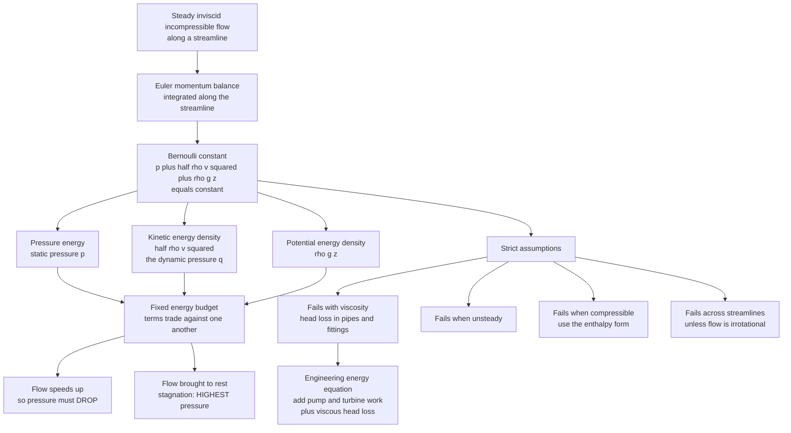

# 🌊 Bernoulli and Energy in Flows

> [!abstract] TL;DR
> **Bernoulli's equation** is nothing more exotic than **conservation of energy written for a flowing fluid**. Follow one streamline of a **steady, inviscid, incompressible** flow and the sum of three energy densities stays constant: $p + \tfrac12\rho v^2 + \rho g z = \text{const}$ — a **pressure** term, a **kinetic** term (the *dynamic pressure* $\tfrac12\rho v^2$), and a **gravitational** term. Because that total is fixed, the terms trade against one another, which gives fluid dynamics its most famous and most counterintuitive headline: **where a fluid flows faster, its pressure is lower.** This single balance underlies flow measurement (**Venturi** meters, **Pitot** tubes), draining and spraying (**Torricelli's law** $v=\sqrt{2gh}$, atomizers), and the pressure differences that *accompany* lift. But its power is matched by its fragility: the assumptions are strict, and the moment viscosity, unsteadiness, compressibility, or vorticity across streamlines enters, the clean form fails — which is why the engineering **energy equation** bolts on viscous **head losses** and **pump/turbine work**, and why the popular "equal-transit-time" story of airplane lift is flatly **wrong**. Understanding Bernoulli's *limits* is as important as understanding the principle.

---

## Intuition

**Analogy first.** Put your thumb over the end of a garden hose. The water shoots out *faster* — and here is the surprise buried in that everyday act — the pressure inside the fast jet *drops*. Now hold two sheets of paper a few centimetres apart and blow *between* them. They do not fly apart as you would guess; they clap *together*, sucked inward by the fast, low-pressure stream you just created. Both tricks are the same idea: a moving fluid has a fixed **energy budget** shared out among **speed, pressure, and height**, so buying more speed must be *paid for* with less pressure. That is Bernoulli's principle — **fast flow means low pressure** — and it is at once the single most famous idea in fluid dynamics and the single most frequently *mis-stated* one, dragged in (sometimes correctly, often not) to "explain" airplane wings, curveballs, shower curtains, and chimneys that draw better on a windy day.

The deep point is that nothing new or magical is being invented. A fluid parcel is just a little packet of mass obeying the work–energy theorem you already know from mechanics: to speed it up, some force has to do net work on it, and in a fluid that force is a *pressure difference*. Bernoulli's equation is that bookkeeping, made exact for an idealized flow.

---

## How It Works

### Bernoulli as an energy budget

For **steady, inviscid, incompressible** flow, along any single **streamline** (a curve everywhere tangent to the velocity):

$$\underbrace{p}_{\text{pressure energy density}} + \underbrace{\tfrac12\rho v^2}_{\text{kinetic energy density}} + \underbrace{\rho g z}_{\text{potential energy density}} = \text{constant along the streamline.}$$

Every term has units of **energy per unit volume** — equivalently, of **pressure** (pascals). Read it as a fixed pot of energy the fluid carries: pour more into the kinetic term by speeding the flow up, and the pressure term *must* fall to keep the sum constant. That is the whole physics; everything below is derivation, packaging, and caveats.

### The derivation — from Euler along a streamline

Start from the **Euler equation** (the inviscid limit of Navier–Stokes; developed in [[Euler_Equations_and_Ideal_Fluids]] and the coming sibling *Euler_Equations_and_Inviscid_Flow*). For steady flow with gravity $\vec g = -g\,\hat z$:

$$\rho\,(\vec v\cdot\nabla)\vec v = -\nabla p - \rho g\,\hat z.$$

Use the vector identity $(\vec v\cdot\nabla)\vec v = \nabla\!\left(\tfrac12 v^2\right) - \vec v\times\vec\omega$, where $\vec\omega=\nabla\times\vec v$ is the vorticity. Dot the whole equation with the unit tangent $\hat s$ along a streamline. The rotational term $\vec v\times\vec\omega$ is perpendicular to $\vec v$ (hence to $\hat s$) and *drops out*, leaving a total derivative along the streamline that integrates to

$$\frac12 v^2 + \int\frac{dp}{\rho} + gz = \text{const}.$$

For constant $\rho$ this is exactly $p + \tfrac12\rho v^2 + \rho g z = \text{const}$. The equivalent **work–energy** route reaches the same place: the net pressure force doing work on a fluid parcel as it moves down a streamline equals its change in kinetic plus potential energy — Bernoulli *is* the work–energy theorem for an ideal fluid (see [[Work_Energy_and_Conservation]]).

### The "heads" form used by engineers

Divide through by $\rho g$ and every term becomes a **length** — a "head":

$$\underbrace{\frac{p}{\rho g}}_{\text{pressure head}} + \underbrace{\frac{v^2}{2g}}_{\text{velocity head}} + \underbrace{z}_{\text{elevation head}} = H \;(\text{total head}).$$

The **total head** $H$ is the height to which the fluid's energy could raise it. Constant total head is the ideal; real pipe systems *lose* head to friction, which is where the extended energy equation comes in.

### The speed–pressure trade-off — the core intuition

Because the sum is fixed, accelerating a fluid **requires** a pressure drop, and decelerating it **produces** a pressure rise. This is why squeezing flow into a **constriction** (which speeds it up, by continuity) drops the pressure there, and why flow curving over a bump speeds up and drops pressure on the crest. The counterintuitive slogan "**fast = low pressure**" is really just "you can't get kinetic energy for free."

### Stagnation and dynamic pressure

Bring a moving fluid **completely to rest** — say, at the nose of an object or the mouth of a facing tube — and all its kinetic energy converts to pressure. That maximum is the **stagnation** (or **total**) **pressure**:

$$p_0 = \underbrace{p}_{\text{static}} + \underbrace{\tfrac12\rho v^2}_{\text{dynamic}}.$$

The **dynamic pressure** $q=\tfrac12\rho v^2$ is the kinetic term wearing a pressure hat; it is *the* key quantity in aerodynamics (lift and drag both scale with $q$). A **stagnation point** — the leading edge of a wing, the front of a bridge pier — is the spot of **highest** pressure in the flow, because there the fluid is momentarily stopped.

### The strict assumptions (the part everyone forgets)

Plain Bernoulli holds **only** when the flow is:

1. **Steady** — no explicit time dependence. (Unsteady flows add a $\partial\phi/\partial t$ term; see below.)
2. **Inviscid** — frictionless, so no energy is dissipated. Real viscosity bleeds energy into heat.
3. **Incompressible** — constant $\rho$. Good for liquids and for gases below Mach $\approx 0.3$.
4. **Along a single streamline** — the constant generally *differs* from one streamline to another. Only if the flow is also **irrotational** ($\vec\omega=0$) is the Bernoulli constant the *same everywhere*, so you may compare points on *different* streamlines.

Violate any of these and the clean equation fails. This is not pedantry: misapplying Bernoulli across streamlines of a rotational flow, or through a lossy fitting, or in a fast-changing transient, is the source of most "Bernoulli paradoxes."

### The engineering energy equation — real losses and machines

Real pipe systems are viscous and often contain pumps and turbines. The **extended (engineering) energy equation** between an upstream point 1 and a downstream point 2 keeps Bernoulli's structure but adds work and loss terms (a control-volume result; see [[Conservation_Laws_and_Control_Volumes]]):

$$\frac{p_1}{\rho g}+\frac{v_1^2}{2g}+z_1+h_{\text{pump}}
=\frac{p_2}{\rho g}+\frac{v_2^2}{2g}+z_2+h_{\text{turbine}}+h_{\text{loss}}.$$

Here $h_{\text{pump}}$ adds head (a pump does work *on* the fluid), $h_{\text{turbine}}$ removes it, and $h_{\text{loss}}$ is the irreversible **head loss** from wall friction (major losses, via the Moody chart) and fittings/valves/expansions (minor losses). This term is exactly *why real pressure does not fully recover downstream of a constriction*: some of the energy that was pressure became turbulence and heat, never to return.

### Compressible Bernoulli — foreshadowing gas dynamics

For **high-speed gas** flow, $\rho$ is no longer constant and the integral $\int dp/\rho$ must be kept. For steady, inviscid, **adiabatic** flow it is the **stagnation enthalpy** that is conserved along a streamline:

$$h + \tfrac12 v^2 = h_0 \quad\Longrightarrow\quad c_p T + \tfrac12 v^2 = c_p T_0,$$

so a gas brought to rest heats up to the **stagnation temperature** $T_0$, and (via the isentropic relations) reaches a **stagnation pressure** $p_0 = p\,(1+\tfrac{\gamma-1}{2}Ma^2)^{\gamma/(\gamma-1)}$. In the low-Mach limit this reduces to the incompressible $p_0=p+\tfrac12\rho v^2$. Full treatment lands in the sibling *Compressible_Flow_and_Gas_Dynamics*.

### The lift misconception (an important corrective)

Bernoulli is *correct* physics, but it is routinely welded to a *wrong* story: the **"equal-transit-time"** (or "longer-path") myth claims air over a wing's curved top must travel farther and therefore faster to "meet up" with the air underneath at the trailing edge. **There is no law requiring the two streams to reunite**, and measurements show the top flow arrives *earlier*, moving far faster than the path-length argument predicts. The lift that "equal transit" predicts is far *smaller* than the lift wings actually produce. Lift is better understood via **circulation** and the **Kutta–Joukowski** theorem ($L' = \rho v_\infty\Gamma$) and, equivalently, via **momentum** (Newton's third law — the wing deflects a large mass of air *downward*, and the reaction pushes it up; see [[Newtons_Laws_and_Kinematics]]). The pressure differences *do* accompany lift and *are* consistent with Bernoulli — but Bernoulli alone does not *explain* why the top flow is fast. This nuance belongs to the coming sibling *Lift_Drag_and_Aerodynamics*.



---

## Key Concepts

### Secondary Level

- **Fast flow, low pressure.** In a smoothly flowing fluid, wherever it moves faster, the pressure is lower. Thumb on a hose, air between two sheets of paper — same rule.
- **A shared energy budget.** A fluid's energy is split between **pressure**, **speed**, and **height**. Speed one up and another must go down; the total stays fixed.
- **Torricelli's law.** Water squirts from a hole a depth $h$ below the surface at $v=\sqrt{2gh}$ — the *same* speed it would reach falling freely through height $h$.
- **Everyday machines.** A **Venturi** narrows a pipe to speed the flow and drop pressure (carburettors, aspirators, flow meters); a **Pitot tube** on an aircraft reads airspeed from the pressure of the air it stops.
- **Careful with lift.** "Air travels farther over the top so it goes faster" is a *myth*; wings work mainly by pushing air down.

### Undergraduate Level

- **Bernoulli's equation:** $p+\tfrac12\rho v^2+\rho g z=\text{const}$ along a streamline (steady, inviscid, incompressible); constant everywhere if also irrotational.
- **Heads form:** $\dfrac{p}{\rho g}+\dfrac{v^2}{2g}+z=H$ = pressure head + velocity head + elevation head = total head.
- **Venturi:** combine **continuity** $A_1 v_1=A_2 v_2$ with Bernoulli; for a horizontal meter $p_1-p_2=\tfrac12\rho\!\left(v_2^2-v_1^2\right)$, so the throat pressure is lowest.
- **Pitot tube:** $v=\sqrt{2\,(p_0-p)/\rho}$ from the stagnation-minus-static pressure.
- **Torricelli:** apply Bernoulli from the free surface (speed $\approx 0$, atmospheric) to the jet (atmospheric) to get $v=\sqrt{2gh}$.
- **Stagnation and dynamic pressure:** $p_0=p+\tfrac12\rho v^2$; the dynamic pressure $q=\tfrac12\rho v^2$ sets lift and drag magnitudes.
- **Extended energy equation:** add $h_{\text{pump}}$, $h_{\text{turbine}}$, and $h_{\text{loss}}$ for real pipe-system design; head loss is why pressure does not fully recover.

### Graduate Level

- **Where the constant lives.** For rotational flow the Bernoulli "constant" varies from streamline to streamline; **Crocco's theorem** relates its gradient to vorticity and entropy gradients ($\nabla h_0 = T\nabla s + \vec v\times\vec\omega$). Only irrotational flow gives a single global constant.
- **Unsteady Bernoulli.** For irrotational, incompressible flow with velocity potential $\phi$ ($\vec v=\nabla\phi$): $\dfrac{\partial\phi}{\partial t}+\dfrac{v^2}{2}+\dfrac{p}{\rho}+gz=f(t)$ — the transient term matters for water hammer, sloshing, and acoustics.
- **Compressible / stagnation relations.** Conserved stagnation enthalpy $h_0=h+\tfrac12 v^2$; for a perfect gas $T_0/T=1+\tfrac{\gamma-1}{2}Ma^2$ and $p_0/p=(1+\tfrac{\gamma-1}{2}Ma^2)^{\gamma/(\gamma-1)}$, recovering the incompressible dynamic-pressure form as $Ma\to0$.
- **Loss modelling.** Head loss splits into **major** (Darcy–Weisbach $h_f=f\tfrac{L}{D}\tfrac{v^2}{2g}$, with $f$ from the Moody chart / Colebrook) and **minor** ($h_m=K\tfrac{v^2}{2g}$) contributions; flow **separation** in an adverse pressure gradient downstream of a throat is what prevents full pressure recovery.
- **Lift, properly.** Circulation $\Gamma$ fixed by the **Kutta condition** gives $L'=\rho v_\infty\Gamma$ (Kutta–Joukowski); Bernoulli then *maps* the velocity field to the surface pressure field, but the *cause* is circulation / downward momentum flux, not path length.

---

## Python Demo

```python
# Bernoulli's energy budget in action, four ways:
#  (a) VENTURI  : continuity (A v = Q) + Bernoulli -> velocity and PRESSURE
#                 along a converging-diverging pipe; pressure DIPS at the
#                 throat where the flow speeds up, and recovers downstream
#                 (ideal) vs only partly recovers (real, with head loss).
#  (b) TORRICELLI: exit speed from a hole at depth h, v = sqrt(2 g h),
#                  shown to equal the free-fall speed from height h.
#  (c) PITOT     : infer airspeed from stagnation-minus-static pressure.
#  (d) MISCONCEPTION CHECK: the 'equal-transit-time' story underpredicts lift.
# Requires: numpy, matplotlib
import numpy as np
import matplotlib.pyplot as plt

rho = 1000.0   # water density [kg/m^3]
g   = 9.81     # gravity [m/s^2]

# ================================================================
# (a) VENTURI: continuity + Bernoulli through a smooth constriction
# ================================================================
x = np.linspace(0.0, 1.0, 400)                 # position along pipe [m]
A_wide = 0.01                                  # inlet/outlet area [m^2]
throat_ratio = 0.4                             # throat area / wide area
# smooth Gaussian-shaped constriction centred at x = 0.5
A = A_wide * (1.0 - (1.0 - throat_ratio) * np.exp(-((x - 0.5) / 0.12) ** 2))

Q = 0.02                                       # volumetric flow rate [m^3/s]
v = Q / A                                      # continuity: v = Q / A(x)

# Bernoulli along a horizontal pipe: p + 0.5 rho v^2 = const
p_inlet = 200_000.0                            # inlet static pressure [Pa]
v_inlet = v[0]
p_ideal = p_inlet + 0.5 * rho * (v_inlet ** 2 - v ** 2)

# Real flow: irreversible loss => pressure does NOT fully recover downstream.
# Simple monotonic head-loss ramp after the throat (illustrative).
q_scale = 0.5 * rho * (v.max() ** 2 - v_inlet ** 2)
loss = np.where(x > 0.5, 0.35 * q_scale * (x - 0.5) / 0.5, 0.0)
p_real = p_ideal - loss

print("=== Venturi ===")
print(f"inlet speed  = {v_inlet:5.2f} m/s   throat speed = {v.max():5.2f} m/s")
print(f"ideal throat pressure = {p_ideal.min()/1e3:6.1f} kPa  (drop of "
      f"{(p_inlet - p_ideal.min())/1e3:.1f} kPa)")
print(f"real outlet pressure  = {p_real[-1]/1e3:6.1f} kPa  "
      f"(ideal would recover to {p_ideal[-1]/1e3:.1f} kPa)")

# ================================================================
# (b) TORRICELLI: exit speed from depth h equals free-fall speed
# ================================================================
h = np.linspace(0.0, 5.0, 200)                 # hole depth below surface [m]
v_torricelli = np.sqrt(2 * g * h)              # from Bernoulli
v_freefall   = np.sqrt(2 * g * h)              # object dropped through height h
print("\n=== Torricelli ===")
print(f"max |v_Bernoulli - v_freefall| = {np.max(np.abs(v_torricelli - v_freefall)):.2e} m/s"
      "  (identical -> draining = falling)")

# ================================================================
# (c) PITOT: airspeed from dynamic pressure, v = sqrt(2 (p0 - p) / rho_air)
# ================================================================
rho_air = 1.225                                # air density [kg/m^3]
dp = np.linspace(0.0, 4000.0, 200)             # measured p0 - p [Pa]
v_pitot = np.sqrt(2 * dp / rho_air)
dp_cruise = 0.5 * rho_air * 250.0 ** 2         # dynamic pressure at 250 m/s
print("\n=== Pitot ===")
print(f"a 250 m/s airliner produces p0 - p = {dp_cruise:,.0f} Pa of dynamic pressure")

# ================================================================
# (d) MISCONCEPTION CHECK: 'equal transit time' underpredicts lift
# ================================================================
v_bot = 60.0                                   # airspeed under the wing [m/s]
path_excess = 0.12                             # top surface 12% longer
v_top_ett = v_bot * (1 + path_excess)          # equal-transit-time prediction
dp_ett = 0.5 * rho_air * (v_top_ett ** 2 - v_bot ** 2)
v_top_real = v_bot * 1.35                       # measured top speed is much higher
dp_real = 0.5 * rho_air * (v_top_real ** 2 - v_bot ** 2)
print("\n=== Lift misconception check ===")
print(f"equal-transit top speed = {v_top_ett:5.1f} m/s -> pressure diff {dp_ett:6.0f} Pa")
print(f"realistic  top speed    = {v_top_real:5.1f} m/s -> pressure diff {dp_real:6.0f} Pa")
print(f"equal-transit underpredicts the pressure difference by about "
      f"{100 * (1 - dp_ett / dp_real):.0f} percent")

# ================================================================
# PLOTS
# ================================================================
fig, ax = plt.subplots(2, 2, figsize=(13, 9))
fig.suptitle("Bernoulli and Energy in Flows", fontsize=15, fontweight="bold")

# A: Venturi velocity + area
axA = ax[0, 0]
axA.plot(x, v, color="#1f77b4", lw=2.2)
axA.set_xlabel("position along pipe  x [m]")
axA.set_ylabel("velocity  v [m/s]", color="#1f77b4")
axA.tick_params(axis="y", labelcolor="#1f77b4")
axA2 = axA.twinx()
axA2.plot(x, A * 1e4, color="#7f7f7f", ls="--", lw=1.5)
axA2.set_ylabel("area [cm^2]", color="#7f7f7f")
axA2.tick_params(axis="y", labelcolor="#7f7f7f")
axA.set_title("A. Venturi: continuity speeds flow up in the throat")

# B: Venturi pressure (ideal vs with loss)
axB = ax[0, 1]
axB.plot(x, p_ideal / 1e3, color="#2ca02c", lw=2.2, label="ideal Bernoulli")
axB.plot(x, p_real / 1e3, color="#d62728", lw=2.0, ls="--", label="real flow with losses")
axB.axvline(0.5, color="k", lw=0.8, ls=":")
axB.set_xlabel("position along pipe  x [m]")
axB.set_ylabel("static pressure [kPa]")
axB.set_title("B. Pressure DROPS at the throat, then recovers")
axB.legend(fontsize=8)

# C: Torricelli
axC = ax[1, 0]
axC.plot(h, v_torricelli, color="#1f77b4", lw=2.6, label="Bernoulli  v = sqrt(2 g h)")
axC.plot(h, v_freefall, color="#ff7f0e", lw=1.2, ls="--", label="free fall from height h")
axC.set_xlabel("depth of hole below surface  h [m]")
axC.set_ylabel("exit speed [m/s]")
axC.set_title("C. Torricelli: draining speed equals free-fall speed")
axC.legend(fontsize=8)

# D: Pitot
axD = ax[1, 1]
axD.plot(dp, v_pitot, color="#9467bd", lw=2.6)
axD.set_xlabel("stagnation minus static pressure  p0 - p [Pa]")
axD.set_ylabel("inferred airspeed [m/s]")
axD.set_title("D. Pitot tube: airspeed from dynamic pressure")

plt.tight_layout(rect=[0, 0, 1, 0.96])
plt.savefig("bernoulli_energy_in_flows.png", dpi=130)
plt.show()
```

Running the script prints the Venturi numbers (the flow accelerates from 2 m/s to 5 m/s in the throat, the ideal pressure dips ~10.5 kPa there, and the *real* outlet pressure falls short of full recovery because of head loss), confirms Torricelli's speed is identical to free-fall, reports the airliner's dynamic pressure, and shows the equal-transit-time story underpredicting the lift-related pressure difference by roughly 60 percent. The four panels visualize each: the Venturi velocity-and-area profile, the pressure dip and its incomplete recovery, the Torricelli-equals-free-fall curve, and the Pitot airspeed calibration.

---

## Real-World Applications

- **Venturi meters and carburettors.** A calibrated constriction turns an easily measured **pressure drop** into a flow-rate reading; the same throat suction pulls fuel into a carburettor's air stream and draws liquid in **aspirators** and vacuum ejectors.
- **Pitot-static airspeed indicators.** Every aircraft measures airspeed by comparing the **stagnation** pressure at a forward-facing tube with the ambient **static** pressure and inverting $v=\sqrt{2\,(p_0-p)/\rho}$ — a blocked or iced Pitot tube has caused fatal loss-of-airspeed accidents.
- **Draining, siphons, and fountains.** Torricelli's law sizes tank-drain times, spillways, and the reach of a fire hose; siphons and fountains are Bernoulli plus gravity.
- **Atomizers and spray.** Perfume atomizers, spray guns, and inhalers use a fast air jet's low pressure to lift and shatter liquid into droplets (the same suction as the two-sheets-of-paper demo).
- **Pipe-system and pump design.** The **extended energy equation** with head loss and pump/turbine work is the daily tool for sizing pumps, choosing pipe diameters, and predicting pressure at every node of a network (links to control-volume analysis in [[Conservation_Laws_and_Control_Volumes]]).
- **Medicine.** Clinicians estimate the pressure drop across a narrowed heart valve or arterial **stenosis** from a simplified Bernoulli relation ($\Delta p\approx 4v^2$ in clinical units) measured by Doppler ultrasound.
- **Weather and structures.** Wind speeding over a ridge or a roof drops the pressure above it — lifting roofs in storms — the same balance behind the horizontal [[Pressure_Gradient_Force_and_Winds|pressure-gradient force that drives wind]].

---

## Common Pitfalls

- **Applying Bernoulli across streamlines of a rotational flow.** The constant is per-streamline unless the flow is irrotational. Comparing two points on *different* streamlines of a shear or wake flow gives wrong answers — a classic exam and design trap.
- **Ignoring losses in real pipes.** Plain Bernoulli predicts *full* pressure recovery downstream of a constriction. Real viscous dissipation and flow separation mean pressure recovers only partly; you must use the energy equation with $h_{\text{loss}}$.
- **Using incompressible Bernoulli at high Mach.** Above $Ma\approx0.3$ density changes matter; $p_0=p+\tfrac12\rho v^2$ underestimates stagnation pressure and you need the compressible (enthalpy) form.
- **Believing the equal-transit-time lift story.** Air over the top is *not* required to reunite with air underneath, it actually moves much faster than "longer path" implies, and the predicted lift is far too small. Lift comes from **circulation / downward momentum**, with pressure differences merely consistent with Bernoulli.
- **Confusing static, dynamic, and stagnation pressure.** Static $p$ is what a pressure gauge moving with the flow reads; dynamic $\tfrac12\rho v^2$ is the kinetic term; stagnation $p_0=p+\tfrac12\rho v^2$ is their sum. A Pitot tube reads $p_0$, a wall tap reads $p$, and the *difference* gives speed — mixing them up corrupts every downstream number.
- **Forgetting steadiness.** In sloshing, water hammer, or acoustics the unsteady $\partial\phi/\partial t$ term is not optional; dropping it can be dangerously wrong for transient pressures.
- **Treating Bernoulli as the *cause* rather than a bookkeeping relation.** It tells you how pressure and speed *co-vary*; it does not by itself explain *why* the flow accelerated. For lift, the "why" is circulation, not Bernoulli.

---

## Related Concepts

- [[Euler_Equations_and_Ideal_Fluids]] — the inviscid momentum equation Bernoulli is integrated *from*; the natural parent of this note.
- [[Conservation_Laws_and_Control_Volumes]] — continuity ($A v=Q$) underpins the Venturi, and the control-volume energy balance generalizes Bernoulli with pump/turbine work and head loss.
- [[Work_Energy_and_Conservation]] — Bernoulli is the work–energy theorem specialized to a fluid parcel; the same energy bookkeeping.
- [[Fluid_Statics_and_Buoyancy]] — the zero-velocity limit: with $v=0$, Bernoulli collapses to the hydrostatic law $p+\rho g z=\text{const}$.
- [[Newtons_Laws_and_Kinematics]] — the momentum / Newton's-third-law view of lift that the equal-transit-time myth ignores.
- [[Viscous_Fluids_and_Navier_Stokes]] — restores the viscosity that Bernoulli neglects and turns ideal recovery into real head loss.
- [[Kinetic_Theory_of_Gases]] — the gas physics behind the compressible (enthalpy) form and stagnation temperature.
- [[Pressure_Gradient_Force_and_Winds]] — atmospheric pressure–velocity coupling on the large scale.
- [[Fluid_Dynamics_in_Biology]] — Bernoulli estimates of pressure drops across arterial stenoses and heart valves.
- [[Applications_of_Integration]] — the line integration along a streamline that produces the Bernoulli constant.

*Fluid-Dynamics siblings referenced in prose (to be built): Euler_Equations_and_Inviscid_Flow, Lift_Drag_and_Aerodynamics, Compressible_Flow_and_Gas_Dynamics, Laminar_Flow_and_Exact_Solutions.*

---

## Review Questions

1. **(Secondary)** Water flows through a horizontal pipe that narrows from a wide section to a throat. Using only the ideas "the same amount of water must pass every second" and "faster flow means lower pressure," explain what happens to the water's **speed** and **pressure** in the throat. Name one everyday device that deliberately exploits this.
2. **(Undergraduate)** A horizontal Venturi meter carries water. In the wide section ($A_1=100\,\text{cm}^2$) the speed is $2\,\text{m/s}$; the throat area is $A_2=25\,\text{cm}^2$. (a) Use continuity to find the throat speed. (b) Use Bernoulli to find the pressure difference $p_1-p_2$. (c) A real meter recovers *less* than $p_1$ downstream of the throat — which assumption of Bernoulli has been violated, and which extra term in the engineering energy equation accounts for the shortfall?
3. **(Graduate)** A student "proves" airplane lift by arguing that air over the longer top surface must travel faster to rejoin the air below at the trailing edge, then invokes Bernoulli for the low pressure. Identify the false premise, explain (using vorticity/Crocco's theorem and the Kutta condition) why Bernoulli's *constant* and the circulation are the physically correct machinery, and state how the momentum (Newton's-third-law) picture gives the same lift. In what precise sense is Bernoulli still "consistent with" the observed pressure field?

---

## Sources

- Frank M. White — *Fluid Mechanics*, 8th ed. (McGraw-Hill, 2016), Ch. 3 (Bernoulli's equation) and Ch. 3/6 (the energy equation with pump/turbine work and head loss).
- Munson, Young, Okiishi & Huebsch — *Fundamentals of Fluid Mechanics*, 8th ed. (Wiley, 2016), Ch. 3 (elementary fluid dynamics / Bernoulli) and Ch. 5 (finite control-volume energy analysis).
- John D. Anderson Jr. — *Fundamentals of Aerodynamics*, 6th ed. (McGraw-Hill, 2017) — incompressible and compressible Bernoulli, stagnation properties, and the correct theory of lift via circulation.
- NASA Glenn Research Center — "Incorrect Lift Theory (Equal Transit / Longer Path)", [grc.nasa.gov](https://www.grc.nasa.gov/www/k-12/VirtualAero/BottleRocket/airplane/wrong1.html).
- H. Babinsky — "How do wings work?", *Physics Education* 38(6), 497–503 (2003) — a widely cited debunking of the equal-transit-time myth.

---

#fluid-dynamics #bernoulli #energy-conservation #venturi #pressure-velocity
