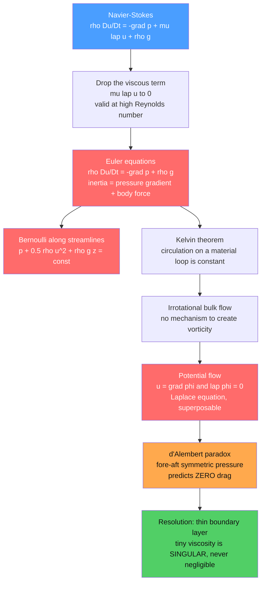

# 🌀 Euler Equations and Inviscid Flow

> [!abstract] TL;DR
> The **Euler equations** — $\rho\,(\partial_t\vec u + \vec u\cdot\nabla\vec u) = -\nabla p + \rho\vec g$ — are the governing equations of an **ideal (inviscid, frictionless) fluid**, obtained by dropping the viscous term from Navier-Stokes. They are simpler, often analytically solvable, and describe the outer flow of high-Reynolds-number problems astonishingly well, yielding Bernoulli's theorem, Kelvin's conservation of circulation, and potential flow. Yet they also predict **zero drag on any body** (d'Alembert's paradox), exposing that the inviscid limit is *singular*: the vanishingly small viscosity is never truly negligible in the thin boundary layer near a surface.

---

## Intuition

**Analogy:** Imagine a fluid so slippery it has *no internal friction at all* — a perfect, frictionless liquid whose layers slide past one another without any resistance. Strip viscosity out of the full Navier-Stokes equations and what remains is Euler's set: elegant, tractable, and often solvable with pencil and paper.

This idealization works far better than it has any right to. In most of the air flowing around a wing, friction is confined to a paper-thin layer clinging to the surface; everywhere else the air behaves as if it were truly inviscid. But the same simplification spawns a famous absurdity: a perfectly inviscid ball moving through a perfectly inviscid fluid would feel **zero drag** — d'Alembert's paradox — which is plainly wrong, since *everything* experiences drag. The paradox is the fluid's way of telling us that the tiny viscosity we threw away, however small, is never entirely negligible.

---

## How It Works

### Core Mechanics

1. **Start from Newton's second law for a fluid parcel.** The full Navier-Stokes momentum balance is $\rho\,\dfrac{D\vec u}{Dt} = -\nabla p + \mu\nabla^2\vec u + \rho\vec g$, where $\dfrac{D}{Dt} = \partial_t + \vec u\cdot\nabla$ is the material derivative following the parcel.

2. **Drop the viscous term.** Setting $\mu = 0$ removes $\mu\nabla^2\vec u$ and leaves the **Euler equations** (Euler, 1750s — historically the *first* fluid equations of motion):
   $$\rho\left(\frac{\partial\vec u}{\partial t} + \vec u\cdot\nabla\vec u\right) = -\nabla p + \rho\vec g$$
   Three effects balance: parcel **inertia**, the **pressure gradient**, and the **body force**. There is no shear stress and no dissipation.

3. **When is this legitimate?** The viscous term matters only where velocity gradients are steep. At high **Reynolds number** $Re = \rho U L/\mu \gg 1$, those steep gradients are trapped in **thin boundary layers** near solid walls and in thin wakes/shear layers. *Outside* those regions — the bulk of the flow — the fluid behaves nearly inviscidly, so Euler theory accurately predicts the outer streamlines, the pressure distribution, and (with a circulation correction) the lift.

4. **Consequence 1 — Bernoulli.** For steady flow, integrating Euler along a streamline gives $p + \tfrac12\rho u^2 + \rho g z = \text{const}$: pressure falls where the fluid speeds up. This is energy conservation for an ideal fluid (developed further in the companion *Bernoulli_and_Energy_in_Flows*).

5. **Consequence 2 — conservation of circulation (Kelvin).** With no viscosity there is no torque to create or destroy rotation, so the circulation $\Gamma = \oint_C \vec u\cdot d\vec\ell$ around a *material* loop moving with the fluid stays constant: $D\Gamma/Dt = 0$. A flow that starts irrotational stays irrotational (the subject of *Vorticity_and_Circulation*).

6. **Consequence 3 — potential flow.** Irrotational plus incompressible means $\vec u = \nabla\phi$ with $\nabla^2\phi = 0$ — **Laplace's equation**. This is *linear*, so solutions superpose, and in 2D the complex potential $w(z)=\phi+i\psi$ is analytic, unleashing complex analysis on aerodynamics (the workhorse of *Potential_Flow_and_Complex_Analysis*).

7. **The catch — d'Alembert's paradox.** For steady inviscid flow past a closed body, the pressure field is fore-aft symmetric, so the net force in the flow direction is **zero**. Predicted drag is zero — absurdly wrong. The resolution: the neglected viscosity, however small, creates a boundary layer that *separates*, forming a wake and destroying the symmetry. The inviscid limit $Re\to\infty$ is **singular**, not smooth — you cannot simply set $\mu=0$ everywhere (see *The_Boundary_Layer*).

### Flow / Architecture



---

## Key Concepts

### Secondary Level

- **Ideal fluid** — a made-up perfect fluid with no viscosity (no internal friction). Real fluids are close to this away from surfaces.
- **Euler's equations** — Newton's $F=ma$ written for a lump of fluid, using only pressure and gravity to push it around. No stickiness.
- **Bernoulli in one line** — fast flow means low pressure. That is why air speeding over a curved wing top pulls it upward, and why a shower curtain sucks inward.
- **The paradox** — the pure theory says a smooth ball should feel *no* drag as it moves. Reality disagrees: friction near the surface is what actually causes drag.

### Undergraduate Level

- **The material derivative** $\dfrac{D}{Dt}=\partial_t+\vec u\cdot\nabla$ carries the nonlinear advection $\vec u\cdot\nabla\vec u$ — the sole source of nonlinearity once viscosity is gone, and the reason inviscid flows are still rich.
- **Bernoulli's theorem** follows from Euler using $\vec u\cdot\nabla\vec u = \nabla(u^2/2) - \vec u\times\vec\omega$. For steady flow it holds along a streamline; for *irrotational* flow ($\vec\omega=0$) it holds everywhere.
- **Velocity potential and stream function** — irrotational incompressible flow gives $\vec u=\nabla\phi$ with $\nabla^2\phi=0$, and in 2D a stream function $\psi$ with $\nabla^2\psi=0$. Contours of $\psi$ are streamlines. Because Laplace's equation is linear, elementary flows (uniform stream, source, sink, vortex, doublet) add up. Flow past a cylinder is *uniform stream + doublet*: $w(z)=U\!\left(z+a^2/z\right)$.
- **Pressure coefficient** $C_p = 1 - (u/U)^2$ packages Bernoulli into a dimensionless surface pressure. On the cylinder surface $C_p = 1 - 4\sin^2\theta$ — perfectly symmetric front-to-back.
- **d'Alembert's paradox, concretely** — integrating that symmetric $C_p$ around the body gives zero net streamwise force. Lift can be nonzero (add circulation), but pressure drag is exactly zero.

### Graduate Level

- **The singular inviscid limit.** Dropping $\mu\nabla^2\vec u$ removes the *highest-order derivative* from the momentum equation. This is a **singular perturbation**: the order of the PDE falls, so the outer inviscid solution cannot satisfy the no-slip wall condition. A thin inner region — the **boundary layer**, thickness $\delta\sim L/\sqrt{Re}$ — restores it. Prandtl (1904) matched the inviscid *outer* flow to the viscous *inner* layer, resolving the paradox. This is why "$Re\to\infty$" is not the same as "$\mu=0$."
- **Kelvin's circulation theorem** ($D\Gamma/Dt=0$) requires a barotropic, inviscid, conservative-force flow. It underlies the **Kutta condition** that fixes the circulation on a lifting airfoil, hence lift via **Kutta-Joukowski** $L=\rho U\Gamma$.
- **Compressible Euler and shocks.** For a compressible inviscid gas, the Euler system is *hyperbolic* and nonlinear; characteristics can cross, so smooth data can steepen into **discontinuous weak solutions — shock waves**. The Rankine-Hugoniot jump conditions (mass, momentum, energy conservation across the front) select physical shocks via an entropy condition. This makes the Euler equations the backbone of gas dynamics and of shock-capturing CFD (see *Shock_Waves_and_Supersonic_Flow*).
- **Existence and regularity.** The 3D *incompressible* Euler equations may develop finite-time singularities from smooth data — an open question closely tied to the Navier-Stokes Millennium Problem (*The_Navier_Stokes_Equations*).

---

## Python Demo

```python
# Inviscid (potential) flow past a circular cylinder.
#   Complex potential:  w(z) = U (z + a^2 / z)     [uniform stream + doublet]
#   Complex velocity :  dw/dz = U (1 - a^2 / z^2)
# There is NO circulation, so the flow is perfectly fore-aft symmetric.
# Bernoulli then gives a symmetric pressure field  =>  ZERO net drag
# (d'Alembert's paradox). We also read Bernoulli off the surface:
# pressure DROPS exactly where the flow speeds up.

import numpy as np
import matplotlib.pyplot as plt

U   = 1.0    # free-stream speed
a   = 1.0    # cylinder radius
rho = 1.0    # density (unused in Cp, kept for clarity)

# ---- (a) Flow field on a grid ---------------------------------------
x = np.linspace(-3, 3, 400)
y = np.linspace(-3, 3, 400)
X, Y = np.meshgrid(x, y)
Z = X + 1j * Y
inside = np.abs(Z) < a

W   = U * (Z + a**2 / Z)          # complex potential
psi = np.imag(W)                  # stream function -> streamlines
psi[inside] = np.nan

dW = U * (1 - a**2 / Z**2)        # conjugate velocity = vx - i*vy
vx =  np.real(dW)
vy = -np.imag(dW)
speed2 = vx**2 + vy**2
Cp = 1 - speed2 / U**2            # Bernoulli pressure coefficient
Cp[inside] = np.nan

# ---- (b) Exact surface quantities vs angle --------------------------
theta = np.linspace(0, 2 * np.pi, 361)
v_surf   = -2 * U * np.sin(theta)         # tangential surface velocity
Cp_surf  = 1 - (v_surf / U) ** 2          # = 1 - 4 sin^2(theta)

# Net pressure drag (streamwise force): integrate -Cp*cos(theta) around body.
# Fore-aft symmetry makes this integral vanish  ->  d'Alembert's paradox.
Cd = -np.trapz(Cp_surf * np.cos(theta), theta) / 2.0
print(f"Net inviscid drag coefficient Cd = {Cd:.3e}   (exact theory: 0)")

# ---- Plot -----------------------------------------------------------
fig, ax = plt.subplots(1, 3, figsize=(16, 5))

# Panel 1: symmetric streamlines
ax[0].contour(X, Y, psi, levels=np.linspace(-3, 3, 41),
              colors="#1f77b4", linewidths=0.7)
ax[0].add_patch(plt.Circle((0, 0), a, color="0.3", zorder=5))
ax[0].set_aspect("equal")
ax[0].set_title("Inviscid streamlines\nfore-aft SYMMETRIC")
ax[0].set_xlabel("x / a"); ax[0].set_ylabel("y / a")

# Panel 2: symmetric pressure field (Bernoulli)
pc = ax[1].contourf(X, Y, Cp, levels=40, cmap="RdBu")
ax[1].add_patch(plt.Circle((0, 0), a, color="0.3", zorder=5))
ax[1].set_aspect("equal")
fig.colorbar(pc, ax=ax[1], label="pressure coefficient Cp")
ax[1].set_title("Pressure field via Bernoulli\nfront = back  ->  ZERO drag")
ax[1].set_xlabel("x / a"); ax[1].set_ylabel("y / a")

# Panel 3: Bernoulli on the surface -- p drops where speed rises
ax[2].plot(np.degrees(theta), Cp_surf, color="#d62728", lw=2,
           label="Cp (pressure)")
ax[2].plot(np.degrees(theta), (v_surf / U) ** 2, color="#2ca02c", lw=2,
           ls="--", label="(u/U)^2 (speed squared)")
ax[2].axhline(0, color="0.6", lw=0.8)
for t in (0, 90, 180, 270, 360):
    ax[2].axvline(t, color="0.9", lw=0.8, zorder=0)
ax[2].set_xlabel("angle theta around cylinder [deg]")
ax[2].set_ylabel("dimensionless")
ax[2].set_title("Bernoulli on the surface\nlow pressure where flow is fastest")
ax[2].legend(loc="lower right")

plt.tight_layout()
plt.show()

# Expected: Cd ~ 1e-16. Stagnation points at theta = 0, 180 deg have Cp = +1
# (highest pressure, zero speed); the "shoulders" at 90, 270 deg have Cp = -3
# (lowest pressure, highest speed) -- textbook Bernoulli, and a symmetry that
# yields zero drag. Real flow separates near the shoulders and trails a wake.
```

Running it prints a drag coefficient of order $10^{-16}$ (numerically zero) and shows the symmetric streamline and pressure patterns, plus the surface Bernoulli trade-off. The real flow, by contrast, separates just past the shoulders and leaves a low-pressure wake behind the cylinder — the missing back-face pressure recovery is precisely the drag the inviscid theory cannot see.

---

## Real-World Applications

> **Example — aircraft wing design.** Away from the paper-thin boundary layer, the air over a wing obeys the Euler/potential equations almost exactly. Panel methods and full-potential/Euler CFD solvers compute the *outer* pressure distribution on airfoils and wings, and with the Kutta condition supplying circulation, they predict lift accurately. Skin-friction drag and separation are then patched in via a boundary-layer model coupled to the inviscid outer solution.

- **Gas dynamics and aerospace** — the *compressible* Euler equations are the standard model for transonic and supersonic flow: shock-capturing Euler solvers predict shock positions on wings, inlets, and nozzles where viscosity is a small correction.
- **Water waves and naval hydrodynamics** — surface gravity waves and much of ship wave-making resistance are modeled with inviscid potential flow.
- **Meteorology and geophysical flow** — large-scale atmospheric and oceanic motion is nearly inviscid; Kelvin's circulation theorem and potential-vorticity conservation are everyday tools.
- **Turbomachinery and hydraulics** — first-cut blade and duct pressure fields come from inviscid/potential theory before viscous refinement.

---

## Common Pitfalls

- **Treating "$\mu=0$" and "$Re\to\infty$" as the same thing** — they are not. Viscosity multiplies the highest derivative, so setting it to zero *lowers the order* of the equations and drops the no-slip condition. The inviscid limit is **singular**; a boundary layer always remains.
- **Expecting inviscid theory to predict drag** — it cannot (d'Alembert). Use Euler/potential flow for the *outer* field, lift, and pressure distribution, and always couple a boundary-layer or full viscous model for drag and separation.
- **Applying Bernoulli across streamlines in rotational flow** — the constant differs from streamline to streamline unless the flow is irrotational. Check $\vec\omega=0$ before using a single global Bernoulli constant.
- **Assuming inviscid flow stays smooth in the compressible case** — nonlinear steepening produces genuine discontinuities (shocks). Naive central-difference schemes oscillate; you need shock-capturing (upwind/flux-limited) methods and the Rankine-Hugoniot conditions.
- **Forgetting the Kutta condition** — potential flow around a lifting body is not unique until circulation is fixed by requiring smooth flow off the trailing edge. Omit it and you get zero lift.

---

## Related Concepts

- [[Euler_Equations_and_Ideal_Fluids]] — the broad Physics overview of ideal-fluid dynamics; this note is the focused inviscid-limit / d'Alembert deep-dive, so read that first for the wider Bernoulli-vorticity-Kutta picture.
- [[Viscous_Fluids_and_Navier_Stokes]] — the full equations Euler comes from; restoring $\mu\nabla^2\vec u$ is exactly what resolves the paradox.
- [[Turbulence_and_Instabilities]] — where the neglected viscosity and the resulting wake/separation actually live at high $Re$.
- [[Waves_in_Fluids_and_Acoustics]] — sound and gravity waves as solutions of the linearized inviscid equations.
- [[The_Poisson_and_Laplace_Equation]] — the Laplace equation $\nabla^2\phi=0$ that potential flow reduces to, plus how to solve it numerically.
- [[Complex_Analysis_for_Physics]] — the complex-potential machinery for 2D inviscid flow.
- [[Holomorphic_Functions]] — why the analytic complex potential $w(z)=\phi+i\psi$ automatically gives an irrotational, incompressible flow.
- [[The_Wave_Equation_and_Hyperbolic_PDEs]] — the hyperbolic structure behind compressible Euler and shock formation.
- [[Introduction_to_PDEs]] — PDE classification (elliptic potential flow vs hyperbolic compressible Euler) that governs solution behavior.

---

## Review Questions

1. **Secondary** — In one sentence, why does inviscid theory predict that a smooth ball feels no drag, and what real-world effect does the theory leave out that actually causes drag?
2. **Undergraduate** — On a cylinder in uniform inviscid flow the surface pressure coefficient is $C_p = 1 - 4\sin^2\theta$. Show that the net streamwise force is zero, and identify where on the surface the pressure is highest and lowest. How does this connect to Bernoulli's theorem?
3. **Graduate** — Explain precisely why the limit $Re\to\infty$ is a *singular* perturbation rather than a regular one, referring to the order of the momentum equation and the no-slip condition. How does Prandtl's boundary-layer matching restore the missing physics and resolve d'Alembert's paradox?

---

## Sources

- Batchelor, G. K. — *An Introduction to Fluid Dynamics*, Cambridge University Press, Chs. 5-6 (ideal flow, d'Alembert's paradox).
- Kundu, Cohen & Dowling — *Fluid Mechanics*, 6th ed., Chs. 4-6 (Euler equations, potential flow, boundary layers).
- Acheson, D. J. — *Elementary Fluid Dynamics*, Oxford University Press, Chs. 1, 4-5.
- Landau & Lifshitz — *Fluid Mechanics*, Vol. 6, Chs. 1, 9 (ideal fluids and compressible/shock flow).
- Anderson, J. D. — *Fundamentals of Aerodynamics*, McGraw-Hill, Chs. 3, 11 (inviscid outer flow and compressible Euler).

---

#fluid-dynamics #euler-equations #inviscid-flow #dalemberts-paradox #ideal-fluid
