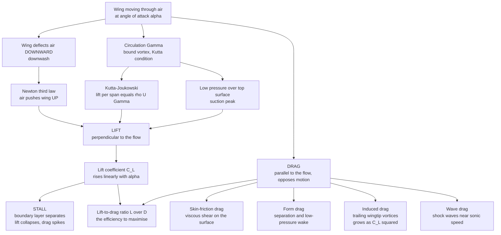

# ✈️ Lift, Drag, and Aerodynamics

> [!abstract] TL;DR
> **Aerodynamics** is the study of the forces a fluid exerts on a body moving through it, resolved into **lift** (perpendicular to the oncoming flow) and **drag** (parallel to it, opposing motion). A wing lifts not because of the school-taught "equal transit time" myth but because it **deflects a sheet of air downward** and, by Newton's third law, is pushed **up** in return — equivalently described by the **circulation** bound to the airfoil through the **Kutta-Joukowski theorem** ($L' = \rho U \Gamma$) and by the low-pressure suction over the upper surface. The **lift coefficient** $C_L$ rises almost linearly with **angle of attack** until the flow **separates** and the wing **stalls**. **Drag** splits into four physically distinct pieces — **skin-friction** (viscous shear), **form/pressure** drag (separation and wake), **induced** drag (the unavoidable price of lift, carried off by trailing wingtip vortices, $\propto C_L^2$), and **wave** drag (shock waves near the speed of sound). The whole craft of aerodynamics — streamlining a car, dimpling a golf ball, sweeping a wing, tuning a turbine blade — is the pursuit of one number: a high **lift-to-drag ratio** $L/D$.

---

## Intuition

**Analogy:** How does a 400-tonne airliner hang in thin air? Not by the myth you were taught in school — that air must "race" over the longer top surface and rejoin its partner at the trailing edge. (It does not: the upper air actually arrives *first*, and would still lift a flat or even upside-down wing.) The real answer is Newtonian and elegant: **a wing throws a great sheet of air downward, and the air throws the wing up in return.** Every second, an airliner's wings hurl tonnes of air toward the ground; the equal-and-opposite reaction holds the plane aloft.

You can feel this directly. Cup your hand flat out of a moving car window and tilt the leading edge up a few degrees. Your hand is shoved **upward** (lift) and **backward** (drag) at the same time — you are personally deflecting air downward and paying a drag toll for it. Tilt more and more and, at some angle, the smooth push suddenly turns into a buffeting, juddering mess as the airflow tears away from the back of your hand: that is a **stall**. Aerodynamics is the science of shaping objects to maximise that upward throw while minimising the backward tug — the difference between a graceful glider that sinks one metre for every fifty it travels and a falling brick.

---

## How It Works

### Core Mechanics

**1. Two forces, one pressure-and-shear field.** A body in a flow feels pressure pushing inward everywhere on its surface plus viscous shear dragging along it. Integrate that stress field over the whole surface and the resultant force resolves into two components: **lift** $L$ perpendicular to the free stream and **drag** $D$ parallel to it. We non-dimensionalise both by the **dynamic pressure** $q = \tfrac12\rho U^2$ and a reference area $S$:
$$C_L = \frac{L}{\tfrac12\rho U^2 S}, \qquad C_D = \frac{D}{\tfrac12\rho U^2 S}.$$
These coefficients depend on the *shape*, the *angle of attack*, and the dimensionless **Reynolds** and **Mach** numbers — not on size or speed directly. That is what lets a small wind-tunnel model stand in for a full aircraft (see the **dynamic similarity** discussion in [[Fluid_Dynamics_Overview]]).

**2. How lift really arises — three consistent pictures, one phenomenon.**
- **Newton (momentum).** The wing turns the flow: air arrives horizontally and leaves with a **downward** velocity component (**downwash**). The rate of downward momentum imparted to the air equals the lift on the wing. No downwash, no lift.
- **Circulation (Kutta-Joukowski).** Superpose a uniform stream with a **bound vortex** of strength $\Gamma$ (the **circulation**) around the airfoil and you reproduce the real flow: faster over the top, slower underneath. The lift per unit span is exactly
$$L' = \rho\,U\,\Gamma.$$
The airfoil's sharp trailing edge fixes $\Gamma$ through the **Kutta condition** (the flow leaves smoothly off the trailing edge rather than whipping around it). This is the potential-flow route developed in the sibling note *Potential_Flow_and_Complex_Analysis*, and $\Gamma$ itself is the subject of *Vorticity_and_Circulation*.
- **Pressure (Bernoulli, done correctly).** Faster flow over the top means **lower pressure** there — a **suction peak** near the leading edge — while the underside runs slightly slower and higher pressure. The net upward pressure imbalance is the lift. This is fully consistent with Bernoulli, but the speed-up is caused by the circulation and curvature, **not** by any equal-transit-time rule.

All three are the *same* physics viewed through momentum, kinematics, or the pressure field. **Angle of attack** and airfoil **camber** are simply the knobs that set how much circulation and downwash the wing generates.

**3. The lift curve and stall.** For a thin airfoil, thin-airfoil theory predicts a lift slope of $2\pi$ per radian, so $C_L$ climbs almost **linearly** with angle of attack $\alpha$. But this cannot continue forever: as $\alpha$ increases, the adverse pressure gradient on the upper surface grows until the **boundary layer separates** (a *The_Boundary_Layer* phenomenon). At the **critical angle** — typically $12$–$16^\circ$ — the flow detaches, the suction peak collapses, $C_L$ **drops sharply**, and drag spikes. This is **stall**, the boundary-layer separation limit on lift. High-lift devices — **flaps** (add camber and area) and **slats** (re-energise the boundary layer) — delay separation and push $C_{L,\max}$ higher for takeoff and landing.

**4. Drag decomposed — four separate villains.**
- **Skin-friction drag** — viscous shear tangent to the surface. Dominant for well-streamlined bodies; set by whether the boundary layer is laminar or turbulent.
- **Form (pressure) drag** — the low-pressure **wake** left behind when flow **separates**. Dominant for **bluff** bodies (a flat plate, a cylinder, a truck). **Streamlining** — a long tapered tail that keeps the boundary layer attached — is the art of shrinking this wake; it is why a teardrop has roughly one-tenth the drag of a sphere of the same frontal area.
- **Induced drag** — the unavoidable **price of lift**. A finite wing sheds **trailing vortices** off its tips (high-pressure air below spilling to low-pressure above); these tilt the local lift vector backward and carry kinetic energy away. Induced drag scales as $C_{D,i} = C_L^2/(\pi e\,AR)$ — it **grows as the square of the lift coefficient** and shrinks with high **aspect ratio** $AR$ (long thin wings) and **winglets**.
- **Wave drag** — near and above Mach 1, **shock waves** form and dump energy, adding a steep drag rise. This foreshadows *Compressible_Flow_and_Gas_Dynamics*.

**5. The drag crisis and streamlining.** Drag is dramatically shape- and Reynolds-dependent. On a smooth sphere, as $Re$ climbs the laminar boundary layer separates early, giving a huge wake and high $C_D \approx 0.5$. Trip the boundary layer into **turbulence** and it clings farther around the back, the wake narrows, and $C_D$ suddenly **drops** to $\approx 0.2$ — the **drag crisis**. That is exactly why **golf balls have dimples**: they force early turbulence, delay separation, and let the ball fly nearly twice as far. This form-versus-friction trade-off is explored in *Flow_Separation_and_Drag_Crisis*.

**6. The design objective — lift-to-drag ratio.** Efficiency is captured by $L/D = C_L/C_D$, the **glide ratio** (metres forward per metre of descent), and the driver of range and fuel economy. Because parasite drag rises with speed while induced drag falls, total drag has a **minimum** at a particular speed, and $L/D$ is **maximised at one best angle of attack**. Aircraft cruise near that point. The full map of $C_L$ against $C_D$ is the **drag polar** — the single most useful curve in aircraft design, tied to finite-wing effects and airfoil geometry in *Aerodynamics_and_Aerospace_Applications*.

### Flow / Architecture



---

## Key Concepts

### Secondary Level

- **Lift is air thrown down.** A wing pushes air downward; the air pushes the wing up. The "equal transit time" story you may have heard is a **myth** — it predicts far too little lift and cannot explain how planes fly upside down.
- **Drag is the backward tug.** Air resists a body moving through it. Streamlined shapes (a teardrop, a fish, a fast car) slip through with little drag; blunt shapes (a brick, a parachute) fight a big turbulent wake.
- **Angle of attack.** Tilt a wing more into the wind and it lifts harder — up to a point. Tilt too far and it **stalls**: the airflow rips away and lift suddenly vanishes.
- **Why golf balls have dimples.** Roughness trips the airflow into turbulence that hugs the ball longer, shrinking the wake and cutting drag, so a dimpled ball flies about twice as far as a smooth one.

### Undergraduate Level

- **Force coefficients.** $C_L = L/(\tfrac12\rho U^2 S)$ and $C_D = D/(\tfrac12\rho U^2 S)$; functions of shape, $\alpha$, $Re$, and $Ma$.
- **Kutta-Joukowski.** Lift per span $L' = \rho U \Gamma$; the trailing-edge **Kutta condition** selects $\Gamma$. Thin-airfoil theory: $C_L \approx 2\pi(\alpha - \alpha_0)$, lift slope $\approx 0.11$ per degree.
- **Stall.** Boundary-layer separation caps $C_L$ at $C_{L,\max}$ near $\alpha_{\text{crit}}$; beyond it lift falls and drag rises steeply.
- **Drag polar.** $C_D = C_{D,0} + \dfrac{C_L^2}{\pi e\, AR}$ — parasite drag $C_{D,0}$ plus induced drag $\propto C_L^2$; $e$ is the Oswald efficiency, $AR = b^2/S$ the aspect ratio.
- **Best glide.** $L/D$ is maximised at $C_L = \sqrt{\pi e\,AR\,C_{D,0}}$, giving $(L/D)_{\max} = \tfrac12\sqrt{\pi e\,AR / C_{D,0}}$ — the point of minimum drag in level flight.
- **Induced drag physics.** Trailing vortices produce downwash that tilts the lift vector back; long, high-$AR$ wings and winglets reduce it.

### Graduate Level

- **Kelvin's theorem and the starting vortex.** Circulation is conserved in inviscid flow, so the bound $\Gamma$ around the wing must be matched by an equal-and-opposite **starting vortex** shed at the trailing edge when lift is first generated — the origin of $\Gamma$ that *Vorticity_and_Circulation* develops.
- **Lifting-line theory (Prandtl).** A finite wing is a bound vortex plus a trailing vortex sheet; the elliptic lift distribution minimises induced drag, giving $C_{D,i} = C_L^2/(\pi AR)$ at $e = 1$.
- **Boundary-layer control of drag.** Skin friction depends on the laminar/turbulent state ($C_f \sim Re^{-1/2}$ laminar, $\sim Re^{-1/5}$ turbulent); separation and hence form drag are governed by the adverse pressure gradient and momentum thickness — the domain of *The_Boundary_Layer*.
- **Drag crisis.** The sudden $C_D$ drop near $Re \sim 3\times10^5$ on a sphere/cylinder is turbulent reattachment delaying separation; deliberately triggered by dimples, trip wires, and vortex generators (*Flow_Separation_and_Drag_Crisis*).
- **Compressibility and wave drag.** Above the critical Mach number, local supersonic pockets terminate in shocks; the **drag-divergence** Mach number, supercritical airfoils, and swept/area-ruled wings all mitigate wave drag (*Compressible_Flow_and_Gas_Dynamics*).
- **d'Alembert's paradox.** Ideal inviscid, irrotational flow predicts **zero drag** on any body — resolved only by viscosity (boundary layers, separation) and by lift-induced trailing vorticity, the very effects the [[Euler_Equations_and_Ideal_Fluids]] idealisation omits.

---

## Python Demo

```python
# Aerodynamics of a wing: the lift curve with STALL, the DRAG POLAR, the
# lift-to-drag ratio, the drag-vs-speed breakdown (why a cruise speed exists),
# the airfoil pressure distribution (suction peak on top), and Kutta-Joukowski.
# Requires: numpy, matplotlib
import numpy as np
import matplotlib.pyplot as plt

# ------------------------------------------------------------------
# Airfoil / wing model parameters
# ------------------------------------------------------------------
a_slope   = 0.11      # lift-curve slope [per degree] (~ 2*pi per radian)
alpha0    = -2.0      # zero-lift angle [deg] (positive camber)
alpha_st  = 15.0      # stall angle [deg]
CD0       = 0.020     # parasite (profile) drag coefficient
AR        = 8.0       # aspect ratio
e_osw     = 0.85      # Oswald efficiency factor
k_ind     = 1.0 / (np.pi * e_osw * AR)   # induced-drag factor: CDi = k*CL^2

# ------------------------------------------------------------------
# (a) LIFT COEFFICIENT vs ANGLE OF ATTACK, with a sharp STALL drop
# ------------------------------------------------------------------
alpha = np.linspace(-6, 22, 400)                 # angle of attack [deg]
CL_lin = a_slope * (alpha - alpha0)              # linear (attached) regime
CL_max = a_slope * (alpha_st - alpha0)           # peak CL at the stall angle
# after stall, lift collapses as the flow separates
CL = np.where(alpha <= alpha_st,
              CL_lin,
              CL_max - 0.09 * (alpha - alpha_st))
CL = np.maximum(CL, 0.05)                        # never fully to zero

# Drag: parasite + induced (CL^2) + a post-stall separation penalty
CD_sep = np.where(alpha <= alpha_st, 0.0, 0.10 * (alpha - alpha_st))
CD = CD0 + k_ind * CL**2 + CD_sep
LD = CL / CD                                     # lift-to-drag ratio

# best glide: analytic optimum in the ATTACHED regime
CL_best = np.sqrt(CD0 / k_ind)
LD_best = 0.5 * np.sqrt(1.0 / (k_ind * CD0))
alpha_best = alpha0 + CL_best / a_slope
print("=== Wing performance ===")
print(f"Stall at alpha = {alpha_st:.0f} deg,  CL_max = {CL_max:.2f}")
print(f"Best L/D = {LD_best:.1f} at CL = {CL_best:.2f} "
      f"(alpha = {alpha_best:.1f} deg)")

# mask for a clean drag polar (attached regime only)
att = alpha <= alpha_st

# ------------------------------------------------------------------
# (b) DRAG vs SPEED in level flight (fixed weight): find the minimum
#     Parasite drag ~ V^2 ; induced drag ~ 1/V^2  ->  U-shaped total
# ------------------------------------------------------------------
rho = 1.0            # air density at altitude [kg/m^3]
W   = 12000.0        # aircraft weight [N] (~1220 kg)
S   = 16.0           # wing area [m^2]
V   = np.linspace(30, 120, 400)                  # airspeed [m/s]
q   = 0.5 * rho * V**2                            # dynamic pressure
CL_need = W / (q * S)                            # CL needed to hold altitude
D_par = q * S * CD0                              # parasite drag  (~ V^2)
D_ind = k_ind * W**2 / (q * S)                   # induced  drag  (~ 1/V^2)
D_tot = D_par + D_ind
V_min = V[np.argmin(D_tot)]                      # min-drag (best-range) speed
print(f"Minimum-drag cruise speed ~ {V_min:.0f} m/s "
      f"(~{V_min*3.6:.0f} km/h)")

# ------------------------------------------------------------------
# (c) PRESSURE distribution over an airfoil: suction peak on top
#     Plot -Cp so that suction (low pressure) points UP.
# ------------------------------------------------------------------
xc = np.linspace(0, 1, 300)                      # chordwise position x/c
Cp_up  = -3.2 * np.exp(-((xc - 0.08) / 0.12)**2) + 0.55 * xc   # upper surface
Cp_low =  0.55 * np.exp(-((xc - 0.06) / 0.18)**2) - 0.25 * xc  # lower surface

# ------------------------------------------------------------------
# (d) KUTTA-JOUKOWSKI: lift per span  L' = rho * U * Gamma
# ------------------------------------------------------------------
Gamma = np.linspace(0, 60, 200)                  # circulation [m^2/s]
for U in (30.0, 60.0, 90.0):
    pass
# example: model wing, chord c, target CL -> Gamma = 0.5 U c CL, L' = rho U Gamma
U_ex, c_ex, CL_ex = 60.0, 1.6, 0.6
Gamma_ex = 0.5 * U_ex * c_ex * CL_ex
Lprime_ex = rho * U_ex * Gamma_ex
Lprime_dp = 0.5 * rho * U_ex**2 * c_ex * CL_ex   # cross-check via dynamic pressure
print(f"Kutta-Joukowski: U={U_ex} m/s, c={c_ex} m, CL={CL_ex} -> "
      f"Gamma={Gamma_ex:.1f} m^2/s, L'={Lprime_ex:.0f} N/m "
      f"(check {Lprime_dp:.0f} N/m)")

# ------------------------------------------------------------------
# Plotting: 2 x 3 grid
# ------------------------------------------------------------------
fig, ax = plt.subplots(2, 3, figsize=(16, 9))
fig.suptitle("Aerodynamics of a Wing: Lift, Drag, and Efficiency",
             fontsize=15, fontweight="bold")

# A. lift curve with stall
axA = ax[0, 0]
axA.plot(alpha, CL, color="#1f77b4", lw=2.5)
axA.axvline(alpha_st, ls="--", color="#d62728", lw=1.2)
axA.annotate("STALL\nflow separates", xy=(alpha_st, CL_max),
             xytext=(alpha_st + 1.5, CL_max - 0.35), fontsize=9,
             color="#d62728",
             arrowprops=dict(arrowstyle="->", color="#d62728"))
axA.axhline(0, color="k", lw=0.6)
axA.set_xlabel("angle of attack  alpha [deg]")
axA.set_ylabel("lift coefficient  C_L")
axA.set_title("A. Lift rises linearly, then STALLS")
axA.grid(alpha=0.3)

# B. drag polar (attached regime)
axB = ax[0, 1]
axB.plot(CD[att], CL[att], color="#2ca02c", lw=2.5)
axB.scatter([CD0 + k_ind*CL_best**2], [CL_best], color="#d62728", zorder=5,
            label="best L/D point")
axB.set_xlabel("drag coefficient  C_D")
axB.set_ylabel("lift coefficient  C_L")
axB.set_title("B. Drag polar:  C_D = C_D0 + C_L^2 / (pi e AR)")
axB.legend(fontsize=8); axB.grid(alpha=0.3)

# C. lift-to-drag ratio vs alpha
axC = ax[0, 2]
axC.plot(alpha[att], LD[att], color="#9467bd", lw=2.5)
axC.axvline(alpha_best, ls="--", color="#d62728", lw=1.2)
axC.annotate(f"best L/D = {LD_best:.0f}\nat {alpha_best:.1f} deg",
             xy=(alpha_best, LD_best), xytext=(alpha_best + 1.0, LD_best*0.6),
             fontsize=9, color="#d62728",
             arrowprops=dict(arrowstyle="->", color="#d62728"))
axC.set_xlabel("angle of attack  alpha [deg]")
axC.set_ylabel("L / D  (glide ratio)")
axC.set_title("C. Efficiency peaks at ONE best angle")
axC.grid(alpha=0.3)

# D. drag vs speed breakdown
axD = ax[1, 0]
axD.plot(V, D_par, color="#ff7f0e", lw=2, label="parasite  ~ V^2")
axD.plot(V, D_ind, color="#1f77b4", lw=2, label="induced  ~ 1 / V^2")
axD.plot(V, D_tot, color="k", lw=2.5, label="total drag")
axD.axvline(V_min, ls="--", color="#d62728", lw=1.2)
axD.annotate(f"min drag\n~{V_min:.0f} m/s", xy=(V_min, D_tot.min()),
             xytext=(V_min + 8, D_tot.min()*1.5), fontsize=9, color="#d62728",
             arrowprops=dict(arrowstyle="->", color="#d62728"))
axD.set_xlabel("airspeed  V [m/s]")
axD.set_ylabel("drag [N]")
axD.set_title("D. Why a cruise speed exists")
axD.legend(fontsize=8); axD.grid(alpha=0.3)

# E. pressure distribution (suction peak on top)
axE = ax[1, 1]
axE.plot(xc, -Cp_up,  color="#d62728", lw=2, label="upper (suction)")
axE.plot(xc, -Cp_low, color="#1f77b4", lw=2, label="lower")
axE.fill_between(xc, -Cp_up, -Cp_low, color="#ffd7d7", alpha=0.6)
axE.annotate("suction peak", xy=(0.08, -np.min(Cp_up)),
             xytext=(0.3, -np.min(Cp_up)*0.85), fontsize=9,
             arrowprops=dict(arrowstyle="->"))
axE.axhline(0, color="k", lw=0.6)
axE.set_xlabel("chordwise position  x / c")
axE.set_ylabel("-C_p   (up = low pressure)")
axE.set_title("E. Pressure: strong suction over the top")
axE.legend(fontsize=8); axE.grid(alpha=0.3)

# F. Kutta-Joukowski lift per span vs circulation
axF = ax[1, 2]
for U in (30.0, 60.0, 90.0):
    axF.plot(Gamma, rho * U * Gamma, lw=2, label=f"U = {U:.0f} m/s")
axF.scatter([Gamma_ex], [Lprime_ex], color="k", zorder=5)
axF.annotate("model wing", xy=(Gamma_ex, Lprime_ex),
             xytext=(Gamma_ex - 34, Lprime_ex*1.05), fontsize=9,
             arrowprops=dict(arrowstyle="->"))
axF.set_xlabel("circulation  Gamma [m^2/s]")
axF.set_ylabel("lift per span  L' [N/m]")
axF.set_title("F. Kutta-Joukowski:  L' = rho U Gamma")
axF.legend(fontsize=8); axF.grid(alpha=0.3)

plt.tight_layout(rect=[0, 0, 1, 0.95])
plt.show()
```

**What it shows.** Panel **A** is the wing's signature: $C_L$ climbs almost linearly with angle of attack, then **stalls** — a sudden collapse as the boundary layer separates. Panel **B** is the **drag polar**, the parabola $C_D = C_{D,0} + C_L^2/(\pi e\,AR)$, with the best-$L/D$ point marked. Panel **C** shows that efficiency $L/D$ peaks at a *single* best angle. Panel **D** decomposes level-flight drag into **parasite** (rising as $V^2$) and **induced** (falling as $1/V^2$); their sum is U-shaped, and its minimum is exactly why aircraft have a most-efficient cruise speed. Panel **E** plots the airfoil pressure, revealing the strong **suction peak** over the upper surface that carries most of the lift. Panel **F** verifies **Kutta-Joukowski**: lift per span is linear in circulation $\Gamma$, and the model-wing point matches the dynamic-pressure cross-check printed to the console.

---

## Real-World Applications

> **Example — the Boeing/Airbus wing.** A modern airliner cruises near its best $L/D$ (roughly $17$–$20$ for a transport jet), the airspeed where induced and parasite drag balance. **Winglets** cut the induced drag by weakening the tip vortices; **supercritical airfoils** and **wing sweep** push back the drag-divergence Mach number to tame wave drag; **flaps and slats** raise $C_{L,\max}$ so the aircraft can fly slowly on approach without stalling. Every one of these is a direct application of the decomposition in this note.

- **Cars and motorsport.** Road cars are streamlined to slash form drag for fuel economy ($C_D \approx 0.25$–$0.30$); Formula 1 cars run **inverted wings** to generate *downforce* (negative lift) for cornering grip, accepting large induced drag as the price.
- **Sports balls.** A curveball or a swinging cricket ball bends because of the **Magnus effect** (spin-induced circulation) and asymmetric boundary-layer separation; golf-ball dimples exploit the **drag crisis** to nearly double carry distance.
- **Wind turbines and propellers.** Turbine and propeller blades are rotating airfoils; blade design maximises lift-to-drag along the span, and stall-regulated turbines deliberately use separation to shed power in high winds.
- **Buildings and bridges.** Wind loads and **vortex-induced vibration** (alternating vortex shedding, as in the 1940 Tacoma Narrows collapse) are aerodynamic problems solved with streamlined fairings and dampers.
- **Biological flight.** Birds and insects generate lift with flapping, cambered wings, exploiting leading-edge vortices and unsteady effects — the animal-locomotion side developed in [[Fluid_Dynamics_in_Biology]] and [[Biomechanics_of_Movement]].

---

## Common Pitfalls

- **Believing the equal-transit-time myth.** Air over the top does **not** have to rejoin its underside partner, and it reaches the trailing edge *sooner*. Lift comes from circulation, downwash, and turning the flow — the myth predicts a fraction of the real lift and cannot explain inverted or symmetric-airfoil flight.
- **Thinking lift is perpendicular to the wing.** Lift is defined perpendicular to the **free-stream flow**, not to the chord line. At angle of attack the two differ, and the streamwise component of the aerodynamic force is drag.
- **Ignoring induced drag when sizing a wing.** Induced drag $\propto C_L^2/AR$ dominates at low speed and high lift (takeoff, climb, tight turns). Short, stubby wings pay a heavy induced-drag penalty; this is why gliders have long, slender wings.
- **Assuming more angle of attack always means more lift.** Past the critical angle the wing **stalls** and lift *drops*. Stall depends on angle of attack, not airspeed — an aircraft can stall at high speed in a hard pull-up.
- **Treating drag as a single number.** Confusing form, friction, induced, and wave drag leads to wrong fixes: streamlining helps form drag but not induced drag; winglets help induced drag but not wave drag; sweep helps wave drag but adds structural weight.
- **Extrapolating low-Reynolds intuition.** A smooth surface can have *more* drag than a rough one near the drag crisis (the dimpled-golf-ball paradox). Always check the Reynolds regime before assuming smoother is better.

---

## Related Concepts

- [[Euler_Equations_and_Ideal_Fluids]] — the inviscid, potential-flow foundation for circulation, the Kutta condition, and Bernoulli's pressure argument; also the source of d'Alembert's zero-drag paradox that viscosity resolves.
- [[Viscous_Fluids_and_Navier_Stokes]] — viscosity and the boundary layer that produce skin-friction drag, separation, and stall.
- [[Newtons_Laws_and_Kinematics]] — the momentum/third-law picture of lift as downward-deflected air pushing the wing up.
- [[Fluid_Dynamics_Overview]] — parent survey; where Reynolds and Mach numbers, dynamic similarity, and wind-tunnel testing come from.
- [[Fluid_Dynamics_in_Biology]] — low-Reynolds and flapping flight, blood flow, and the aerodynamics of living systems.
- [[Biomechanics_of_Movement]] — the mechanics of animal flight and locomotion that aerodynamics underlies.
- [[Rotational_Dynamics]] — angular momentum and spin behind the Magnus effect on curving, swinging balls.
- [[Turbulence_and_Instabilities]] — the turbulent boundary layer behind the drag crisis and vortex-induced vibration.

Deeper development lives in the not-yet-written Fluid_Dynamics siblings *Potential_Flow_and_Complex_Analysis* (circulation and the Kutta condition), *Vorticity_and_Circulation* (the origin and conservation of $\Gamma$), *The_Boundary_Layer* (skin friction and the separation that causes stall), *Flow_Separation_and_Drag_Crisis* (form drag, streamlining, and dimples), *Compressible_Flow_and_Gas_Dynamics* (wave drag and transonic wings), and *Aerodynamics_and_Aerospace_Applications* (finite-wing design and the full drag polar).

---

## Review Questions

1. **Secondary:** A friend insists that planes fly because air travels farther over the curved top of the wing and so must speed up. State two reasons this explanation is wrong, then give the correct Newtonian account of where lift comes from.
2. **Undergraduate:** An airfoil has a lift slope of $0.1$ per degree and a zero-lift angle of $-3^\circ$. (a) Estimate $C_L$ at $\alpha = 5^\circ$. (b) With $C_{D,0} = 0.02$, $AR = 7$, and $e = 0.85$, compute the induced drag coefficient at that $C_L$ and the resulting $L/D$. (c) Would increasing the aspect ratio raise or lower $L/D$, and which drag component does it act on?
3. **Graduate:** A glider designer must choose between a short stubby wing and a long slender wing of equal area. Using the drag polar $C_D = C_{D,0} + C_L^2/(\pi e\,AR)$, explain quantitatively how aspect ratio shifts the best-$L/D$ point and the minimum-drag speed. Then discuss two *penalties* of very high aspect ratio (structural and aerodynamic) that keep real wings finite, referencing wing-root bending moment and boundary-layer/stall behaviour.

---

## Sources

- J. D. Anderson — *Fundamentals of Aerodynamics*, 6th ed. (McGraw-Hill, 2017), Chs. 1, 4–5 (aerodynamic forces, Kutta-Joukowski, finite wings).
- H. Babinsky — "How do wings work?" *Physics Education* **38**(6), 497–503 (2003) — the standard debunking of the equal-transit-time myth.
- L. Prandtl & O. G. Tietjens — *Applied Hydro- and Aeromechanics* (Dover, 1957) — lifting-line theory and induced drag.
- I. H. Abbott & A. E. von Doenhoff — *Theory of Wing Sections* (Dover, 1959) — airfoil pressure distributions, lift curves, and drag polars.
- NASA Glenn Research Center — "Beginner's Guide to Aeronautics: Lift, Drag, and the Incorrect Lift Theory," grc.nasa.gov.

---

#fluid-dynamics #aerodynamics #lift #drag #airfoils
